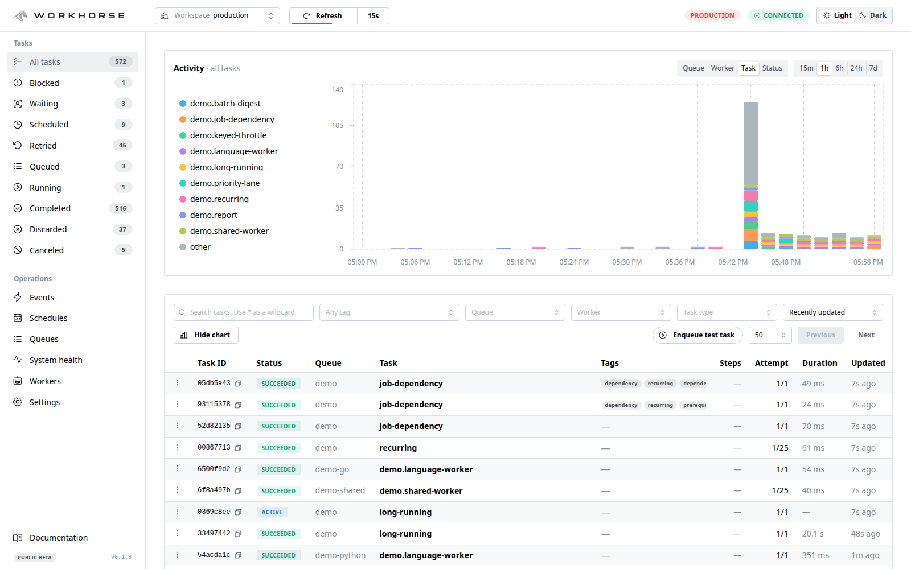
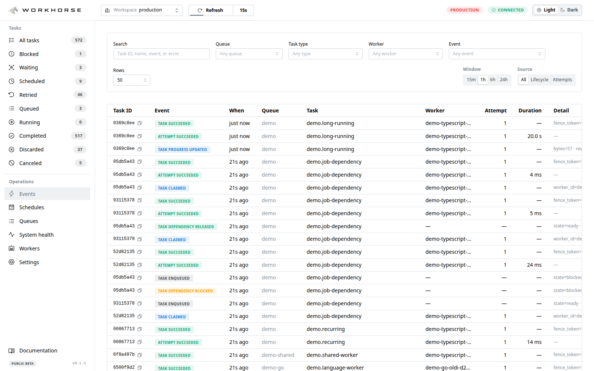
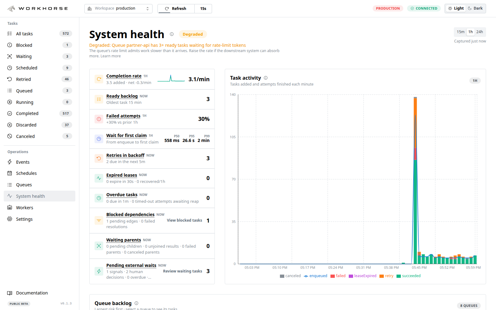
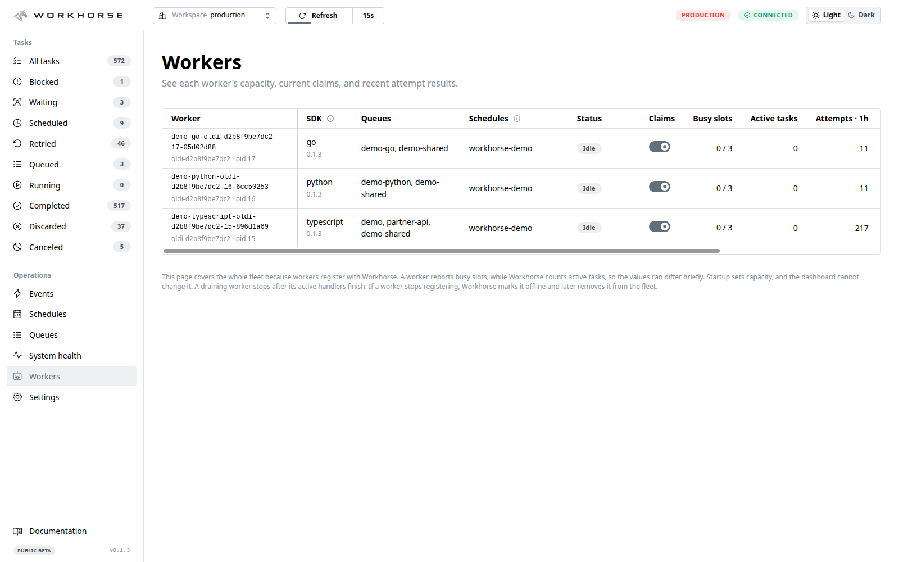
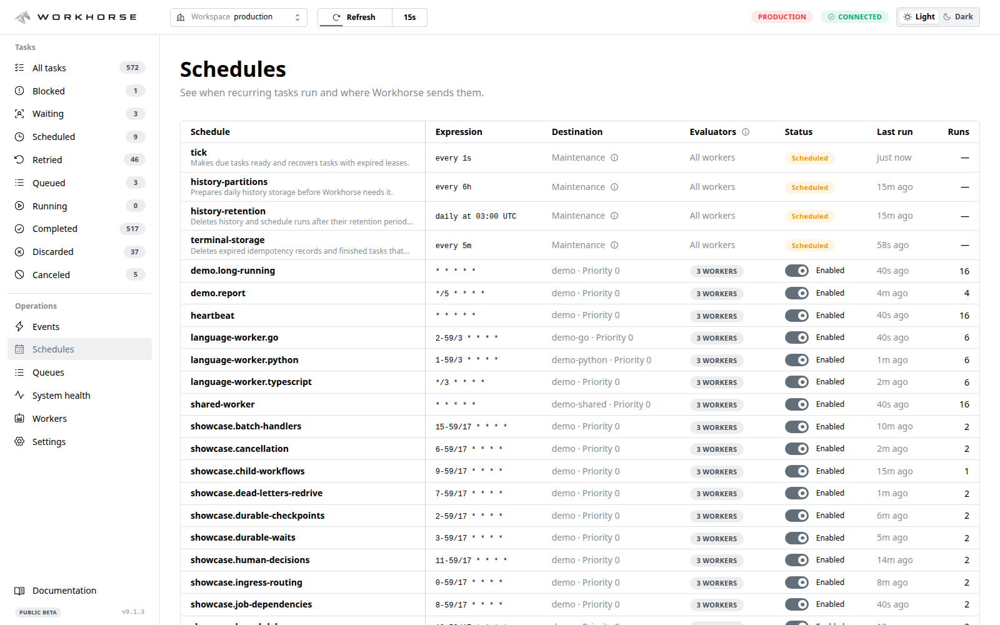

# Workhorse

A durable job queue for PostgreSQL, with TypeScript, Python, and Go workers on one SQL protocol.

Workhorse is versioned SQL functions inside the database you already run. Every language gets the
same workers, the same durable waits, and the same dashboard, with no broker or server beside
PostgreSQL.

> **Public beta:** Workhorse is usable for evaluation and early production adoption. A 0.x minor
> release may change behaviour, so read the changelog before you upgrade. It will not ask you to
> recreate your database: migrations are ordered, and inside a major line a migration only adds, so
> a running deployment upgrades in place.

[](https://github.com/stablemates/workhorse/actions/workflows/ci.yml?query=branch%3Amain)

[Documentation](https://workhorse.run/docs) · [Quickstart](https://workhorse.run/docs/quickstart) ·
[Live demo](https://demo.workhorse.run) · [Compatibility](docs/compatibility.md) ·
[Security policy](SECURITY.md) · [For AI agents](https://workhorse.run/llms.txt)

## Why Workhorse

Applications often need a database change and a background job to succeed together. Workhorse
enqueues through the same PostgreSQL transaction, so a rollback cannot leave one without the other.

PostgreSQL owns queue state, scheduling, retries, recovery, and immutable history. Workers claim jobs
with fence tokens, so a worker that resumes after losing its lease cannot overwrite newer work.

Handlers receive at-least-once delivery. Workhorse records durable progress and outcomes, but external
effects still need stable provider idempotency keys or compensation.

## See it operate

The dashboard exposes task activity, lifecycle events, system health, worker capacity, and schedules
without making the queue's PostgreSQL tables part of your operator interface.

<p>
  <a href="site/public/screenshots/demo-tasks.png"></a>
  <a href="site/public/screenshots/demo-events.png"></a>
</p>
<p>
  <a href="site/public/screenshots/demo-health.png"></a>
  <a href="site/public/screenshots/demo-workers.png"></a>
</p>
<p align="center">
  <a href="site/public/screenshots/demo-schedules.png"></a>
</p>

Open the [live demo](https://demo.workhorse.run) to explore the dashboard, including recurring
schedules and task details.

## Run one job

Install the TypeScript package and its schema:

```bash
npm install @stablemates/workhorse
npx --package @stablemates/workhorse workhorse schema install
```

Install the schema during deployment. Runtime processes should verify compatibility instead of
attempting schema changes.

Requires Node.js 22 or 24 and PostgreSQL 15 through 18.

```ts
import { Admin, Pool, Queue, Worker } from "@stablemates/workhorse";

export async function runQuickstart(databaseUrl) {
  const pool = new Pool({ connectionString: databaseUrl });
  try {
    const queue = new Queue(pool);
    const admin = new Admin(pool);
    const worker = new Worker(queue, { workerId: "quickstart-worker" }).handle(
      "welcome.send",
      async (payload) => ({ message: `Welcome, ${payload.name}!` }),
    );
    const jobId = await queue.enqueue("welcome.send", { name: "Ada" });
    await worker.runOnce();
    const job = await admin.getJob(jobId);
    if (job?.state !== "succeeded") throw new Error(`Quickstart job finished in ${job?.state}`);
    return { jobId, result: job.result };
  } finally {
    await pool.end();
  }
}
```

The [quickstart](https://workhorse.run/docs/quickstart) continues through failure and recovery. See
[worker processes](https://workhorse.run/docs/worker-processes) before deploying a worker.

## When it fits

Choose Workhorse when your application already depends on PostgreSQL and needs durable background
work that can share application transactions. Choose a dedicated broker when queue scale or
availability must be independent from the application database.

## Packages

- [`@stablemates/workhorse`](typescript/core) is the TypeScript client, worker runtime, schema CLI,
  and operator API that most TypeScript applications install.
- [`@stablemates/workhorse-drizzle`](typescript/drizzle),
  [`@stablemates/workhorse-prisma`](typescript/prisma),
  [`@stablemates/workhorse-typeorm`](typescript/typeorm), and
  [`@stablemates/workhorse-kysely`](typescript/kysely) enqueue through ORM-owned transactions.
- [`@stablemates/workhorse-dashboard`](typescript/dashboard) is the React operator dashboard and
  compatibility facade. Its server and type contract are also published for package composition.
- [`@stablemates/workhorse-otel`](typescript/otel) connects core's vendor-neutral telemetry to the
  host application's OpenTelemetry API providers.
- The [Python SDK](python) and [Go SDK](go) implement the same PostgreSQL protocol and embed the
  same operator dashboard.

## Learn and operate

- [Guides](https://workhorse.run/docs) explain enqueue, workers, retries, durable execution, and
  integrations.
- [API reference](https://workhorse.run/docs/api) documents the public TypeScript surface.
- [Architecture](docs/architecture.md) defines exact protocol behavior and invariants.
- [Feature matrix](docs/features.md) separates supported, partial, and unsupported behavior.
- [Compatibility](docs/compatibility.md) defines supported runtimes, schema policy, and releases.
- [Operations](https://workhorse.run/docs/operations) covers health, retention, and maintenance.
- [Dashboard](https://workhorse.run/docs/dashboard) explains the operator UI and deployment boundary.
- [Changelog](CHANGELOG.md) records releases and required schema versions.

## Contributing

Read [CONTRIBUTING.md](CONTRIBUTING.md) before sending a change, sign the [contributor
agreement](CLA.md), and use the development commands defined in [package.json](package.json).

## License

Workhorse is available under the [Apache License, Version 2.0](LICENSE). Attribution lives in
[NOTICE](NOTICE).
