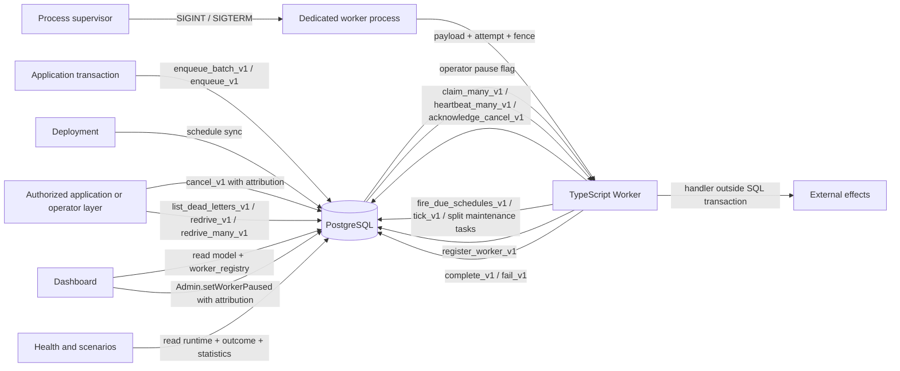
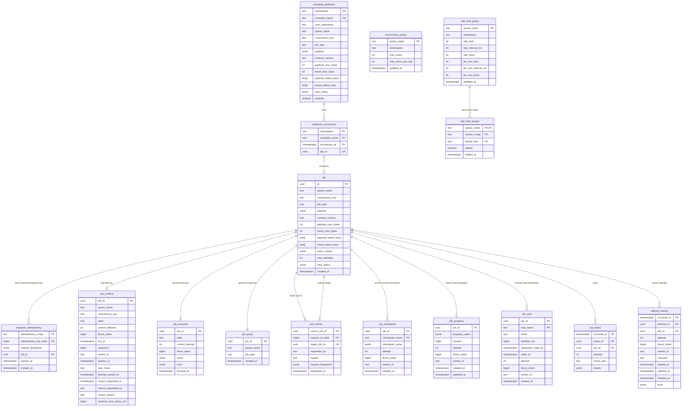
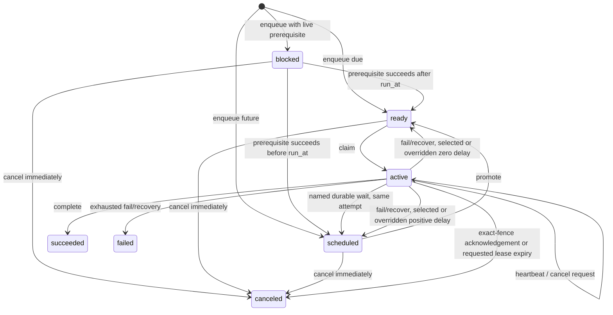

# Workhorse architecture

Workhorse is a PostgreSQL-backed durable queue whose correctness-sensitive lifecycle transitions live in versioned SQL functions. The TypeScript and Go `Queue`, `Admin`, and `Worker` remain thin protocol clients.

The current schema version is 47. Version 43 is the permanent migration baseline
(`WORKHORSE_SCHEMA_BASELINE_VERSION`); no earlier version is a supported upgrade source.

`installSchema` reads `sql/schema.sql`. It accepts only a fresh database or an already-current
version 1 schema. `migrateSchema` reads the single `workhorse.schema_version` row and applies the
ordered steps in `SCHEMA_MIGRATIONS` from `sql/migrations/`; migration `0044-protocol-version.sql`
is the first, `0045-statistics-maintenance-policy.sql` is the second, and
`0046-statistics-tiers.sql` adds the long-horizon tiers, and `0047-multi-queue-workers.sql` adds
multi-queue worker registration. `workhorse schema migrate` runs the same steps from the CLI.

A clean installation records the full lineage — `(43, 'pre-release baseline')`,
`(44, 'protocol version registry')`, `(45, 'statistics maintenance policy')`, and
`(46, 'long-horizon statistics tiers')`, and `(47, 'multi-queue workers')` — in
`workhorse.schema_migration`, so a migrated and a
clean-installed database carry identical history. `workhorse.protocol_version` records the served
SQL protocol versions (currently 1) independently of that history; `readProtocolVersions` reads it
and returns null below version 44. `migrateSchema` delegates ordered execution to the internal
`applySchemaMigrationPlan` function. Its `SchemaMigrationPlan` has `baselineVersion`,
`currentVersion`, `steps`, and `readStep` fields. Each `SchemaMigrationStep` has `fromVersion`,
`toVersion`, `file`, and `description` fields.

`isMissingDatabaseRelationError` unwraps database errors through `databaseErrorCode` and returns
true only for PostgreSQL SQLSTATE `3F000` (invalid schema name) or `42P01` (undefined table).

The plan runner wraps every step file in one transactional script: `BEGIN`, the
`pg_advisory_xact_lock(hashtext('workhorse:schema-migration'))` lock, a guard raising unless
exactly one `workhorse.schema_version` row equals `fromVersion`, the step body, the bookkeeping
that advances `workhorse.schema_version` and inserts the `workhorse.schema_migration` row, then
`COMMIT`. A body containing `BEGIN`, `COMMIT`, `ROLLBACK`, or `START TRANSACTION` is rejected
before execution. A step that fails while a concurrent migrator committed the same step is treated
as that migrator's success; any other failure rolls back atomically and reports
`Workhorse migration <file> failed and was rolled back`.

Versions below 43, versions above 47, gaps, and mixed version rows fail without running a migration.
`typescript/core/test/schema-migrations.test.ts` migrates every frozen artifact under
`sql/releases/` and requires schema-only dump equality with a clean installation.
SQL protocol functions keep their independent `_vN` suffix. A schema migration does not rename a
function or reinterpret that suffix.

## SQL protocol conformance

`protocol/v1/manifest.json` declares fixture format 1 and SQL protocol 1. It accepts installed
schema version 1 and client protocol 1. `protocol/v1/compatibility.json` distinguishes an absent,
older, current, or newer installed schema from the client's protocol version. Every incompatible
case requires refusal before a mutating function runs.

The manifest also pins `dashboard_signal_wait_v1` and `dashboard_human_wait_v1` as read contracts.
Their projections support public external-wait lists without exposing private tables.

`protocol/v1/scenarios.json` executes raw versioned PostgreSQL functions and versioned dashboard
views. It covers enqueue, claim, heartbeat, completion, failure, cancellation, retry, checkpoint,
timer boundaries, coalescing, dependencies, child jobs, signals, and human decisions. Exact JSON
surrounds typed placeholders for UUIDs, timestamps, and integers. Captured values preserve identity
and fence relationships across later steps. Structured errors pin SQLSTATE, message, canonical
JSON detail, and deterministic digests.

`protocol/v1/interpreter.json` pins the semantics of `$type`, `$ref`, normalization, capture reuse,
and structured-error matching without querying PostgreSQL. TypeScript executes it through
`materializeInterpreterValue`, `normalizeFixtureValue`, `assertFixtureValue`, and
`assertProtocolErrorValue`; Go uses `materializeInterpreterValue`, `normalizeProtocolValue`,
`matchFixtureValue`, and `matchProtocolErrorValue`; Python uses `materialize_interpreter_value`,
`normalize`, `assert_value`, and `assert_error_value`.

`protocol/v1/runtime.json` defines worker behavior above the SQL protocol. Its batch fixture pins
priority order, positional outcomes, retries, terminal failures, and independent attempt state.
Its suspension fixture pins durable-timer suspension, immediate worker-slot release, replay within
one logical attempt, and reuse of completed checkpoints. Its ownership fixtures pin cooperative
cancellation, database-authoritative deadline and execution-timeout settlement, lease-loss fencing,
non-overlapping worker heartbeat batches, and graceful drain without further claims. Its poll-cadence
fixture pins the empty-claim backoff step. `emptyPollsBeforeEnqueue` names the step under test, and
each language holds its worker at the end of every empty claim so the enqueue lands on that step
rather than on whichever step the runner reached. `enqueueStallMs` then delays the enqueue past one
whole step, so an executor that only counts empty polls fails on every run instead of once under
load. The TypeScript suite
runs every fixture through `Worker`; Python and Go runtimes must run the same fixtures.

`protocol/v1/requests.json` maps public enqueue inputs to exact PostgreSQL JSON. TypeScript
`Queue.enqueueMany`, Python `Queue.enqueue_with_result`, and Go `Queue.EnqueueWithResult` run every
mapping. `protocol/v1/schedules.json` maps recurring definitions to exact PostgreSQL JSON.
TypeScript `Queue.syncSchedules`, Python `Queue.sync_schedules`, and Go `Queue.SyncSchedules` run
every mapping. `manifest.fixtureCoverage` declares the complete identifier set for `requests`,
`schedules`, and `interpreter`. Each language compares the declaration with the file identifiers
and with the identifiers executed by its runner.

The Python distribution is `stablemates-workhorse`, and its import package is `workhorse`. It requires
Python 3.12 or newer. The distribution depends on Psycopg 3.3 or newer and below 4. The `asyncpg`
extra adds asyncpg 0.31 or newer and below 1. `python/src/workhorse/client.py` exports synchronous `Queue` for Psycopg and
asynchronous `AsyncQueue.from_psycopg` and `AsyncQueue.from_asyncpg` constructors. Both clients
expose `enqueue`, `enqueue_with_result`, `enqueue_many`, `enqueue_many_with_results`, and
`sync_schedules`. Both also expose `cancel`, `send_signal`, and `complete_human_wait`. Enqueue calls
use `enqueue_many_v1`; recurring definitions use `sync_schedule_definitions_v1`. Cancellation uses
`cancel_v1`; signal delivery uses `send_signal_v1`; human completion uses
`complete_human_wait_v1`.

Every module under `python/src/workhorse/` whose path carries no leading underscore declares
`__all__`, and that list is the module's supported surface. `workhorse` re-exports 126 names;
`types`, `errors`, `admin`, `client`, `worker`, `async_worker`, `worker_process`, `compatibility`,
`dashboard_v1`, and `workhorse.dashboard` each declare their own. A name a private module owns
reaches a public module only through an underscore-prefixed alias, so `import workhorse.admin`
no longer resolves `SQL_STATEMENTS`, `LIST_JOBS`, `MAX_PAGE_SIZE`, or `JOB_STATES`, and
`import workhorse.errors` no longer resolves `translate_database_error`.
`python/tests/test_public_surface.py` asserts both rules for every public module and executes the
`workhorse` import lines in `docs/guides/`, `site/content/docs/`, and `python/README.md`.

`Queue.cancel(job_id, *, requested_by=None, reason=None)` and the asynchronous equivalent return
`CancelResult`. Its status is `canceled`, `cancel_requested`, `already_terminal`, or `not_found`.
The result contains the job identity, state, current attempt, request attribution, reason, and
terminal timestamp. `requested_by` is audit attribution and does not authorize the caller.

`Queue.send_signal(job_id, name, payload, *, idempotency_key, requested_by)` and the asynchronous
equivalent return `SignalDeliveryResult`. Its `status` is `delivered`, `duplicate`, `not_waiting`,
`already_delivered`, `stale`, or `not_found`. The result also contains `job_id`, `name`, the retained
`payload`, `delivered_at`, and `delivered_by`. A changed request under one retained idempotency key
raises `SignalIdempotencyConflictError`.

`Queue.complete_human_wait(job_id, name, result, *, idempotency_key, requested_by)` and the
asynchronous equivalent return `HumanWaitCompletionResult`. Its `status` is `completed`,
`duplicate`, `not_waiting`, `already_completed`, `stale`, or `not_found`. The result also contains
`job_id`, `name`, the retained result as `payload`, `completed_at`, and `completed_by`. A changed
completion under one retained idempotency key raises `HumanWaitIdempotencyConflictError`.

Python validates external-wait names at 1 through 200 characters without surrounding whitespace.
It accepts `timeout_ms` from 1 through 604800000. Signal payloads, human contexts, and human results
must encode to at most 65536 UTF-8 bytes. Delivery idempotency keys contain 1 through 512 UTF-8
bytes, and `requested_by` contains 1 through 200 characters.

Every non-empty Python mutation first executes `SELECT version FROM workhorse.schema_version ORDER
BY version`. `python/src/workhorse/_protocol.py` accepts schema version 1 and client protocol 1.
It refuses an unreadable, missing, older, or newer schema before the mutating statement. Enqueue
batches contain at most 1000 requests. Default priority is 0, default attempt budget is 25, default
payload and result limits are 1048576 bytes, and default idempotency retention is 86400000
milliseconds.

`python/src/workhorse/_statements.py` owns each statement in `STATEMENTS` with explicit Psycopg and
asyncpg parameter dialects. `assert_sync_compatible` and `assert_async_compatible` query on every
call. `CachedCompatibilityCheck` and `AsyncCachedCompatibilityCheck` cache the first query result
for worker loops that opt into a one-shot gate. `python/src/workhorse/compatibility.py` publishes
that check to applications as `assert_schema_compatible(connection)` for synchronous Psycopg, and
`assert_schema_compatible_psycopg(connection)` and `assert_schema_compatible_asyncpg(connection)`
for the two asynchronous drivers. Each wraps the caller-owned connection in the matching executor,
reads `workhorse.schema_version`, and raises `ProtocolCompatibilityError` without creating or
changing a database object.

The Go module exports `NewQueue(executor, defaultQueue)`, `Queue.Enqueue`,
`Queue.EnqueueWithResult`, `Queue.EnqueueMany`, `Queue.EnqueueManyWithResults`, and
`Queue.SyncSchedules`. It also exports `Queue.Cancel`, `Queue.SendSignal`, and
`Queue.CompleteHumanWait` for application-driven lifecycle input. The single-item enqueue methods
accept zero or one variadic `EnqueueOptions` value. `EnqueueRequest.Options` carries the same value
for batch calls.

`Queue.Cancel(ctx, jobID, CancellationRequest)` invokes `cancel_v1` and returns `CancelResult`.
`CancellationRequest.RequestedBy` and `CancellationRequest.Reason` are optional audit metadata.
`CancelResult` returns the status, job identity, state, current attempt, retained request metadata,
and terminal timestamp. `RequestedBy` does not authorize the caller.

`EnqueueOptions` contains `Queue`, `Priority`, `ConcurrencyKey`, `RunAt`, `Deadline`,
`ExecutionTimeoutMS`, `MaxAttempts`, `RetryPolicy`, `Tags`, `Idempotency`, `Debounce`, `Throttle`,
and `Dependencies`. `Idempotency` contains `Key`, `Scope`, and `TTLMS`. `Debounce` adds `WindowMS`
and `Schedule`; `Throttle` adds `WindowMS`. `Dependencies` contains sorted `PrerequisiteJobIDs`
plus `OnSuccess`, `OnFailure`, and `OnCancellation` terminal policies.

`Queue.SyncSchedules(ctx, namespace, definitions, options...)` accepts `[]ScheduleDefinition` and
zero or one `SyncSchedulesOptions`. `ScheduleDefinition` contains `Name`, `Schedule`, `Job`, and an
optional `Enabled`; nil enables the definition. `ScheduledJob` contains `Type`, `Payload`, `Queue`,
`Priority`, `ConcurrencyKey`, `MaxAttempts`, and `RetryPolicy`. An omitted option prunes by default;
`SyncSchedulesOptions{Prune: false}` preserves definitions omitted from the desired set. Every call
serializes the full set, checks compatibility, and invokes `sync_schedule_definitions_v1` through
the caller-owned `Executor`.

A zero `ScheduledJob.Queue` uses the queue default. `Priority` accepts 0 through 100. A zero
`MaxAttempts` becomes 25. A zero `ConcurrencyKey` and `RetryPolicy` serialize as `null`.
`contractVersion` is `null`. `payloadMaxBytes` and `resultMaxBytes` are 1048576.
`sensitivePayloadKeys` and `sensitiveResultKeys` are empty arrays. `Enabled` serializes as true when
its pointer is nil.

Each non-empty call serializes and validates every request before it runs `AssertSchemaCompatible`
through the caller-owned `Executor`. Validation rejects multiple keyed modes. It rejects priority
outside 0 through 100 and negative `MaxAttempts`. A debounce cannot combine with `RunAt`.
Debounce and throttle cannot combine with `Dependencies`. Prerequisite lists cannot be empty,
duplicated, or larger than `MaxJobDependencies` at 100. PostgreSQL validates every remaining value.

The queue then calls `enqueue_many_v1`. A zero `Queue` uses the queue default. Zero `Priority` is 0,
zero `MaxAttempts` is 25, and zero `Idempotency.TTLMS` is 86400000 milliseconds. Zero `Scope` is
`default`. Zero `ConcurrencyKey`, `ExecutionTimeoutMS`, `Deadline`, `RetryPolicy`, `Dependencies`,
and keyed-mode pointers serialize as absent or `null` according to the protocol contract.
`payloadMaxBytes` and `resultMaxBytes` are 1048576. `sensitivePayloadKeys`,
`sensitiveResultKeys`, and zero `Tags` are empty arrays. `runAt` is the current UTC timestamp unless
the caller supplies `RunAt` or a keyed mode selects PostgreSQL's default. `MaxEnqueueBatchSize` is 1000.

`EnqueueResult` preserves PostgreSQL's
ordered job ID, outcome, and optional non-replaceable reason. The queue never commits, rolls back,
or closes the pgx or `database/sql` resource behind the executor. An incomplete, duplicate, or
out-of-range ordinal returns `ErrInvalidEnqueueResult`. SQLSTATEs `P1001`, `P1003`, and `P1005`
return `EnqueueIdempotencyConflictError`, `DependencyCycleError`, and
`DependencyLimitExceededError` with typed detail structs and matching sentinel errors. The three
`EnqueueNonReplaceableReason` constants carry the enum prefix every other Go constant group carries:
`NonReplaceableIncompatibleKeyMode`, `NonReplaceableNotPending`, and `NonReplaceableWindowElapsed`.
`IncompatibleKeyMode`, `NotPending`, and `WindowElapsedPending` remain as deprecated Go aliases of
the same values for the rest of the `0.x` line and are removed in `1.0.0`.

`python/src/workhorse/worker.py` exports `Worker` for a dedicated synchronous Psycopg connection
whose `autocommit` property is `True`. `Worker.handle(type, handler)` registers a handler whose
arguments are the JSON payload and `HandlerContext`. `HandlerContext.job` is the `ClaimedJob`
returned by `claim_v1`. `HandlerContext.cancellation` is a `CancellationToken` with `cancelled`,
`reason`, `wait(timeout)`, and `raise_if_cancelled()`.

`python/src/workhorse/async_worker.py` exports `AsyncWorker.from_psycopg` and
`AsyncWorker.from_asyncpg`. Both require one dedicated query connection outside a transaction.
Psycopg also requires `autocommit=True`. `_AsyncExecutorBridge` serializes calls through one
`asyncio.Lock` and schedules them on the run loop, then passes the resulting rows into the same
`Worker` lifecycle core. Async handlers run on that loop and receive `AsyncHandlerContext`.
Its durability methods are awaitable views of the same `_HandlerDurability` instance, so row
mapping, attempt arbitration, batch grouping, error settlement, telemetry, and drain have no
second async implementation. `AsyncCancellationToken.wait(timeout)` is awaitable; `cancelled`,
`reason`, and `raise_if_cancelled()` match `CancellationToken`.

Both factories accept `queue`, `queues`, `worker_id`, `concurrency`, `poll_ms`, `lease_ms`,
`heartbeat_ms`, `maintenance_interval_ms`, `registry_interval_ms`, `schedule_namespaces`, and
`schedule_catchup_limit` with the same validation and limits as `Worker`. They also accept an
awaitable `notification_connection_factory`, `on_notification_error`, and
`on_registration_error` callbacks.
`registry_interval_ms` defaults to 5000. It accepts `0` to disable registration or a non-boolean
integer of at least 100 milliseconds.
`AsyncWorker.handle(type, handler)` receives `(Json, AsyncHandlerContext)`. The context exposes
awaitable `get_checkpoint(name)`, `get_wait(name)`, `checkpoint(name, operation)`, `sleep(name,
duration_ms)`, `sleep_until(name, wake_at)`, `get_progress()`, `set_progress(value)`,
`wait_for_signal(name, *, timeout_ms)`,
`wait_for_human(name, context, *, timeout_ms)`, `run_child(name, type, payload, options)`, and
`run_children(children)`, and `run_children_all(children)`. `AsyncWorker.handle_batch(type, handler, *, max_size, linger_ms)` uses
the same limits as `Worker.handle_batch`. `run_once()`, `run()`, `pause()`, `resume()`,
`is_paused()`, and `stop()` match their synchronous names and return contracts.

`Worker.run_once()` and `Worker.run()` use a cached compatibility check. Each dispatch sweep first
calls `promote_v1(100)` and then `recover_expired_telemetry_v1(100, NULL)`. Promotion makes due
retries and durable waits claimable. Recovery uses the persisted retry policy before the sweep
calls `claim_v1`. `queue` selects one queue, while `queues` selects an ordered, de-duplicated set.
If the caller supplies both, `Worker` raises `ValueError`. Every claim attempt advances the
round-robin queue index.
The sweep stops after every queue returns empty without an intervening claim.

Python `HandlerContext.checkpoint(name, operation)` loads `job_checkpoint` lazily once per
activation, coalesces concurrent calls by name, and calls `save_checkpoint_v1` under the active
worker and fence. `get_checkpoint(name)` reads the same activation cache. The method raises
`CheckpointLeaseLostError` for `stale` and `CheckpointConflictError` for `conflict`.

Python `HandlerContext.get_progress()` loads `job_progress` once per activation.
`set_progress(value)` calls `update_progress_v1` with the active worker and fence, then replaces
the activation cache. It returns `JobProgress`. Status `stale` raises `ProgressLeaseLostError`;
status `rate_limited` raises `ProgressRateLimitError` with `retry_after_ms`.

`HandlerContext.sleep(name, duration_ms)` and `sleep_until(name, wake_at)` call
`schedule_wait_v1`. `get_wait(name)` loads `job_wait` lazily once per activation. Status
`scheduled` submits `suspended_for_wait` to the attempt arbiter, cancels the local token with a
private `BaseException` sentinel, stops the heartbeat, and skips completion or failure settlement.
The post-handler arbiter check preserves suspension if handler code catches that sentinel. Status
`elapsed` returns normally. The methods raise `WaitLeaseLostError`, `WaitConflictError`, or
`WaitLimitExceededError` for their matching protocol statuses.

`go/worker.go` defines `Handler` as
`func(context.Context, any, *HandlerContext) (any, error)`. `HandlerContext.Job` retains the
`ClaimedJob`. `HandlerContext.Checkpoint(name, operation)` reads the exact `job_checkpoint` row
before it runs `operation`, coalesces same-name calls within one activation, and calls
`save_checkpoint_v1` under the active worker and fence. Names contain 1 through 200 Unicode code
points. A nil operation is rejected before any query. Status `stale` returns
`CheckpointLeaseLostError`, which unwraps to `ErrLeaseLost`; status `conflict` returns
`CheckpointConflictError`.

Go `HandlerContext.GetProgress()` loads `job_progress` once per activation.
`SetProgress(value)` calls `update_progress_v1` with the active worker and fence, then replaces
the activation cache. It returns `*JobProgress`. Status `stale` returns
`ProgressLeaseLostError`, which unwraps to `ErrLeaseLost`; status `rate_limited` returns
`ProgressRateLimitError` with `RetryAfter`.

Go `HandlerContext.Sleep(name, duration)` accepts whole-millisecond `time.Duration` values from 1
millisecond through 365 days. `SleepUntil(name, wakeAt)` accepts a nonzero `time.Time` no more than
365 days in the future. Both call `schedule_wait_v1`. Status `scheduled` records an internal
suspension before returning the private sentinel error. `Worker.execute` then releases the slot and
uses that sentinel to cancel the handler's standard context. It skips failure and completion even
if the handler swallows the error. Status `elapsed` returns nil. Concurrent calls with one name
share one in-flight result.
Status `stale` returns `WaitLeaseLostError`, which unwraps to `ErrLeaseLost`; `conflict` and
`limit_exceeded` return `WaitConflictError` and `WaitLimitExceededError`.

Go `HandlerContext.RunChild(name, jobType, payload, options ...EnqueueOptions)` accepts one
optional `EnqueueOptions` value. A child name contains 1 through 200 Unicode code points. The method
rejects idempotency, debounce, throttle, and dependencies before it calls `create_child_v1`. The
default child queue is `default`. Status `created` records the private child suspension and cancels
the handler context. Status `completed` returns the retained result. Concurrent calls with one name
share one result only when their canonical requests match.

Go `HandlerContext.RunChildren(children)` accepts at most 100 unique `ChildJobRequest.Name`
values. It calls `create_children_v1` with mode `settled`. Status `created` uses the same suspension
path. Status `completed` reads the ordered `children` array and returns `[]ChildResult` in request
order. Each `ChildResult.Outcome` is `ChildSucceeded`, `ChildFailed`, or `ChildCanceled`.
`HandlerContext.RunChildrenAll(children)` passes mode `all_success`, returns
`[]ChildSuccessResult`, and propagates a failed or canceled child to the parent. An empty slice
returns an empty result without suspension. `ChildLeaseLostError`, `ChildConflictError`,
`ChildLimitExceededError`, and `ChildResultLimitExceededError` map the corresponding protocol
statuses. The result-limit error retains `ResultBytes` and `ResultLimitBytes`.
The `Create`-prefixed spelling of each of these three methods remains as a deprecated Go alias for
the rest of the `0.x` line and is removed in `1.0.0`. `go/CHANGELOG.md` pairs every old Go name with
its replacement.

`HandlerContext.wait_for_signal(name, *, timeout_ms=None)` calls `wait_for_signal_v1`. Status
`waiting` submits `suspended_for_wait` through the same private sentinel and lifecycle arbiter as a
timer. Status `delivered` returns the retained `payload`. Concurrent same-name calls share one
`Future`. The method raises `SignalWaitLeaseLostError`, `SignalWaitConflictError`, or
`SignalWaitLimitExceededError` for `stale`, `already_waiting`, or `limit_exceeded`.

`HandlerContext.wait_for_human(name, context, *, timeout_ms=None)` encodes the JSON context and
calls `wait_for_human_v1`. Status `waiting` suspends through the same arbiter; status `completed`
returns the retained `result`. Concurrent same-name calls share one `Future` only when their
canonical encoded contexts match. A different in-flight or retained context raises
`HumanWaitConflictError`. The method raises `HumanWaitLeaseLostError`,
`HumanWaitAlreadyWaitingError`, or `HumanWaitLimitExceededError` for `stale`, `already_waiting`, or
`limit_exceeded`. PostgreSQL caps each job at 1000 signal names and 1000 human-decision names.

`HandlerContext.run_child(name, type, payload, options=None)` accepts child names from 1 through 200
characters. It encodes `EnqueueOptions` without keyed modes or dependencies and calls
`create_child_v1`. An omitted child queue is `default`. Status `created` submits
`suspended_for_child` to the attempt arbiter. Status `completed` returns the retained result.
Concurrent calls with one name share a `Future` only when their canonical requests match. The
method raises `ChildLeaseLostError`, `ChildConflictError`, or `ChildLimitExceededError` for `stale`,
`conflict`, or `limit_exceeded`.

`HandlerContext.run_children(children)` accepts at most 100 unique `ChildJobRequest.name` values
and calls `create_children_v1` with mode `settled`. An empty sequence returns `{}` without
suspension. Status `created` submits `suspended_for_child`; status `completed` returns
`dict[str, ChildOutcome]` in request insertion order. `ChildOutcome` is the tagged union
`ChildSucceeded | ChildFailed | ChildCanceled`. `run_children_all(children)` passes mode
`all_success`, returns successful results as `dict[str, Json]`, and propagates a failed or canceled
child to the parent. The methods
map `stale`, `conflict`, `limit_exceeded`, and `result_too_large` to the corresponding child errors.
`ChildResultLimitExceededError` retains `result_bytes` and `result_limit_bytes`.

`concurrency` accepts integers from 1 through 100 and defaults to 1. The dispatcher calls
`claim_many_v1` with its free-slot count until all slots are occupied or a sweep is empty. Each claim
uses a 30000 millisecond default lease. `lease_ms` accepts 100 through 86400000. `heartbeat_ms`
defaults to the greater of 100 or one third of `lease_ms`; it must be positive and less than
`lease_ms`. Each claimed job starts one handler thread. One worker heartbeat timer submits every
active lease through `heartbeat_many_v1`, and it schedules the next batch only after the prior call
returns. A handler that finishes releases its slot and wakes the dispatcher.

`heartbeat_many_v1` status `cancel_requested` cancels the matching token with
`CancellationRequestedError`.
`deadline_exceeded` and `timeout_exceeded` use `DeadlineExceededError` and
`ExecutionTimeoutError`. `stale` uses `StaleLeaseError`. A local timer also calls
`expire_owned_v1` at the earlier of `deadline_at` and `attempt_timeout_at`. If PostgreSQL returns
`not_due`, the thread retries after 5 milliseconds and does not abandon the live attempt.

One locked attempt-outcome arbiter accepts the first lifecycle outcome. Cancellation calls
`acknowledge_cancel_v1` under the claimed worker and fence even if the handler catches the signal
and returns. Deadline and timeout transitions remain owned by `expire_owned_v1`. Lease loss raises
`StaleLeaseError` and prevents completion or failure. The worker stops and joins the background
thread before final settlement.

`run_once()` refills freed slots until one empty queue sweep, drains every claimed job, and returns
whether the pass claimed any work. `run()` repeats sweeps until `stop()` is called. `pause()` stops
new claims without stopping active handlers, and `resume()` wakes the dispatcher. `stop()` also
wakes the dispatcher and makes `run()` return only after every active handler settles.

`AsyncWorker.run_once()`, `run()`, `pause()`, `resume()`, and `stop()` preserve those contracts.
`AsyncWorker.handle_batch` accepts an async callback and supplies `AsyncBatchHandlerItem` values.
The shared coordinator still owns group selection, priority order, evidence writes, and per-member
settlement. `AsyncBatchHandlerContext.get_progress()` and `set_progress(value)` are awaitable, like
its checkpoint methods. These operations run on the application loop while the shared durability
core owns replay and persistence.

`Worker.handle_batch(type, handler, *, max_size, linger_ms)` registers a synchronous Python batch
handler. `max_size` accepts integers from 1 through 100 and cannot exceed `Worker.concurrency`.
`linger_ms` accepts integers from 0 through 60000. Each job occupies one worker slot while it waits
for a full group or the linger deadline. The coordinator groups one type and queue, then orders the
selected members by descending `ClaimedJob.priority` and worker claim order. Each job occupies its
own handler thread, so the dispatcher stamps a claim sequence before that thread starts. The
coordinator ranks by that sequence, not by the order threads reach it.

The handler receives a sequence of `BatchHandlerItem` values. Each item contains `payload` and a
`BatchHandlerContext` with `job`, `cancellation`, `get_checkpoint`, `checkpoint`, `get_progress`,
and `set_progress`.
`BatchHandlerContext` has no `sleep` or `sleep_until` methods, so one member cannot suspend the
shared invocation. The handler returns one `BatchHandlerOutcome` mapping per item. Status
`succeeded` requires `result`; status `failed` requires an `Exception` under `error`. A thrown
exception, a non-sequence return, the wrong outcome count, or an invalid mapping fails every member.

Before invocation, the coordinator calls `record_batch_dispatch_v1` with the ordered job IDs,
attempts, fence tokens, and worker ID. A shared callback failure also calls
`record_batch_failure_v1`. Evidence writes are best effort and never replace per-member settlement.
Every handler thread retains its own outcome arbiter, cancellation token, fence token,
retry budget, completion call, and failure call.

`Worker.HandleBatch(jobType, options, handler)` registers the Go `BatchHandler` for one job type.
`BatchHandlerOptions.MaxSize` accepts 1 through 100 and cannot exceed `WorkerOptions.Concurrency`.
`BatchHandlerOptions.Linger` accepts whole millisecond durations from zero through 60 seconds.
The process-local coordinator groups one queue and job type, then orders members by descending
`ClaimedJob.Priority` and arrival order.

The Go callback receives `[]BatchHandlerItem` and returns `[]BatchHandlerOutcome` in the same order.
Each item contains `Payload` and a `BatchHandlerContext` with `Job`, the standard cancellation
`Context`, `Checkpoint`, `GetProgress`, and `SetProgress`. The batch context omits `Sleep` and
`SleepUntil`, so one member cannot
suspend the shared invocation. `BatchSucceeded{Result: value}` completes one member.
`BatchFailed{Error: err}` submits that member's failure through its own retry budget. A panic, a
wrong outcome count, a nil outcome, or `BatchFailed` with a nil error fails every member.

Before the callback, the Go coordinator calls `record_batch_dispatch_v1` with one generated UUID
and the ordered jobs. If the callback fails as a group, it calls `record_batch_failure_v1` with the
same members. Both evidence writes are best effort. Each ordinary Go execution path still owns the
member's heartbeat, cancellation context, fence token, completion, and failure settlement.

`Worker._run_loop()` clears the wake event before a sweep, so a completion or state change during
an in-flight empty claim stays latched for the following wait. `poll_ms` defaults to 250 and must be
positive. If `notification_connection_factory` is present, `run()` starts one daemon listener
thread with a distinct autocommit Psycopg connection. The listener executes
`LISTEN workhorse_jobs`, wakes for a configured queue or `*`, and uses a 5,000 millisecond fallback
while connected. Before the listener connects, after it disconnects, or without a factory, the
worker uses the 250 millisecond polling default. An explicit `poll_ms` replaces both defaults.

The listener reconnects after errors with 10 percent jitter around exponential delays from 100 to
5,000 milliseconds. Each successful `LISTEN` resets the delay and wakes the worker. The optional
`on_notification_error` callback receives setup, connection, read, and close failures. Listener
failure never stops dispatch. `stop()` waits at most 200 milliseconds for the listener thread, so a
blocked connection factory cannot prevent the worker from draining.

`AsyncWorker.run()` can open a separate native async notification connection through
`notification_connection_factory`. Psycopg uses its asynchronous `notifies` iterator. asyncpg uses
`add_listener` and `remove_listener`. Both filter `workhorse_jobs` payloads to the configured queues
or `*`, wake the shared dispatcher, report listener errors, and reconnect with the same jittered
backoff. `AsyncWorker` closes the listener connection but never closes its query connection.

Handler failures pass a JSON error envelope to `fail_v1` with a null retry override, so PostgreSQL
selects `ready`, `scheduled`, or `failed` from the persisted attempt budget and retry policy.

Python `run_worker_process(worker, *, shutdown_timeout_ms, force_exit)` installs `SIGINT` and
`SIGTERM` handlers around `Worker.run()`. The first signal calls `Worker.stop()` and starts the
shutdown deadline. The deadline defaults to 25000 milliseconds and accepts integers from 1 through 3600000. If the worker drains before the deadline, the function restores the previous handlers and
returns. A second signal calls `force_exit` with 128 plus its signal number, which produces 130 for
`SIGINT` and 143 for `SIGTERM`. An expired deadline calls `force_exit(1)`. The default `force_exit`
is `os._exit`, so hard termination leaves active leases for `recover_expired_telemetry_v1`.

Python `Queue` accepts a caller-owned Psycopg connection. `AsyncQueue` accepts a caller-owned
Psycopg `AsyncConnection` or asyncpg `Connection`. The clients never call `commit`, `rollback`, or
`close`. `python/tests/test_driver_integration.py` verifies commit and rollback visibility through
independent connections. `python/tests/test_protocol_conformance.py` executes every
`protocol/v1/scenarios.json` step and verifies compatibility fixtures, canonical rows, captures,
SQLSTATE values, messages, and JSON details.

`python/tests/test_release.py` derives the Python and PostgreSQL support lists from
`python/pyproject.toml` and `typescript/core/src/support.ts`. It requires the active interpreter and
connected PostgreSQL server to belong to those lists. A session fixture builds the `py3-none-any`
wheel and source distribution. It installs each artifact bare, with the compatibility `psycopg`
extra, and with the `asyncpg` extra in clean environments. The lifecycle example runs from the bare
wheel and executes retry, checkpoint, timer, child, signal, and human-wait boundaries. The async
example runs from the source distribution with the `asyncpg` extra. It commits enqueue through
Psycopg `AsyncConnection` and asyncpg `Connection`.
`python/tests/test_worker_process.py` runs `python/examples/dedicated_worker.py` from the same wheel
and delivers `SIGTERM` through `run_worker_process`.

The Go module is `github.com/stablemates/workhorse/go`, requires Go 1.25 or newer, and requires pgx v5.9.2
as a minimum rather than a pin: minimal version selection lets a consumer choose a higher pgx v5, which
is expected to work and is not tested.
`Executor.Query(context.Context, string, ...any) ([]Row, error)` returns rows keyed by PostgreSQL
column name. `PGXQueryer` accepts `pgx.Tx`, `*pgx.Conn`, and `*pgxpool.Pool` through
`NewPGXExecutor`. `SQLQueryer` accepts `*sql.Tx`, `*sql.Conn`, and `*sql.DB` through
`NewSQLExecutor`. Both adapters close the result rows they open. They never commit, roll back, or
close a caller-owned transaction, connection, pool, or database.

`NewWorker(pool, options)` accepts a caller-owned `*pgxpool.Pool`. `WorkerOptions.Queue` selects one
queue and defaults to `default`. `WorkerOptions.Queues` selects several queues. Supplying both
returns an error. Every queue name must be non-empty. Duplicate names collapse to their first
occurrence.

`WorkerOptions.WorkerID` defaults to the host name, process ID, and a random suffix.
`WorkerOptions.Concurrency` defaults to 1 and accepts integers from 1 through 100. One buffered
semaphore owns that budget across every configured queue.
`WorkerOptions.LeaseDuration` defaults to 30000 milliseconds and accepts whole-millisecond values
from 100 through 86400000. `WorkerOptions.PollInterval` defaults to 1000 milliseconds.
`WorkerOptions.HeartbeatInterval` defaults to one third of `LeaseDuration`, truncated to a whole
millisecond, and must remain positive and shorter than the lease.
`WorkerOptions.MaintenanceInterval` defaults to 1000 milliseconds and accepts positive
whole-millisecond values.
`WorkerOptions.RegistryInterval` defaults to 5000 milliseconds and accepts whole-millisecond values
of at least 100. `WorkerOptions.DisableRegistry` prevents registration and remote pause delivery.
`WorkerOptions.OnRegistrationError` observes a failed refresh without stopping dispatch.
`WorkerOptions.ScheduleNamespaces` defaults to empty, rejects empty names, and removes duplicates
after their first occurrence. An empty list disables schedule evaluation.
`WorkerOptions.ScheduleCatchupLimit` defaults to 100 and accepts integers from 1 through 10,000.
`WorkerOptions.ShutdownGracePeriod` defaults to 30000 milliseconds and accepts positive
whole-millisecond values.
`WorkerOptions.Logger` accepts a `*slog.Logger` and defaults to `slog.Default()`.
`Worker.Handle(type, handler)` registers a
`Handler(context.Context, any, *HandlerContext) (any, error)`.
`Worker.Run` and `Worker.RunOnce` share one execution permit. Concurrent calls serialize, so they
cannot multiply the concurrency budget or race the queue cursor.

`Worker.RunOnce` calls `tick_v1(100, 100)` and then `promote_v1(100)`. If the tick lock is available,
it also evaluates every configured schedule namespace before claiming. It then
checks configured queues in round-robin order until one `claim_many_v1(..., 1, ...)` succeeds or every queue is empty.
It executes at most one matching handler outside a transaction. It calls `complete_v1` or `fail_v1`
under the returned fence.

`Worker.Run` fills free semaphore slots with `claim_many_v1`. Each successful claim starts
one handler goroutine. The queue cursor advances after every claim attempt, so a busy queue cannot
prevent another configured queue from being checked. An empty sweep waits for `PollInterval` or a
matching PostgreSQL notification, whichever arrives first. Without an active listener, empty waits
double through 5000 milliseconds with ±10% jitter. A notification waits a random 0 through 50
milliseconds before the next claim.

If the pool permits at least two connections, `Worker.Run` acquires one dedicated connection and
executes `LISTEN workhorse_jobs`. A payload equal to a configured queue name or `*` wakes the claim
loop. The listener also wakes the loop after connecting, so polling covers work committed during a
connection gap. Listener failure never stops dispatch. The worker logs a warning through
`WorkerOptions.Logger`, continues polling, and reconnects after an exponential delay from 100
milliseconds through 5000 milliseconds. A pool limited to one connection logs once and uses polling
without starting the listener. PgBouncer transaction mode cannot preserve the session that owns
`LISTEN`. For that deployment, `WorkerOptions.PollingOnly` disables the listener and logs the
polling fallback; it defaults to false.
On clean shutdown, the listener allows up to 1000 milliseconds for `UNLISTEN workhorse_jobs` before
returning its connection to the pool.

Cancelling the `Run` context stops new claims and the maintenance loop. An in-flight claim may still
land and joins the drain. Active handlers retain a context without the caller's cancellation during
`ShutdownGracePeriod`. When that period expires, `Run` cancels every remaining handler context.
`Run` waits for every claimed handler goroutine before returning. A handler must observe context
cancellation for a forced drain to finish. The SDK installs no process signal handlers;
applications can pass a context from `signal.NotifyContext` for `SIGINT` and `SIGTERM`.

While handlers run, one worker heartbeat goroutine serializes `heartbeat_many_v1` calls on the pool.
Each call includes every active job's ID, fence token, and lease duration. Heartbeat batches never
overlap.
The earlier of `deadline_at` and `attempt_timeout_at` cancels the handler context. The supervisor
then retries `expire_owned_telemetry_v1` while PostgreSQL returns `not_due` within its 1000
millisecond clock-skew budget. If the supervisor settles expiration, `execute` records the outcome
without repeating the fenced transition. `cancel_requested` cancels the context and settles through
`acknowledge_cancel_v1`; `stale` cancels it without another fenced write. `context.Cause` returns
`CancellationRequestedError`, `DeadlineExceededError`, `ExecutionTimeoutError`, or `LeaseLostError`.

`Worker.Run` borrows a pool connection for each claim or settlement query. No connection remains
checked out while a handler runs. A separate maintenance goroutine calls `tick_v1(100, 100)`
immediately, then repeats on every `MaintenanceInterval`. Handler
duration and claim throughput do not delay it. Heartbeat, maintenance, claim, and settlement queries
serialize safely when the pool has one connection.
A handler error passes a JSON envelope and a null retry override to `fail_v1`, so PostgreSQL selects
retry timing and attempt exhaustion. A rejected completion or `stale` failure returns
`StaleLeaseError`, which matches `ErrStaleLease` through `errors.Is`.
`callHandler` recovers a panic and converts it to `handler for <type> panicked: <value>`. The worker
passes that error through the same `fail_v1` path, waits for the ownership supervisor, and keeps the
dispatch loop alive.

The Go SDK installs no process handlers. Applications pass a context from `signal.NotifyContext` to
`Worker.Run`. Cancellation stops claims and begins the configured drain. `go/worker_process_test.go`
builds `go/testdata/process-worker` as a separate executable. The test sends `SIGTERM` while a handler
is active and verifies a zero exit after settlement. A second test sends `SIGKILL`, waits for the
lease to expire, starts another executable, and verifies one recovery on attempt two.

`go/release_test.go` derives the minimum Go and pgx versions from `go/go.mod`. It derives the
PostgreSQL matrix from `support.json` and checks the connected lane against that matrix. It also
requires the README example to match `go/examples/quickstart/main.go` verbatim, then builds every
example through an external module. Its consumer test writes a separate module with a local
`replace` directive, imports `github.com/stablemates/workhorse/go`, and commits an enqueue through
`pgx.Tx`. The external module constructs `Worker`, registers `Handle`, and settles the job through
`RunOnce`. The queue integration tests also enqueue through `*pgxpool.Pool` and `*sql.Tx` with the
pgx stdlib driver.

`scripts/readme-alignment.test.ts` derives SDK support sentences from `support.json` and the Go pgx
claim from `go/go.mod`. It requires the TypeScript, Python, and Go README code blocks to be verbatim
excerpts of their release-tested quickstart files. `pnpm check` runs this focused test before the
repository test suite.

`support.json` also owns the install commands under its `install` key: `node` is
`npm install @stablemates/workhorse`, `python` is `pip install stablemates-workhorse`, `go` is
`go get github.com/stablemates/workhorse/go`, `schema` is
`npm exec --no -- workhorse schema install`, and `schemaPinned` is
`npx --package @stablemates/workhorse@0.1.0 workhorse schema install`. The three language commands
carry no version. The two schema commands are the deployment tool rather than an adoption step, and
their version must equal the SDK the application depends on: `schema` achieves that by resolving
the binary from the project's own `node_modules`, which `--no` requires and never installs, and
`schemaPinned` achieves it by naming the version for a project that has no `node_modules`.
`scripts/install-commands.test.ts` requires each command verbatim on the surfaces that introduce the
product: `README.md` and `typescript/core/README.md` state `node` and `schema`; the
`dashboard`, `dashboard-server`, `drizzle`, `kysely`, `otel`, `prisma`, and `typeorm` READMEs under
`typescript/` state `node`; `python/README.md` states `python` and `schemaPinned`; `go/README.md`
states `go` and `schemaPinned`; `go/examples/README.md` states `go`;
`site/content/docs/installation.mdx`, `quickstart.mdx`, and `for-ai-agents.mdx` state all five; and
`site/content/docs/api.mdx` states both schema commands. `typescript/dashboard-contract/README.md`
is exempt because it installs a type-only development dependency, and the test fails when a
published package gains a README that is neither governed nor exempt. Three sweeps cover every
tracked Markdown and MDX file outside `docs/decisions/`: no install command other than a
`workhorse schema` command may name a version, `install.schemaPinned` must name exactly the version
in `typescript/core/package.json` while `install.schema` names none, and no file may run the
`workhorse` binary through `npx` without `--package`, a form `npx` resolves to an unrelated package
outside a project that already depends on `@stablemates/workhorse`.

TypeScript `PROTOCOL_VERSION` is 1. `schemaCompatibilityRefusal(state, clientProtocolVersion)` in
`typescript/core/src/schema.ts` applies the tests in the order `protocol/v1/compatibility.json`
fixes, and returns a `SchemaCompatibilityRefusal` carrying a `code` and a `message`, or null.
`clientProtocolVersion` defaults to `PROTOCOL_VERSION`; a caller passes another version only to ask
what a different client would meet. The `code` is `schema-not-installed`, `schema-too-old`,
`schema-too-new`, `client-protocol-too-old`, or `client-protocol-too-new`, which are the same five
strings as Go's `CompatibilityCode` and Python's `CompatibilityCode`. `assertSchemaCompatible` reads
the state with `readCompatibilityState` and throws `SchemaCompatibilityError` (exported from
`typescript/core/src/errors.ts`) carrying that `code`, the `installedVersion` it read, and the
`expectedVersion` this build was compiled against. A missing relation becomes
`schema-not-installed`; any other query failure stays a plain `Error`, because an unreadable
database is not a verdict about versions.
`typescript/core/test/schema-compatibility.test.ts` executes every case in
`protocol/v1/compatibility.json`, and
`typescript/core/test/schema-installation.test.ts` asserts the thrown type and code against a real
database in both directions.

Go `ProtocolVersion` is 1. `CheckCompatibility` takes an installed schema version, a client
protocol version, and the protocol versions the installed schema declares it serves, and returns
`*CompatibilityError`. Its `Code` is `schema-not-installed`, `schema-too-old`, `schema-too-new`,
`client-protocol-too-old`, or `client-protocol-too-new`. It refuses a schema below
`minimumSchemaVersion` and applies no upper bound to the schema version, because inside a major
line a migration only adds. The upper bound comes from the served set instead: a client protocol
below the oldest served version is `schema-too-new`, and one above the newest served version is
`schema-too-old`. An empty served declaration enforces nothing.
`AssertSchemaCompatible` executes the `compatibility_state` statement on every call, which returns
both facts in one round trip as `kind`/`version` rows, and translates SQLSTATE `42P01` or `3F000` to
`schema-not-installed`. It accepts exactly one `schema` row. `NewCachedCompatibilityCheck` returns a `CachedCompatibilityCheck` whose
`Assert` uses `sync.Once` to cache the first result, including a compatibility or database error.
`AssertCompatible` remains as a deprecated Go alias for the rest of the `0.x` line and is removed in
`1.0.0`. `go/compatibility_test.go` executes every case in `protocol/v1/compatibility.json`.

`scripts/verify-sql-protocol.ts` interprets the language-neutral files. It reads
`workhorse.schema_version` and rejects incompatible schema or client protocol versions before a
scenario can mutate the database. The clean-install and forward-migration suites both run the
interpreter. The suite pins every TypeScript function call's projection, casts, argument order,
and arity. It also pins each TypeScript view read's projection and ordering. A clean-schema,
migration, TypeScript-call, or fixture change therefore fails the same conformance command.

PostgreSQL owns canonical JSONB values, enqueue outcomes, claim selection, leases, fence tokens,
retry timing, lifecycle transitions, checkpoints, waits, dependency resolution, child lineage,
signal delivery, human completion, and structured SQL errors. Each language runtime validates
local arguments, registers handlers, bounds concurrency, and sends heartbeats. It attaches polling
or notifications, delivers cancellation locally, emits telemetry, maps errors, and drains during
shutdown. Batch handlers remain a runtime feature assembled from jobs with separate fence tokens.

This page is the precise reference. For the ideas it assumes — leases and fence tokens,
at-least-once delivery, cooperative cancellation, the runtime/outcome split — start with
[`guides/000-start-here.md`](guides/000-start-here.md).

## Dashboard wire contract

`dashboard/v1` is the language-neutral contract an embedded dashboard backend implements (ADR
0029). `dashboard/v1/manifest.json` declares format 1, contract 1, read surface 1, the oRPC RPC
transport envelope, the delegated-authentication and same-origin CSRF expectations, and each
procedure's mutation flag. `dashboard/v1/procedures.json` carries every procedure's URL path,
request-input JSON Schema, and response JSON Schema, with shared wire types under `$defs`. Its
`html.runtimeConfigPlaceholder` is `/*__WORKHORSE_RUNTIME_CONFIG__*/`,
`html.browserModulesPlaceholder` is `<!--__WORKHORSE_BROWSER_MODULES__-->`, and
`html.runtimeConfig` is the complete `DashboardRuntimeConfig` JSON Schema.
`dashboard/v1/README.md` specifies the envelope, error codes, request handling order, and the
application-serving surfaces.

Every `$defs` key carries the `Dashboard` prefix, whether or not the TypeScript symbol it was
resolved from does. `dashboardDefinitionName` in
`typescript/dashboard-server/spec/response-schemas.ts` applies that rule, and the
`names every shared wire type with the Dashboard prefix` test in
`typescript/dashboard-server/test/dashboard-spec.test.ts` pins it to the committed artifact. The
rule exists because a core type that reaches a dashboard response would otherwise name a second
copy of itself in a generated binding, beside the core one the same SDK already exports:
`CancelStatus`, `SignalDeliveryStatus`, `HumanWaitCompletionStatus`, `Json`, `QueueHealthReason`,
`QueueHealthReasonCode`, and `RetentionPolicyImpact` are all keyed with the prefix. The prefix
names the contract's schema, not the TypeScript symbol, so the core type stays the one source of
the shape. `generate-bindings.ts` resolves a procedure input's local `__schema0`, which
`z.toJSONSchema` names inside that input document, to the shared `DashboardJson`.

The committed dashboard artifacts are the authority, and `dashboardRouter` is their generator.
The SQL flow has the opposite ownership: `sql/schema/current.sql` is the tracked authority, and
the build generates `sql/schema.sql` from it. `typescript/dashboard-server/spec/generate.ts`
derives input schemas from the router's Zod inputs via `z.toJSONSchema` and response schemas from
the checker-resolved `DashboardV1Responses` in `typescript/dashboard-server/spec/responses.ts`.
`pnpm dashboard-spec:generate` rewrites the artifacts; `pnpm dashboard-spec:check` and
`typescript/dashboard-server/test/dashboard-spec.test.ts` fail on any divergence, so a router
change that alters the wire contract lands only with regenerated, reviewed artifacts. The spec
commands run `dashboard-bindings:generate` or `dashboard-bindings:check` after the artifact step.
`typescript/dashboard-server/spec/generate-bindings.ts` reads `procedures.json` and emits
`go/dashboard/v1_generated.go` and `python/src/workhorse/dashboard_v1.py`. Those files contain the
request and response types and `DashboardRuntimeConfig`. The `DashboardJson` definition gets no Go
declaration, because Go spells an arbitrary JSON value `any`; Python declares `DashboardJSON` as a
recursive union, which is the only way to type the same value there. Go exposes `ValidateInput`
plus one `Validate<Procedure>Input` wrapper per procedure; its internal `validateSchema`
interpreter uses `number` for JSON numeric coercion.
Python exposes `validate_input` plus one `validate_<procedure>_input` wrapper per procedure and
raises `DashboardInputValidationError`; its internal interpreter is `_validate_schema`.

The internal `dashboardRuntimeConfigSchema` in `typescript/dashboard-server/src/server/html.ts`
is the source of the exported `DashboardRuntimeConfig` through `z.infer`. `z.toJSONSchema` writes
the same schema to `procedures.json.html.runtimeConfig`, so the server type and versioned schema
cannot drift.

`dashboard/v1/conformance.json` adds executable HTTP-level conformance fixtures analogous to
`protocol/v1/scenarios.json`: SQL seed steps bring a freshly installed schema to a known state,
then golden request/response exchanges cover every procedure plus the error envelope, the
same-origin mutation rejection, and read-only `FORBIDDEN` behavior.
`scripts/verify-dashboard-conformance.ts` executes the fixtures and enforces that coverage;
`typescript/dashboard-server/test/conformance.test.ts` binds the TypeScript server as the
reference implementation that must pass them, and `pnpm dashboard-conformance:generate`
regenerates the golden `expect` blocks from that server. `dashboard/v1/README.md` specifies the
fixture format and the harness a backend under test must present.

`workhorse.dashboard.DashboardHost` is the Python WSGI backend. Its constructor takes one
caller-owned Psycopg connection plus `authorize`, `path`, `environment`, `audit_actor`, `read_only`,
`browser_modules`, `configured_workers`, `maintenance_loops`, and the optional `enqueue_test`
extension. The connection must have `autocommit=True`; the host rejects transactional connections
so a WSGI request cannot leave locks or an idle transaction behind. `DashboardPrincipal.actor` is
the authenticated identity. `DashboardResponse` lets the
authorization hook return a complete denial or redirect response. The host authorizes before
`assert_sync_compatible`, rejects cross-origin mutations before decoding input, validates through
`dashboard_v1.validate_input`, overwrites `audit.actor`, and then calls the private
`workhorse.dashboard._backend.DashboardBackend`. Its `procedures()` implements every
database-owned contract procedure through
versioned dashboard views and lifecycle functions. The host supplies `enqueueTest` and
`setScheduleEnabled`, whose behavior belongs to the embedding runtime.
`python/tests/test_dashboard_conformance.py` executes all six
scenarios and all 66 exchanges against both writable and read-only hosts.

`workhorse.dashboard_tasks_v1(p_input jsonb)`,
`workhorse.dashboard_queues_v1(p_input jsonb)`,
`workhorse.dashboard_task_counts_v1(p_input jsonb)`,
`workhorse.dashboard_task_facets_v1(p_input jsonb)`,
`workhorse.dashboard_activity_v1(p_input jsonb)`,
`workhorse.dashboard_events_v1(p_input jsonb)`,
`workhorse.dashboard_job_detail_v1(p_input jsonb)`, and
`workhorse.dashboard_human_waits_v1(p_input jsonb)` return their complete `dashboard/v1`
response documents. `workhorse.dashboard_event_detail_v1(p_input jsonb)` returns one complete
event-detail document or SQL `NULL` when the stable event identity does not exist. TypeScript,
Python, and Go validate the wire input, call the matching function, and decode its single `jsonb`
result. The TypeScript host may add its application-owned durability summary after
`dashboard_tasks_v1` or `dashboard_job_detail_v1` returns. `DashboardDurabilityProjector` is an
in-process callback rather than database state.

`dashboard.NewHandler` is the Go `net/http` backend. `HandlerOptions` takes a caller-owned
`workhorse.Executor`, `Authorize`, `Path`, `Environment`, `AuditActor`, `ReadOnly`,
`BrowserModules`, `ConfiguredWorkers`, `MaintenanceLoops`, and optional `Procedures` extensions.
`Principal.Actor` supplies authenticated attribution; `Authorization.Response` can supply a
complete denial or redirect. The handler preserves the same authorization, compatibility, CSRF,
validation, attribution, and dispatch order as Python. `RPCError` carries defined status, code,
message, and data. `typescript/dashboard-server/test/go-conformance.test.ts` runs the shared
fixture verifier against the Go HTTP backend, with `go/dashboard/cmd/conformance` supplying the
contract's `enqueueTest` and `setScheduleEnabled` extensions and writable/read-only deployments.

ADR 0037 keeps presentation policy out of those backends. `settings.recommendationInputs` returns
health reasons, rollup measurements, fallback-partition counts, and the measured enqueue rate.
`system.status.reasons` returns the database verdict inputs without English checks.
Retry buckets use `upperBoundMs`; worker rows use `lastHeartbeatAt`; activity returns every group;
system queue rows retain database order. `cron.maintenance` returns the maintenance policy,
cadences, and task state instead of fabricated schedule rows. Retention categories and storage
relations carry identifiers and measurements without labels or groups.
`dashboard/app/src/presentation-policy.ts` owns the exact presentation policy. Its
`deriveSettingsRecommendations` function warns about cleanup pressure when the measured daily
enqueue rate exceeds 80% of the daily deletion ceiling, and derives the retention, rollup, and
fallback-partition recommendations. `healthCheckMessages`, `retentionCategoryLabels`, and
`presentStorageRelation` map reason, retention-category, and relation identifiers to English
wording and storage groups. `retryBucketLabel` maps upper bounds of 60,000, 300,000, 900,000,
and 3,600,000 milliseconds to `1m`, `5m`, `15m`, and `1h`; every other bound is `later`.
`workerStatus` reports `active` when `activeJobs` is positive, `idle` when a registered worker's
heartbeat is at most 30,000 milliseconds old, `recent` when `lastSeenAt` is at most 300,000
milliseconds old, and `offline` otherwise. `sortQueuesByRisk` orders descending by
`oldestReadyMs + ready * 1,000 + dueSoon * 100`, then by queue name. `capActivityGroups` keeps at
most 10 legend groups; when more exist, it keeps the nine highest-count groups and combines the
rest as `other`. `presentSchedules` adds the `workhorse:tick`, `workhorse:history-partitions`,
`workhorse:history-retention`, and `workhorse:terminal-storage` rows and derives their descriptions
and maintenance state from the raw policy, cadence, and task state.

## Design objective

Dispatch cost should scale with live work, not lifetime completed work. Schema version 1 stores:

- stable identity and the current accepted definition in `job`; pending keyed debounce may replace
  the definition before dispatch
- exactly one mutable `job_runtime` row only while a job is scheduled, blocked, ready, or active
- exactly one immutable `job_outcome` row after success or terminal failure
- at most one bounded mutable `job_progress` projection, separate from payload and outcome
- immutable audited `job_redrive` edges between failed sources and fresh target identities
- append-only, time-partitioned `job_event` and `attempt_history`

## System context

PostgreSQL is the durable authority. A worker owns a job only while the active `job_runtime` row matches its worker ID and fence token and has not expired.

`@stablemates/workhorse` exports node-postgres `Pool` as its default connection implementation. `Queue`,
`Admin`, and schema operations accept that pool or another `Queryable` supplied by an adapter.
`Worker` accepts a `Queue` or another `WorkerQueueApi`.

Workers run in dedicated processes. Each process owns its adapter,
Workers, optional probe-only listener, termination signals, bounded drain, and final resource close.
Web frameworks do not participate in worker lifecycle. See
[`worker-processes.md`](worker-processes.md) and
[ADR 0012](decisions/0012-dedicated-worker-processes.md).

`@stablemates/workhorse-drizzle`, `@stablemates/workhorse-prisma`, `@stablemates/workhorse-typeorm`, and `@stablemates/workhorse-kysely` convert
provider database and transaction objects into `Queryable`. `createDrizzleAdapter` discovers the
retained node-postgres client through `$client`. `createPrismaAdapter`, `createTypeOrmAdapter`, and
`createKyselyAdapter` accept `notificationPool`; Kysely callers can pass the pool used by
`PostgresDialect`. Each adapter exposes `queue` and `admin`, while `forTransaction` and
`adminForTransaction` bind the corresponding client to a caller-owned transaction. Neither method
commits, rolls back, disconnects, or destroys that transaction. Each adapter closes
resources only through its configured `close` callback, and `WorkhorseAdapter.close()` invokes that
callback once.

`prismaQueryable` sends the statement and positional values through `$queryRawUnsafe`.
`typeOrmQueryable` sends them through `query`. Both require a row array and synthesize the
`QueryResult` metadata that core does not inspect: an empty `command`, the row-array length as
`rowCount`, zero as `oid`, and an empty `fields` array. `PrismaQueryError` and `TypeOrmQueryError`
retain the statement and original `cause` without copying parameter values into the message. Their
error-code searches process at most 16 queued entries and accept only five-character uppercase
alphanumeric codes. `PrismaQueryError` prefers `meta.code` over Prisma's outer raw-query code.
`TypeOrmQueryError` follows `driverError` and `cause`. Each adapter copies the discovered code to
its wrapper's `code` property so core can preserve typed SQL conflicts.

`kyselyQueryable` builds a `CompiledQuery.raw` from the statement and positional values, then calls
`executeQuery` on either a `Kysely` database or `Transaction`. It maps `QueryResult.rows` into the
same synthetic node-postgres metadata described above. `KyselyQueryError` retains the statement and
original `cause`, follows at most 16 nested causes, accepts only five-character uppercase
alphanumeric codes, and copies the discovered code to its wrapper.

### What an adapter must guarantee

`typescript/core/src/adapter.ts` owns the shared implementation of every guarantee below, exported from
`@stablemates/workhorse` as `QueryError`, `rowsToQueryResult`, `attachNotificationPool`,
`createProviderQueryable`, `createProviderAdapter`, and `createWorkhorseAdapter`. An adapter that
uses them supplies only how its ORM runs a statement; an adapter that does not still owes the same
guarantees.

1. **Statement execution.** `query(text, values)` sends `text` unmodified with `values` as
   positional parameters, and returns a `QueryResult` whose `rows` preserve result order.
   `rowsToQueryResult` sets `rowCount` to the row-array length, `command` to the empty string,
   `oid` to zero, and `fields` to an empty array; core reads only `rows` and `rowCount`. A provider
   that answers with anything other than a row array is a failed query, not an empty result.
2. **Transaction adaptation.** `forTransaction(transaction)` returns a `Queue` bound to the
   caller's transaction. `adminForTransaction(transaction)` returns the matching `Admin`. Neither
   client commits, rolls back, disconnects, or destroys the transaction.
3. **Error translation.** A failed statement throws an error extending `QueryError`, which retains
   `statement` and the original `cause` and copies the SQLSTATE to `code`. The code comes from
   `databaseErrorCode` in `typescript/core/src/errors.ts`: breadth-first over `cause`, `driverError`, and `meta`,
   at most 16 objects, cycle-safe, accepting only five-character uppercase alphanumeric codes, and
   preferring a nested SQLSTATE over a Prisma `P\d{4}` code that carries `meta`. Core depends on
   this to raise `EnqueueIdempotencyConflictError` for SQLSTATE `P1001`,
   `RedriveIdempotencyConflictError` for `P1002`, `DependencyCycleError` for `P1003`, and
   `DependencyLimitExceededError` for `P1005` through any ORM wrapper. Messages never copy parameter
   values.
4. **Failures that pass through untranslated.** A `QueryError` is already translated and is
   rethrown as-is rather than nested again. A `RangeError` states that the statement itself was
   malformed — a placeholder with no matching value — which is the caller's error rather than the
   database's.
5. **Notification capability.** Optional. An adapter that can lend a dedicated session sets
   `connect()`, `notificationConnectionCapacity`, and `notificationConnectionIdentity` on the
   queryable, which `attachNotificationPool` does from a node-postgres pool's `connect()` and
   `options.max`. The pool object is the sharing identity, so queryables built from one pool share
   one listener. Transaction queryables never carry the capability, because that session ends.
   Without it, workers fall back to bounded polling.
6. **Resource ownership.** An adapter closes nothing it did not create. `WorkhorseAdapter.close()`
   invokes the configured `close` callback at most once, however many times it is called.

### Queue module seams

`Queue` is the application and worker facade. `Admin` is the operator facade. Both constructors
call `createQueueModuleContext` and `createQueueModules`. Neither factory is exported from
`typescript/core/src/index.ts`, so both clients share modules without exposing the module graph.

`createQueueModuleContext` returns an immutable `QueueModuleContext`. The context contains the
`Queryable`, default queue name, and validated `QueueOptions`. Every internal module extends
`QueueModule`, which retains that context for relocated behavior.

`createQueueModules` constructs nine receivers. They are `EnqueueContractsModule`,
`ClaimLeaseFenceModule`, `CheckpointsProgressWaitsModule`, `QueueAdministrationModule`,
`WorkerRegistryModule`, `RetentionMaintenanceModule`, `CronSchedulesModule`, and
`OperatorReadsModule`, plus `ChildJobsModule` for fenced child creation and joining.

`EnqueueContractsModule.enqueue` and `enqueueMany` own enqueue serialization, tracing, telemetry,
and `P1001` conflict translation. `jobAcceptance` selects and validates the current payload
contract for direct enqueue and schedule synchronization. `validateResult` validates completion
against the contract version accepted by the claimed job. `validateQueueOptions` checks contract
configuration before `Queue` creates the immutable module context. `Queue.enqueue`,
`enqueueMany`, `syncSchedules`, and `complete` delegate these operations without changing their
public signatures. `typescript/core/src/queue.ts` continues to re-export the four public error classes.

`ClaimLeaseFenceModule` owns `cancel`, `claim`, `heartbeat`, `heartbeatStatus`, `expireOwned`,
`acknowledgeCancel`, `complete`, `fail`, and `recoverExpired`. `Queue` delegates without changing
its public signatures. `FencedLease` converts a `ClaimedJob` and worker ID into the exact job ID,
worker ID, and decimal fence token tuple used by every owned SQL transition in that module.
`complete` invokes the enqueue module's result-contract validation before the fenced transition. `recordRecoveryTelemetry`
remains shared with `Queue.tick`, which reports the same recovery counters from the combined
maintenance function. `rowTimestamp` and `nullableRowTimestamp` own PostgreSQL timestamp mapping
for this module and the row mappers that remain in `Queue`.

`Admin` delegates job lookup, listing, timelines, dead letters, redrive, lineage, checkpoint and
wait reads, worker inspection, and queue controls to those modules. `Queue` does not expose those
operator methods. `OperatorReadsModule.validateJobListQuery` and `validateJobTimelineQuery` use
`validateJobListQuery`, `validateJobTimelineCursor`, and
`validatePageLimit` from `typescript/core/src/queue/filter-cursor.ts`. The validators enforce the limits exported as
`MAX_JOB_QUERY_PAGE_SIZE`, `MAX_JOB_QUERY_PAYLOAD_BYTES`, and `MAX_JOB_QUERY_REDACT_KEYS`.

The Python package exports `Admin` over a caller-owned Psycopg connection and `AsyncAdmin` through
`from_psycopg` or `from_asyncpg`. Both clients expose `list_jobs`, `get_job`,
`get_job_timeline`, `list_dead_letters`, `redrive`, `redrive_many`, `get_checkpoint`,
`list_checkpoints`, `get_progress`, `get_wait`, `list_waits`, `list_signal_waits`,
`list_human_waits`, `list_workers`, `set_worker_paused`, `pause_queue`, `resume_queue`, and
`purge_queue`. `AdminAudit` carries `actor`, `reason`, and `request_id`. Every method uses the same
versioned SQL and row mappers for Psycopg and asyncpg, and neither client commits, rolls back, or
closes the caller's connection. The Python dashboard backend creates `Admin` from its existing
`SyncExecutor`; shared wait reads and audited queue or worker controls therefore use the public
client rather than a dashboard-only SQL path.

The Go module exports `NewAdmin(Executor)` beside `NewQueue`. `Admin` uses the caller-owned pgx or
`database/sql` executor and checks schema compatibility for every operation. It maps the same
versioned job, timeline, dead-letter, checkpoint, wait, worker, redrive, queue pause, queue resume,
and queue purge protocols. `AdminAudit` carries `Actor`, `Reason`, and `RequestID` for every
mutation. `go/dashboard` constructs one `Admin` and routes queue and worker controls through it.

The operator dashboard is a separate boundary from the worker fleet. It is a framework-neutral
request host that reads everything it shows from PostgreSQL, including worker identity, runtime
state, and policy provenance, so it can be mounted in a process that runs no workers at all.
Mounting requires only a database connection. Policy mutation additionally requires `operator.mode
=== "writable"` and a `DashboardSettingsController`; every call carries actor, reason, request ID, and
server-assigned occurrence time.

`createDashboardHost` accepts exactly one of `database` and `workspaces`. `workspaces` maps a
name to `DashboardWorkspaceOptions`, each carrying its own `Queryable` plus optional overrides for
`environment`, `configuredWorkers`, `maintenanceLoops`, `operator`, the five controllers, and
`projectDurability`; an omitted override falls back to the host-level option.
`DashboardWorkspaceOptions.databaseHost` and `DashboardWorkspaceOptions.databaseName` are optional
display-only labels of the backing database's host and name; the host never derives them from the
connection, because a `Queryable` carries no address. The demo derives its labels from
`DATABASE_URL_PRIMARY` and `DATABASE_URL_SECONDARY` via `demoDatabaseHostLabel` — `hostname[:port]`,
or the `host` query parameter when the URL names no network host — and `demoDatabaseNameLabel`, the
URL path without its leading slash. Each workspace gets
its own `Admin`, `Queue`, schema-compatibility probe, and RPC context, and mounts at `{path}/{name}` with
its endpoint at `{path}/{name}/rpc`. The mount path answers a 302 redirect to
`{path}/{defaultWorkspace}/tasks`, where `defaultWorkspace` defaults to the first configured
workspace; a first segment naming no workspace answers 404. A workspace name matches
`/^[a-z0-9](?:[a-z0-9_-]{0,62}[a-z0-9])?$/i` and is never `rpc`, `assets`, `login`, or `logout`.
`authorize(request, workspace)` receives the resolved workspace name, or null in single-workspace
mode and outside every workspace. Single-admin authentication stays host-wide at `{path}/login`
and `{path}/logout`. `DashboardRuntimeConfig` carries `workspaces` (every
`{ name, url, databaseHost?, databaseName? }`, where the database labels appear only when
configured) and `workspace` (the rendered one) so the browser renders its switcher; both are `[]`
and `null` in single-workspace mode. The switcher menu shows `databaseHost` and `databaseName`
joined by `·` as a dimmed line under the workspace name. The standalone entry point accepts `DashboardStandaloneTarget<Database>` —
a bare database or `{ workspaces, defaultWorkspace }` — and `workhorse dashboard` builds one from
repeatable `--workspace <name=url>` flags and a `--config` JSON file whose entries state `url` or
`urlEnv`.

## Data model

For every accepted job, exactly one of `job_runtime` and `job_outcome` must exist after a committed transition. SQL functions preserve this lifecycle exclusivity atomically.

### `job`

Stable identity and the current accepted definition. `id` and `created_at` do not change. An ordinary
enqueue inserts the row once. While keyed debounce owns a `scheduled` or `ready` runtime inside its
replacement window, `enqueue_debounced_v1` may update `queue_name`, `job_type`, `concurrency_key`,
`payload`, contract version and limits, redaction keys, trace context, tags, priority, attempt budget,
retry policy, deadline, and execution timeout on the same identity. It updates matching routing and
runtime fields in the same transaction. Dispatch, terminal state, or an elapsed replacement window
makes the accepted definition non-replaceable. `priority` is an integer from 0 through 100, defaults
to 0, and higher values dispatch first. Dispatch reads the raw payload only after a runtime row has
been claimed. The retry policy is one of fixed `{delayMs}`, exponential
`{initialDelayMs,multiplier,maxDelayMs}`, or decorrelated jitter `{baseDelayMs,maxDelayMs}`.

`contract_version` is null for an uncontracted job or contains the `JobTypeContracts.currentVersion` selected at acceptance. `payload_max_bytes` and `result_max_bytes` default to 1,048,576 and accept configured values through 16,777,216. PostgreSQL measures `octet_length(value::text)` after JSONB canonicalization, and `enqueue_batch_v1` rejects an oversized payload before inserting `job`, `job_runtime`, history, idempotency, or notification effects. `complete_v1` checks the persisted result limit before deleting active runtime.

`payload_redact_keys` and `result_redact_keys` each contain at most 50 unique top-level object keys of 1 through 200 characters. When a worker claims a job, `claim_v1` returns the raw payload to its handler. `workhorse.redact_top_level_keys_v1` removes persisted keys for `Admin.getJob`, `Admin.listJobs`, dead-letter listing, and dashboard task detail. Caller-supplied `JobPayloadProjection.redactKeys` are added to the persisted payload keys. Scalar and array values pass through because top-level key redaction applies only to objects. If either persisted key array is non-empty, `workhorse.redact_error_details_v1` substitutes `RedactedJobError` and a fixed message before `fail_v1` writes runtime, outcome, attempt, or event errors. `Worker` applies the same rule before recording a handler exception in OpenTelemetry.

`QueueOptions.contracts` maps a job type to `currentVersion` and a `versions` record of `JobContractVersion`. Each version contains optional `payloadSchema` and `resultSchema` JSON Schema Draft 2020-12 documents. `sync_contract_definitions_v1(p_definitions jsonb)` inserts immutable `(job_type, version)` rows into `contract_definition`; supplying different schema, limit, or redaction values for an existing key raises `contract documents are immutable; publish a new version`. `contract_policy` stores `current_version`, `application_current_version`, and `operator_override` separately. Application sync updates `application_current_version` and changes `current_version` only when `operator_override` is false. The internal `override_contract_version_v1` selects an inserted version and sets the override for policy tests. `get_contract_definition_v1(job_type, version)` returns the named version, or resolves the policy version when `version` is null.

The executable profile is pinned by `protocol/v1/manifest.json` and `protocol/v1/contracts.json`. It accepts Draft 2020-12 core, applicator, validation, and metadata keywords. `format` produces annotations and never rejects an instance. `$ref` must start with `#`; remote references, custom keywords and vocabularies, `$dynamicRef`, `$dynamicAnchor`, `unevaluatedProperties`, and `unevaluatedItems` are rejected before compilation. TypeScript compiles with Ajv, Python with `Draft202012Validator`, and Go with `santhosh-tekuri/jsonschema`. Every language runs the same fixture table.

Enqueue validates with the policy's current version after explicit contract sync. `EnqueueContractsModule` caches each current definition by `job_type`. `jobAcceptance` reads that cache instead of calling `get_contract_definition_v1` per request. If a cached `contractVersion` differs from `contract_policy.current_version`, `enqueue_many_v1` returns one internal row. The row has ordinal `0`, null `job_id`, outcome `contract_mismatch`, and a reason object containing the affected `jobTypes`. TypeScript reloads those definitions through the caller's `Queryable`, revalidates the batch, and retries once. `claim_v1` returns the persisted `contractVersion`, `resultMaxBytes`, and `redactErrorDetails`. Completion caches the immutable document by `(job_type, contract_version)` instead of consulting `current_version`. A validation mismatch becomes `JobContractValidationError` without retaining the value or library diagnostic. A missing retained version becomes `JobContractUnavailableError`. `Worker` handles either error through the ordinary fenced failure and retry path. Reads never invoke schemas, so historical payloads remain inspectable after application validation changes.

### `enqueue_idempotency`

PostgreSQL-owned scoped enqueue ownership, separate from stable job identity and dispatch. The primary key `(idempotency_scope, idempotency_key_hash)` serializes competing callers through one scoped unique owner. The hash is the full SHA-256 of the scope/key ownership input; raw keys are never persisted. Scope defaults to `default`; TTL defaults to 24 hours; keys are 1 through 512 UTF-8 bytes; scopes are 1 through 256 UTF-8 bytes; and TTL is an integer from 1 millisecond through 365 days.

`enqueue_idempotency_expiry_idx` orders expired-key pruning. `enqueue_idempotency_job_idx` lets terminal pruning reject identities with retained enqueue ownership without scanning unrelated keys.

The stored canonical fingerprint covers queue, concurrency key, priority, type, payload, contract version, both size limits, both redaction-key sets, sorted tags, `maxAttempts`, normalized `retryPolicy`, `prerequisiteJobId`, normalized `dependencies`, TTL, and explicitly supplied `runAt`. An omitted `runAt` stays omitted for keyed immediate ingress instead of capturing the classification timestamp. Exact replay returns the bound job ID before job, dependency, event, runtime, FIFO-sequence, or notification side effects. A mismatch raises a structured conflict and aborts the whole statement or caller transaction. Requests without `options.idempotency` bypass this relation and retain the prior always-create behavior.

### `job_dependency`

At most 100 prerequisite edges may enter one dependent job, and at most 100 dependent edges may leave one prerequisite job. The primary key is `(dependent_job_id, prerequisite_job_id)`. `dependent_job_id` cascades when that job identity is removed. `prerequisite_job_id` restricts deletion, so retention cannot strand blocked work. `on_success`, `on_failure`, and `on_cancellation` each contain `release`, `cancel`, or `fail`. `created_at` records acceptance. Nullable `released_at` records when the prerequisite outcome resolved, and `resolution` records the selected action. `workhorse.prune_released_dependencies_v1(p_limit integer)` deletes at most 100,000 released edges whose dependent has a terminal outcome. It orders candidates by `released_at`, `dependent_job_id`, and `prerequisite_job_id`, then locks them with `FOR UPDATE SKIP LOCKED`. `job_dependency_released_retention_idx` supports that bounded selection. Removing the edge lets the prerequisite and dependent follow their own identity windows; retained dependency lineage is not a separate retention category.

Each prerequisite may reach at most 100 distinct dependents through unresolved edges. The bound
includes direct and transitive descendants. PostgreSQL checks every affected ancestor while the
touched-component advisory locks keep the pending graph stable.

`EnqueueOptions.dependencies` accepts 1 through 100 unique stable identities plus success, failure, and cancellation policies. `EnqueueOptions.prerequisiteJobId` remains a deprecated success-oriented shorthand. The TypeScript union rejects both fields on one request. `enqueue_batch_v1` keeps runtime validation for direct SQL and untyped JavaScript callers. It sorts and locks every prerequisite identity inside the caller's transaction. A live prerequisite creates a `blocked` runtime plus `dependency_blocked`. Each terminal prerequisite resolves its edge according to policy. After every edge resolves, `fail` precedes `cancel`, which precedes `release`.

`resolve_job_outcome_dependencies_v1` runs after every `job_outcome` insert and calls `resolve_dependents_v1`. That function locks at most 100 direct dependents in identity order and records each edge's `released_at` plus `resolution`. The dependent stays blocked until every edge resolves. It then chooses `fail`, `cancel`, or `release` by fixed precedence. Release moves the blocked runtime to ready or scheduled, appends one `dependency_released`, and notifies a queue that gained ready work. `dependency_released.details.reason` is `prerequisite_succeeded` after success. It is `prerequisite_failed_policy` when `on_failure` selects `release`. It is `prerequisite_canceled_policy` when `on_cancellation` selects `release`. The enqueue-time terminal short circuit uses `prerequisite_already_succeeded` after success. It uses `prerequisite_terminal_policy` after a failure or cancellation policy release. Failure or cancellation removes the runtime and inserts a synthetic terminal outcome with `DependencyFailed` or `DependencyCanceled`. The outcome trigger applies the same policy recursively to downstream jobs. One outcome transaction can recurse through at most 100 unresolved descendants. It can invoke at most 101 resolver calls. Those calls can inspect at most 10,100 direct pending-edge slots. Runtime locks serialize concurrent prerequisite outcomes at the one state transition, so evidence, FIFO allocation, and notification happen once.

`reject_self_job_dependency_v1` rejects a direct self-edge before the table check and returns SQLSTATE `P1003`. After each insert statement, `validate_job_dependencies_v1` uses the statement transition table to validate all inserted edges together. It finds every pre-existing weakly connected component touched by either endpoint. It locks each job identity in those components in UUID order. Inserts into disconnected components do not share a lock. Inserts which join or mutate the same component serialize before validation. Per-job component locks remain stable when a concurrent transaction merges two components.

The recursive cycle check starts from the inserted prerequisite identities and follows the primary key's `dependent_job_id` prefix. It does not seed from the whole graph. It rejects transitive cycles with SQLSTATE `P1003`. The JSON detail contains `dependentJobId`, `prerequisiteJobId`, at most 101 `cycleJobIds`, and `truncated`. `Queue` maps that detail to `DependencyCycleError`. The same statement trigger enforces both direct edge bounds and the bound of 100 unresolved descendants in a cascade. It raises SQLSTATE `P1005` with `jobId`, `limit`, and `max`, which `Queue` maps to `DependencyLimitExceededError`. Its cascade check walks backward from inserted unresolved edges to affected ancestors, then forward through their unresolved descendants. `job_dependency_prerequisite_idx`, `job_dependency_prerequisite_pending_idx`, and `job_dependency_dependent_pending_idx` keep both traversals scoped to touched components. `enqueue_batch_v1` inserts all prerequisite edges for one accepted job in one statement. The trigger therefore validates that fan-in once.

`Admin.getJob` and `Admin.listJobs` expose sorted `prerequisiteJobIds`, `dependencyPolicy`, the compatible singular `prerequisiteJobId` when exactly one edge exists, and `blockedReason`. `Admin.getDependencyLineage(jobId, limit)` returns at most 1,000 edges where the identity is either the prerequisite or dependent. Each identity can own at most 100 edges in either direction, so the default read returns its complete one-hop lineage and needs no continuation cursor. A caller-selected lower limit can still set `truncated`. Each `DependencyLineageRecord` contains both identities, all three terminal policies, `createdAt`, nullable `releasedAt`, and nullable `resolution`. `dashboard_job_dependency_v1` exposes the same retained edge evidence to the bounded dashboard task-detail read.

`DashboardTaskFilter` contains `all`, `blocked`, `waiting`, `scheduled`, `retried`, `queued`,
`running`, `completed`, `discarded`, and `canceled`. The internal `readDashboardTasks` in
`typescript/dashboard-server/src/server/read-model.ts`, which the `tasks` procedure calls, maps
`blocked` to runtime state `blocked`. It maps `waiting` to jobs present in
`dashboard_signal_wait_v1` or `dashboard_human_wait_v1`.
Each `DashboardJobRow` exposes `blockedReason` as `prerequisite_pending` for a blocked state. Its
`prerequisiteJobIds` contains the sorted unresolved prerequisite identities.
`readDashboardTaskCounts` reports both live populations exactly below its planner threshold. Above
that threshold, it reads their exact counts from the live runtime and external-wait projections.
`readDashboardTasks` returns filtered page totals but does not call `readDashboardTaskCounts` or
embed `DashboardTaskCounts`. The SPA reads those navigation counts through the separate
`taskCounts` procedure. `DashboardJobRow` omits `payload`; `readDashboardJobDetail` is the only
task procedure that returns it. The task page adds the latest-attempt lateral join only when the
internal `DashboardTasksQuery.worker` is non-null. Without that filter, a terminal row reports a
null `lastWorkerId`. If the host configures `DashboardDurabilityProjector`, the TypeScript backend reads
payload and checkpoint names only for that server-side projection. It still omits payload from
`DashboardJobRow`. Without a projector, task-page durability is null and those columns are absent
from the database result. Task detail still projects the complete durability plan.

The dashboard `tasksInput.priority` filter is a nullable integer from 0 through 100. Its `sort` is
`updated` or `priority` and defaults to `updated`. `readDashboardTasks` accepts these fields through
`DashboardTasksQuery` and applies the priority filter before counting and pagination. The
`priority` sort orders by priority descending, then `updated_at` descending, then job identity
descending. `DashboardTasksPage` returns the effective `priority` and `sort`.
`parseTaskLocation` reads them from the task URL. `taskLocationHref` writes them as `priority` and
`sort` parameters.

`enqueueTestInput.priority` is an integer from 0 through 100 and defaults to 0. The router passes it
to `DashboardOperator.enqueueTest`, and the demo operator supplies it to `Queue.enqueue`. The
`redrive` test action ignores this input because `redrive_v1` copies the source priority.

`Queue.health().dependencies` reports blocked jobs, pending edges, retained `DependencyFailed` outcomes, and `retentionPruneStarved`. The last field records that the latest terminal prune deleted no identities while its bounded candidate window contained a prerequisite protected by a dependency edge. A later successful prune or a zero-deletion pass without dependency pins clears it. The three counts scan at most 10,001 matching rows, return at most 10,000, and set `capped` when any value is a lower bound. `job_runtime_blocked_queue_idx` supports global and per-queue blocked counts. `job_dependency_dependent_pending_idx` supports pending-edge joins from live runtimes. `job_outcome_dependency_failed_idx` supports failure counts. These diagnostic indexes keep the health query from scanning unrelated runtime or history rows. The partial indexes exclude ready, scheduled, and active rows from their predicates, so claim does not use them. `Queue.queueMetricSnapshot()` splits the dispatch-pressure facts by queue and exposes `dependencyCountsCapped`. `registerQueueMetrics()` exports them as `workhorse.queue.dependencies.blocked`, `workhorse.queue.dependencies.pending_edges`, `workhorse.queue.dependencies.failed_resolutions`, and `workhorse.queue.dependencies.capped`; the only attribute is `workhorse.queue.name`.

### `job_child`

One immutable row links a parent identity to each named child. The primary key is
`(parent_job_id, child_name)`, and `child_job_id` is unique. One parent may own at most 100 children.
Names contain 1 through 200 characters. `request_fingerprint` stores the complete normalized child
request for replay comparison. `created_as_set` distinguishes `runChildren` edges from the
compatible single-child contract. `created_at` records creation, while nullable `joined_at`
records the first accepted result read.

`create_child_v1(parent_job_id, worker_id, fence_token, child_name, request)` locks and validates
the exact active, unexpired parent generation. It calls `enqueue_many_v1`, inserts `job_child`, and
adds a `job_dependency` edge from parent to child with success `release`, failure `fail`, and
cancellation `cancel`. It then moves the parent from active to blocked and clears ownership in the
same transaction. A rollback removes the child, lineage, dependency, events, and suspension.
Coalescing and additional dependency options are rejected for child requests.

`create_single_child_v1` retains that implementation. The public `create_child_v1` wrapper rejects
any `created_as_set` edge before it delegates, which keeps the single-child replay contract
compatible without letting it consume a child-set replay.

`HandlerContext.runChild(name, type, payload, options)` calls the fenced transition and suspends
the handler without consuming its logical attempt. Child success releases the parent through the
dependency resolver. The next claim has a new fence, restarts the handler from entry, and returns
the retained result when `runChild` replays. `child_created`, `parent_linked`, and the first
`child_joined` record the lifecycle. A later parent retry reads the same result without creating
another child or appending another join event. A handler that creates no child completes through
the ordinary completion path.

`create_children_v1(parent_job_id, worker_id, fence_token, children, mode)` accepts zero through
100 unique named requests and mode `settled` or `all_success`. A non-empty first call creates every
child and dependency edge before it moves the parent to blocked. Replay requires the exact names,
normalized requests, and mode. It returns only after every child reaches a terminal state. The
joined object may not exceed the parent job's `result_max_bytes`; an oversized join returns
`result_too_large` without copying the object to the client. `children_created` and
`children_joined` each append once per set.

Mode `settled` gives every edge success, failure, and cancellation policy `release`. Its result is
keyed by child name. Each value is exactly one of `{ status: "succeeded", result }`,
`{ status: "failed", error }`, or `{ status: "canceled", error }`. The ordered `children` array
uses the same value under `outcome`, so TypeScript and Python rebuild insertion-ordered maps and Go
returns `[]ChildResult` in request order. The error value is the bounded terminal evidence from
`job_outcome.error`.

Mode `all_success` gives each edge success `release`, failure `fail`, and cancellation `cancel`.
It returns raw successful results under the child names. If more than one rejected outcome exists,
failure takes precedence over cancellation, then prerequisite identity breaks ties. Terminal
evidence names the prerequisite whose resolution selected the parent outcome, regardless of
settlement order.

`HandlerContext.runChildren(children)` uses `settled` and returns `ChildOutcomes<TResult>`.
`HandlerContext.runChildrenAll(children)` uses `all_success` and returns `TResult`. Zero children
return `{}` without suspension in either mode. Retry and duplicate dependency wakeups reuse the
same edges and results without appending another join event. `ChildResultLimitExceededError`
reports the measured and configured aggregate result sizes.

Canceling a blocked parent does not cancel the child, and a later child outcome cannot resurrect
that terminal parent.
`ChildLeaseLostError`, `ChildConflictError`, and `ChildLimitExceededError` distinguish stale
ownership, a changed replay, and an oversized child set. The single-child function returns
`limit_exceeded` when any set-created edge exists, so callers cannot mix the two replay contracts.

`Admin.getJob` and `Admin.listJobs` expose `parentJobId` and sorted `childJobIds`.
`Admin.getChildLineage(jobId, limit)` returns at most 1,000 edges in either direction and reports
truncation. Each record includes the child's terminal state and bounded error when available.
`readDashboardJobDetail` reads at most 102 child rows and returns at most 101. A job can own 100
children and be one parent's child, so that response contains its complete direct child lineage.
`dashboard_job_child_v1` gives the dashboard the same lineage. The parent owns edge
lifetime. `prune_terminal_jobs_v1` refuses to prune it while any linked child is live or has not
crossed the identity, outcome, and history cutoffs. Parent deletion then removes dependency and
child edges atomically, so the next pass can reclaim children without a foreign-key cycle.

`Queue.health().children` reports waiting parents, live children, unjoined successful results, and
retained parents that child policy failed or canceled. Each count scans at most 10,001 matching
rows, returns at most 10,000, and sets `capped` when any value is a lower bound.

The ownership relation stores scope and full key hash, never the raw key. The initial `enqueued` event, UI projections, and errors expose only a bounded key preview plus 12-hex key digest; exact replay appends no event. Structured conflicts additionally carry full SHA-256 stored and rejected request digests. Expired ownership can be replaced by a new request. Housekeeping prunes expired bindings before terminal job identity, and purging ready or scheduled jobs releases their bindings with the job.

### `job_runtime`

The only mutable lifecycle relation. Its check constraint makes state-specific fields mutually exclusive:

- `scheduled`: `run_at` is populated; ready and ownership fields are null; `wait_name` and `attempt_started_at` are either both null for enqueue/retry delay or both populated for a durable timer
- `blocked`: `run_at` preserves the requested dispatch time; ready, ownership, wait, and attempt-start fields are null; no dispatch partial index contains the row
- `ready`: `ready_at` and FIFO `sequence` are populated; ownership fields and `wait_name` are null; a resumed timer may preserve `attempt_started_at`
- `active`: worker, acquisition, heartbeat, expiry, positive fence, and logical `attempt_started_at` are populated; ready placement and `wait_name` are null; optional cancellation-request timestamp, attribution, and reason are all present or all absent

`job_runtime.priority` duplicates the accepted `job.priority` so claim can remain on the ready index.
Pending debounce replaces both values in one transaction. Retry, recovery, durable waits, and
promotion preserve the value while moving the same row between live states. Retry and recovery
increment `current_attempt` while moving the same row back to ready or scheduled. Named durable
timer suspension preserves `current_attempt`, because waiting is successful control flow rather than
failure; promotion and the next claim continue the same logical attempt with a new fence.
`previous_retry_delay_ms` stores only the previous decorrelated-jitter selection needed for the next
deterministic step and is cleared for other policy types.

PostgreSQL validates policy shape and numeric bounds, selects the delay, performs the state transition, and writes provenance. Explicit persisted policies apply consistently to handler failure and expired-lease recovery. When policy is omitted, compatibility remains path-specific: handler failure uses the legacy Sidekiq-inspired random delay `(count ** 4) + 15 + floor(random() * 10) * (count + 1)` seconds, while lease recovery is immediate. Numeric `Queue.fail` delays, numeric or callback-derived `WorkerOptions.retryDelayMs`, and explicit `Queue.recoverExpired` delays take precedence, including zero. A worker callback may return `undefined` to omit the override and defer to PostgreSQL. Retry-budget enforcement remains in SQL regardless of delay source.

All delay fields are integers from zero through 31,536,000,000 milliseconds (365 days). Exponential `multiplier` is an integer from 1 through 100, and `maxDelayMs` must be at least `initialDelayMs` or `baseDelayMs`. Decorrelated jitter hashes stable job identity, current attempt, and persisted previous delay, so replay and `Queue` recreation select the same value.

Selective indexes keep unrelated states out of each access path:

| Index                            | Predicate             | Purpose                                                                        |
| -------------------------------- | --------------------- | ------------------------------------------------------------------------------ |
| `job_runtime_ready_idx`          | `state = 'ready'`     | Strict-priority claims by `(queue_name, priority DESC, sequence, job_id)`      |
| `job_runtime_scheduled_idx`      | `state = 'scheduled'` | Bounded due promotion by `(run_at, job_id)`                                    |
| `job_runtime_expired_active_idx` | `state = 'active'`    | Active recovery candidates by `job_id`; expiry stays heap-only for HOT updates |

The table uses fillfactor 70 because heartbeat and lifecycle updates are intentional churn. State changes can still require index maintenance when rows enter or leave a partial index.

`concurrency_key` is null or a non-empty UTF-8 string through 256 bytes. `job` retains the accepted value, while `job_runtime` duplicates it for admission without joining lifetime identity. The key is queue-scoped. Keyless jobs consume only queue capacity.

`job_runtime_active_queue_key_expiry_idx` contains only active rows and orders them by queue, concurrency key, and job identity. `claim_v1` reads heap-only `expires_at` while counting admission pressure. The concurrency policy bounds those candidates. Neither active partial index stores `expires_at`, so an accepted heartbeat can use a HOT update.

### `job_outcome`

Semantically immutable terminal state. Completion, terminal failure, or cancellation deletes runtime and inserts the outcome in one transaction. Succeeded rows contain `result`; failed rows contain `error`; canceled rows contain the bounded cancellation envelope. Those semantic columns never change. Each terminal function sets the retention-only `history_through_at` watermark when it inserts the outcome. Never-started cancellation uses fence zero and has no attempt row, while started cancellation retains ownership provenance. Terminal jobs no longer occupy dispatch indexes. Automated retention never deletes an outcome alone. It removes the stable terminal job only after every retention boundary has elapsed and no history rows remain.

Failed outcomes additionally have one cold partial index ordered by immutable completion time and identity. `list_dead_letters_v1` uses it for bounded cursor pages and joins the frozen accepted `job` definition only after selecting terminal candidates. This index is not a dispatch path and claim never reads it.

### `job_query`

A bounded operator routing projection created with each job. It stores `job_id`, `queue_name`, `job_type`, and immutable `created_at`. A pending debounce replacement can update the two routing fields. Claims, retries, promotion, cancellation, completion, and heartbeats never write this table.

`project_job_query_v1` maintains the projection through `job_query_projection_insert` and `job_query_projection_update`. The triggers run after `job` insert or a routing-field update.

`list_jobs_v1` scans the dedicated global, queue, or type creation-time indexes. It joins each candidate to its authoritative `job_runtime` or `job_outcome` row before applying a state filter. It then joins `job` for priority and optional payload projection. No broad query index is added to `job_runtime`. Pages use immutable `(created_at, job_id)` keys and a filter/projection-bound signature. Cross-page state membership is weakly consistent until snapshot pagination is implemented.

Payload is omitted by default. When requested, PostgreSQL applies bounded top-level redaction before checking the response byte ceiling and returns explicit omission status. These controls bound disclosure and returned size for selected rows, not accepted payload size or requested detoasting work.

### `job_redrive`

Insert-only source-to-target lineage and operator audit. The source/request hash primary key serializes exact replay, while unique target identity gives every new execution one parent. Raw request IDs are never stored. The row retains safe request preview/digest/length, actor, reason, canonical request fingerprint, source and initial target states, and request time.

`redrive_v1` accepts only a retained failed source. It creates a fresh ready job. It copies queue, type, priority, payload, accepted contract version, size limits, redaction keys, tags, attempt budget, retry policy, and execution timeout. It clears the old absolute deadline. It never copies dependency edges, child lineage, checkpoints, waits, signal deliveries, attempts, results, or cancellation state. Source and target events plus the lineage row commit atomically; the original outcome's semantic terminal columns are never updated, while its retention watermark follows the normal history-attribution rule. Exact replay returns the existing target, while a changed actor or reason under the same source/request identity conflicts. `redrive_many_v1` applies the same transition to an oldest-first bounded candidate page, accepts a keyset cursor for deterministic backlog progression, and performs no writes in dry-run mode.

The source foreign key protects lineage: terminal identity pruning skips any source with a retained descendant edge. Target deletion cascades its inbound edge, allowing ancestors to become eligible later under the normal retention windows. `Admin.getRedriveLineage` traverses the retained connected graph with an explicit bound and truncation flag.

### `job_checkpoint`

Insert-only named JSON results at explicit handler restart boundaries. The primary key `(job_id, checkpoint_name)` makes each name immutable for the stable job identity, so retries can reuse completed steps. `save_checkpoint_v1` locks and verifies the exact active, unexpired worker/fence generation before inserting, serializing the write against completion, failure, and lease recovery. Attempt, fence, worker, and creation time preserve ownership provenance. Equal repeated saves return the existing row; a different value conflicts.

`HandlerContext.checkpoint(name, operation)` reads an existing value before running user code and coalesces overlapping calls for the same name inside one handler. It does not make external effects exactly once: a process can disappear after an external system commits but before the checkpoint transaction commits.

Values are limited to 1 MiB of PostgreSQL's canonical JSONB text representation, giving every language client one authoritative definition. Checkpoints intentionally have no independent retirement path because deleting a completed name while retaining a retryable job could repeat that step. They cascade only when the stable parent job identity is deleted, so future job-retention policy must account for checkpoint storage.

### `job_progress`

One latest-value mutable projection for operational progress, kept separate from immutable payload,
checkpoint, and outcome fields. `update_progress_v1` serializes on the active runtime row and accepts only
the exact unexpired worker/fence generation. Accepted changes increment a monotonic revision and replace
attempt, fence, worker, and update-time provenance. Identical values are no-ops.

Handlers expose this projection through TypeScript `getProgress` and `setProgress`, Python
`get_progress` and `set_progress`, and Go `GetProgress` and `SetProgress`. Stale writes raise each
SDK's `ProgressLeaseLostError`; changed writes inside the cadence limit raise
`ProgressRateLimitError` with the remaining delay.

Values are limited to 64 KiB of canonical JSONB text. One fence may commit a changed value at most every
100 milliseconds; a new ownership generation may report immediately. Each accepted change emits a bounded
`progress_updated` event with revision and byte size but not the value. The latest projection survives retry
and terminal materialization and cascades only with the stable parent identity.

### `job_wait`

Insert-once named timer boundaries for a stable job identity. Relative sleeps store the first PostgreSQL-computed wake timestamp and are first-write-wins by name; absolute waits conflict if replay supplies a different target or changes mode. `schedule_wait_v1` locks and revalidates the active generation, then either returns an elapsed row or atomically moves runtime to scheduled without consuming an attempt. Rows retain attempt, fence, worker, and creation provenance and leave dispatch eligibility in `job_runtime`.

Code after a wait resumes by replaying the handler from its entry point. Work before the wait must itself be idempotent or checkpointed. Names are limited to 200 characters, durations to 365 days, and one job to 1,000 timer names. Waits cascade only with the stable parent job identity.

### `job_signal_wait`

One named external-delivery boundary per stable job identity. `wait_for_signal_v1` accepts the
exact active job, worker, and fence generation. A first declaration retains its attempt, fence,
worker, and claim time, then moves runtime to a non-runnable scheduled row without closing the
logical attempt. `MAX_EXTERNAL_WAITS_PER_JOB` is 1,000, and
`MAX_EXTERNAL_WAIT_NAME_CHARACTERS` is 200. Names cannot have leading or trailing whitespace.
If the same pending boundary is declared concurrently, PostgreSQL returns `already_waiting` and
the client raises `SignalWaitConflictError`. `SignalWaitLeaseLostError` is reserved for a
stale or expired ownership generation. Both errors expose the boundary through `waitName`.

`send_signal_v1` accepts the job identity, signal name, JSON payload, idempotency key, and trusted
actor. `MAX_EXTERNAL_WAIT_VALUE_BYTES` limits payloads to 65,536 bytes of canonical JSONB text.
`MAX_EXTERNAL_WAIT_IDEMPOTENCY_KEY_BYTES` limits keys to 512 UTF-8 bytes.
`MAX_EXTERNAL_WAIT_ACTOR_CHARACTERS` limits actors to 200 characters. The function serializes
delivery with declaration. It stores only a SHA-256 key hash and request fingerprint. The same
transaction makes the waiting runtime ready.
The first accepted payload is retained. An equal same-key retry returns `duplicate`; a changed
same-key request raises `SignalIdempotencyConflictError`; another key returns
`already_delivered`. Early, stale, and late deliveries return bounded statuses without changing
dispatch state.

`HandlerContext.waitForSignal(name, { timeoutMs })` suspends and later returns the retained payload
after handler replay. `MAX_EXTERNAL_WAIT_TIMEOUT_MS` is 604,800,000, and `timeoutMs` accepts an
integer from 1 through that bound.
`Queue.sendSignal` is the application-owned delivery surface. The dashboard procedure
`dashboard.signalTask` derives `requestedBy` from its authenticated server principal before it
calls the same queue operation. `signal_waiting`, `signal_received`, `signal_replayed`, and
`signal_rejected` events retain bounded lifecycle evidence. Events include the actor and a short
key digest but never the raw key or payload.

Go `HandlerContext.WaitForSignal(name, options ...ExternalWaitOptions)` uses the same transition.
`ExternalWaitOptions.Timeout` accepts zero or a whole-millisecond duration through seven days.
Status `waiting` records the worker suspension and cancels the handler context with the private
sentinel. Status `delivered` decodes and returns the retained JSON payload. The method returns
`SignalWaitLeaseLostError`, `SignalWaitConflictError`, or `SignalWaitLimitExceededError` for
`stale`, `already_waiting`, or `limit_exceeded`. Concurrent calls with one name share one result.
`Queue.SendSignal` accepts an `ExternalWaitDelivery` and returns `SignalDeliveryResult` with the
bounded status, retained payload, delivery time, and actor. A changed retained key returns
`SignalIdempotencyConflictError`.

`Admin.listSignalWaits({ limit, cursor })` returns a `SignalWaitPage` in ascending `createdAt`,
`jobId`, and `name` order. The default page size is 100, and `MAX_EXTERNAL_WAIT_LIST_SIZE` is 1,000. Each
`SignalWait` contains `jobId`, `queue`, `jobType`, `name`, `attempt`, `createdAt`, and `deadlineAt`.
`nextCursor` contains the exact PostgreSQL `created_at` text, job identity, and name when another
page exists. `dashboard_signal_wait_v1` owns the matching SQL projection and excludes delivered
or stale rows.

`dashboard.humanWaits` reads the first default page from both `Admin.listSignalWaits()` and
`Admin.listHumanWaits()`. Its `DashboardHumanWaitPage` returns `signalWaits`, `waits`, `canSignal`,
`canComplete`, and the bounded `QueueHealth.externalWaits` diagnostics. Dashboard task rows join
the current runtime name to `dashboard_signal_wait_v1` and `dashboard_human_wait_v1`. They expose
`signalWait` as `{ name, deadlineAt }` and `humanWait` as `{ name, context, deadlineAt }`.
`DashboardTasksPage.canCompleteHumanWait` reports the server-owned operator capability. Task detail
also returns `canSignal`. The React application marks both wait kinds in `/tasks?filter=waiting`.
It calls `dashboard.signalTask` from the task drawer and offers an application-defined human quick
action in each task-row menu.

If the caller omits `timeoutMs`, PostgreSQL gives the undelivered signal a seven-day `timeout_at`.
A shorter caller timeout or earlier `job.deadline_at` wins. The waiting runtime temporarily stores
that effective bound in `job_runtime.deadline_at`. Expiry terminally fails the job with
`DeadlineExceeded`; it never resumes handler code without a payload.
Accepted delivery restores the accepted job deadline before making the runtime ready.
`terminalize_deadline_v1` materializes `DeadlineExceeded`, retains the original attempt attribution,
and makes every later delivery return `stale`. Signal rows have no independent retention window.
They cascade only when terminal identity pruning can safely remove the parent `job`, after its
outcome and required history are also eligible.

### `job_human_wait`

One named human decision per stable job identity. `wait_for_human_v1` accepts the exact active job,
worker, fence generation, name, and operator context. Names are limited to 200 characters. Context
and completion results are each limited to 65,536 bytes of canonical JSONB text. One job retains at
most 1,000 human decisions. The shared bounds are `MAX_EXTERNAL_WAIT_NAME_CHARACTERS`,
`MAX_EXTERNAL_WAIT_VALUE_BYTES`, and `MAX_EXTERNAL_WAITS_PER_JOB`. Names cannot have leading or
trailing whitespace. A same-context concurrent declaration raises `HumanWaitAlreadyWaitingError`.
A changed context raises `HumanWaitConflictError`. Declaration errors expose the name as `waitName`.

`complete_human_wait_v1` accepts the job identity, token name, result, idempotency key, and trusted
actor. Keys are limited to 512 UTF-8 bytes and actors to 200 characters. The function retains only
the SHA-256 key hash, request fingerprint, first result, actor, and completion time. An equal retry
returns `duplicate`; a changed same-key request raises `HumanWaitIdempotencyConflictError`; another
key returns `already_completed`. Early and stale requests return bounded statuses without changing
dispatch state.

`HandlerContext.waitForHuman(name, context, { timeoutMs })` suspends and returns the retained result
after replay. `timeoutMs` has the same optional range and terminal failure outcome as a signal wait.
`Queue.completeHumanWait` is the application completion surface. `CompleteHumanWaitRequest` uses
`requestedBy` for caller attribution. `HumanWaitCompletionResult.payload` contains the accepted
decision, matching signal delivery vocabulary. Its `completedBy` reports the actor whose completion
PostgreSQL retained.

Go `HandlerContext.WaitForHuman(name, context, options ...ExternalWaitOptions)` uses the same
timeout and suspension path. It JSON-encodes the context before the call. Concurrent calls with
one name share a result only when their encoded contexts match. Status `completed` returns the
retained result. The method maps `stale`, `already_waiting`, `limit_exceeded`, and `conflict` to
`HumanWaitLeaseLostError`, `HumanWaitAlreadyWaitingError`, `HumanWaitLimitExceededError`, and
`HumanWaitConflictError`. `Queue.CompleteHumanWait` accepts `ExternalWaitDelivery` and returns the
retained result, completion time, and actor in `HumanWaitCompletionResult`. A changed retained key
returns `HumanWaitIdempotencyConflictError`.
`Admin.listHumanWaits<TContext>({ limit, cursor })` returns a `HumanWaitPage<TContext>` with the
same page bounds, cursor fields, and order. Each `HumanWait<TContext>` adds the stored `context` to
the signal-wait projection. Custom operator tools can use this method. The dashboard task query
reads the matching `dashboard_human_wait_v1` row and derives `requestedBy` from the authenticated
principal when it completes a decision. `human_wait_created`, `human_wait_completed`,
`human_wait_replayed`, and `human_wait_rejected` retain value-free lifecycle evidence.

The dashboard recognizes an optional `context.dashboard.quickAction` object with `label` and
`result` fields. It renders `label` in the task-row menu and submits the stored JSON `result` only
after confirmation. A missing or malformed object leaves the menu action disabled, because the
dashboard does not invent a result for a generic decision.

Human decisions use the same default PostgreSQL timeout and parent-identity retention contract.
Immediate cancellation and deadline terminalization read `job_human_wait` to preserve the original
attempt, fence, worker, and claim time before deleting `job_runtime`. A completion after either
transition returns `stale` and appends `human_wait_rejected`; it cannot overwrite the retained
decision row or terminal outcome. `dashboard_human_wait_v1.deadline_at` exposes the effective
PostgreSQL timeout, including an earlier accepted job deadline when one exists.

### `retention_policy`

One singleton row is the target database's authoritative retention policy. Its effective typed
columns contain explicit nullable minimum windows for job identity, terminal outcome, job events,
attempt history, schedule occurrences, and statistics, plus five bounded work limits. Matching
`application_*` columns retain the latest deployment defaults, while `operator_overrides` contains
only the names whose effective values an operator owns. Every category defaults to 14 days; null
disables automatic deletion for that category.

`sync_retention_policy_v1` and `Queue.syncRetentionPolicy` update the application columns and copy
them into effective columns that are not operator-owned. Passing `{ force: true }` copies every
supplied value and clears all overrides. `override_retention_policy_v1` and
`Queue.overrideRetentionPolicy` atomically update selected effective values and add their names.
`revert_retention_policy_v1` and `Queue.revertRetentionPolicy` copy selected application values back
and remove their names. `Queue.previewRetentionPolicy` counts at most 10,001 eligible rows per
category, reports 10,000 plus a capped flag, and performs no writes.

Identity is the attribution anchor. Finite terminal-job retention requires both identity and outcome windows, finite event, attempt, and occurrence windows, and an identity minimum at least as long as every dependent minimum. PostgreSQL rejects configurations that could remove an identity before its retained provenance. Windows are minimums rather than deletion deadlines because bounded cleanup or retained dependent rows can safely extend actual retention.

### `concurrency_policy`

One row per queue stores a deployment-owned dispatch budget. `queue_name` is the primary key and accepts 1 through 256 UTF-8 bytes. `namespace` accepts the same bounds and owns the row. `max_active` limits all active jobs in the queue and accepts integers from 1 through 1,000,000. Nullable `max_active_per_key` adds a queue-scoped key limit and accepts an integer from 1 through `max_active`. A null key limit disables keyed admission while preserving the queue limit. `updated_at` changes only when either effective limit changes.

`sync_concurrency_policies_v1(namespace, definitions, prune)` and TypeScript `Queue.syncConcurrencyPolicies(namespace, definitions, { prune })` reconcile one namespace atomically. Python `Queue.sync_concurrency_policies(namespace, definitions, prune=True)` and `AsyncQueue.sync_concurrency_policies(namespace, definitions, prune=True)` expose the same transition through caller-owned Psycopg or asyncpg connections. Go `Queue.SyncConcurrencyPolicies(ctx, namespace, definitions, options...)` exposes it through a caller-owned `Executor`. One call accepts at most 10,000 unique queue definitions. Each definition permits only `queue`, `maxActive`, and optional `maxActivePerKey`. The function takes an exclusive global transaction advisory lock to serialize reconcilers. It also takes an exclusive queue advisory lock before changing each row. `claim_v1` takes the matching shared queue lock before reading policy, so first creation and pruning cannot race an ungoverned claim. The reconciler rejects queues owned by another namespace, upserts desired rows, and prunes omitted rows by default. TypeScript `{ prune: false }`, Python `prune=False`, and Go `SyncPolicyOptions{Prune: false}` retain omitted rows. An empty desired set removes every policy owned by that namespace when pruning is enabled.

TypeScript `Queue.listConcurrencyPolicies(queueNames)`, Python `Queue.list_concurrency_policies(queue_names)` and `AsyncQueue.list_concurrency_policies(queue_names)`, and Go `Queue.ListConcurrencyPolicies(ctx, queueNames)` return persisted rows ordered by `queue_name`. An omitted, nil, or empty array returns every policy. A non-empty array filters by exact queue name. This read has no implicit result cap. `Queue.concurrencyPolicies(queueNames)` remains as a deprecated TypeScript alias for the rest of the `0.x` line and is removed in `1.0.0`.

Policy capacity counts only active rows whose lease has not expired. The policy is therefore a dispatch budget, not mutual exclusion. A handler can still overlap a replacement after its stale lease expires. Fence validation prevents the stale generation from committing a lifecycle result.

### `rate_limit_policy` and `rate_limit_bucket`

One `rate_limit_policy` row per queue defines a PostgreSQL-owned token bucket. The queue bucket
requires `rate_limit`, `rate_interval_ms`, and `rate_burst`. Each accepts bounded positive integers:
limits and bursts from 1 through 1,000,000, and intervals from 1 through 86,400,000 milliseconds.
`queue_name` and `namespace` each accept 1 through 256 UTF-8 bytes.
Nullable `per_key_limit`, `per_key_interval_ms`, and `per_key_burst` either appear together or remain
null. A keyed policy gives every non-null `job.concurrency_key` an independent bucket within its
queue. Keyless jobs consume only the queue bucket.

`sync_rate_limit_policies_v1(namespace, definitions, prune)` and
TypeScript `Queue.syncRateLimitPolicies(namespace, definitions, { prune })`, Python
`Queue.sync_rate_limit_policies(namespace, definitions, prune=True)` and
`AsyncQueue.sync_rate_limit_policies(namespace, definitions, prune=True)`, plus Go
`Queue.SyncRateLimitPolicies(ctx, namespace, definitions, options...)` reconcile deployment-owned desired
state. Each definition contains only `queue`, `rate`, and optional `perKey`; each bucket contains
`limit`, `intervalMs`, and `burst`. Synchronization accepts at most 10,000 unique queues, rejects
cross-namespace ownership, and prunes omitted rows by default. TypeScript
`Queue.listRateLimitPolicies(queueNames)`, Python `Queue.list_rate_limit_policies(queue_names)` and
`AsyncQueue.list_rate_limit_policies(queue_names)`, and Go
`Queue.ListRateLimitPolicies(ctx, queueNames)` return persisted definitions without an implicit
result cap. An omitted or empty Python sequence and a nil or empty Go slice read every policy.
`Queue.rateLimitPolicies(queueNames)` remains as a deprecated TypeScript alias for the rest of the
`0.x` line and is removed in `1.0.0`.

`rate_limit_bucket` stores mutable queue and key token balances separately from policy provenance.
`rate_limit_bucket_v1` computes elapsed time from `clock_timestamp()`, clamps negative elapsed time
to zero, adds `elapsed_ms * limit / interval_ms`, and caps the result at `burst`. One admitted start
consumes one token in the claim transaction. Completion, failure, cancellation, durable suspension,
and lease expiry never refund a token. Process clock skew cannot create capacity because application
time never enters refill arithmetic. Admission probes do not create rows for keys that never start;
the function inserts bucket state only when it consumes a token. Each claim inspects the oldest 100
key buckets for its queue and removes those whose tokens have fully refilled. This bounds cleanup
work while preventing inactive high-cardinality keys from accumulating forever. Deleting a policy
cascades its remaining bucket state; recreating the policy therefore begins with a full burst.

`Queue.rateLimitStatuses(queueNames)` observes at most 100 policies and the oldest 100 ready rows per
policy. It reads a 101st sentinel to set `policySetCapped` or `sampleCapped`, but never returns that
sentinel. Each returned row reports refilled queue tokens, throttled-ready depth, distinct sampled
keys waiting for tokens, and the earliest sampled `nextEligibleAt`. An omitted or empty `queueNames`
array observes every policy subject to the cap; a non-empty array filters exact queue names before
the cap. `QueueHealth.rateLimitPolicies` includes the same observations and sets `capped` when either
limit applies. OpenTelemetry exports configured starts per second, available queue tokens, throttled
ready depth, and next-eligibility delay using queue name as the only policy dimension.

### History

`job_event` is the append-only lifecycle audit. `attempt_history` contains one immutable row for every closed logical attempt, including retry, lease expiry, success, terminal failure, and cancellation after an attempt actually started. Its `started_at` preserves the logical attempt start across timer suspensions, while `claimed_at` identifies the final activation that closed it. Timer suspension itself emits events but does not close attempt history. Both history relations use UTC-daily range partitions with default fallbacks. Clean installation creates the current day plus three future days, and `prepare_history_partitions_v1` continuously replenishes and repairs that horizon.

`job_event.event_id` and `attempt_history.attempt_id` are UUIDv7 values generated by
`uuid_v7_v1()`. PostgreSQL 15 through 18 does not need an extension. The function starts with the
core `gen_random_uuid()` value. It writes the low 48 bits of Unix epoch milliseconds into bytes 0
through 5. It sets version 7 in byte 6 and the RFC 9562 variant in byte 8. Each partitioned relation
has a composite primary key over its partition key and record identity:
`(occurred_at, event_id)` or `(occurred_at, attempt_id)`. The UUID remains the portable identity in
an archive, while the composite key satisfies PostgreSQL's partitioned uniqueness rule.
`job_event_identity_idx` and `attempt_history_identity_idx` support direct dashboard and archive
lookups by UUID when the caller does not know the history day.

`list_job_timeline_v1` merges retained rows from both history relations into one latest-first cursor stream ordered by event/attempt time, kind rank, and immutable UUID record identity. Its cursor accepts the UUID as `p_cursor_record_id`. Every entry exposes the job's accepted priority, which is frozen before any attempt begins. Event details and attempt errors are operator evidence rather than job payload and are not changed by payload redaction. Since retention is independent, an existing identity can legitimately return partial or empty history.

Event and attempt retention are independent phases inside `retain_history_v1`. Each drops only fully expired completed daily partitions, retires at most the configured number per pass, skips busy day locks, caps DDL lock waits at 250 ms, and bounded-deletes expired rows from its own default partition. Explicit day creation and paired retirement functions remain available for controlled operator work. Default partitions preserve insert availability when partition maintenance is late, while health reports exact counts through 10,000 rows and explicit capped lower bounds beyond that so fallback spill cannot remain invisible or make health unbounded.

`create_history_day_v1` and `retire_history_day_v1` acquire `ACCESS EXCLUSIVE` on the
`attempt_history` parent before the `job_event` parent. Lifecycle transitions insert attempt history
before job events, so this shared parent-lock order prevents paired partition DDL from deadlocking a
transition between its two history inserts. Creation then locks `attempt_history_default` before
`job_event_default`, stages matching fallback rows, attaches each missing partition, and restores the
staged rows.

`job_event.job_id` and `attempt_history.job_id` reference `job.id` with `ON DELETE CASCADE`. PostgreSQL validates history attribution, so history inserts need no row trigger. `prune_terminal_jobs_v1` excludes identities with retained history, while direct identity deletion cascades history and dropping a history partition removes its rows independently. A global retained-through watermark advances only after both history categories are completely cleared before their cutoffs. `prune_terminal_storage_v1` may delete a terminal identity only behind that watermark. The internal `purge_queue_internal_v1` explicitly deletes associated history before deleting queued identities. The public four-argument `purge_queue_v1` adds the `Admin` contract. `queue_purge_request` stores the request hash, safe preview, 12-character digest, character length, actor, reason, fingerprint, original deleted count, and request time. An exact replay returns that count without deleting newer jobs. A material replay raises SQLSTATE `P1006`, which `Admin` maps to `PurgeIdempotencyConflictError`. Direct application SQL that deletes package-owned `job` rows is unsupported because it can bypass these guards.

### `job_stat_bucket`, `job_stat_bucket_hour`, `job_stat_bucket_day`, and `job_stat_state`

Rolling statistics serve operator reads expressed as time windows without scanning every retained
event and attempt. Their stored tiers bound dashboard query cost as retained history grows.

`job_stat_bucket` holds one row per closed minute per `(queue_name, job_type)`. `job_stat_bucket_hour` derives complete hours from minute rows, and `job_stat_bucket_day` derives complete days from hour rows. Measures are split by grain: `enqueued` and the `job_*` columns count jobs, while the `attempt_*` columns count closed attempts. Each row carries the latest attempt error and a `wait_sketch` for first-claim queue latency.

`wait_sketch` is a JSON object from logarithmic bin index to count. `stat_sketch_index_v1(value_ms)` uses `floor(ln(1 + value_ms) / ln(1.02))`; `stat_sketch_merge_v1(sketches)` adds matching counts; `stat_sketch_percentile_v1(sketch, q)` returns `1.02^(bin + 0.5) - 1` for the nearest-rank bin. The midpoint estimate has roughly one percent relative error, keeps zero and sub-millisecond waits representable, and merges without retaining samples.

`aggregate_stats_v1(from, to)` is the single definition of a minute bucket. It attributes a first-attempt wait to the first `claimed` event's minute and joins that event to the job's `enqueued` event. `rollup_stats_v1` materializes complete minutes, derives complete hours, derives complete days, and advances `rolled_up_through`, `hourly_rolled_up_through`, and `daily_rolled_up_through` in `job_stat_state`.

`stat_window_tier_v1(from, to)` requires a minute-aligned lower bound, an hour-aligned lower bound at two days, and a day-aligned lower bound at ninety days. `stat_buckets_v1(from, to)` selects that tier for complete periods, then uses finer rows and `aggregate_stats_v1` for the recent right edge. A window is correct immediately, while a lagging rollup costs a longer raw tail rather than missing data.

Each pass rewrites the last few closed minutes. A bucket is a pure function of the raw history in its minute, so a transaction that commits its history row after its own minute closed is absorbed by the rewrite instead of being lost, and running the pass twice converges rather than double counting. Cardinality is bounded per bucket: pairs beyond the group limit are folded into the `__other__` job type within their own queue, so generated job types cannot make statistics grow without limit.

The watermark is a retention interlock. Raw history is the only input a bucket can be rebuilt from, so `retain_history_v1` clamps its event and attempt cutoffs to `rolled_up_through`. A stalled rollup holds history and surfaces as growing retention lag and a rising `QueueHealth.statistics.lagMs`, rather than silently deleting the input to a window nobody has computed yet.

Buckets are a sixth retained category with a retention ladder. Minute rows retain at most two days, hour rows retain at most ninety days, and day rows follow `statistics_retention_days`; a shorter configured window shortens every tier. Each table deletes at most `statistics_rows_per_pass` rows per pass. Statistics stay outside the `job_identity >= dependents` constraint because a bucket summarizes jobs rather than attributing one.

Worker and tag dimensions remain live-query dimensions. Worker identifiers and tag arrays have data-controlled cardinality, so adding either to the rollup would remove the row bound that queue and job type provide. The tier benchmark uses sixty-four workers and three tags per job to measure the decision without multiplying aggregate rows.

Workers offer to run `run_maintenance_v1(p_now)` on their slow maintenance cadence. It calls `rollup_stats_v1` before retention so the same pass can reclaim the history it just summarized. The real rollup cadence is `maintenance_policy.statistics_rollup_interval_ms`, one minute by default and matching the bucket width; `rollup_stats_v1` reads it, along with `statistics_group_limit` and `statistics_recompute_buckets`, and returns without work until the interval elapses. Passes serialize on a transaction-scoped advisory lock, so every worker may run it. Setting the interval to zero opts the whole fleet out: windows stay fully derived and history retention holds at the current watermark. `Queue.rollupStatistics({ force: true })` bypasses the cadence gate for an explicit operator pass, including while opted out.

Full reference in [`rolling-statistics.md`](rolling-statistics.md); the design tradeoffs are recorded in [ADR 0019](decisions/0019-derived-rolling-statistics.md).

### `queue_control` and `queue_purge_request`

`queue_control` stores one row per managed queue. The audited `set_queue_paused_v1` writes `paused`,
`updated_by`, `reason`, `request_id_preview`, `request_id_digest`, `request_id_length`, and
`updated_at`. Actor contains 1 through 200 characters, and reason contains 1 through 2,000
characters. The request ID contains 1 through 512 UTF-8 bytes and is never stored raw. PostgreSQL
stores a safe preview, the first 12 hexadecimal hash characters, and the character length.

`queue_purge_request` is the idempotency and audit record for the four-argument `purge_queue_v1`. One request hash
owns one queue, actor, and reason fingerprint. An exact replay returns `deleted_count` from the
first execution. Actor, reason, and request ID use the same limits as queue pause. A material replay
raises `P1006` before it deletes anything.

### `worker_registry`

One row per live worker process, keyed by the durable `worker_id` used for leases and attempt history.
`queue_names` stores the ordered, non-empty set of queues the worker claims. `queue_name` mirrors
the first member for readers that show one queue.
`schedule_namespaces` stores the ordered set that the worker offers to `fire_due_schedules_v1`.
`register_worker_v1` is a single round trip that publishes `queue_names`, `schedule_namespaces`, `concurrency`, `lease_ms`,
`heartbeat_ms`, `poll_ms`, `maintenance_interval_ms`, `maintenance_task_poll_ms`,
`registry_interval_ms`, `active_slots`, and `draining`, then returns the PostgreSQL-owned `paused`
flag. TypeScript uses `WorkerOptions.registryIntervalMs`, Python uses `registry_interval_ms`, and Go
uses `WorkerOptions.RegistryInterval`; each defaults to five seconds. TypeScript and Python accept
zero to opt out, while Go uses `WorkerOptions.DisableRegistry`. The dashboard shows the reported
process values read-only because changing them requires a deployment.

The relation exists because process-local memory cannot answer "which workers exist" once workers are deployed independently of the web tier. It is what allows an operator surface to report and control a fleet it does not host. It is never read by the claim path and holds one row per worker, so it cannot affect dispatch cost.

Ownership is deliberately split. A worker may not write `paused`, and an operator may not write the runtime columns. The five-argument `set_worker_paused_v1` records `paused_by` of 1 through 200 characters and `paused_reason` of 1 through 2,000 characters. Its request ID contains 1 through 512 UTF-8 bytes. It delegates the registry update to `set_worker_paused_internal_v1`, then stores `paused_request_id_preview`, `paused_request_id_digest`, and `paused_request_id_length`. It returns no rows for an unregistered worker. The flag is scoped to a process incarnation. Each worker lifecycle start announces a fresh `instance_id`, and `register_worker_v1` keeps the pause and request evidence only while that instance keeps refreshing; a new instance of the same worker id clears them. Without that column PostgreSQL could not tell a routine heartbeat from a restart, and the flag would be either indefinitely sticky or cleared by the worker's own next heartbeat. Durable "stop this work" belongs to queue pause.

Pause is cooperative in exactly the sense cancellation is: the worker stops claiming at its next
refresh, and a handler already executing runs to completion. TypeScript and Python keep local pause
separate, so a local `Worker.resume()` cannot clear a still-effective operator pause. Attribution is
not authorization; callers enforce their own permission checks. Registration failures are
non-fatal, and each worker keeps its last remote-pause value until another refresh succeeds.

Graceful shutdown calls `deregister_worker_v1`. A killed worker simply stops refreshing and is
reported offline once its registration goes stale. `run_maintenance_v1` calls the bounded
`prune_worker_registry_v1` with a one-minute maximum age; `Queue.pruneWorkerRegistry` accepts an
explicit window for operator calls. Reported slot use is therefore eventually
consistent with the worker's real event loop, and should be read as an operational indicator rather
than a synchronous cross-process read.

### `maintenance_policy` and `maintenance_state`

The singleton maintenance policy stores one validated IANA `timezone`, a
`partition_preparation_interval_ms` from 60,000 through 604,800,000, a
`terminal_cleanup_interval_ms` from 1,000 through 86,400,000, a
`history_retention_local_time` with second precision, a `statistics_rollup_interval_ms` of zero or
1,000 through 86,400,000, a `statistics_group_limit` from 1 through 10,000, and a
`statistics_recompute_buckets` from 0 through 1,440. Clean installation uses UTC, six hours, five
minutes, 03:00, one minute, 200 groups, and two recompute buckets. Matching `application_*` columns
and `operator_overrides` use the same ownership model as retention policy.

`sync_maintenance_policy_v1` seeds unoverridden effective values and accepts `p_force` to clear all
overrides. `override_maintenance_policy_v1` changes selected effective values.
`revert_maintenance_policy_v1` restores selected application defaults. A timezone or local-time
change clears `maintenance_state.last_completed_local_date`, so the new boundary may run on the
current local date. Maintenance state stores `last_started_at` and `last_completed_at` for `tick`,
`history_partitions`, `history_retention`, and `terminal_storage`, plus the history-retention
watermark. `maintenance_state.terminal_prune_dependency_starved` records whether
the last `prune_terminal_jobs_v1` call deleted nothing from its exact locked candidate window while
that window contained a prerequisite protected by a dependency edge. Workers poll all four
database-scheduled tasks — the statistics rollup included — every minute by default, while
PostgreSQL performs the global due check and advisory-lock coordination.

### Declarative schedules

`sync_schedule_definitions_v1` validates the cron expression and IANA `timezone`, then stores them with the accepted `contract_version`, both size limits, and both redaction-key arrays beside each schedule payload. Any change increments the schedule revision. `fire_schedule_v1` copies that metadata into the occurrence job, so a later deployment cannot reinterpret an already-synchronized definition with a different current contract.

`schedule_definition` is the target database's desired-state record for one deployment namespace. It stores validated cron text, a typed Workhorse job definition, and a monotonically increasing revision, never arbitrary SQL. Removed definitions are disabled rather than deleted so occurrence history remains attributable.

`schedule_occurrence` provides one durable key per `(namespace, schedule_name, occurrence_at)` second. `fire_schedule_v1` inserts that key and enqueues through `enqueue_v1` in one transaction. A repeated fire for the same second returns null, so only the call that creates the job reports a fire.

Scheduling metadata and occurrence evaluation live in the target database. `cron_occurrences_v1(expression, last_occurrence_at, now, limit, timezone)` is `IMMUTABLE` and `PARALLEL SAFE`. It implements the five- or six-field dialect in `protocol/v1/cron.md`, including lists, ranges, steps, names, `?`, `L`, `<DOW>L`, `<DOW>#<ordinal>`, the fixed macro set, and `H` expansion. It advances a nonexistent wall time across a daylight-saving gap and selects the first instant in a fold. If several wall-clock fields normalize to one instant, it returns that instant once. It searches at most 128 years and accepts limits from 1 through 10,000. `protocol/v1/cron-occurrences.json` fixes the inputs and expected UTC instants.

`fire_due_schedules_v1(namespaces, now, catchup_limit)` lists enabled definitions and their last durable occurrence, calls `cron_occurrences_v1`, then delegates every result to revision-fenced `fire_schedule_v1` in one database round trip. TypeScript `WorkerOptions.scheduleNamespaces`, Python `Worker.schedule_namespaces`, and Go `WorkerOptions.ScheduleNamespaces` select definitions. TypeScript `scheduleCatchupLimit`, Python `schedule_catchup_limit`, and Go `WorkerOptions.ScheduleCatchupLimit` accept 1 through 10,000 and default to 100. Python `maintenance_interval_ms` accepts integers of at least 100 and defaults to 1,000. Every runtime calls `fire_due_schedules_v1` on that cadence independently of the `tick_v1` lock. The function takes one transaction advisory lock per namespace. Concurrent callers for one namespace return without evaluation, while workers offering different namespaces can progress in parallel. Persisted occurrence keys remain the final duplicate barrier. Schedules fire once per occurrence while any worker offering their namespace remains live.

The four-argument `run_task_now_v1(job_id, requested_by, reason, request_id)` releases an
ordinary future-scheduled job without changing its recurring definition or bypassing a durable
wait. Actor contains 1 through 200 characters, reason contains 1 through 2,000 characters, and the
request ID contains 1 through 512 UTF-8 bytes. A successful release appends one `promoted` event.
Its details contain `reason = 'manual'`, `requested_by`, `request_reason`,
`request_id_preview`, the 12-character `request_id_digest`, and `request_id_length`. Calls that do
not change the job append no event. Every dashboard backend calls this function directly and
supplies the audit arguments from its authenticated actor and the request's audit envelope.

## Atomic lifecycle

### Enqueue

`enqueue_batch_v1` parses and validates at most 1,000 requests against one timestamp, including optional priority, persisted retry policies, and up to 100 dependency identities. Priority defaults to 0 and must be an integer from 0 through 100. It returns `(ordinal, job_id, accepted)` for each input; `accepted` is true only when the statement created the durable job. One statement inserts `job`, optional `job_dependency` edges, `job_runtime` or a policy-selected terminal outcome, and acceptance events. Input ordinality controls returned IDs and ready sequence allocation. Any invalid member rolls back the entire batch. Commit-delivered `NOTIFY workhorse_jobs` is coalesced to one notification per distinct queue that gained ready work.

`enqueue_many_v1` preserves that contract and returns `(ordinal, job_id, outcome, reason)`. Ordinary requests map `accepted` to `accepted` or `replayed` and return a null `reason`. A batch containing `debounce` or `throttle` requests locks every scoped idempotency, debounce, or throttle key in bytewise order before processing requests in caller order. This keeps mixed batches atomic and prevents overlapping batches from reversing key-lock order.

`Queue.enqueueWithResult` and `Queue.enqueueManyWithResults` expose the discriminated `EnqueueResult` union. Its `outcome` is `accepted`, `replayed`, `replaced`, `non_replaceable`, or `coalesced`. Only `non_replaceable` carries `reason`, whose `EnqueueNonReplaceableReason` is `incompatible_key_mode`, `not_pending`, or `window_elapsed_pending`. `Queue.enqueue` and `Queue.enqueueMany` preserve their string-ID return values by projecting the same structured results.

Idempotency replays one materially equivalent request and rejects a conflicting reuse. Debounce replaces one pending definition while arrivals continue. Throttle reuses one accepted identity without changing it. These contracts serialize acceptance in PostgreSQL, but they do not make handler effects exactly once. A handler can repeat after a lost lease or process failure, so external effects still require their own idempotency boundary.

ADR 0031 keeps these keyed ingress modes mutually exclusive. The `EnqueueOptions` union rejects invalid combinations during TypeScript compilation, while PostgreSQL rejects malformed direct requests. Their shared ownership table, hash,
and lock ordering do not collapse `replayed`, `replaced`, `non_replaceable`, and `coalesced` into one
outcome.

#### Keyed debounce

`EnqueueOptions.debounce` contains `key`, optional `scope`, `windowMs`, and `schedule`. Keys and scopes share the idempotency limits of 512 and 256 UTF-8 bytes. `windowMs` is an integer from 1 through 31,536,000,000. `schedule` is `reset` or `preserve`. A request with `debounce` cannot also supply `idempotency`, `runAt`, `prerequisiteJobId`, or `dependencies`. `Queue.enqueueManyWithResults` rejects these combinations before querying PostgreSQL, and `enqueue_debounce_v1` rejects them for direct SQL callers. PostgreSQL derives the initial run time from `clock_timestamp() + windowMs`.

`enqueue_debounce_v1` hashes the scoped key, takes the same transaction advisory lock as enqueue idempotency, and stores `coalescing_mode = 'debounce'` on `enqueue_idempotency`. It never persists the raw key. A new key creates one scheduled job through `enqueue_batch_v1` and returns `accepted`.

If the retained runtime is `scheduled` or `ready`, PostgreSQL validates the replacement through `enqueue_batch_v1`. The key window must still be active. PostgreSQL then updates the accepted job definition and runtime atomically. `reset` derives a new run time and key expiry from the statement clock. `preserve` retains both. The stable job ID and current attempt remain unchanged. A `debounced` event records the safe key preview and digest, schedule policy, window, expiry, prior request digest, and replacement request digest.

An active runtime, terminal outcome, incompatible idempotency key, or elapsed-but-still-pending runtime returns `non_replaceable` with the retained job ID. `enqueue_many_v1` also returns `not_pending`, `incompatible_key_mode`, or `window_elapsed_pending` as its reason. PostgreSQL discards the new request's payload and leaves the accepted definition unchanged. It appends `debounce_rejected` with the same bounded reason. If the key window elapsed after the old job became active or terminal, a new pending identity can be accepted. Queue purge removes the key before the job identity, so a purged key can also accept fresh work. These rules preserve one runtime or outcome for every accepted identity and prevent promotion lag from creating two pending jobs for one elapsed key.

#### Keyed throttle

`EnqueueOptions.throttle` contains `key`, optional `scope`, and `windowMs`. Keys and scopes share the idempotency limits of 512 and 256 UTF-8 bytes. `windowMs` is an integer from 1 through 31,536,000,000. A request cannot combine `throttle` with `idempotency`, `debounce`, `prerequisiteJobId`, or `dependencies`. `Queue.enqueueManyWithResults` and `enqueue_throttle_v1` enforce the dependency exclusions. A throttled request may supply `runAt`; explicit scheduling remains material to request equivalence.

`enqueue_throttle_v1` hashes the scoped key and takes the shared transaction advisory lock. It converts the throttle window into the `enqueue_batch_v1` idempotency retention contract. PostgreSQL stores `coalescing_mode = 'throttle'` and derives expiry from `clock_timestamp() + windowMs`. The first request returns `accepted`. Its `enqueued` event adds `details.throttle`. That object contains `scope`, the first 12 hexadecimal key-digest characters, `key_length`, `window_ms`, and `expires_at`. An equivalent request before expiry returns the retained job ID with `coalesced`. It creates no job, runtime, ready sequence, or notification effect. PostgreSQL appends one `throttled` event with the same safe key evidence. The event never stores the raw key. The caller also emits a `workhorse.job.throttled` debug log and increments `workhorse.jobs.enqueue.outcomes`.

Payload, queue, type, priority, scheduling, retry, contract, tag, deadline, timeout, or window changes before expiry raise `EnqueueIdempotencyConflictError`. Coalescing remains valid while the retained job is ready, scheduled, active, or terminal because throttle controls acceptance rather than execution. After expiry, a new request accepts a new stable identity even if the prior identity remains retained. Queue purge removes a pending job's binding and also permits a new acceptance. A retained key cannot change among idempotency, debounce, and throttle modes before expiry.

### Promotion

`promote_v1` locks a bounded due set with `FOR UPDATE SKIP LOCKED`, updates those runtime rows from scheduled to ready, preserves priority, assigns new FIFO sequences, appends events, and emits a wake hint. Every promoted row emits `promoted`; its locked `due` CTE also carries any durable `wait_name` through the update so timer-backed rows append `wait_elapsed` before the marker is cleared.

Production maintenance is worker-owned and split by cadence and failure domain.

Each worker calls `tick_v1` at most once per configured `maintenanceIntervalMs` (default one second). Under the transaction-scoped `workhorse:tick` advisory lock it records `maintenance_state.last_started_at`, performs bounded promotion and bounded expired-lease recovery, then records `last_completed_at` if both phases avoid an error. Concurrent callers return immediately with `skipped_lock = true` and do not change the state. The same cadence drives in-process schedule evaluation.

Every TypeScript, Python, and Go worker calls `run_maintenance_v1(p_now)` from its slow maintenance cycle. The function calls `rollup_stats_v1`, `prepare_history_partitions_v1`, `retain_history_v1`, `prune_terminal_storage_v1`, then `prune_worker_registry_v1`. TypeScript offers it on `maintenanceTaskPollMs`, which defaults to 60 seconds. Python offers it on `maintenance_interval_ms`, which defaults to 1,000 milliseconds. Go offers it on `WorkerOptions.MaintenanceInterval`, which defaults to one second. PostgreSQL checks persisted due state under each task's advisory lock, so extra offers remain no-ops. The statistics rollup defaults to every minute. Partition preparation defaults to every six hours. Terminal storage cleanup defaults to every five minutes. History retention runs once per local date at or after `maintenance_policy.history_retention_local_time` in `maintenance_policy.timezone`. None shares the promotion advisory lock. Partition retirement abandons a DDL lock attempt after 250 ms rather than waiting indefinitely behind dispatch. Each maintenance function keeps its existing phase exception subtransactions, so a reported phase error does not roll back successful sibling phases. An unexpected top-level failure from the first four functions still rejects the pass. Registry pruning alone is caught by the orchestrator and reported as `worker_registry` after the other phases. Terminal storage reports `enqueue_idempotency`, `released_dependencies`, then `terminal_jobs`; released-edge compaction runs first so the same pass can prune a newly unpinned prerequisite.

Terminal-job pruning selects a bounded candidate window of identities with outcomes, both minimum windows elapsed, no live runtime, no retained schedule occurrence, and history boundaries behind the global retained-through watermark. The bounded delete cascades outcome, checkpoints, and waits. History insert triggers serialize with parent deletion and move the watermark backward for late old history, while queue purge explicitly removes history before identity.

All maintenance functions return one row per phase, `(phase, rows_affected, duration_ms, skipped_lock, error)`. `WorkerMaintenanceLoop` is the shared `tick | statistics_rollup | background_tasks` taxonomy for phase telemetry and drift metrics. The worker exposes the latest phase rows through `worker.maintenanceTelemetry()` and forwards each row to the optional `onMaintenance` callback. Between passes a worker issues only the claim query.

## OpenTelemetry metrics

`@stablemates/workhorse` has no OpenTelemetry dependency or emitted OpenTelemetry import.
`typescript/core/src/telemetry.ts` owns every instrument definition and routes records through the
process-wide `WorkhorseTelemetryProvider`. Its permanent no-op provider discards records until
`registerTelemetryProvider(provider)` installs one provider. Registration rejects another active
provider and returns an idempotent cleanup function that restores the no-op provider. Every log,
span, context, and synchronous metric operation reads the current provider. `lazyCounter`,
`lazyHistogram`, and `lazyGauge` re-create their provider instrument when that provider identity
changes, so registration may happen after core import. ADR 0024 records the measurement that selected
this lifecycle over module-scope instrument creation.

`@stablemates/workhorse-otel` implements the contract. `registerOpenTelemetry()` has no import side
effect and returns `registerTelemetryProvider()`'s cleanup function. The adapter declares
`@opentelemetry/api >=1.9.0 <2`, `@opentelemetry/api-logs >=0.200.0 <0.300.0`, and
`@stablemates/workhorse >=0.1.0 <0.2.0` as peer dependencies. It resolves tracer, meter,
logger, context, and propagation state from those host-owned API copies. Its synchronous metric and
log wrappers re-read the OpenTelemetry global provider, preserving SDK registration after adapter
registration.

Queue and worker operations emit these synchronous instruments:

| Instrument                           | Kind and unit           | Recording point and attributes                                                                                                                                                                                                                   |
| ------------------------------------ | ----------------------- | ------------------------------------------------------------------------------------------------------------------------------------------------------------------------------------------------------------------------------------------------ |
| `workhorse.jobs.enqueued`            | counter, `{job}`        | One accepted `enqueue_batch_v1` member, grouped by `workhorse.queue.name` and `workhorse.job.type`. An outer caller transaction may still roll back after this statement returns.                                                                |
| `workhorse.jobs.enqueue.outcomes`    | counter, `{request}`    | Every `enqueue_many_v1` result, grouped by `workhorse.queue.name` and bounded `workhorse.enqueue.outcome`. Outcomes are `accepted`, `replayed`, `replaced`, `non_replaceable`, and `coalesced`; an outer caller transaction may still roll back. |
| `workhorse.jobs.claimed`             | counter, `{job}`        | One successfully claimed job, by queue and job type. Empty claim polls emit nothing.                                                                                                                                                             |
| `workhorse.jobs.completed`           | counter, `{job}`        | One accepted `complete_v1`, by queue and job type. A rejected stale completion emits nothing.                                                                                                                                                    |
| `workhorse.jobs.failed`              | counter, `{job}`        | One `fail_v1` result, by queue, job type, and `workhorse.attempt.outcome`.                                                                                                                                                                       |
| `workhorse.jobs.retried`             | counter, `{job}`        | Each attempt returned to live work by failure, owned expiry, or bounded recovery, by queue and job type. Recovery rows without dimensions use `unknown` for both.                                                                                |
| `workhorse.jobs.cancellation`        | counter, `{request}`    | One `cancel_v1` result, by `workhorse.cancellation.status`.                                                                                                                                                                                      |
| `workhorse.jobs.redrive`             | counter, `{request}`    | Every result from single or bulk redrive operations, by `workhorse.redrive.status`.                                                                                                                                                              |
| `workhorse.handler.executions`       | counter, `{execution}`  | One worker handler activation, by queue, job type, and `workhorse.handler.outcome`. Outcomes are `succeeded`, `retry`, `failed`, `canceled`, `deadline_exceeded`, `timeout`, `lease_lost`, and `suspended`.                                      |
| `workhorse.handler.duration`         | histogram, `ms`         | Wall-clock duration of the same activation, with the same attributes. An activation that ends without a recorded outcome reports `unknown`. Durable wait suspension closes an activation without closing its logical attempt.                    |
| `workhorse.handler.runtime`          | counter, `ms`           | Cumulative handler execution time by queue and job type.                                                                                                                                                                                         |
| `workhorse.handler.batch.size`       | histogram, `{job}`      | Jobs delivered in one `BatchHandler` invocation, by queue, job type, and bounded full/partial flag.                                                                                                                                              |
| `workhorse.handler.batch.linger`     | histogram, `ms`         | Time from the first member reaching its coordinator until batch dispatch, with the same attributes.                                                                                                                                              |
| `workhorse.claim.duration`           | histogram, `ms`         | One `claim_v1` or `claim_many_v1` statement, by queue and the bounded `workhorse.claim.result` values `claimed` and `empty`.                                                                                                                     |
| `workhorse.leases.expired`           | counter, `{lease}`      | Leases recovered by `recover_expired_v1`; zero-result passes emit nothing.                                                                                                                                                                       |
| `workhorse.schedule.fired`           | counter, `{occurrence}` | One `fire_schedule_v1` call that returns a job ID, by schedule namespace and name.                                                                                                                                                               |
| `workhorse.schedule.lag`             | histogram, `s`          | Delay from the planned occurrence to the successful fire, with the schedule attributes.                                                                                                                                                          |
| `workhorse.worker.heartbeat.failure` | counter, `{heartbeat}`  | Every per-job `heartbeat_many_v1` status other than `accepted`, by `workhorse.heartbeat.status`.                                                                                                                                                 |
| `workhorse.maintenance.runs`         | counter, `{run}`        | Each maintenance result, by loop, phase, and skipped-lock flag.                                                                                                                                                                                  |
| `workhorse.maintenance.rows`         | counter, `{row}`        | Rows affected by the same result and attributes.                                                                                                                                                                                                 |
| `workhorse.maintenance.duration`     | histogram, `ms`         | SQL-reported duration for the same result and attributes.                                                                                                                                                                                        |
| `workhorse.maintenance.errors`       | counter, `{error}`      | Maintenance results whose `error` is non-null, with the same attributes.                                                                                                                                                                         |
| `workhorse.maintenance.drift`        | histogram, `ms`         | Delay beyond a worker maintenance loop's configured cadence, by loop.                                                                                                                                                                            |

Each lifecycle event reaches exactly one instrument. A handler activation is counted by
`workhorse.handler.executions` and timed by `workhorse.handler.duration`, both dimensioned by
outcome; the write it produces is counted by `workhorse.jobs.completed`, `workhorse.jobs.failed`, or
`workhorse.jobs.retried` at the queue operation that performed it.

The Go worker emits `workhorse.jobs.claimed`, `workhorse.jobs.completed`,
`workhorse.jobs.failed`, `workhorse.jobs.retried`, `workhorse.leases.expired`,
`workhorse.claim.duration`, all five `workhorse.handler.*` instruments in the table, and
`workhorse.worker.heartbeat.failure`. It uses the same units and attribute keys as the TypeScript
runtime. Recovery cannot recover the original queue and type from its aggregate SQL result, so its
retry count uses `unknown` for both bounded dimensions, matching the TypeScript fallback.

`WorkhorseMetricsObserver` lives in `typescript/core/src/metrics-observer.ts` and records its gauges through the same
lazy lifecycle. It performs two concurrent read-only queries every `intervalMs`, which
defaults to 10,000 and must be a safe integer of at least 1,000. `start()` collects immediately and
then repeats on an unreferenced timer; `stop()` clears the timer; `collect()` provides a serialized
one-shot collection. `onError` receives interval failures. Applications must run at most one observer
per database because every observer sees the same global PostgreSQL state.

Its queue query is pinned as `metrics_observer` in `protocol/v1/manifest.json` and joins `queue_control`
for the pause flag. The observer records `workhorse.jobs.count` for scheduled, ready, and active rows by queue and state;
`workhorse.queue.oldest_ready.age`; `workhorse.queue.paused`; `workhorse.lease.expired`;
`workhorse.deadline.overdue`; and `workhorse.execution_timeout.overdue`. A second query groups
`worker_registry` rows into mutually exclusive `running`, `paused`, `draining`, and `offline` states
for every queue in `queue_names`;
`offline` means the last heartbeat is at least 30 seconds old. The observer then records
`workhorse.worker.count`, `workhorse.worker.capacity`, and `workhorse.worker.active` by queue and worker
state. The observer never uses job IDs, worker IDs, payloads, error text, cancellation attribution, or
redrive attribution as metric attributes.
Capacity and active-slot observations repeat a multi-queue worker under every queue it can serve.
They describe eligible shared capacity per queue and must not be summed across queue labels.

### Durable timer suspension

ADR 0030 reserves **timer wait** for the immutable `job_wait` record. Signal boundaries, human
decisions, child joins, and dependency gates keep separate meanings despite shared storage.

`schedule_wait_v1` accepts either a relative bigint duration or an absolute timestamp, locks the exact active worker/fence generation, and rechecks lease expiry after acquiring the runtime lock. A first future target inserts `job_wait`, changes runtime to wait-marked scheduled state, clears ownership, and emits `wait_scheduled`. A first past-due target is still recorded but leaves runtime active and returns elapsed. Relative replay returns the first stored target even if later configuration supplies another duration; absolute target or mode changes conflict. Reaching an elapsed name emits `wait_replayed`.

Suspension aborts the handler's cooperative signal and exits through private worker control flow, so the heartbeat stops and the worker slot is free for another claim. If the handler catches that signal and returns, the worker reasserts the recorded suspension. It also emits `workhorse.handler.signal_swallowed` at warning severity with `workhorse.handler.outcome = suspended`. Suspension does not call failure or completion and does not increment attempts. Normal promotion later makes the same logical attempt claimable with a new fence. Wake latency is bounded by maintenance cadence and worker availability, not by an exact wall-clock guarantee. Queue health reports the number of sleeping and overdue waits plus the next durable wake target.

### Durable signal suspension

`wait_for_signal_v1` takes an advisory lock scoped to job identity and signal name, then locks and
revalidates the active runtime generation. Its nullable `p_timeout_ms` selects a shorter boundary
than the default or accepted job deadline. It inserts `job_signal_wait`, clears ownership, and
parks runtime outside the ready and active indexes. The worker uses the same private suspension
control path as a timer wait, so no failure, completion, or attempt-history row is written.

`send_signal_v1` takes the same advisory lock. If a pending row still owns the waiting boundary,
it retains the request and changes runtime to ready with a fresh FIFO sequence before notifying
workers. Competing deliveries serialize at this transition. Cancellation, deadline materialization,
or another lifecycle transition makes an undelivered row stale. A delivered row remains replayable
through later handler retries and follows parent-job retention.

`QueueHealth.externalWaits` reports `pendingSignals`, `pendingHumanDecisions`, `overdue`,
`oldestPendingAgeMs`, `rejectedDeliveries`, and `capped`. `rejectedDeliveries` counts rejection
events from the trailing 24 hours. Separate scans inspect at most 10,001 pending signals, pending
human decisions, overdue signals, overdue human decisions, and recent rejection events. Counts cap
at 10,000. `job_event_rejected_delivery_idx` restricts rejection scans by event type and time, so
health and metrics never scan unrelated retained events. An overdue row adds the critical
`overdue-external-waits` reason until the deadline reaper materializes it. `WorkhorseMetricsObserver`
exports `workhorse.wait.pending`, `workhorse.wait.overdue`, and
`workhorse.wait.delivery.rejected` by queue and the bounded `signal` or `human` kind only.

### Human decision suspension

`wait_for_human_v1` serializes on the stable job and token name, validates the active fence, stores
bounded decision context and the effective optional `p_timeout_ms`, and parks the runtime without
closing the logical attempt. A replay must provide equal JSON context.
`complete_human_wait_v1` serializes competing operator results, retains
the first accepted completion, moves the runtime to ready, and notifies workers in the same
transaction. The handler restarts from entry and receives that retained result at the named wait.

### Claim

`claim_v1` takes shared advisory locks for concurrency and rate-policy deployment, then locks any
matching policy rows before admission. It computes acquisition and lease timestamps after those
potentially blocking locks. Without a concurrency policy, it selects the strict-priority head through
`job_runtime_ready_idx`. With one, it counts only unexpired active rows through
`job_runtime_active_queue_key_expiry_idx` and stops when queue capacity is full. With a rate policy,
it refills the queue bucket from PostgreSQL time and returns null when no queue token exists.

Priority dispatch has no aging or fair-share control. A sustained stream of higher-priority ready work can starve lower-priority rows in the same queue.

If concurrency-key or rate-key limits apply, `claim_v1` inspects at most the first 100 ready rows by
priority descending, FIFO sequence, and job identity. It selects the earliest candidate whose queue-scoped key has concurrency capacity and
a rate token. Saturated or throttled candidates remain ready, so later admissible work can proceed
without an unbounded prefix scan. The transaction consumes queue and key tokens only after its
runtime update selects a candidate. Competing worker processes serialize on the rate-policy row, so
one durable token admits one start even when claims overlap. Returning null after exhausting the
window enters the Worker's normal bounded empty-claim wait instead of a claim loop.

One runtime update changes the selected row to active and installs worker, global fence, acquisition, heartbeat, and expiry data. The same transaction appends the claim event before returning identity, payload, normalized `retryPolicy`, contract version, result limit, and error-redaction flag. No transaction remains open while user code runs. `Queue.claim` uses `claim_v1`. `claim_many_v1(queue, worker, limit, lease_ms)` accepts a limit from 1 through 100. It invokes the same transition repeatedly inside one database call until it reaches the limit or `claim_v1` returns no row.

### Worker concurrency and lifecycle

`WorkerOptions.concurrency` accepts an integer from 1 through 100 and defaults to 1. The configured value
is exposed as readonly `worker.concurrency`. `worker.runtimeState()` returns the process-local snapshot
`{ concurrency, activeSlots, paused, draining }`; it is an operational view of this object, not durable
liveness or membership state.

`WorkerOptions.queues` accepts one or more non-empty queue names. Duplicate names collapse to one
entry while preserving first occurrence order. `WorkerOptions.queue` remains the single-queue
compatibility option. Supplying both options throws. Omitting both uses `WorkerQueueApi.defaultQueue`.
One worker identity, pause state, and `concurrency` budget cover the complete configured queue set.

One claim pass requests its currently free slots through `claim_many_v1`. PostgreSQL still performs each
`claim_v1` transition serially inside that call, so every member independently passes ordering, policy,
rate-token, and fence checks. The worker advances the queue cursor after every batched queue attempt.
Each successful claim starts one independent per-job handler task; the fill loop stops when all free
slots are occupied or every configured queue returns no row.
This bounds claim and connection pressure without serializing user handlers. A handler slot remains active
through completion, retry/failure handling, or durable-wait suspension, and every active job owns its own
worker heartbeat registration, abort controller, fence checks, and final transition.

`Worker.handleBatch(type, { maxSize, lingerMs }, handler)` registers one `BatchHandler` for a job
type. `maxSize` is a safe integer from 1 through 100 and cannot exceed `WorkerOptions.concurrency`.
`lingerMs` is a safe integer from 0 through 60,000. Jobs in ordinary active slots rendezvous in the
type's process-local coordinator. A full group dispatches immediately. A partial group dispatches
after its first member has waited `lingerMs`; this timer does not depend on `LISTEN` notifications.

Every `BatchHandlerItem` retains its payload and a `BatchHandlerContext`. This context omits
`sleep`, `sleepUntil`, `waitForSignal`, `waitForHuman`, `runChild`, and `runChildren` because one
member cannot suspend while the shared callback owes an outcome for every member. It retains the job,
abort signal, checkpoint reads and writes, wait reads, and progress reads and writes. The coordinator
sorts members by priority descending and coordinator arrival order. One invocation contains only the
same configured queue and registered job type. The handler returns one `BatchHandlerOutcome` per member in the same order.
`{ status: "succeeded", result }` submits that member's result. `{ status: "failed", error }` submits that
member's failure through its persisted retry policy and remaining attempt budget. A thrown error, non-array
return, wrong outcome count, or invalid outcome rejects every member. Each per-job execution path still
submits that failure under its own fence.

PostgreSQL admits each member through an independent `claim_v1` transition inside `claim_many_v1` before the process-local rendezvous.
The batch is not an atomic admission unit. Every admitted member consumes one worker slot, one queue or
keyed active count, one queue rate token, and one keyed rate token when the matching policy applies. A
policy can therefore produce a partial batch. Linger time continues to consume each admitted member's
lease and policy capacity. Priority controls PostgreSQL admission first; the coordinator's sort only orders
members that were already admitted. The fenced SQL transitions release each member's policy capacity after
completion, failure, cancellation, expiry, or recovery. A stale fence rejects only its member. `Worker.stop()`
drains admitted members and their heartbeats but prevents another claim pass.

At dispatch, the coordinator generates one UUID and calls `record_batch_dispatch_v1(batch_id,
job_ids, attempts, fence_tokens, worker_id)` before invoking the callback. The function accepts 1
through 100 unique job IDs with equal-length attempt and fence arrays. PostgreSQL verifies every
member against its immutable `claimed` event, so cancellation or lease loss during the linger does
not erase an actual dispatch. The wrapper delegates to `record_batch_event_v1`, which validates all
members before it writes any event. The helper locks the batch ID while it writes, so a retry returns
the original member count without appending duplicate evidence. The `job_event_batch_id_idx` partial
expression index bounds the lookup to matching batch evidence. Dispatch and failure evidence must
name identical members. If the same batch ID already names different evidence, PostgreSQL rejects
the write. PostgreSQL then appends one
`batch_dispatched` `job_event` per member.
Each event records `batch_id`, ordered `members` containing `job_id` and `attempt`, `size`,
`worker_id`, and that member's `fence_token`. `Worker` serializes these announcements, but callbacks
execute with its ordinary concurrency. If PostgreSQL rejects the evidence write, `Worker` logs the
failure and still invokes the callback, so an observability failure does not become a job failure.

If the callback throws or returns an invalid outcome list, `Worker` calls
`record_batch_failure_v1` before it rejects the members. PostgreSQL appends one `batch_failed`
event per claimed member with the same batch fields. A failure to append this evidence does not
replace the callback error or prevent per-job settlement.

`DashboardJobDetail.batchExecutions` projects every retained `batch_dispatched` event for the
selected task. Each execution includes the batch ID, selected attempt, dispatch time, and ordered
member identities. If a member's matching attempt has closed, the execution also includes its
outcome and error. The task drawer links the other member identities. It labels a batch-wide
failure only when the selected task has a retained `batch_failed` event for that batch ID.

`workhorse.handler.batch_dispatched` logs the bounded size, measured linger, full/partial flag, queue, type,
and worker identity without payloads or job IDs. `workhorse.handler.batch_evidence_failed` warns
when PostgreSQL cannot record either the dispatch or its shared callback failure.

`pause()` prevents later claims while maintenance and active jobs continue. `resume()` clears the pause and
makes claims immediately eligible. `stop()` enters draining state, prevents later claims, and allows every
already active handler and its final fenced transition to finish before `run()` resolves. These process-local
controls do not impose queue weights. `concurrency_policy` enforces a durable active-work budget and
`rate_limit_policy` enforces a durable start-rate budget across worker processes.

An update that moves a governed runtime away from active, or deletes it, runs
`notify_concurrency_capacity_v1`. The trigger publishes the queue on `workhorse_jobs`. Completion, failure,
retry release, cancellation, durable wait, and recovery can therefore wake a worker in another process
without waiting for its fallback poll.

### Heartbeat

`heartbeat_v1` performs one `UPDATE` against the exact active `job_id`, `worker_id`, and `fence_token`. It takes no advisory or concurrency-policy row lock because renewal does not change admission counts. The function returns `accepted`, `cancel_requested`, `deadline_exceeded`, `timeout_exceeded`, or `stale`, and changes heartbeat, expiry, and `updated_at` only for `accepted`.

`heartbeat_many_v1(p_worker_id, p_leases jsonb)` accepts one through 100 `{ jobId, fenceToken, leaseMs }` entries. One `UPDATE ... FROM` renews every matching generation and returns `(ordinal, job_id, status)` in input order, with missing or mismatched generations reported as `stale`. TypeScript, Python, and Go workers keep one non-overlapping heartbeat timer per worker and send every active lease through this function. Per-job deadline timers and abort signals remain independent.

### Cancellation

`cancel_v1` locks the sole runtime row, serializing cancellation with completion, failure, checkpoint, wait, heartbeat, and recovery. Ready, future-scheduled, and durable-wait continuations delete runtime and insert one immutable `canceled` outcome immediately. Never-started work emits no attempt history. A durable wait whose logical attempt already started closes exactly one canceled attempt using retained provenance.

For active work, the first request stores its timestamp, optional `requestedBy`, and optional reason, then appends one `cancel_requested` event. Repeats retain the first committed metadata. Heartbeat status aborts the handler's `AbortSignal` with `CancellationRequestedError`. `acknowledge_cancel_v1` accepts only the exact unexpired worker/fence and creates one canceled outcome, attempt row, and terminal event. If the handler ignores the signal until expiry, bounded recovery materializes cancellation instead of retrying.

Cancellation is cooperative, not an out-of-band lease revocation. JavaScript cannot be forcibly interrupted and external effects remain at least once. Handlers should observe `AbortSignal`, stop beginning new effects, and use provider idempotency, outbox/inbox, or compensation. `requestedBy` is audit attribution only; authorization belongs to the calling application or operator layer.

Cancellation versus completion or failure is first-committer-wins because all terminal paths own the same runtime lock and exclusivity invariant. After cancellation commits, stale completion, failure, checkpoint, wait, heartbeat, and acknowledgement calls cannot recreate runtime or overwrite outcome. After success or failure commits, cancellation reports that existing terminal state. Repeated terminal requests do not duplicate events, outcomes, or attempt history.

A recurring schedule owns definitions and occurrence deduplication, not the lifecycle of every fired job. Canceling one occurrence does not disable the definition, change its revision, or prevent the next occurrence from enqueueing independently.

### Deadlines and execution timeouts

An optional enqueue deadline is an absolute wall-clock boundary on the stable job identity. It keeps
advancing while work is ready, scheduled, waiting, retrying, or active. PostgreSQL prevents an expired
job from entering a new claim and materializes one immutable failed outcome with deadline-specific
evidence. A deadline never creates another attempt.

An optional execution timeout is a budget for one logical attempt. Active execution consumes the
budget, while a named durable wait releases the lease and pauses that accounting. If the timeout is
reached, PostgreSQL closes the attempt with timeout-specific history and either schedules the next
attempt through the persisted retry policy or materializes terminal failure when the retry budget is
exhausted.

Ordinary handlers should complete within 110 seconds so rolling deployments retain practical drain
headroom. Longer operations should use durable execution boundaries: idempotent stages, named
checkpoints, and lease-releasing waits. The recommendation is not a hard database limit because
deployment grace periods vary, but applications should set execution timeouts deliberately rather
than relying on an unbounded handler.

The worker mirrors authoritative timestamps with local timers for prompt cooperative delivery. At
the earlier of `deadline_at` and `attempt_timeout_at`, the local timer aborts the handler signal and
calls `expire_owned_v1` with the current worker and fence. PostgreSQL then closes the timed-out
attempt and schedules its retry or terminal failure without waiting for lease expiry. JavaScript and
external effects are not forcibly preempted, but the completed timeout transition fences every late
completion, failure, heartbeat, checkpoint, or wait write. Heartbeat and bounded maintenance remain
fallbacks for process loss and races. Cancellation, completion, deadline, timeout, and lease-expiry
races remain row-lock ordered and first-committer-wins.

### Retry and recovery

`fail_v1` locks the matching unexpired active generation. If budget remains, it calls the PostgreSQL delay selector, compare-and-set increments the attempt, persists any next jitter state, and places the row in ready or scheduled state. Otherwise it deletes runtime and inserts a failed outcome. In both cases it closes attempt history and appends an event atomically. `retry_scheduled` details include `retry_policy`, `retry_delay_ms`, and `retry_delay_source`.

`recover_expired_v1` cooperatively locks expired active rows in bounded batches. A row carrying a cancellation request becomes canceled and does not retry. Other rows perform policy selection and increment-and-requeue or delete-and-outcome transition using the observed fence and expiry as CAS guards. `Queue.recoverExpired(limit)` passes an omitted delay as SQL `NULL`, allowing persisted policy selection; an explicit number remains an override. `lease_expired` details include the policy, selected delay, and source. Old workers cannot later complete because their active generation no longer exists.

`recover_expired_v1` also sets transaction-local counts for expired leases and jobs returned to live
work. `recover_expired_telemetry_v1` returns those counts with total affected rows. `tick_v1` carries
them on its `recover` phase, so the production worker path and direct `Queue.recoverExpired` calls
emit the same recovery span and counters.

`expire_owned_telemetry_v1` wraps prompt timeout settlement by a live worker. It returns the exact
next state, so `Queue.expireOwned` emits a retry span and increments the retry counter only when
PostgreSQL starts another attempt.

### Terminal transitions

`complete_v1`, exhausted failure, and cancellation consume the matching runtime row. Runtime deletion, outcome insertion, any truthful attempt closure, and event append commit or roll back together. Completion and failure reject a runtime that already carries a cancellation request.

### Enqueue and replay

`enqueue_batch_v1` first validates and canonicalizes every request against one classification timestamp. Keyed requests acquire deterministic sorted scoped-ownership locks before ordinal processing, preventing overlapping batches from deadlocking. Exact equivalents return the retained job ID and skip all acceptance side effects; a mismatch aborts the whole batch. New keyed and unkeyed requests then insert identity, runtime, one `enqueued` event, FIFO placement when ready, and at most one commit-delivered notification per ready queue in caller order. This preserves same-batch duplicates, caller transaction rollback, and ordinary unkeyed behavior.

## Read models and health

`Admin.getJob(id)` joins the stable `job` identity and accepted definition to both lifecycle relations and coalesces the one that exists, preserving `retryPolicy` plus cancellation-request metadata for active work.

`Queue.health()`, Go `Queue.Health()`, Python `Queue.health()`, and Python `AsyncQueue.health()` call
`queue_health_v1(p_rejected_since timestamptz)`. The function reads every correctness-sensitive
value in one statement. One MVCC snapshot
covers the verified schema version, state counts, and dispatch depths. It also covers dependency,
child, deadline, timeout, promotion, concurrency, rate-limit, rollup, and retention pressure.
`historyPartitionDays` reports whether each required daily history partition exists. `capturedAt`
is PostgreSQL's transaction timestamp for the statement.

Singleton CTEs carry `LIMIT 1` planner hints. Without them, PostgreSQL's row estimates trigger JIT
compilation and add roughly one second to each snapshot.

Snapshot cost tracks live work, not lifetime history. Live-state counts and depths come from `job_runtime` and are exact. Terminal state counts stop scanning `job_outcome` at `HEALTH_HISTORY_SCAN_LIMIT` (100,000) rows, and the `job_stat_bucket` count stops at the same cap; `terminalCountsCapped` and `statistics.bucketsCapped` mark capped values as lower bounds that are exact until the cap. The rate-limit block reuses the identical SQL as `Queue.rateLimitStatuses()`, so the two surfaces cannot disagree about throttle semantics.

PostgreSQL planner and collector readings are observations rather than transactional facts and are returned under `QueueHealth.observations`: per-relation size and tuple statistics from `pg_stat_user_tables` summed across `pg_partition_tree`, `oldestTransactionAgeMs` and `lockWaitCount` from `pg_stat_activity`, and `pg_notification_queue_usage()`. `queue_health_v1` reads them after the correctness snapshot in the same function call. They may lag until the statistics collector flushes.

`evaluate_queue_health_v1(snapshot, policy)` produces `status.level` (`healthy`, `degraded`, `critical`) and `status.reasons`, each `{ code, severity, observed, budget }` plus `queue` on admission codes and `category` on retention lag. Critical codes mean work is stopping or being lost: `expired-leases`, `overdue-deadlines`, `overdue-execution-timeouts`, `overdue-external-waits`, `stalled-promotion` when the oldest due scheduled runtime exceeds `promotionLagMs`, and `missing-history-partitions` counting each absent partition side. Degraded codes cost storage or throughput: `rollup-stalled`, `retention-lag`, `eligible-history-partitions`, `default-history-rows`, `concurrency-blocked`, and `rate-limit-throttled`.

`queue_health_policy` uses `singleton` as its primary key. It owns `promotion_lag_ms`,
`rollup_stalled_lag_ms`, `row_retention_lag_ms`, `partition_retention_lag_ms`, and
`eligible_history_partitions`. Their defaults are 10,000 milliseconds, 1,800,000 milliseconds,
21,600,000 milliseconds, 172,800,000 milliseconds, and 2 partitions. The matching application
defaults are `application_promotion_lag_ms`, `application_rollup_stalled_lag_ms`,
`application_row_retention_lag_ms`, `application_partition_retention_lag_ms`, and
`application_eligible_history_partitions`. `operator_overrides` records provenance, and
`updated_at` records the last policy change. `sync_queue_health_policy_v1` seeds application values
without replacing overrides unless `p_force` is true. `override_queue_health_policy_v1` accepts
named non-negative integer values. `revert_queue_health_policy_v1` restores named application
defaults. `get_queue_health_policy_v1` returns the policy row. `QueueHealth.budgets` reports the
values used for the returned verdict; callers cannot supply per-call thresholds.

`workhorse health --json` writes the same `QueueHealth` object and exits 2 when the level is not `healthy`. `createDashboardQueueHealthReader` calls `Admin.health()` on the workspace's `Admin`, so the dashboard reads the health snapshot through the same public operator method any application uses and holds no conversion of its own. It shares an in-flight read and its resolved `QueueHealth` for 3,000 milliseconds. The readers in one host workspace's `DashboardRpcContext` use that cache. A failed read is never cached. `dashboard_system_v1` and `dashboard_settings_v1` call `queue_health_v1` inside PostgreSQL instead. `DashboardSystemPage.status` carries `level` and the raw reasons. The SPA derives human wording through `healthCheckMessages` and adds no thresholds. `DashboardSystemPage.kpis` also projects `dependencies`, `children`, and `externalWaits` from the same snapshot for current-pressure drill-downs. `dashboard_system_v1` groups ready rows by `queue_name` and `priority`. Each `DashboardSystemQueueRow.priorityBacklog` returns `priority`, `ready`, and `oldestReadyMs`, ordered by priority descending. PostgreSQL orders queue rows by `queue_name`; the SPA applies display-risk order.

Retention health includes the persisted policy, oldest retained timestamps, per-category cleanup lag, counts of fully eligible event and attempt partitions, and bounded row counts for both default partitions. Fallback counts are exact through 10,000 rows; `defaultHistoryRowsCapped` marks 10,001 as a lower bound. Live jobs are excluded from terminal identity lag. History lag is based only on fully droppable partitions or expired default rows, not the intentionally retained partial boundary day.

## Dashboard package boundary

Core owns the dashboard's relational read contract. The version 1 views expose these exact columns:

- `dashboard_attempt_history_v1`: `attempt_id`, `job_id`, `attempt`, `fence_token`, `worker_id`, `outcome`, `started_at`, `claimed_at`, `finished_at`, `error`, `occurred_at`.
- `dashboard_concurrency_policy_v1`: `namespace`, `queue_name`, `max_active`, `max_active_per_key`, `updated_at`.
- `dashboard_human_wait_v1`: `job_id`, `queue_name`, `job_type`, `token_name`, `context`, `attempt`, `created_at`, `completed_at`, `completed_by`, `deadline_at`.
- `dashboard_job_checkpoint_v1`: `job_id`, `checkpoint_name`, `checkpoint_value`, `attempt`, `fence_token`, `worker_id`, `created_at`.
- `dashboard_job_child_v1`: `parent_job_id`, `child_job_id`, `child_name`, `created_at`, `joined_at`.
- `dashboard_job_redrive_v1`: `source_job_id`, `target_job_id`, `request_id_preview`, `request_id_digest`, `request_id_length`, `requested_by`, `reason`, `source_state`, `target_initial_state`, `requested_at`.
- `dashboard_job_event_v1`: `event_id`, `job_id`, `attempt`, `event_type`, `details`, `occurred_at`.
- `dashboard_job_outcome_v1`: `job_id`, `state`, `current_attempt`, `run_at`, `error`, `finished_at`, `updated_at`. `result` is absent; read it through `dashboard_job_result_v1`.
- `dashboard_job_progress_v1`: `job_id`, `progress_value`, `revision`, `attempt`, `fence_token`, `worker_id`, `created_at`, `updated_at`.
- `dashboard_job_runtime_v1`: `job_id`, `queue_name`, `state`, `current_attempt`, `fence_token`, `run_at`, `ready_at`, `worker_id`, `acquired_at`, `heartbeat_at`, `expires_at`, `attempt_timeout_at`, `wait_name`, `attempt_started_at`, `cancel_requested_at`, `cancel_requested_by`, `cancel_reason`, `error`, `updated_at`.
- `dashboard_job_v1`: `id`, `queue_name`, `job_type`, `concurrency_key`, `payload`, `payload_redact_keys`, `result_redact_keys`, `tags`, `max_attempts`, `retry_policy`, `deadline_at`, `execution_timeout_ms`, `created_at`, `priority`. `payload` is `redact_top_level_keys_v1(payload, payload_redact_keys)`; the key arrays are projected so a reader can report how many keys were withheld.
- `dashboard_job_wait_v1`: `job_id`, `wait_name`, `mode`, `duration_ms`, `requested_wake_at`, `wake_at`, `attempt`, `fence_token`, `worker_id`, `created_at`.
- `dashboard_maintenance_policy_v1`: `singleton`, `timezone`, `partition_preparation_interval_ms`, `terminal_cleanup_interval_ms`, `history_retention_local_time`, `statistics_rollup_interval_ms`, `statistics_group_limit`, `statistics_recompute_buckets`, `updated_at`.
- `dashboard_maintenance_state_v1`: `task_name`, `last_started_at`, `last_completed_at`, `last_completed_local_date`.
- `dashboard_queue_control_v1`: `queue_name`, `paused`.
- `dashboard_rate_limit_policy_v1`: `queue_name`.
- `dashboard_retention_policy_v1`: `singleton`, `job_event_retention_days`, `attempt_history_retention_days`.
- `dashboard_schedule_definition_v1`: `namespace`, `schedule_name`, `cron_expression`, `timezone`, `queue_name`, `job_type`, `enabled`, `revision`, `updated_at`.
- `dashboard_schedule_occurrence_v1`: `namespace`, `schedule_name`, `occurrence_at`, `fired_at`.
- `dashboard_signal_wait_v1`: `job_id`, `queue_name`, `job_type`, `signal_name`, `attempt`, `created_at`, `deadline_at`.
- `dashboard_worker_registry_v1`: `worker_id`, `hostname`, `pid`, `queue_name`, `concurrency`, `lease_ms`, `heartbeat_ms`, `poll_ms`, `maintenance_interval_ms`, `maintenance_task_poll_ms`, `registry_interval_ms`, `active_slots`, `draining`, `paused`, `started_at`, `last_heartbeat_at`, `queue_names`, `schedule_namespaces`.

`dashboard_job_result_v1(p_job_id uuid)` returns one job's terminal result with the operator-declared
`result_redact_keys` removed. It is a function rather than a view column because the redaction keys
live on `job` while the result lives on `job_outcome`: projecting a redacted `result` from
`dashboard_job_outcome_v1` would join every reader of that view to `job`, including the task list
and the activity chart, which never read a result. `docs/benchmarks/results/2026-08-22-dashboard-read-surface.json`
records both plans.

`dashboard_job_estimate_v1()` returns the planner tuple estimate for the private `job` table. The
dashboard uses it to choose exact counts or estimates without naming the private relation.
`dashboard_tasks_v1(p_input jsonb)` applies the `filter`, `queue`, `worker`, `jobType`,
`priority`, `tags`, `search`, `sort`, `page`, and `pageSize` inputs. It returns the
complete version 1 task-page JSON document. The wire validator limits `pageSize` to 25, 50, or
100, `page` to 100, selected tags to 20 values, and each search or string filter to 200 characters
before the backend calls the function.

`dashboard_task_counts_v1(p_input jsonb)` returns the complete version 1 sidebar-count JSON
document and ignores its input. If the job estimate is below 50,000, it counts every filter
bucket exactly from `dashboard_job_v1` joined to `dashboard_job_runtime_v1` and
`dashboard_job_outcome_v1`. At or above the threshold, `all` is the job estimate, the live
buckets (`blocked`, `waiting`, `scheduled`, `queued`, `running`, and the live half of `retried`)
are counted exactly from `dashboard_job_runtime_v1`, and `completed`, `discarded`, `canceled`,
and the terminal half of `retried` each come from one `EXPLAIN (FORMAT JSON)` probe over
`dashboard_job_outcome_v1` reading `Plan Rows`.

`dashboard_task_facets_v1(p_input jsonb)` accepts `configuredWorkers` and returns the complete
version 1 facet JSON document: sorted distinct `queues` from `dashboard_job_v1` and
`dashboard_queue_control_v1`; `workers` from the configured list, `dashboard_job_runtime_v1`,
and `dashboard_attempt_history_v1`; `jobTypes` and `tags` from `dashboard_job_v1`.

`dashboard_activity_v1(p_input jsonb)` maps `period` to its trailing window and bucket width,
selects jobs whose runtime or outcome changed inside the window, and applies `filter`, `groupBy`,
`tags`, `queue`, and `worker`. It probes `dashboard_attempt_history_v1` for the latest worker only
when worker grouping or filtering requires that value. It returns the complete version 1 activity
JSON document with UTC bucket timestamps rendered by `dashboard_iso_v1`. The wire validator limits
each string filter to 200 characters before the backend calls the function.

`dashboard_events_v1(p_input jsonb)` applies `window`, `kind`, `queue`, `jobType`, `types`, and
`jobId` before merging `dashboard_job_event_v1` with `dashboard_attempt_history_v1`. Each source
reads at most `page * pageSize` rows before the merge, while separate bounded counts produce
`total`. The wire validator limits `page` to 100 and each string filter to 200 characters before
the backend calls the function. The function disables JIT because compiling its generic partitioned
plan costs more than executing the bounded reads. It returns the complete version 1 events JSON
document, including retention days from `dashboard_retention_policy_v1`.

`dashboard_event_detail_v1(p_input jsonb)` accepts the stable `event:<UUIDv7 event_id>` or
`attempt:<UUIDv7 attempt_id>` identity. It returns the complete version 1 event-detail JSON document.
The document includes attempt timing and error fields. A malformed or missing identity returns SQL
`NULL`. Backends map SQL `NULL` to the version 1 `NOT_FOUND` error.

`dashboard_workers_v1(p_input jsonb)` accepts `configuredWorkers` and `canManageWorkers`. It
returns the complete version 1 worker-page JSON document. The worker fleet combines configured
identities with `dashboard_worker_registry_v1`. Active-job counts come from
`dashboard_job_runtime_v1`. Attempt counts, failure counts, average execution time, and last-seen
times cover the previous hour of `dashboard_attempt_history_v1`.

`dashboard_cron_v1(p_input jsonb)` accepts `maintenanceLoops` and returns the complete version 1
cron-page JSON document. It returns at most 50 schedule definitions ordered by `namespace` and
`schedule_name`, with occurrence counts and last-fired times from
`dashboard_schedule_occurrence_v1`. Each definition includes `evaluatorCount`, which counts
registrations whose `schedule_namespaces` contains the definition namespace and whose
`last_heartbeat_at` is no older than 30 seconds. Its maintenance policy comes from
`dashboard_maintenance_policy_v1`. It derives `due` and `incomplete` for `tick`,
`history_partitions`, `history_retention`, and `terminal_storage` from
`dashboard_maintenance_state_v1`, the supplied tick cadence, the policy, and the current database
time. The Schedules page uses the tick state's completion time as the built-in tick row's last run.

`dashboard_queues_v1(p_input jsonb)` returns the complete version 1 queue-page JSON document and
calls `queue_health_v1()` once per invocation. If the job estimate is at least 50,000, it runs one
`EXPLAIN (FORMAT JSON)` probe for each known queue and terminal state and reads `Plan Rows`.
Every probe uses `dashboard_job_v1` and `dashboard_job_outcome_v1`. Below the threshold, it runs
one exact grouped terminal-count query. `dashboard_iso_v1(p_value timestamptz)` renders procedure
timestamps in UTC with millisecond precision and a `Z` suffix.

`dashboard_human_waits_v1(p_input jsonb)` accepts `canComplete` and `canSignal`. It returns the
first 50 human waits in `(created_at, job_id, token_name)` order. It returns the first 50 signal
waits in `(created_at, job_id, signal_name)` order. It calls `queue_health_v1()` once and projects
the `externalWaits` diagnostics into the wire document.

`dashboard_job_detail_v1(p_input jsonb)` accepts `id` and `canSignal`. One SQL statement builds
each response section from its own named CTE. The sections cover identity, lineage, policy,
waits, progress, current state, batch executions, attempts, checkpoints, and events. Dependency
and redrive lineage read 101 rows and return 100; child lineage reads 102 rows and returns 101.
The extra row sets each section's `truncated` flag without a separate count. `queue_health_v1()`
supplies current concurrency utilization only for a live job. The function returns SQL `NULL`
when `id` does not exist. TypeScript replaces the returned `durability: null` with
`DashboardDurabilityProjector`; Python and Go leave it null.

After the backend validates the input, `dashboard_system_v1(p_input jsonb)` accepts `window` as
`15m`, `1h`, or `24h`. It returns the complete version 1 system-page JSON document. The function
calls `queue_health_v1()` once per invocation. PostgreSQL owns the rolling statistics, queue and
priority backlog, retry buckets, failing types, retention, storage, partition, admission-policy,
and health projections. The due-but-unpromoted count uses a 10-second grace period.

`dashboard_settings_v1(p_input jsonb)` accepts the process-owned `writable` and
`settingsController` flags. The function sets `editable` only when both flags are true. It returns
the complete version 1 settings-page JSON document. The function calls `queue_health_v1()` once.
It reads `get_maintenance_policy_v1()` and `get_retention_policy_v1()`. It sums the trailing
statistics hour. It includes registry rows whose heartbeat is within the greater of 30 seconds or
three registry intervals. Policy values include application defaults, operator provenance, and
`updatedAt`.

`pnpm benchmark:dashboard-read-surface` compares the pre-WH-388 and current `tasks` and
`queues` request shapes. Each comparison reports the statements per call and p50, p95, and p99
latency across at least 20 repetitions. The recorded PostgreSQL 18.4 run is
`docs/benchmarks/results/2026-08-24-dashboard-read-surface.json`.

`redrive_lineage_v1(p_job_id uuid, p_limit integer)` accepts `p_limit` from 1 through 1,001. It
traverses and returns at most that many edges. Deterministic breadth-first order makes every
smaller response a prefix of a larger response. It returns:

- identity columns `source_job_id` and `target_job_id`;
- audit columns `requested_by`, `reason`, and `requested_at`;
- request evidence columns `request_id_preview`, `request_id_digest`, and `request_id_length`;
- state columns `source_state` and `target_initial_state`.

`stat_buckets_v1`,
`redact_top_level_keys_v1`, and the maintenance functions remain the other
versioned core surfaces used by the dashboard server. A core migration may change private tables
without a dashboard release when it preserves these view and function contracts.

`DashboardJobEventType`, the router's `eventTypeValues`, and the wire package's
`dashboardJobEventTypes` enumerate every lifecycle event written by `schema.sql`, including
coalescing, dependency, child, signal, human-wait, progress, and cancellation events. The Events
feed exposes that vocabulary as filter values. The task drawer renders every returned event and
uses a humanized type name with a neutral color when a newer SQL producer returns an unknown type.
Its coalescing section reads only `scope`, `key_digest`, `key_length`, `window_ms`, `schedule`, and
`expires_at` from `details.debounce` or `details.throttle`. It counts `debounced`, `throttled`, and
`debounce_rejected` events and never reads `key_preview` or a raw key.

`@stablemates/workhorse-dashboard-contract` exports `DashboardCommandOptions`, `RunningDashboard`, and
`DashboardStandaloneModule<Database>`. The package contains declarations only and imports neither
`@stablemates/workhorse` nor `@stablemates/workhorse-dashboard`. Both packages depend on this contract, so neither
copies the standalone API from the other.

`dashboard/app` owns the shared React application, its styles and assets, the Vite development
harness, and the compiled static bundle in `dashboard/app/dist/app`. Its private workspace package
is `@stablemates/workhorse-dashboard-app`.

`typescript/dashboard` is the thin `@stablemates/workhorse-dashboard` compatibility package. Its build copies
the compiled library from `dashboard/app/dist/library`; those modules export the React API and
re-export the backend entry points under their existing public names. The same build copies
`dashboard/app/browser/index.html` to `development/browser/index.html` and the non-test files from
`dashboard/app/src` to `development/src`. If `createDashboardDevServer()` runs from the copied
`dist/dev.js`, `developmentRoot()` selects that `development` directory for the HTML template and
the `/src` Vite alias. The programmatic Vite server sets esbuild's `jsx` mode to `automatic`, so TSX
modules import the React JSX runtime without loading the private application's Vite configuration.

`typescript/dashboard-server` owns the TypeScript backend. Its package is
`@stablemates/workhorse-dashboard-server`; it implements the wire types, RPC client, read model, operator
controllers, request host, Node middleware, and standalone server. The full build copies
`dashboard/app/dist/app` to `typescript/dashboard-server/dist/app`, and
`dashboardAssetsDirectory()` serves that copied artifact. No React application source lives in
the backend package.

Each public name reaches a consumer from exactly one subpath. `./wire` owns the wire vocabulary,
including `dashboardJobEventTypes` and `dashboardAttemptOutcomes`; `./server` owns
`DashboardWorkspaceLink`, which `.` and `./client` no longer re-export; `./client` owns
`createDashboardClient` and `DashboardAuthenticationRoutes`. `sql`, `DashboardSql`, and
`CompleteDashboardOptions` are internal and reach no subpath: the bare `sql` collides with the
`drizzle` and `kysely` template tags in a consumer namespace, and `CompleteDashboardOptions` only
proves a local option array covers its union. A consumer builds no fragment, because
`dashboardDatabase(database)` returns the `DashboardDatabase` that `createDashboardHost` accepts.
The dashboard application's `.` subpath drops `TaskActivityGroup` and `TaskActivityPeriod`, which
restated `DashboardActivityGroupBy` and `DashboardActivityPeriod` member for member.

A host implements the five controllers, so `./server` exports every type their methods name.
`DashboardTaskController` returns `DashboardRunNowResult`, `DashboardSignalTaskResult`, and
`DashboardCompleteHumanWaitResult` beside `DashboardCancelTaskResult`, and `cancelTask` receives
`DashboardCancellationAuditContext`, whose `reason` is nullable because an operator may cancel
without stating one. Python and Go already generate the first three. Each result field resolves
from a subpath too: `DashboardRunNowStatus` from `./wire`, and `CancelStatus`,
`SignalDeliveryStatus`, `HumanWaitCompletionStatus`, and `Json` from `@stablemates/workhorse`.

Nothing `typescript/dashboard-server/src/server/read-model.ts` declares reaches a subpath. That
covers its thirteen `readDashboard*` functions, `createDashboardQueueHealthReader`, and the
`DashboardTasksQuery` and `DashboardEventsQuery` argument types. The read model is the
implementation of `dashboardRouter`, not a second way in: the router is where the read-only mode,
the `canManageWorkers` decision, and the error-stack redaction live. Calling
`readDashboardJobDetail` directly defaults `redactErrorStacks` to false and returns persisted
worker stacks that the mounted dashboard never shows. A host reads through the procedure it
already mounts. `readDashboardEvents`, `readDashboardEventDetail`, `readDashboardWorkers`, and
`DashboardEventsQuery` therefore leave `./server`, which had exposed three of those readers for no
stated reason. This repository's own suites import the module by relative path, as they already do
for `readDashboardJobDetail`.

The idempotency wire family carries the `Dashboard` prefix every other wire name has:
`DashboardIdempotencyEvidence`, `readDashboardIdempotencyEvidence`,
`hasDashboardIdempotencyEvidence`, and `dashboardIdempotencyEventDetailKeys`. Each unprefixed name
remains an exported `@deprecated` alias for the rest of the `0.x` line and is removed in `1.0.0`.
`MaintenanceLoopCadences` becomes `DashboardMaintenanceLoopCadences`, keeping the name Python and
Go share, because every `dashboard/v1` `$defs` key now carries that prefix. `DashboardCancelStatus`
is `CancelStatus` itself rather than a hand-copied union, so the dashboard vocabulary and the one
`Queue.cancel` reports cannot drift.

`scripts/generate-dashboard-bundle.ts` packages `dashboard/app/dist/app` and
`dashboard/app/browser/login.html` into the deterministic
`dashboard/v1/bundle/read-surface-<readSurfaceVersion>.tar.gz` tracked artifact. `bundle.json`
records the archive name, read-surface version, and SHA-256 digest. The generator copies both files
into `go/dashboard` and `python/src/workhorse/dashboard`; `pnpm dashboard-bundle:check` rebuilds the
application and rejects a stale artifact or language copy. `go/dashboard.Files` embeds the Go copy,
and Python distributions retain their copy as package data for `importlib.resources`.

The Vite `workhorse-dashboard-third-party-notices` plugin derives
`app/THIRD_PARTY_NOTICES.txt` from the package roots represented in Rollup's production chunk
module graph. Each section records the package name, version, declared licence, source URL, and the
complete contents of every root `LICENSE`, `LICENCE`, `COPYING`, and `NOTICE` file. If the installed
npm archive omitted that file, the plugin requires a version-specific reviewed copy under
`dashboard/app/third-party-legal`. The build fails if a bundled package has no declared licence or
matching legal file. The archive digest makes any dependency or legal-text change stale until
`pnpm dashboard-bundle:generate` updates the canonical, Go, and Python copies.

The dashboard application retains its build-time dependency on `@stablemates/workhorse-dashboard-server`.
Vite uses `renderDashboardHtml` for the development transform, and the browser imports shared wire
types. The compiled static archive contains no Node.js module, so the dependency does not cross the
language-neutral delivery boundary.

`@stablemates/workhorse-dashboard/standalone` re-exports
`@stablemates/workhorse-dashboard-server/standalone.startDashboardServer(database, options)`. The caller owns
`database` and closes it after `RunningDashboard.close()` stops the HTTP listener. The backend
entry owns `Queue`, `createDashboardOperatorControllers`, `createDashboardHost`,
`dashboardNodeMiddleware`, and the Node HTTP server. It binds `options.hostname` and `options.port`,
uses `/` as the dashboard path, and enables queue, task, and worker mutations only when
`options.allowMutations` is true.

`DashboardCommandOptions.authentication` selects the standalone single-admin mode. It contains a
username, a `scrypt-v1$<base64url-salt>$<base64url-digest>` password hash, and an optional session
lifetime. Version 1 uses scrypt with `N=16384`, `r=8`, and `p=1`. The salt contains at least 16
bytes, and the digest contains exactly 32 bytes. Sessions default to 28,800 seconds and accept
integer lifetimes from 60 through 86,400 seconds.

`previousPasswordHash` and `previousPasswordHashExpiresAt` form one optional rotation pair. The
expiry is an absolute ISO 8601 timestamp. Before that timestamp, either hash can authenticate. A
session created with the previous hash expires at the earlier of the configured session lifetime
and the rotation timestamp. At and after the timestamp, the previous hash and every session it
created fail authentication. The CLI maps the pair from
`WORKHORSE_DASHBOARD_PREVIOUS_PASSWORD_HASH` and
`WORKHORSE_DASHBOARD_PREVIOUS_PASSWORD_HASH_EXPIRES_AT`, including their `_FILE` variants.

The server stores only a random 32-byte session token and its expiry. The browser receives the
token in `__Host-workhorse-dashboard-session` with `Path=/`, `Max-Age`, `Secure`, `HttpOnly`, and
`SameSite=Strict`. `POST /logout` deletes the server record and expires the cookie. An expired
server record never authorizes a request, even if a client retains its cookie. Each process retains
at most 16 sessions. Login removes expired records and evicts the oldest record before exceeding
that bound.

`loginPage()` renders the shipped `login.html` document with the Workhorse mark, light and dark
color schemes, and an optional generic invalid-credential alert. The template contains the single
`<!--__WORKHORSE_LOGIN_ERROR__-->` placeholder. `DashboardRuntimeConfig.authentication` is either
`{ loginUrl, logoutUrl }` for `singleAdmin` or `null` for host-owned authorization.
`serveApplication()` serializes the request's `authenticatedActor` as `auditActor`.
`createDashboardClient()` wraps the oRPC fetch adapter and calls `window.location.replace(loginUrl)`
once after a `401` response when the authentication routes are present. It leaves those RPC calls
pending until navigation unloads the document, so page-level error handlers cannot report session
expiry as a generic RPC failure. `Dashboard` shows the authenticated actor in its header menu and
submits sign-out to `logoutUrl` with `POST`.

Single-admin authentication retains at most five login reservations in a rolling 60-second window.
Each form submission reserves capacity before scrypt begins, so concurrent requests cannot bypass
the bound. Invalid submissions retain their reservations and return the generic `401` response.
Further submissions return `429` with `Retry-After` until the oldest reservation leaves the window.
A successful login clears the reservations. The limit is process-wide because the mode has one
configured administrator and does not trust caller-supplied forwarding headers as client identity.

ADR 0032 makes that process boundary explicit. Built-in authentication supports one standalone
server replica, and a restart revokes every session. Replicated deployments use host-owned
authorization or an identity-aware proxy with its own shared session boundary.

The CLI reads `WORKHORSE_DASHBOARD_USERNAME` and `WORKHORSE_DASHBOARD_PASSWORD_HASH`. Each value can
instead come from its `_FILE` variant, with one trailing line ending removed. A direct value and its
file variant are mutually exclusive, and the username and hash must be configured together.
`createDashboardHost` accepts either `authorize` or `singleAdmin`, and rejects both or neither.
Each state-changing router declaration uses `mutationProcedure`, which stores `mutation: true` in
the oRPC procedure metadata. `isDashboardMutation` resolves the request path against
`dashboardRouter` and reads that metadata, so the host does not maintain a second procedure list.
For every mutation, `rejectCrossOriginMutation` requires an `Origin` header whose parsed origin
exactly matches the request URL origin. The single-admin session contributes its configured username as
`DashboardRpcContext.authenticatedActor`. An embedded `authorize` callback may return a
`DashboardPrincipal` with an `actor`; a compatible boolean `true` result uses the server-owned
`auditActor`, which defaults to `dashboard`. `auditWithOccurredAt` replaces the parsed browser
`audit.actor` with that authenticated actor before any operator controller runs.
`BoundaryTimeline` reads `details.requested_by` from task events and renders it beside the event's
reason, so cancellation, signal, redrive, and other operator events retain visible attribution.

`DashboardCommandOptions.socketPath` selects a Unix socket instead of `hostname` and `port`. The
unauthenticated development bypass accepts only an address in `127.0.0.0/8`, `::1`, or a Unix
socket. A remotely reachable TCP listener without authentication fails before `listen`.
An unauthenticated loopback or Unix-socket listener also rejects a non-loopback `publicOrigin`, so
an explicit proxy configuration cannot publish the development bypass.
An authenticated remote TCP listener also requires `publicOrigin`; its protocol must be HTTPS.
`dashboardNodeMiddleware` ignores `Forwarded` and `X-Forwarded-*` when it constructs the Fetch
request URL. If `publicOrigin` is configured, that canonical HTTP or HTTPS origin supplies the
scheme and authority instead. This keeps Secure-cookie and same-origin mutation policy independent
of untrusted proxy headers. The CLI maps `--socket`, `--public-origin`, and
`WORKHORSE_DASHBOARD_PUBLIC_ORIGIN` to those options.

`Dockerfile.dashboard` builds the core, dashboard contract, dashboard server, and shared dashboard
application tarballs, then installs those release-shaped artifacts with production dependencies
into a Node 24 Alpine image.
The image runs as the `node` user, exposes port 3000, binds `0.0.0.0`, and starts the read-only
dashboard command. Its startup contract requires `DATABASE_URL` or `WORKHORSE_DATABASE_URL`, both
single-admin credential values, and an HTTPS `WORKHORSE_DASHBOARD_PUBLIC_ORIGIN`. The packed test
asserts that the image consumes the generated tarball names and starts the installed standalone
CLI through the same remote-listener contract.

`typescript/core/src/cli/dashboard.ts` imports only the shared contract. It loads the optional
`@stablemates/workhorse-dashboard/standalone` entry and verifies that the module exports
`startDashboardServer`. The `@stablemates/workhorse` manifest declares `@stablemates/workhorse-dashboard` as an
optional peer, so a worker-only installation does not install React or the dashboard package.
`workhorse dashboard` reports the missing optional package before it opens a listener.

The `@stablemates/workhorse` manifest exposes only the `workhorse` binary. `parseCommandArgs()` calls
Node.js `parseArgs()` with `strict: true` for each command. String options accept `--flag value` and
`--flag=value`. `resolveDatabaseUrl()` uses `--database-url`, `WORKHORSE_DATABASE_URL`, then
`DATABASE_URL`. `workhorse schema status
--json` returns `schema.installedVersion`, `schema.expectedVersion`, `schema.minimumVersion`,
`schema.clientProtocolVersion`, `schema.installedProtocolVersions`, `schema.state`,
`schema.compatible`, `schema.refusal`, and `schema.refusalCode` separately from `postgres.major`, `postgres.version`,
`postgres.supported`, `postgres.tested`, `postgres.minimumMajor`, and `postgres.level`.
`schema.state` is `not-installed`, `behind`, `current`, or `ahead`, and reports position only.
`schema.compatible` reports whether this build would start against the installed schema,
`schema.refusal` carries the sentence `assertSchemaCompatible` would throw, and
`schema.refusalCode` carries the `SchemaCompatibilityCode` that error would carry, both from the
shared `schemaCompatibilityRefusal`. Both are null when compatible. The status command exits 1 when `schema.compatible` is false or
`postgres.supported` is false, so `ahead` alone is not a failure. `workhorse health --json` returns
`QueueHealth`. Help exits 0 before database resolution. Runtime failures exit 1, health degradation
exits 2, and `CliUsageError` exits 64.

## OpenTelemetry traces, logs, and baseline metrics

The TypeScript host installs `@stablemates/workhorse-otel` and compatible API peers, configures the
OpenTelemetry context manager, propagator, readers, processors, exporters, and resource, then calls
`registerOpenTelemetry()` once. Importing core or the adapter does not register a provider. Queue
correctness is unchanged when the adapter or an SDK is absent. The operational
instruments above provide the detailed queue, job type, outcome, and fleet dimensions used by the
bundled SigNoz dashboards. The baseline instruments below retain a smaller attribute set for
deployments that enforce a fixed cardinality cap.

The Go worker imports only `go.opentelemetry.io/otel`, `otel/metric`, and `otel/trace` in production
files. Its SDK metric and trace packages are test dependencies. The application installs global
providers and a W3C `propagation.TraceContext`; without them, the API instruments are no-ops. The Go
worker accepts an optional `*slog.Logger` as `WorkerOptions.Logger`. A nil logger uses a disabled
handler, so routine lifecycle records do not write to the process default logger.

TypeScript `Queue.enqueueMany` creates `workhorse.enqueue` and injects that span's W3C context into
the new job's `job.trace_context`. Python `Queue.enqueue_many` and `AsyncQueue.enqueue_many`, plus Go
`Queue.EnqueueMany`, inject the active caller context. TypeScript `MAX_TRACE_CONTEXT_BYTES`, Python
`_telemetry.MAX_TRACE_CONTEXT_BYTES`, and Go `maxTraceContextBytes` each enforce 1,024 bytes before
enqueue. The column accepts only `traceparent` and optional
`tracestate`, requires `traceparent`, and caps canonical JSONB text at the same size. It is separate
from `job.payload` and is excluded from operator projections. An idempotent replay keeps the first
accepted context. `claim_v1` returns the stored value. Each worker extracts it before creating the
`workhorse.handler` consumer span. Baggage is never persisted.

The Go worker performs the same extraction and creates the same consumer span. Its span carries
`workhorse.queue.name`, `workhorse.job.id`, `workhorse.job.type`,
`workhorse.job.attempt`, and the bounded `workhorse.handler.outcome`. A stored enqueue or caller
context can therefore parent any language's handler span. Child jobs prefer the parent job's stored
context over the ambient handler context, so replay preserves the original trace chain.

The TypeScript runtime emits `workhorse.enqueue`, `workhorse.claim`, `workhorse.handler`,
`workhorse.heartbeat`, `workhorse.retry`, `workhorse.complete`, `workhorse.recovery`,
`workhorse.maintenance`, and `workhorse.schedule.synchronize` spans. Span attributes may include
`workhorse.job.id`, `workhorse.job.type`, `workhorse.job.attempt`, and
`workhorse.queue.name`, because spans are sampled event records rather than metric dimensions.
Single-request enqueue spans also carry the bounded `workhorse.enqueue.outcome` returned by
PostgreSQL.
Workhorse emits at most eight attributes on one span and exports
`TRACE_ATTRIBUTE_COUNT_LIMIT = 8` for matching SDK span limits.

The synchronous Python worker emits `workhorse.claim`, `workhorse.handler`,
`workhorse.heartbeat`, `workhorse.retry`, `workhorse.complete`, `workhorse.recovery`, and
`workhorse.maintenance` with the same attributes and parent relationships.
`python/src/workhorse/_telemetry.py` exports
`TRACE_ATTRIBUTE_COUNT_LIMIT = 8` and `METRIC_ATTRIBUTE_CARDINALITY_LIMIT = 2,000`. The
`stablemates-workhorse[telemetry]` extra installs `opentelemetry-api` but no SDK. If the API extra is absent,
the module supplies local no-op instruments; if the API is present without an SDK, OpenTelemetry's
providers remain no-ops. Both cases preserve worker behavior.

The TypeScript runtime submits vendor-neutral structured records to `WorkhorseTelemetryProvider`.
The OpenTelemetry adapter emits them through `@opentelemetry/api-logs`. The Python worker uses
`opentelemetry._logs` for the matching worker
event names. Debug
records cover enqueue acceptance and replay, claims, accepted heartbeats, handler registration and
execution boundaries, checkpoints, progress, schedule replay, and worker deregistration. Info
records cover queue and worker lifecycle, final execution outcomes, rejected
heartbeats, completion and failure, cancellation, durable waits, promotion and recovery, schedule
changes, redrive, and maintenance that changes rows or returns an error.
Warning records identify handlers that catch a durable-wait suspension signal and return normally.

Debug event names are `workhorse.job.enqueued`, `workhorse.job.enqueue_replayed`,
`workhorse.job.claimed`, `workhorse.job.heartbeat_accepted`,
`workhorse.job.checkpoint_saved`, `workhorse.job.progress_updated`,
`workhorse.handler.registered`, `workhorse.handler.started`, `workhorse.handler.finished`,
`workhorse.schedule.fire_replayed`, `workhorse.worker.registered`, and
`workhorse.worker.deregistered`.
`workhorse.maintenance.completed` emits only when the phase changes rows or returns an error.
Successful no-ops and skipped advisory locks emit no log; maintenance counters and duration
histograms still record them.
`workhorse.worker_registry.pruned` uses debug when no stale registrations exist.

Info event names are `workhorse.jobs.promoted`, `workhorse.leases.recovered`,
`workhorse.queue.paused`, `workhorse.queue.resumed`, `workhorse.queue.purged`,
`workhorse.schedules.synchronized`, `workhorse.schedule.fired`,
`workhorse.jobs.redrive_processed`, `workhorse.job.run_now_requested`,
`workhorse.job.cancellation_processed`, `workhorse.job.cancellation_acknowledged`,
`workhorse.job.redrive_processed`, `workhorse.job.wait_processed`,
`workhorse.job.child_processed`, `workhorse.job.completed`,
`workhorse.job.completion_rejected`, `workhorse.job.failure_processed`,
`workhorse.job.heartbeat_rejected`, `workhorse.job.ownership_expired`,
`workhorse.job.execution_finished`, `workhorse.worker.paused`, `workhorse.worker.resumed`,
`workhorse.worker.registration_failed`, `workhorse.worker.started`,
`workhorse.worker.stop_requested`, and `workhorse.worker.stopped`.
`workhorse.maintenance.completed` uses info when the phase changes rows or returns an error.
`workhorse.worker_registry.pruned` uses info when PostgreSQL removes registrations.
`workhorse.retention_policy.synchronized` and `workhorse.maintenance_policy.synchronized` record
successful configuration changes at info.

The warning event name is `workhorse.handler.signal_swallowed`. It carries bounded job and worker
identity plus `workhorse.handler.outcome`. It never carries the swallowed value or error.

The internal `logDebug`, `logInfo`, and `logWarn` functions accept the closed `WorkhorseLogEvent` union. They
set `eventName`, `severityNumber`, `severityText`, and a stable text body. Job records may use
`workhorse.job.id`, `workhorse.job.type`, `workhorse.job.attempt`, `workhorse.job.state`, and
`workhorse.operation.status`. Owned transitions add `workhorse.worker.id`.

Queue records use `workhorse.queue.name` and may add `workhorse.job.count`. Schedule records may
use `workhorse.schedule.namespace`, `workhorse.schedule.name`, and `workhorse.schedule.count`.
Recovery records use `workhorse.recovery.rows_affected`, `workhorse.recovery.expired_leases`, and
`workhorse.recovery.retried`. Redrive records may use `workhorse.redrive.target_job_id` and
`workhorse.redrive.dry_run`. Durable records use the bounded status plus
`workhorse.checkpoint.name` or `workhorse.wait.name`; they never use the stored value.

Maintenance records use `workhorse.maintenance.operation`, `workhorse.maintenance.phase`,
`workhorse.maintenance.rows_affected`, and `workhorse.maintenance.skipped_lock`. Worker
life-cycle records use `workhorse.worker.queues` for the complete configured queue array.
Registration records may also use concurrency, active slots, draining, and pause state. Handler
completion adds `workhorse.handler.duration_ms`.

`Worker.refreshRegistration` emits `workhorse.worker.registered` after the first successful
registration and when `activeSlots`, `draining`, or the PostgreSQL-owned pause result changes. The
durable heartbeat still runs at `registryIntervalMs`, but an unchanged refresh emits no log.

Logs may include job, worker, schedule, and checkpoint identity because logs are event records.
Workhorse never logs payloads, results, error messages, cancellation reasons, idempotency keys, or
progress and checkpoint values. The active OpenTelemetry context remains attached at emission, so
an SDK can correlate handler logs with the current trace. If the host installs no Logs SDK, the API
remains a no-op and queue behavior is unchanged.

`createDashboardHost` emits one OpenTelemetry log after `RPCHandler` returns a matched dashboard
RPC response. `workhorse.dashboard.rpc_completed` uses debug below 1,000 milliseconds and warning
at or above 1,000 milliseconds. `workhorse.dashboard.rpc_failed` uses error for an HTTP status of
400 or greater. Both events set `rpc.system = "orpc"`, the dot-separated procedure path in
`rpc.method`, `http.response.status_code`, and `workhorse.dashboard.rpc.duration_ms`. In
workspaces mode both also set `workhorse.dashboard.workspace` to the serving workspace name;
single-workspace mode omits the attribute. They never include the request input, response output,
error details, headers, or URL query. Dashboard assets, application pages, authorization failures,
and schema compatibility failures do not produce these RPC records. Without a Logs SDK, the
OpenTelemetry API discards them.

In workspaces mode `createDashboardHost` also emits one info record at construction,
`workhorse.dashboard.workspaces_configured`, with `workhorse.dashboard.workspace_count`,
`workhorse.dashboard.workspace_names`, and `workhorse.dashboard.default_workspace`.
Single-workspace mode emits no construction record. The demo states its workspace mode at startup:
`workhorse.demo.workspaces_enabled` when `DATABASE_URL_SECONDARY` provisions the
staging workspace, and `workhorse.demo.single_workspace_fallback` when the variable is absent and
the dashboard serves a single workspace.

The demo HTTP server applies a process-local token bucket to writable dashboard RPC paths. Each
client may spend a burst of five tokens. Tokens refill at twelve per minute. The server selects the
right-most `X-Forwarded-For` address appended by the trusted deployment proxy, then falls back to
the socket address. It retains at most 10,000 client buckets and evicts the least recently used
bucket above that bound. Rejected requests return `429`, `Retry-After`, and `Cache-Control:
no-store` before they reach the dashboard host or append an audit row. Reads, assets, login routes,
and `/up` do not spend tokens.

`public.workhorse_demo_audit` retains rows for seven days. The demo server deletes the oldest 1,000
expired rows once at startup and once per minute, using the `(occurred_at, id)` index. One pass can
therefore reclaim more rows than the rate limiter can admit between passes. A failed periodic pass
emits `workhorse.demo.audit_retention_failed`; a failed startup pass prevents the server from
accepting traffic.

The demo preload always installs one `NodeSDK` and one rotating file log processor. It writes NDJSON
to `logs/<environment>/<service>.ndjson` under the repository root. `WORKHORSE_DEMO_ENV` supplies
the dashboard environment, `<environment>`, and the OpenTelemetry `deployment.environment.name`
and `deployment.environment` resource attributes. It defaults to `development`. The preload
resolves the root from its own location rather than the working directory. It rotates before the next record would take the current file
past 10,485,760 bytes, and retains five numbered archives. `WORKHORSE_DEMO_LOG_DIRECTORY`,
`WORKHORSE_DEMO_LOG_MAX_BYTES`, and `WORKHORSE_DEMO_LOG_ARCHIVES` override the root, byte limit,
and archive count. The server and worker use different `service.name` values, so they never write
the same file. If `WORKHORSE_DEMO_TELEMETRY = "true"`, the same SDK adds exactly one OTLP log
processor plus automatic trace and metric instrumentation. Otherwise trace and metric exporters
are disabled while local structured logs remain active.

`registerQueueMetrics` adds these observable instruments, which the meter reads at collection time
rather than on an emission path:

- `workhorse.queue.depth` is an observable gauge split by `workhorse.queue.name` and the
  `workhorse.job.state` values `ready`, `scheduled`, and `active`.
- `workhorse.queue.oldest_ready_age` is an observable gauge in milliseconds, split by
  `workhorse.queue.name`.
- `workhorse.queue.concurrency.limit` is the queue's configured active-job limit.
- `workhorse.queue.concurrency.active` counts active rows with unexpired leases in governed queues.
- `workhorse.queue.concurrency.blocked_ready` reports bounded ready work that policy admission rejects.
- `workhorse.queue.dependencies.blocked`, `workhorse.queue.dependencies.pending_edges`, and
  `workhorse.queue.dependencies.failed_resolutions` report bounded dependency pressure by queue.
  `workhorse.queue.dependencies.capped` reports lower-bound samples. None uses stable job identities
  as attributes.
- `workhorse.queue.children.waiting_parents`, `workhorse.queue.children.pending`,
  `workhorse.queue.children.unjoined_results`, `workhorse.queue.children.failed_parents`, and
  `workhorse.queue.children.canceled_parents` report bounded child orchestration by parent queue.
  `workhorse.queue.children.capped` reports lower-bound samples.
- `workhorse.queue.rate_limit.configured`, `workhorse.queue.rate_limit.available_tokens`,
  `workhorse.queue.rate_limit.throttled_ready`, and
  `workhorse.queue.rate_limit.next_eligible_delay` report rate-policy state for governed queues.

`workhorse.queue.depth` and `WorkhorseMetricsObserver`'s `workhorse.jobs.count` measure the same
live work and use manifest-pinned statements. `queue_health_v1`, `queue_metric_snapshot`, and
`metrics_observer` in `protocol/v1/manifest.json` own their exact aggregates over
`workhorse.job_runtime`. Every count aggregates the `job_id` primary key, so a queue with no runtime rows
reports zero across the outer join rather than one. Callers supply their own queue-name source and
name the aggregates they need; no caller writes its own aggregate.

`registerQueueMetrics(queue)` stores the database-wide observation in core and returns a cleanup
function. If the no-op provider is active, core activates the observation when a provider registers.
Provider cleanup detaches it, and later provider registration attaches it again until the queue
cleanup runs. Register it once per database and telemetry resource; registering it for every worker
duplicates observations. `Queue.queueMetricSnapshot()` groups live pressure by every queue
present in `job_runtime`, `queue_control`, any `worker_registry.queue_names` member, `concurrency_policy`, or
`rate_limit_policy`, plus the
`Queue.defaultQueue`. Concurrency metrics carry only `workhorse.queue.name`; raw key values never become
metric attributes.

Lifecycle counters and handler instruments use `workhorse.queue.name` and `workhorse.job.type`.
`workhorse.jobs.enqueue.outcomes` uses queue and bounded `workhorse.enqueue.outcome`, without job
type or key material.
`workhorse.handler.executions` and `workhorse.handler.duration` add the bounded
`workhorse.handler.outcome`. `workhorse.jobs.failed` also uses the bounded
`workhorse.attempt.outcome` values `ready`, `scheduled`, `failed`, `cancel_requested`,
`deadline_exceeded`, `timeout_exceeded`, and `stale` returned by `fail_v1`.
Claim latency uses `workhorse.queue.name` and the bounded `workhorse.claim.result`. Maintenance
instruments retain their bounded loop attribute. Job IDs, worker IDs, schedule names, namespaces,
tags, payload values, and error messages remain forbidden metric attributes.

The Python worker records `workhorse.jobs.claimed`, `workhorse.jobs.completed`,
`workhorse.jobs.failed`, `workhorse.jobs.retried`, `workhorse.claim.duration`,
`workhorse.handler.duration`, `workhorse.handler.runtime`, `workhorse.handler.executions`,
`workhorse.handler.batch.size`, `workhorse.handler.batch.linger`, and
`workhorse.worker.heartbeat.failure`. Maintenance and schedule firing also record
`workhorse.leases.expired`, `workhorse.schedule.fired`, `workhorse.schedule.lag`,
`workhorse.maintenance.runs`, `workhorse.maintenance.rows`,
`workhorse.maintenance.duration`, and `workhorse.maintenance.errors`. Their attributes follow the
same restrictions and bounded outcome vocabularies as the TypeScript instruments.

Queue and job type multiply the number of time series. Applications must keep both as stable
identifiers and must not embed customer or request identity in either value. Workhorse exports
`METRIC_ATTRIBUTE_CARDINALITY_LIMIT = 2,000`, matching the OpenTelemetry JavaScript SDK default,
for applications that configure explicit reader limits. Values beyond the configured SDK limit
enter its overflow series.

The host sets deployment-wide filters as OpenTelemetry resource attributes. Use
`deployment.environment.name` for the environment and `service.name` for the emitting process.
The SigNoz v6 import artifact at `docs/signoz/workhorse-business-metrics-v1.json` defines dynamic
environment, service, queue, and job-type variables.

Start production dashboards with ready and scheduled depth, oldest-ready age, and claiming and handler
latency percentiles. Add rates for enqueueing, claiming, and completing jobs, plus failure and retry
rates, expired leases, and maintenance drift. Alert when ready depth stays above zero while both claiming and completion rates
stay zero for 5 minutes; make that critical at 15 minutes. Warn when maintenance drift exceeds
twice its configured cadence for three consecutive observations, and make it critical above five
times the cadence. Warn when expired leases exceed 1% of jobs workers claim or failures exceed 5% of handler
settlements over 10 minutes; make failures critical above 20%. Replace the age and latency
thresholds with the application's queue-delay and handler-duration SLOs rather than using a
library-wide guess.

The `telemetry-context` operational scenario compares full enqueue and claiming durations for equal
baseline and instrumented cohorts. The instrumented cohort activates in-memory span and metric
exporters. The scenario verifies exports, payload isolation, context recovery, and the absence of a
dispatch index. Its stable order makes the timings diagnostic rather than a performance claim.

## Errors

Every error Workhorse raises deliberately extends `WorkhorseError` (`typescript/core/src/errors.ts`), which extends `Error` and sets `name` in each subclass. `instanceof WorkhorseError` therefore means "Workhorse rejected this call", not "this call failed": a PostgreSQL error, a handler's own throw, and a driver connection failure propagate unchanged and do not carry the base. The exported subclasses include `DependencyCycleError` and `DependencyLimitExceededError` for dependency graph rejection, and `SchemaCompatibilityError` for a startup refusal, whose `code` is a `SchemaCompatibilityCode` and whose `installedVersion` and `expectedVersion` name the two versions that disagree. `typescript/core/src/index.ts` is the complete export inventory.

Recognizing a PostgreSQL failure means reading through whatever an ORM wrapped it in. `databaseErrorCode(error)` returns the SQLSTATE and `databaseErrorDetails(error)` returns every `DETAIL` string along the chain. Both walk breadth-first over `cause`, `driverError`, and `meta`, visit at most 16 objects, and track visited objects so a cyclic `cause` terminates. A candidate SQLSTATE must match `/^[0-9A-Z]{5}$/`; a Prisma code matching `/^P\d{4}$/` on an object that also carries `meta` is held back and returned only when nothing nested supplies a real SQLSTATE, because Prisma reports `P2010` on the same field and retains the true SQLSTATE under `meta`.

Workhorse owns the following SQLSTATE registry. `schema-sqlstates.test.ts` scans every declaration and fails if a code gains an unregistered meaning.

| SQLSTATE | Meaning                              | TypeScript result                                       |
| -------- | ------------------------------------ | ------------------------------------------------------- |
| `P1001`  | Enqueue idempotency conflict         | `EnqueueIdempotencyConflictError`                       |
| `P1002`  | Redrive idempotency conflict         | `RedriveIdempotencyConflictError`                       |
| `P1003`  | Dependency cycle                     | `DependencyCycleError`                                  |
| `P1004`  | Child creation lost the parent lease | SQL converts it to the child operation's `stale` status |
| `P1005`  | Dependency graph bound exceeded      | `DependencyLimitExceededError`                          |
| `P1006`  | Purge idempotency conflict           | `PurgeIdempotencyConflictError`                         |

`Queue` decodes each exposed error's diagnostics from `DETAIL`. A payload failing shape validation is discarded in favor of sanitized placeholder details rather than propagated, since `DETAIL` is diagnostic text an operator or an ORM can also write.

`expectOneRow(result, source)` takes the single row a statement is defined to return and throws `MissingRowError` naming `source` when the result is empty. An empty result from a set-returning function that declares one row means the installed schema and this client disagree.

## Delivery semantics

Workhorse provides durable at-least-once execution. Enqueue idempotency can make repeated acceptance attempts converge on one durable job identity, but it does not make handler execution or external effects exactly once. A process can die after an external effect but before completion commits, or after completion commits but before observing the response. Applications must use provider idempotency keys or transactional outbox/inbox patterns for non-idempotent effects.

Schedule occurrence deduplication prevents duplicate enqueue for one occurrence second. PostgreSQL's evaluator supplies the planned occurrence slot as the key, and a per-occurrence advisory lock plus the durable key make concurrent workers racing the same fire converge on one job. This does not change handler delivery semantics: a scheduled job can still execute more than once after a worker crash.

## Deployment synchronization

`Queue.syncSchedules(namespace, definitions, { prune })` is a desired-state reconciler:

1. It validates stable namespace and schedule names plus queue job definitions, including optional retry policies.
2. It atomically upserts target definitions and by default deactivates omitted names through `sync_schedule_definitions_v1`.
3. A per-namespace advisory lock serializes concurrent deployments of the same namespace.

Because definitions live only in the target database, a deployment is one transaction: there is no second metadata database to converge. Every material definition change increments a revision, and worker fires pass the revision they loaded. A stale in-process schedule therefore becomes a no-op instead of running a new payload at an old cadence. Definition row locking also makes a disable deployment wait for a fire that already began before returning.

`Queue.syncConcurrencyPolicies(namespace, definitions, { prune })` reconciles queue dispatch budgets in
the same target database. A queue has one namespace owner. Concurrent synchronization serializes before
ownership checks, and a second namespace cannot replace the owner silently. Scheduled definitions retain
their `concurrencyKey`, while `fire_schedule_v1` sends it through ordinary enqueue admission metadata.

## Worker process lifecycle

`defineWorkerProcess()` declares a process-owned adapter and one or more worker configurations.
`startWorkerProcess()` provides framework-neutral orchestration without global signals.
`runWorkerProcess()` and `workhorse worker --config` add the standalone Node lifecycle.

The first `SIGINT` or `SIGTERM` marks readiness false and calls `stop()` on every Worker. Later claim
requests stop, active handlers and their worker-level heartbeat batch continue, and adapter resources close only
after every run loop settles. A claim transaction already in flight may commit after shutdown begins;
that committed lease is drained rather than abandoned. Process termination does not synthesize durable
job cancellation or abort a handler.

A configurable deadline, 25 seconds by default, prevents an uncooperative handler from blocking
termination forever. A second signal exits with its conventional signal code; a missed deadline exits
with code 1. Hard termination leaves active leases for ordinary fenced expiry recovery. Any unexpected
worker-loop failure stops sibling workers, applies the same bounded drain, and fails the process so an
external supervisor can restart it.

The optional probe-only listener reports liveness while running or draining and readiness only while
accepting claims. It does not expose application HTTP ingress, queue data, or mutations.

## Command-line entry points

The published `@stablemates/workhorse` package declares one `bin`, `workhorse`, which resolves to
`dist/src/cli/workhorse.js`. That dispatcher owns every documented command: `init`, `schema`,
`worker`, `dashboard`, `admin`, `tui`, and `health`. `workhorse --help` lists them and
`workhorse --version` prints the package version. Exit codes are shared across commands: 0 success,
1 runtime failure or an unusable schema verdict, 2 queue degradation reported by `health`, and 64 a
usage error, including an unknown command, an unknown flag, or a missing value.

`typescript/core/src/cli/benchmark.ts` and `typescript/core/src/cli/reset-db.ts` are repository
scripts rather than commands of that dispatcher. `tsconfig.build.json` excludes both, so neither
module reaches `dist` or the npm tarball. That exclusion also drops
`typescript/core/benchmarks/`, which the benchmark script is the only importer of. A contributor
runs the two from source through the root package scripts `pnpm benchmark` and `pnpm db:reset:*`,
which is why `docs/benchmarking.md` spells the benchmark invocation `pnpm benchmark -- --help` and
never `workhorse benchmark`. Both files stay under `typescript/core/src/cli/` and stay typechecked
by `typescript/core/tsconfig.source.json`.

`workhorse init` scaffolds a worker configuration for an existing project. It reads the target
directory's `package.json`, and `detectProject` in `typescript/core/src/cli/init.ts` derives three
facts from its dependencies: the ORM (`drizzle`, `prisma`, `typeorm`, `kysely`, or plain `pg`), the
web framework (`hono`, `express`, `fastify`, `next`, or `none`), and the package manager from the
`packageManager` field (`pnpm`, `npm`, `yarn`, or `bun`). It writes `workhorse.config.ts`, or
`workhorse.config.js` when the project declares no TypeScript dependency, then prints the schema
install command, the worker command, and a framework-shaped dashboard mount snippet. The snippet is
printed only; `init` writes no route file and edits no existing file.

`workhorse init` takes two options besides `--help`:

- `--dir <path>` names the project directory, resolved against the current working directory. The
  default is the current directory.
- `--force` rewrites the generated configuration when one already exists. Without it, an existing
  `workhorse.config.ts` or `workhorse.config.js` is left untouched and the command says so while
  still printing the detection result and the next steps.

## Administrative CLI and TUI

`workhorse admin` and `workhorse tui` are thin fronts over one shared client,
`WorkhorseAdminClient` in `typescript/core/src/cli/admin-client.ts`. The client uses `Admin` for
`listJobs`, `getJob`, `getJobTimeline`, `listDeadLetters`, `queueMetricSnapshot`, `schedules`,
`listWorkers`, policy reads, `redrive`, `pauseQueue`, `resumeQueue`, and `purgeQueue`. It uses `Queue` for the
application-shaped `health` and `cancel` operations. Queue status still merges metric snapshots
with `workhorse.queue_control`, while namespace discovery reads `workhorse.schedule_definition`.

Inspection commands are `admin jobs`, `admin job <id>`, `admin timeline <id>`, `admin failures`,
`admin queues`, `admin schedules`, `admin workers`, and `admin maintenance`. Each renders an
aligned text table or key/value listing by default and emits JSON with `--json`; the JSON is the
underlying API result serialized with bigint fence tokens and schedule revisions as strings
(`adminJsonReplacer` in `typescript/core/src/cli/admin-format.ts`, which owns all row projection
shared by the CLI and the TUI). Listing filters are `--queue`, `--type`, `--state`
(repeatable or comma-separated, validated against the `JobState` union), `--limit`, and
`--namespace` for schedules.

Guarded commands are `admin cancel <job-id>`, `admin redrive <job-id>`, `admin pause <queue>`,
`admin resume <queue>`, and `admin purge <queue>`. Two independent checks gate every mutation:

1. **Explicit target environment.** The command requires `--env <database>`, and
   `WorkhorseAdminClient.confirmEnvironment` compares it against `current_database()` on the live
   connection. A mismatch throws `AdminSafetyError`; the CLI reports `Refused:` and exits 1. The
   check exists because ambient `WORKHORSE_DATABASE_URL`/`DATABASE_URL` values can point a shell
   at a database the operator did not intend. Success returns a `ConfirmedEnvironment` token, and
   every mutation method on the client requires that token as its first parameter, so no front end
   can reach a destructive operation around the check.
2. **Confirmation.** Without `--yes`, an interactive session must retype the exact target (job id
   or queue name) at a prompt written to stderr; a mismatched answer changes nothing and exits 1.
   A non-interactive session without `--yes` is a usage error.

`admin redrive`, `admin pause`, `admin resume`, and `admin purge` require `--reason`. They record
`--actor` (default `workhorse-admin`) and use `--request-id` (default: a random UUID). Redrive and
purge use the request identity for idempotency. `admin purge` prints the deleted row count and
emits it as `deletedCount` beside `queue` under `--json`; a reused request identity carrying
different audit fields raises `PurgeIdempotencyConflictError`, which the CLI reports as `Refused:`
and exits 1. Queue and worker pause retain a safe request preview, digest,
and length with the actor and reason. `admin cancel` records attribution optionally. Outcome statuses that did not
mutate — `not_found`, `already_terminal`, `not_failed` — exit 1; malformed usage exits 64, matching
the CLI-wide convention in `typescript/core/src/cli/arguments.ts`.

`workhorse tui` renders six views — jobs, queues, schedules, failures, workers, and health — over
the same client. Keys `1`–`6` switch views, `r` refreshes, `q` quits, and the current view
re-fetches every `TUI_REFRESH_INTERVAL_MS` (5,000 ms). List views fetch `TUI_PAGE_SIZE` (50) rows.
The session is read-only unless launched with `--env <database>`, which runs the same
`confirmEnvironment` check at startup; only then can the queues view stage a pause or resume of
the selected queue, applied only after an explicit `y` confirmation. Frame rendering
(`renderTuiFrame`) and key handling (`handleTuiKey`) in `typescript/core/src/cli/tui.ts` are pure
functions over `TuiState`, so both are unit-tested without a terminal. Launching without an
interactive stdin and stdout is refused with exit 1.

## Operational limits

- The canonical artifact installs version 1, which is the whole schema and is frozen as
  `sql/releases/0001.sql`. From `0.1.0` a schema change is an upgrade rather than a reinstall:
  `migrateSchema` applies the ordered steps under `sql/migrations/`. The plan is empty at `0.1.0`,
  so `migrateSchema` validates and has nothing to apply until the first step ships.
- Only plain PostgreSQL 15+ is required; no extension beyond the default `plpgsql` is installed.
  `uuid_v7_v1()` uses core UUID and byte functions rather than `pgcrypto` or `uuid-ossp`.
- Schedules fire only while one worker has matching `scheduleNamespaces` or `schedule_namespaces`.
  `maintenanceIntervalMs` or `maintenance_interval_ms` bounds drift. `scheduleCatchupLimit` or
  `schedule_catchup_limit` bounds catch-up after downtime.
- Job, outcome, event, attempt, and schedule-occurrence retention default to 14 days and remain independently configurable. Enqueue-idempotency bindings expire by their request TTL and are cleaned before terminal identity pruning.
- Default work bounds are 1,000 terminal jobs, four history partitions per category, 10,000 default-partition rows per category, and 10,000 schedule occurrences per maintenance pass.
- Health snapshots scan at most 100,001 terminal outcomes and 100,001 statistic buckets when counting; capped counts are flagged, exact-until-the-cap lower bounds.
- Schedules have one-second precision; cron expressions are evaluated in the definition's validated IANA timezone.
- Runtime updates centralize churn in one relation and require vacuum and HOT-update validation under sustained heartbeat load.
- `NOTIFY` is a wake hint. Polling remains the correctness mechanism.
- `Worker.run()` subscribes through a process-local `JobNotificationHub` keyed by the exact
  notification connection identity. `Queue.supportsJobNotifications()` checks that capability and
  `Queue.subscribeToJobNotifications()` returns a `JobNotificationSubscription`; its `close()`
  removes that worker and closes the hub after the final subscriber. A node-postgres pool therefore
  reserves one shared connection for `LISTEN workhorse_jobs` regardless of the number of subscribing
  `Queue` or `Worker` objects. The Drizzle adapter forwards its node-postgres `$client.connect()`
  capability, uses `$client` as `notificationConnectionIdentity`, and reads capacity from
  `$client.options.max`. The Prisma, TypeORM, and Kysely adapters forward `connect()` from their
  optional `notificationPool`, use that pool as `notificationConnectionIdentity`, and read capacity
  from `notificationPool.options.max`. Without those capabilities, an adapter remains polling-only.
  A pool whose capacity is 1 also remains polling-only, which prevents its sole connection from being
  held away from claims. Queue-name payloads wake matching subscribers and `*` wakes all subscribers.
  `promote_v1`, `run_task_now_v1`, `recover_expired_v1`,
  `sync_concurrency_policies_v1`, and `sync_rate_limit_policies_v1` notify once per distinct affected
  queue. Job notifications abort only the dispatch loop's `dispatchWakeController`; maintenance and
  registration retain their configured sleep cadence through `wakeController`. Lifecycle changes
  abort both controllers. Repeated notifications never create concurrent claim loops.
- Listener error or end events release the failed client, wake all subscribers, and reconnect after
  exponential delays from 100 ms through 5,000 ms with ±10% jitter. Initial connection and every
  reconnect also wake all subscribers, so work committed during the gap gets an immediate claim.
  `WorkerOptions.onNotificationError` observes failures; they never fail dispatch. The final
  subscriber issues `UNLISTEN`, releases the shared connection, and lets normal worker drain finish.
- Notification-capable `Worker.run()` uses a 5,000 ms default fallback poll with ±10% jitter. A
  notification adds a random delay from 0 through 50 ms before claiming. An explicit `pollMs`
  replaces the fallback base. While no listener is active, consecutive empty waits double through a
  5,000 ms cap, with ±10% jitter. Query-only adapters start at 250 ms. `runOnce()` retains the 250 ms
  compatibility default and never opens a listener. Every pass uses authoritative `claim_many_v1`
  transitions.
- Retention operates on minimum windows. Daily granularity, bounded passes, and retained attribution can extend actual storage beyond a configured cutoff.
