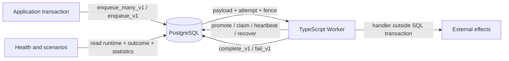
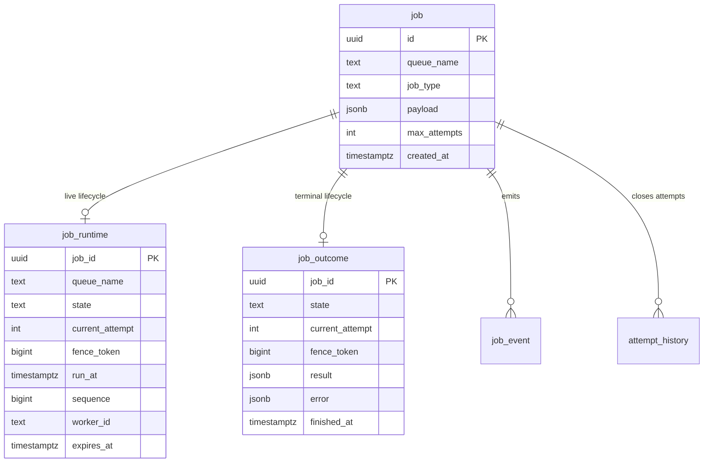
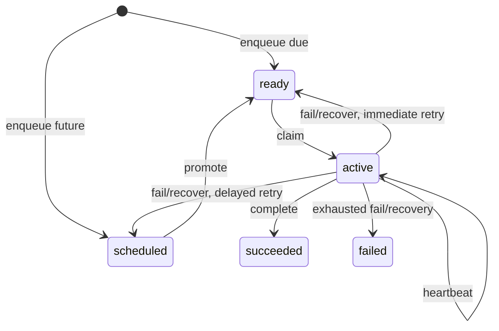

# Ironshift architecture

Ironshift is a PostgreSQL-backed durable queue whose correctness-sensitive lifecycle transitions live in versioned SQL functions. The TypeScript `Queue` and `Worker` remain thin protocol clients.

## Design objective

Dispatch cost should scale with live work, not lifetime completed work. Schema version 2 therefore stores:

- immutable accepted identity and payload in `job`
- exactly one mutable `job_runtime` row only while a job is scheduled, ready, or active
- exactly one immutable `job_outcome` row after success or terminal failure
- append-only, time-partitioned `job_event` and `attempt_history`

No compatibility write views are installed for the version 1 projection tables.

## System context

PostgreSQL is the durable authority. A worker owns a job only while the active `job_runtime` row matches its worker ID and fence token and has not expired.

## Data model

For every accepted job, exactly one of `job_runtime` and `job_outcome` must exist after a committed transition. SQL functions preserve this lifecycle exclusivity atomically.

### `job`

Insert-only identity, routing, payload, retry budget, and acceptance time. Dispatch reads payload only after a runtime row has been claimed.

### `job_runtime`

The only mutable lifecycle relation. Its check constraint makes state-specific fields mutually exclusive:

- `scheduled`: `run_at` is populated; ready and ownership fields are null
- `ready`: `ready_at` and FIFO `sequence` are populated; ownership fields are null
- `active`: worker, acquisition, heartbeat, expiry, and positive fence are populated; ready placement fields are null

Retry and recovery increment `current_attempt` while moving the same row back to ready or scheduled. Heartbeats update only the matching active generation.

Selective indexes keep unrelated states out of each access path:

| Index                            | Predicate             | Purpose                                                     |
| -------------------------------- | --------------------- | ----------------------------------------------------------- |
| `job_runtime_ready_idx`          | `state = 'ready'`     | Queue-local FIFO claims by `(queue_name, sequence, job_id)` |
| `job_runtime_scheduled_idx`      | `state = 'scheduled'` | Bounded due promotion by `(run_at, job_id)`                 |
| `job_runtime_expired_active_idx` | `state = 'active'`    | Bounded recovery by `(expires_at, job_id)`                  |

The table uses fillfactor 70 because heartbeat and lifecycle updates are intentional churn. State changes can still require index maintenance when rows enter or leave a partial index.

### `job_outcome`

Insert-only terminal state. Completion or terminal failure deletes the active runtime row and inserts the outcome in one transaction. Succeeded rows contain `result`; failed rows contain `error`. Terminal jobs no longer occupy dispatch indexes.

### History

`job_event` is the append-only lifecycle audit. `attempt_history` contains one immutable row for every closed attempt, including retry, lease expiry, success, and terminal failure. Both remain range-partitioned by month with default partitions and the existing partition create/retire functions.

## Atomic lifecycle

### Enqueue

`enqueue_many_v1` parses and validates at most 1,000 requests against one timestamp. One statement inserts `job`, `job_runtime`, and `enqueued` events. Input ordinality controls returned IDs and ready sequence allocation. Any invalid member rolls back the entire batch. Commit-delivered `NOTIFY ironshift_jobs` is coalesced to one notification per distinct queue that gained ready work.

### Promotion

`promote_v1` locks a bounded due set with `FOR UPDATE SKIP LOCKED`, updates those runtime rows from scheduled to ready, assigns new FIFO sequences, appends events, and emits a wake hint.

### Claim

`claim_v1` selects one queue-local ready row by FIFO sequence with `SKIP LOCKED`. One runtime update changes it to active and installs worker, global fence, acquisition, heartbeat, and expiry data. The claim event is appended before the function returns identity and payload. No transaction remains open while user code runs.

### Heartbeat

`heartbeat_v1` is a compare-and-set update over job ID, active state, worker ID, fence token, and unexpired lease. `false` means ownership is stale.

### Retry and recovery

`fail_v1` locks the matching unexpired active generation. If budget remains, a compare-and-set runtime update increments the attempt and places the row in ready or scheduled state. Otherwise it deletes runtime and inserts a failed outcome. In both cases it closes attempt history and appends an event atomically.

`recover_expired_v1` cooperatively locks expired active rows in bounded batches. It performs the same increment-and-requeue or delete-and-outcome transition using the observed fence and expiry as CAS guards. Old workers cannot later complete because their active generation no longer exists.

### Terminal transitions

`complete_v1` and exhausted failure consume only the matching unexpired active row. Runtime deletion, outcome insertion, attempt closure, and event append commit or roll back together.

## Read models and health

`Queue.getJob(id)` joins immutable `job` to both lifecycle relations and coalesces the one that exists, preserving the public `JobSnapshot` shape. Health state counts union runtime and outcome. Ready, scheduled, active, expired-active, and oldest-ready metrics come directly from `job_runtime`.

## Delivery semantics

Ironshift provides durable at-least-once execution. A process can die after an external effect but before completion commits, or after completion commits but before observing the response. Applications must use idempotency keys or transactional outbox/inbox patterns for non-idempotent effects.

## Operational limits

- The canonical schema is a clean-install artifact, not an online version 1 to version 2 migration.
- Runtime updates centralize churn in one relation and require vacuum and HOT-update validation under sustained heartbeat load.
- `NOTIFY` is a wake hint. Polling remains the correctness mechanism.
- History partition maintenance must be scheduled operationally.
- Retention for immutable `job` and `job_outcome` is not automated.
