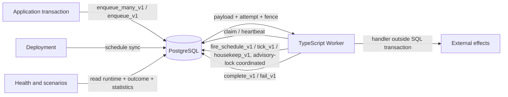
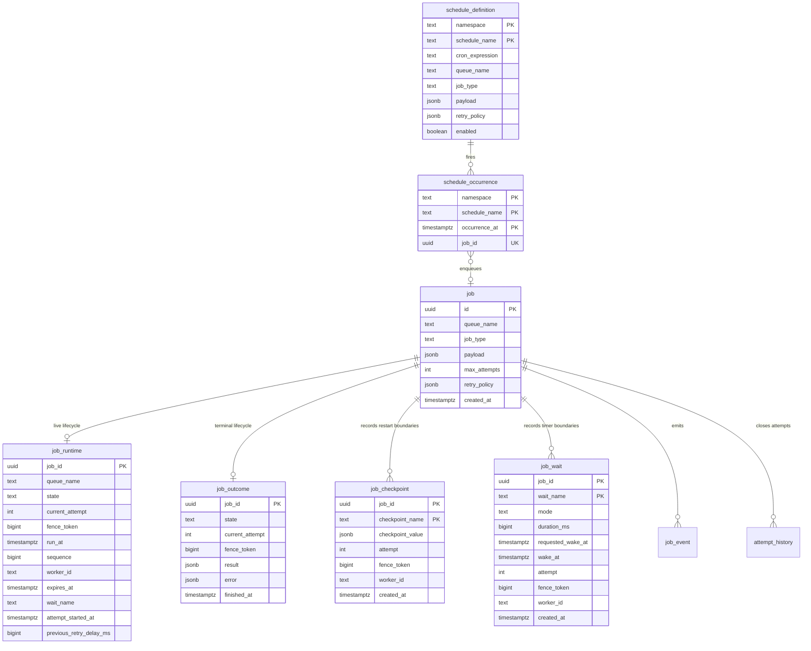
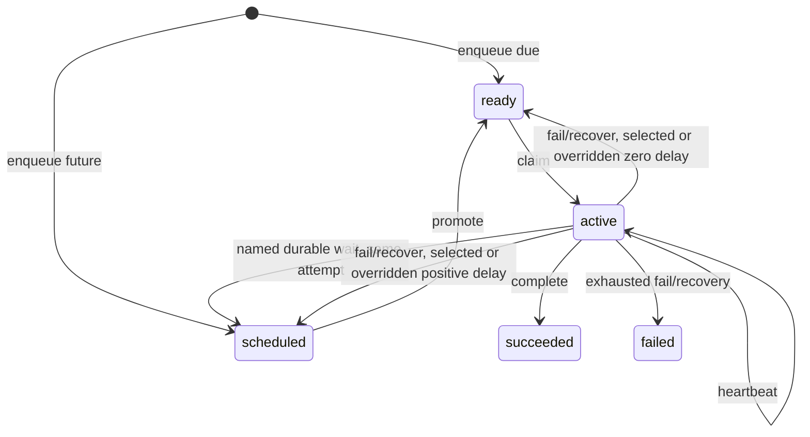

# Workhorse architecture

Workhorse is a PostgreSQL-backed durable queue whose correctness-sensitive lifecycle transitions live in versioned SQL functions. The TypeScript `Queue` and `Worker` remain thin protocol clients.

The current clean-install protocol is schema version 9.

## Design objective

Dispatch cost should scale with live work, not lifetime completed work. Schema version 2 therefore stores:

- immutable accepted identity and payload in `job`
- exactly one mutable `job_runtime` row only while a job is scheduled, ready, or active
- exactly one immutable `job_outcome` row after success or terminal failure
- append-only, time-partitioned `job_event` and `attempt_history`

No compatibility write views are installed for the version 1 projection tables.

## System context

PostgreSQL is the durable authority. A worker owns a job only while the active `job_runtime` row matches its worker ID and fence token and has not expired.

## Data model

For every accepted job, exactly one of `job_runtime` and `job_outcome` must exist after a committed transition. SQL functions preserve this lifecycle exclusivity atomically.

### `job`

Insert-only identity, routing, payload, retry budget, normalized optional retry policy, and acceptance time. Dispatch reads payload only after a runtime row has been claimed. The policy is one of fixed `{delayMs}`, exponential `{initialDelayMs,multiplier,maxDelayMs}`, or decorrelated jitter `{baseDelayMs,maxDelayMs}`.

### `job_runtime`

The only mutable lifecycle relation. Its check constraint makes state-specific fields mutually exclusive:

- `scheduled`: `run_at` is populated; ready and ownership fields are null; `wait_name` and `attempt_started_at` are either both null for enqueue/retry delay or both populated for a durable timer
- `ready`: `ready_at` and FIFO `sequence` are populated; ownership fields and `wait_name` are null; a resumed timer may preserve `attempt_started_at`
- `active`: worker, acquisition, heartbeat, expiry, positive fence, and logical `attempt_started_at` are populated; ready placement and `wait_name` are null

Retry and recovery increment `current_attempt` while moving the same row back to ready or scheduled. Named durable timer suspension preserves `current_attempt`, because waiting is successful control flow rather than failure; promotion and the next claim continue the same logical attempt with a new fence. `previous_retry_delay_ms` stores only the previous decorrelated-jitter selection needed for the next deterministic step and is cleared for other policy types.

PostgreSQL validates policy shape and numeric bounds, selects the delay, performs the state transition, and writes provenance. Explicit persisted policies apply consistently to handler failure and expired-lease recovery. When policy is omitted, compatibility remains path-specific: handler failure uses the legacy Sidekiq-inspired random delay `(count ** 4) + 15 + floor(random() * 10) * (count + 1)` seconds, while lease recovery is immediate. Numeric `Queue.fail` delays, numeric or callback-derived `WorkerOptions.retryDelayMs`, and explicit `Queue.recoverExpired` delays take precedence, including zero. A worker callback may return `undefined` to omit the override and defer to PostgreSQL. Retry-budget enforcement remains in SQL regardless of delay source.

All delay fields are integers from zero through 31,536,000,000 milliseconds (365 days). Exponential `multiplier` is an integer from 1 through 100, and `maxDelayMs` must be at least `initialDelayMs` or `baseDelayMs`. Decorrelated jitter hashes stable job identity, current attempt, and persisted previous delay, so replay and `Queue` recreation select the same value.

Selective indexes keep unrelated states out of each access path:

| Index                            | Predicate             | Purpose                                                     |
| -------------------------------- | --------------------- | ----------------------------------------------------------- |
| `job_runtime_ready_idx`          | `state = 'ready'`     | Queue-local FIFO claims by `(queue_name, sequence, job_id)` |
| `job_runtime_scheduled_idx`      | `state = 'scheduled'` | Bounded due promotion by `(run_at, job_id)`                 |
| `job_runtime_expired_active_idx` | `state = 'active'`    | Bounded recovery by `(expires_at, job_id)`                  |

The table uses fillfactor 70 because heartbeat and lifecycle updates are intentional churn. State changes can still require index maintenance when rows enter or leave a partial index.

### `job_outcome`

Insert-only terminal state. Completion or terminal failure deletes the active runtime row and inserts the outcome in one transaction. Succeeded rows contain `result`; failed rows contain `error`. Terminal jobs no longer occupy dispatch indexes. Automated retention never deletes an outcome alone: it removes the stable terminal job only after both identity and outcome minimum windows have elapsed and no retained history still attributes to that identity.

### `job_checkpoint`

Insert-only named JSON results at explicit handler restart boundaries. The primary key `(job_id, checkpoint_name)` makes each name immutable for the stable job identity, so retries can reuse completed steps. `save_checkpoint_v1` locks and verifies the exact active, unexpired worker/fence generation before inserting, serializing the write against completion, failure, and lease recovery. Attempt, fence, worker, and creation time preserve ownership provenance. Equal repeated saves return the existing row; a different value conflicts.

`HandlerContext.checkpoint(name, operation)` reads an existing value before running user code and coalesces overlapping calls for the same name inside one handler. It does not make external effects exactly once: a process can disappear after an external system commits but before the checkpoint transaction commits.

Values are limited to 1 MiB of PostgreSQL's canonical JSONB text representation, giving every language client one authoritative definition. Checkpoints intentionally have no independent retirement path because deleting a completed name while retaining a retryable job could repeat that step. They cascade only when the stable parent job identity is deleted, so future job-retention policy must account for checkpoint storage.

### `job_wait`

Insert-once named timer boundaries for a stable job identity. Relative sleeps store the first PostgreSQL-computed wake timestamp and are first-write-wins by name; absolute waits conflict if replay supplies a different target or changes mode. `schedule_wait_v1` locks and revalidates the active generation, then either returns an elapsed row or atomically moves runtime to scheduled without consuming an attempt. Rows retain attempt, fence, worker, and creation provenance and leave dispatch eligibility in `job_runtime`.

Code after a wait resumes by replaying the handler from its entry point. Work before the wait must itself be idempotent or checkpointed. Names are limited to 200 characters, durations to 365 days, and one job to 1,000 timer names. Waits cascade only with the stable parent job identity.

### `retention_policy`

One singleton row is the target database's authoritative housekeeping policy. `sync_retention_policy_v1` and `Queue.syncRetentionPolicy` set explicit nullable minimum windows for job identity, terminal outcome, job events, attempt history, and schedule occurrences, plus bounded work limits. Null disables automatic deletion for that category. Job, outcome, event, and attempt retention default to disabled; schedule occurrences preserve the existing 30-day default.

Identity is the attribution anchor. Finite terminal-job retention requires both identity and outcome windows, finite event, attempt, and occurrence windows, and an identity minimum at least as long as every dependent minimum. PostgreSQL rejects configurations that could remove an identity before its retained provenance. Windows are minimums rather than deletion deadlines because bounded cleanup or retained dependent rows can safely extend actual retention.

### History

`job_event` is the append-only lifecycle audit. `attempt_history` contains one immutable row for every closed logical attempt, including retry, lease expiry, success, and terminal failure. Its `started_at` preserves the logical attempt start across timer suspensions, while `claimed_at` identifies the final activation that closed it. Timer suspension itself emits events but does not close attempt history. Both history relations have cascading foreign keys to `job`, which provide referential locking against concurrent terminal retention, and use Monday-aligned weekly range partitions with default fallbacks. Clean installation creates the current week plus four future weeks, and the housekeeping pass (`housekeep_v1`) continuously replenishes and repairs that horizon.

Event and attempt retention are independent housekeeping phases. Each drops only fully expired completed weekly partitions, retires at most the configured number per pass, skips busy week locks, caps DDL lock waits at 250 ms, and bounded-deletes expired rows from its own default partition. The existing explicit week creation and paired retirement functions remain available for controlled operator work. Default partitions preserve insert availability when partition maintenance is late, while health reports exact counts through 10,000 rows and explicit capped lower bounds beyond that so fallback spill cannot remain invisible or make health unbounded.

### Declarative schedules

`schedule_definition` is the target database's desired-state record for one deployment namespace. It stores validated cron text, a typed Workhorse job definition, and a monotonically increasing revision, never arbitrary SQL. Removed definitions are disabled rather than deleted so occurrence history remains attributable.

`schedule_occurrence` provides one durable key per `(namespace, schedule_name, occurrence_at)` second. `fire_schedule_v1` inserts that key and enqueues through `enqueue_v1` in one transaction. A repeated fire for the same second returns the existing job ID instead of creating another job.

Scheduling metadata lives entirely in the target database. Workers evaluate cron expressions in process with `cron-parser` and call only revision-fenced `fire_schedule_v1` or the bounded maintenance entry points `tick_v1` and `housekeep_v1`. Transaction-scoped advisory locks inside those functions make concurrent callers no-ops, so schedules fire once and maintenance runs once per cadence regardless of worker count, while any surviving worker keeps schedules alive.

## Atomic lifecycle

### Enqueue

`enqueue_many_v1` parses and validates at most 1,000 requests against one timestamp, including optional persisted retry policies. One statement inserts `job`, `job_runtime`, and `enqueued` events. Input ordinality controls returned IDs and ready sequence allocation. Any invalid member rolls back the entire batch. Commit-delivered `NOTIFY workhorse_jobs` is coalesced to one notification per distinct queue that gained ready work.

### Promotion

`promote_v1` locks a bounded due set with `FOR UPDATE SKIP LOCKED`, updates those runtime rows from scheduled to ready, assigns new FIFO sequences, appends events, and emits a wake hint. Every promoted row emits `promoted`; its locked `due` CTE also carries any durable `wait_name` through the update so timer-backed rows append `wait_elapsed` before the marker is cleared.

Production maintenance is worker-owned and split by cadence and failure domain into two entry points.

Each worker calls `tick_v1` at most once per configured `maintenanceIntervalMs` (default one second). Under the transaction-scoped `workhorse:tick` advisory lock it performs bounded promotion and bounded expired-lease recovery, the two dispatch-latency-critical phases. Concurrent callers return immediately with `skipped_lock = true`. The same cadence drives in-process schedule evaluation.

Each worker calls `housekeep_v1` at most once per configured `housekeepingIntervalMs` (default 60 seconds). Under the separate `workhorse:housekeeping` lock it replenishes the history-partition horizon, retires event history, retires attempt history, prunes schedule occurrences, and deletes safe terminal-job bundles. Housekeeping does not share the promotion advisory lock, and partition retirement abandons a DDL lock attempt after 250 ms rather than waiting indefinitely behind dispatch. Every phase runs in its own exception subtransaction, so one cleanup failure is reported without rolling back successful sibling phases.

Terminal-job pruning selects a bounded candidate window of identities with outcomes, both minimum windows elapsed, and no live runtime, then filters it for remaining event, attempt, or occurrence references. The bounded delete cascades the outcome, checkpoints, waits, and any history insert that raced after the selection snapshot. History foreign keys serialize inserts with that delete, so no transaction can commit an event or attempt after its identity disappears.

Both functions return one row per phase, `(phase, rows_affected, duration_ms, skipped_lock, error)`. The worker records this telemetry per loop, exposes it through `worker.maintenanceTelemetry()`, and forwards each row to the optional `onMaintenance` callback. Between passes a worker issues only the claim query.

### Durable timer suspension

`schedule_wait_v1` accepts either a relative bigint duration or an absolute timestamp, locks the exact active worker/fence generation, and rechecks lease expiry after acquiring the runtime lock. A first future target inserts `job_wait`, changes runtime to wait-marked scheduled state, clears ownership, and emits `wait_scheduled`. A first past-due target is still recorded but leaves runtime active and returns elapsed. Relative replay returns the first stored target even if later configuration supplies another duration; absolute target or mode changes conflict. Reaching an elapsed name emits `wait_replayed`.

Suspension aborts the handler's cooperative signal and exits through private worker control flow, so the heartbeat stops and the worker slot is free for another claim. It does not call failure or completion and does not increment attempts. Normal promotion later makes the same logical attempt claimable with a new fence. Wake latency is bounded by maintenance cadence and worker availability, not by an exact wall-clock guarantee. Queue health reports the number of sleeping and overdue waits plus the next durable wake target.

### Claim

`claim_v1` selects one queue-local ready row by FIFO sequence with `SKIP LOCKED`. One runtime update changes it to active and installs worker, global fence, acquisition, heartbeat, and expiry data. The claim event is appended before the function returns identity, payload, and normalized `retryPolicy`. No transaction remains open while user code runs.

### Heartbeat

`heartbeat_v1` is a compare-and-set update over job ID, active state, worker ID, fence token, and unexpired lease. `false` means ownership is stale.

### Retry and recovery

`fail_v1` locks the matching unexpired active generation. If budget remains, it calls the PostgreSQL delay selector, compare-and-set increments the attempt, persists any next jitter state, and places the row in ready or scheduled state. Otherwise it deletes runtime and inserts a failed outcome. In both cases it closes attempt history and appends an event atomically. `retry_scheduled` details include `retry_policy`, `retry_delay_ms`, and `retry_delay_source`.

`recover_expired_v1` cooperatively locks expired active rows in bounded batches. It performs the same policy selection and increment-and-requeue or delete-and-outcome transition using the observed fence and expiry as CAS guards. `Queue.recoverExpired(limit)` passes an omitted delay as SQL `NULL`, allowing persisted policy selection; an explicit number remains an override. `lease_expired` details include the policy, selected delay, and source. Old workers cannot later complete because their active generation no longer exists.

### Terminal transitions

`complete_v1` and exhausted failure consume only the matching unexpired active row. Runtime deletion, outcome insertion, attempt closure, and event append commit or roll back together.

## Read models and health

`Queue.getJob(id)` joins immutable `job` to both lifecycle relations and coalesces the one that exists, preserving the public `JobSnapshot` shape including `retryPolicy`. Health state counts union runtime and outcome. Ready, scheduled, active, expired-active, and oldest-ready metrics come directly from `job_runtime`.

Retention health includes the persisted policy, oldest retained timestamps, per-category cleanup lag, counts of fully eligible event and attempt partitions, and bounded row counts for both default partitions. Fallback counts are exact through 10,000 rows; `defaultHistoryRowsCapped` marks 10,001 as a lower bound. Live jobs are excluded from terminal identity lag. History lag is based only on fully droppable partitions or expired default rows, not the intentionally retained partial boundary week.

## Delivery semantics

Workhorse provides durable at-least-once execution. A process can die after an external effect but before completion commits, or after completion commits but before observing the response. Applications must use idempotency keys or transactional outbox/inbox patterns for non-idempotent effects.

Schedule occurrence deduplication prevents duplicate enqueue for one occurrence second. The worker's in-process scheduler supplies the planned occurrence slot as the key, and a per-occurrence advisory lock plus the durable key make concurrent workers racing the same fire converge on one job. This does not change handler delivery semantics: a scheduled job can still execute more than once after a worker crash.

## Deployment synchronization

`Queue.syncSchedules(namespace, definitions, { prune })` is a desired-state reconciler:

1. It validates stable namespace and schedule names plus queue job definitions, including optional retry policies.
2. It atomically upserts target definitions and by default deactivates omitted names through `sync_schedule_definitions_v1`.
3. A per-namespace advisory lock serializes concurrent deployments of the same namespace.

Because definitions live only in the target database, a deployment is one transaction: there is no second metadata database to converge. Every material definition change increments a revision, and worker fires pass the revision they loaded. A stale in-process schedule therefore becomes a no-op instead of running a new payload at an old cadence. Definition row locking also makes a disable deployment wait for a fire that already began before returning.

## Operational limits

- The canonical schema is a clean-install artifact, not an online version 1 to version 2 migration.
- Only plain PostgreSQL 15+ is required; no extension beyond the default `plpgsql` is installed.
- Schedules fire only while at least one worker with matching `scheduleNamespaces` is running; scheduling drift is bounded by `maintenanceIntervalMs` and catch-up after downtime is bounded by `scheduleCatchupLimit`.
- Destructive job, outcome, event, and attempt retention is opt-in. Schedule occurrences default to 30 days and 10,000 rows per housekeeping pass.
- Default work bounds are 1,000 terminal jobs, four history partitions per category, 10,000 default-partition rows per category, and 10,000 schedule occurrences per housekeeping pass.
- Schedules have one-second precision; cron expressions are evaluated in the worker's configured timezone, for which UTC is recommended.
- Runtime updates centralize churn in one relation and require vacuum and HOT-update validation under sustained heartbeat load.
- `NOTIFY` is a wake hint. Polling remains the correctness mechanism.
- Retention operates on minimum windows. Weekly granularity, bounded passes, and retained attribution can extend actual storage beyond a configured cutoff.
