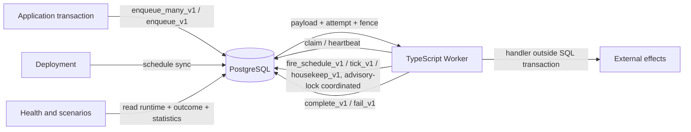
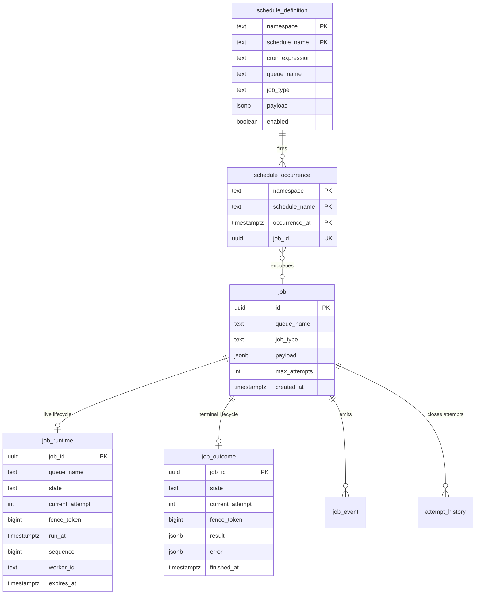
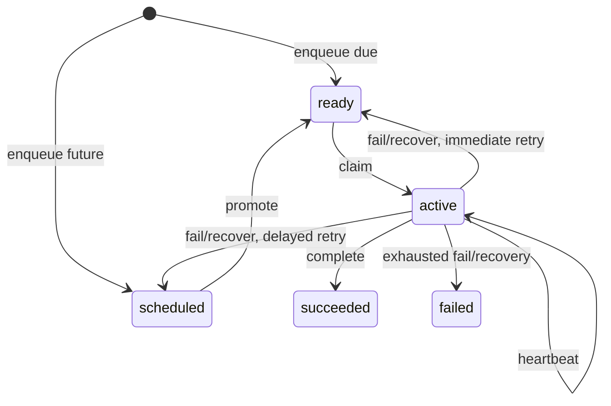

# Workhorse architecture

Workhorse is a PostgreSQL-backed durable queue whose correctness-sensitive lifecycle transitions live in versioned SQL functions. The TypeScript `Queue` and `Worker` remain thin protocol clients.

## Design objective

Dispatch cost should scale with live work, not lifetime completed work. Schema version 2 therefore stores:

- immutable accepted identity and payload in `job`
- exactly one mutable `job_runtime` row only while a job is scheduled, ready, or active
- exactly one immutable `job_outcome` row after success or terminal failure
- append-only, time-partitioned `job_event` and `attempt_history`

No compatibility write views are installed for the version 1 projection tables.

## System context

PostgreSQL is the durable authority. A worker owns a job only while the active `job_runtime` row matches its worker ID and fence token and has not expired.

## Data model

For every accepted job, exactly one of `job_runtime` and `job_outcome` must exist after a committed transition. SQL functions preserve this lifecycle exclusivity atomically.

### `job`

Insert-only identity, routing, payload, retry budget, and acceptance time. Dispatch reads payload only after a runtime row has been claimed.

### `job_runtime`

The only mutable lifecycle relation. Its check constraint makes state-specific fields mutually exclusive:

- `scheduled`: `run_at` is populated; ready and ownership fields are null
- `ready`: `ready_at` and FIFO `sequence` are populated; ownership fields are null
- `active`: worker, acquisition, heartbeat, expiry, and positive fence are populated; ready placement fields are null

Retry and recovery increment `current_attempt` while moving the same row back to ready or scheduled. Heartbeats update only the matching active generation.

Selective indexes keep unrelated states out of each access path:

| Index                            | Predicate             | Purpose                                                     |
| -------------------------------- | --------------------- | ----------------------------------------------------------- |
| `job_runtime_ready_idx`          | `state = 'ready'`     | Queue-local FIFO claims by `(queue_name, sequence, job_id)` |
| `job_runtime_scheduled_idx`      | `state = 'scheduled'` | Bounded due promotion by `(run_at, job_id)`                 |
| `job_runtime_expired_active_idx` | `state = 'active'`    | Bounded recovery by `(expires_at, job_id)`                  |

The table uses fillfactor 70 because heartbeat and lifecycle updates are intentional churn. State changes can still require index maintenance when rows enter or leave a partial index.

### `job_outcome`

Insert-only terminal state. Completion or terminal failure deletes the active runtime row and inserts the outcome in one transaction. Succeeded rows contain `result`; failed rows contain `error`. Terminal jobs no longer occupy dispatch indexes.

### History

`job_event` is the append-only lifecycle audit. `attempt_history` contains one immutable row for every closed attempt, including retry, lease expiry, success, and terminal failure. Both use Monday-aligned weekly range partitions with default fallbacks. Clean installation creates the current week plus four future weeks, and the housekeeping pass (`housekeep_v1`) continuously replenishes that horizon. Explicit week creation and completed-week retirement functions support operator-driven retention.

### Declarative schedules

`schedule_definition` is the target database's desired-state record for one deployment namespace. It stores validated cron text, a typed Workhorse job definition, and a monotonically increasing revision, never arbitrary SQL. Removed definitions are disabled rather than deleted so occurrence history remains attributable.

`schedule_occurrence` provides one durable key per `(namespace, schedule_name, occurrence_at)` second. `fire_schedule_v1` inserts that key and enqueues through `enqueue_v1` in one transaction. A repeated fire for the same second returns the existing job ID instead of creating another job.

Scheduling metadata lives entirely in the target database. Workers evaluate cron expressions in process with `cron-parser` and call only revision-fenced `fire_schedule_v1` or the bounded maintenance entry points `tick_v1` and `housekeep_v1`. Transaction-scoped advisory locks inside those functions make concurrent callers no-ops, so schedules fire once and maintenance runs once per cadence regardless of worker count, while any surviving worker keeps schedules alive.

## Atomic lifecycle

### Enqueue

`enqueue_many_v1` parses and validates at most 1,000 requests against one timestamp. One statement inserts `job`, `job_runtime`, and `enqueued` events. Input ordinality controls returned IDs and ready sequence allocation. Any invalid member rolls back the entire batch. Commit-delivered `NOTIFY workhorse_jobs` is coalesced to one notification per distinct queue that gained ready work.

### Promotion

`promote_v1` locks a bounded due set with `FOR UPDATE SKIP LOCKED`, updates those runtime rows from scheduled to ready, assigns new FIFO sequences, appends events, and emits a wake hint.

Production maintenance is worker-owned and split by cadence and failure domain into two entry points.

Each worker calls `tick_v1` at most once per configured `maintenanceIntervalMs` (default one second). Under the transaction-scoped `workhorse:tick` advisory lock it performs bounded promotion and bounded expired-lease recovery, the two dispatch-latency-critical phases. Concurrent callers return immediately with `skipped_lock = true`. The same cadence drives in-process schedule evaluation.

Each worker calls `housekeep_v1` at most once per configured `housekeepingIntervalMs` (default 60 seconds). Under the separate `workhorse:housekeeping` lock it replenishes the history-partition horizon and prunes old schedule-occurrence keys, so slow housekeeping can never starve promotion. Its phases run in exception subtransactions: a partition-repair failure is reported while pruning still commits, and vice versa.

Both functions return one row per phase, `(phase, rows_affected, duration_ms, skipped_lock, error)`. The worker records this telemetry per loop, exposes it through `worker.maintenanceTelemetry()`, and forwards each row to the optional `onMaintenance` callback. Between passes a worker issues only the claim query.

### Claim

`claim_v1` selects one queue-local ready row by FIFO sequence with `SKIP LOCKED`. One runtime update changes it to active and installs worker, global fence, acquisition, heartbeat, and expiry data. The claim event is appended before the function returns identity and payload. No transaction remains open while user code runs.

### Heartbeat

`heartbeat_v1` is a compare-and-set update over job ID, active state, worker ID, fence token, and unexpired lease. `false` means ownership is stale.

### Retry and recovery

`fail_v1` locks the matching unexpired active generation. If budget remains, a compare-and-set runtime update increments the attempt and places the row in ready or scheduled state. Otherwise it deletes runtime and inserts a failed outcome. In both cases it closes attempt history and appends an event atomically.

`recover_expired_v1` cooperatively locks expired active rows in bounded batches. It performs the same increment-and-requeue or delete-and-outcome transition using the observed fence and expiry as CAS guards. Old workers cannot later complete because their active generation no longer exists.

### Terminal transitions

`complete_v1` and exhausted failure consume only the matching unexpired active row. Runtime deletion, outcome insertion, attempt closure, and event append commit or roll back together.

## Read models and health

`Queue.getJob(id)` joins immutable `job` to both lifecycle relations and coalesces the one that exists, preserving the public `JobSnapshot` shape. Health state counts union runtime and outcome. Ready, scheduled, active, expired-active, and oldest-ready metrics come directly from `job_runtime`.

## Delivery semantics

Workhorse provides durable at-least-once execution. A process can die after an external effect but before completion commits, or after completion commits but before observing the response. Applications must use idempotency keys or transactional outbox/inbox patterns for non-idempotent effects.

Schedule occurrence deduplication prevents duplicate enqueue for one occurrence second. The worker's in-process scheduler supplies the planned occurrence slot as the key, and a per-occurrence advisory lock plus the durable key make concurrent workers racing the same fire converge on one job. This does not change handler delivery semantics: a scheduled job can still execute more than once after a worker crash.

## Deployment synchronization

`Queue.syncSchedules(namespace, definitions, { prune })` is a desired-state reconciler:

1. It validates stable namespace and schedule names plus queue job definitions.
2. It atomically upserts target definitions and by default deactivates omitted names through `sync_schedule_definitions_v1`.
3. A per-namespace advisory lock serializes concurrent deployments of the same namespace.

Because definitions live only in the target database, a deployment is one transaction: there is no second metadata database to converge. Every material definition change increments a revision, and worker fires pass the revision they loaded. A stale in-process schedule therefore becomes a no-op instead of running a new payload at an old cadence. Definition row locking also makes a disable deployment wait for a fire that already began before returning.

## Operational limits

- The canonical schema is a clean-install artifact, not an online version 1 to version 2 migration.
- Only plain PostgreSQL 15+ is required; no extension beyond the default `plpgsql` is installed.
- Schedules fire only while at least one worker with matching `scheduleNamespaces` is running; scheduling drift is bounded by `maintenanceIntervalMs` and catch-up after downtime is bounded by `scheduleCatchupLimit`.
- `schedule_occurrence` defaults to 30-day retention with at most 10,000 deletions per housekeeping run.
- Schedules have one-second precision; cron expressions are evaluated in the worker's configured timezone, for which UTC is recommended.
- Runtime updates centralize churn in one relation and require vacuum and HOT-update validation under sustained heartbeat load.
- `NOTIFY` is a wake hint. Polling remains the correctness mechanism.
- History partition retirement remains an explicit operator policy even though partition creation is replenished by housekeeping.
- Retention for immutable `job` and `job_outcome` is not automated.
