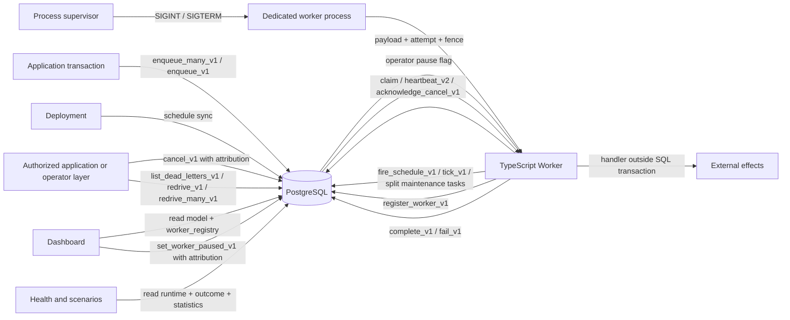
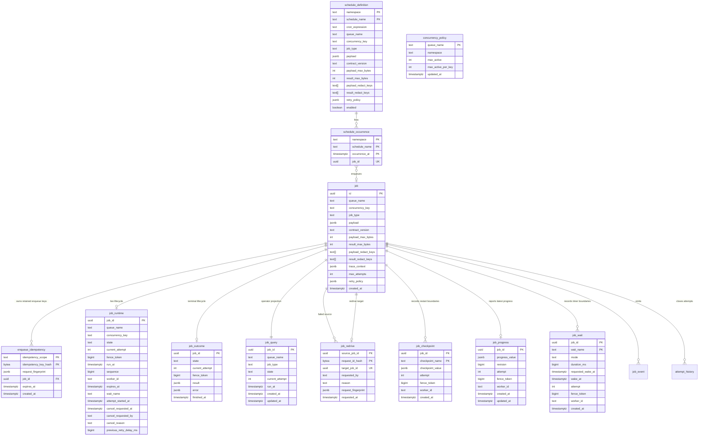
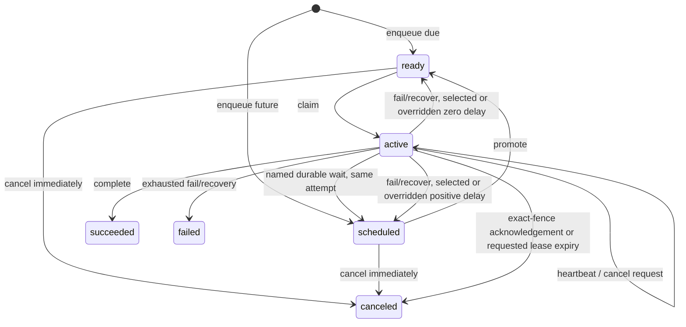

# Workhorse architecture

Workhorse is a PostgreSQL-backed durable queue whose correctness-sensitive lifecycle transitions live in versioned SQL functions. The TypeScript `Queue` and `Worker` remain thin protocol clients.

The current clean-install protocol is schema version 22.

This page is the precise reference. For the ideas it assumes — leases and fence tokens,
at-least-once delivery, cooperative cancellation, the runtime/outcome split — start with
[`guides/000-start-here.md`](guides/000-start-here.md).

## Design objective

Dispatch cost should scale with live work, not lifetime completed work. Schema version 2 therefore stores:

- immutable accepted identity and payload in `job`
- exactly one mutable `job_runtime` row only while a job is scheduled, ready, or active
- exactly one immutable `job_outcome` row after success or terminal failure
- at most one bounded mutable `job_progress` projection, separate from payload and outcome
- immutable audited `job_redrive` edges between failed sources and fresh target identities
- append-only, time-partitioned `job_event` and `attempt_history`

No compatibility write views are installed for the version 1 projection tables.

## System context

PostgreSQL is the durable authority. A worker owns a job only while the active `job_runtime` row matches its worker ID and fence token and has not expired.

Production deployment uses a dedicated worker process by default. The process owns its adapter,
Workers, optional probe-only listener, termination signals, bounded drain, and final resource close.
Framework co-hosting remains available but is not the default scaling boundary. See
[`worker-processes.md`](worker-processes.md) and
[ADR 0012](decisions/0012-dedicated-worker-processes.md).

The operator dashboard is a separate boundary from the worker fleet. It is a framework-neutral
request host that reads everything it shows from PostgreSQL, including worker identity, runtime
state, and policy provenance, so it can be mounted in a process that runs no workers at all.
Mounting requires only a database connection. Policy mutation additionally requires `operator.mode
=== "local"` and a `DashboardSettingsController`; every call carries actor, reason, request ID, and
server-assigned occurrence time.

## Data model

For every accepted job, exactly one of `job_runtime` and `job_outcome` must exist after a committed transition. SQL functions preserve this lifecycle exclusivity atomically.

### `job`

Insert-only identity, routing, payload, retry budget, normalized optional retry policy, acceptance time, and accepted application contract. Dispatch reads the raw payload only after a runtime row has been claimed. The policy is one of fixed `{delayMs}`, exponential `{initialDelayMs,multiplier,maxDelayMs}`, or decorrelated jitter `{baseDelayMs,maxDelayMs}`.

`contract_version` is null for an uncontracted job or contains the `JobTypeContracts.currentVersion` selected at acceptance. `payload_max_bytes` and `result_max_bytes` default to 1,048,576 and accept configured values through 16,777,216. PostgreSQL measures `octet_length(value::text)` after JSONB canonicalization, and `enqueue_many_v1` rejects an oversized payload before inserting `job`, `job_runtime`, history, idempotency, or notification effects. `complete_v1` checks the persisted result limit before deleting active runtime.

`payload_redact_keys` and `result_redact_keys` each contain at most 50 unique top-level object keys of 1 through 200 characters. When a worker claims a job, `claim_v2` returns the raw payload to its handler. `workhorse.redact_top_level_keys_v1` removes persisted keys for `Queue.getJob`, `Queue.listJobs`, dead-letter listing, and dashboard task detail. Caller-supplied `JobPayloadProjection.redactKeys` are added to the persisted payload keys. Scalar and array values pass through because top-level key redaction applies only to objects. If either persisted key array is non-empty, `workhorse.redact_error_details_v1` substitutes `RedactedJobError` and a fixed message before `fail_v1` writes runtime, outcome, attempt, or event errors. `Worker` applies the same rule before recording a handler exception in OpenTelemetry.

`QueueOptions.contracts` maps a job type to `currentVersion` and a `versions` record of `JobContractVersion`. A validator returns `true` to accept a JSON value; `false` or a thrown exception becomes `JobContractValidationError` without retaining the value or validator message. Enqueue validates with the current version. `claim_v2` returns the persisted `contractVersion`, `resultMaxBytes`, and `redactErrorDetails`, so completion uses the accepted version rather than the deployment's current version. A worker without that retained version gets `JobContractUnavailableError`; `Worker` handles either contract error through the ordinary fenced failure and retry path. Reads never invoke validators, so historical payloads remain inspectable after application validation changes.

### `enqueue_idempotency`

PostgreSQL-owned scoped enqueue ownership, separate from stable job identity and dispatch. The primary key `(idempotency_scope, idempotency_key_hash)` serializes competing callers through one scoped unique owner. The hash is the full SHA-256 of the scope/key ownership input; raw keys are never persisted. Scope defaults to `default`; TTL defaults to 24 hours; keys are 1 through 512 UTF-8 bytes; scopes are 1 through 256 UTF-8 bytes; and TTL is an integer from 1 millisecond through 365 days.

The stored canonical fingerprint covers queue, concurrency key, type, payload, contract version, both size limits, both redaction-key sets, sorted tags, `maxAttempts`, normalized `retryPolicy`, TTL, and explicitly supplied `runAt`. An omitted `runAt` stays omitted for keyed immediate ingress instead of capturing the classification timestamp. Exact replay returns the bound job ID before job, event, runtime, FIFO-sequence, or notification side effects. A mismatch raises a structured conflict and aborts the whole statement or caller transaction. Requests without `options.idempotency` bypass this relation and retain the prior always-create behavior.

The ownership relation stores scope and full key hash, never the raw key. The initial `enqueued` event, UI projections, and errors expose only a bounded key preview plus 12-hex key digest; exact replay appends no event. Structured conflicts additionally carry full SHA-256 stored and rejected request digests. Expired ownership can be replaced by a new request. Housekeeping prunes expired bindings before terminal job identity, and purging ready or scheduled jobs releases their bindings with the job.

### `job_runtime`

The only mutable lifecycle relation. Its check constraint makes state-specific fields mutually exclusive:

- `scheduled`: `run_at` is populated; ready and ownership fields are null; `wait_name` and `attempt_started_at` are either both null for enqueue/retry delay or both populated for a durable timer
- `ready`: `ready_at` and FIFO `sequence` are populated; ownership fields and `wait_name` are null; a resumed timer may preserve `attempt_started_at`
- `active`: worker, acquisition, heartbeat, expiry, positive fence, and logical `attempt_started_at` are populated; ready placement and `wait_name` are null; optional cancellation-request timestamp, attribution, and reason are all present or all absent

Retry and recovery increment `current_attempt` while moving the same row back to ready or scheduled. Named durable timer suspension preserves `current_attempt`, because waiting is successful control flow rather than failure; promotion and the next claim continue the same logical attempt with a new fence. `previous_retry_delay_ms` stores only the previous decorrelated-jitter selection needed for the next deterministic step and is cleared for other policy types.

PostgreSQL validates policy shape and numeric bounds, selects the delay, performs the state transition, and writes provenance. Explicit persisted policies apply consistently to handler failure and expired-lease recovery. When policy is omitted, compatibility remains path-specific: handler failure uses the legacy Sidekiq-inspired random delay `(count ** 4) + 15 + floor(random() * 10) * (count + 1)` seconds, while lease recovery is immediate. Numeric `Queue.fail` delays, numeric or callback-derived `WorkerOptions.retryDelayMs`, and explicit `Queue.recoverExpired` delays take precedence, including zero. A worker callback may return `undefined` to omit the override and defer to PostgreSQL. Retry-budget enforcement remains in SQL regardless of delay source.

All delay fields are integers from zero through 31,536,000,000 milliseconds (365 days). Exponential `multiplier` is an integer from 1 through 100, and `maxDelayMs` must be at least `initialDelayMs` or `baseDelayMs`. Decorrelated jitter hashes stable job identity, current attempt, and persisted previous delay, so replay and `Queue` recreation select the same value.

Selective indexes keep unrelated states out of each access path:

| Index                            | Predicate             | Purpose                                                     |
| -------------------------------- | --------------------- | ----------------------------------------------------------- |
| `job_runtime_ready_idx`          | `state = 'ready'`     | Queue-local FIFO claims by `(queue_name, sequence, job_id)` |
| `job_runtime_scheduled_idx`      | `state = 'scheduled'` | Bounded due promotion by `(run_at, job_id)`                 |
| `job_runtime_expired_active_idx` | `state = 'active'`    | Bounded recovery by `(expires_at, job_id)`                  |

The table uses fillfactor 70 because heartbeat and lifecycle updates are intentional churn. State changes can still require index maintenance when rows enter or leave a partial index.

`concurrency_key` is null or a non-empty UTF-8 string through 256 bytes. `job` retains the accepted value, while `job_runtime` duplicates it for admission without joining lifetime identity. The key is queue-scoped. Keyless jobs consume only queue capacity.

`job_runtime_active_queue_key_expiry_idx` contains only active rows and orders them by queue, concurrency key, expiry, and job identity. `claim_v2` uses it to count live admission pressure without scanning terminal jobs or history.

### `job_outcome`

Semantically immutable terminal state. Completion, terminal failure, or cancellation deletes runtime and inserts the outcome in one transaction. Succeeded rows contain `result`; failed rows contain `error`; canceled rows contain the bounded cancellation envelope. Those semantic columns never change. The retention-only `history_through_at` watermark may advance when later append-only history is attributed to the terminal identity. Never-started cancellation uses fence zero and has no attempt row, while started cancellation retains ownership provenance. Terminal jobs no longer occupy dispatch indexes. Automated retention never deletes an outcome alone: it removes the stable terminal job only after both identity and outcome minimum windows have elapsed and no retained history still attributes to that identity.

Failed outcomes additionally have one cold partial index ordered by immutable completion time and identity. `list_dead_letters_v1` uses it for bounded cursor pages and joins immutable `job` definition only after selecting terminal candidates. This index is not a dispatch path and claim never reads it.

### `job_query`

A bounded operator projection maintained in the same transaction as runtime and outcome lifecycle changes. It stores routing, state, current attempt, run time, cancellation-request metadata, immutable creation time, and the last meaningful lifecycle update. It deliberately excludes payload, result, error, checkpoints, waits, worker ownership, heartbeat, and lease expiry.

`list_jobs_v1` selects a page from dedicated global, queue, type, or state creation-time indexes before joining immutable `job` rows for optional payload projection. Heartbeats do not update the projection, and no query index is added to `job_runtime`. Pages use immutable `(created_at, job_id)` keys and a filter/projection-bound signature. Cross-page state membership is weakly consistent until snapshot pagination is implemented.

Payload is omitted by default. When requested, PostgreSQL applies bounded top-level redaction before checking the response byte ceiling and returns explicit omission status. These controls bound disclosure and returned size for selected rows, not accepted payload size or requested detoasting work.

### `job_redrive`

Insert-only source-to-target lineage and operator audit. The source/request hash primary key serializes exact replay, while unique target identity gives every new execution one parent. Raw request IDs are never stored. The row retains safe request preview/digest/length, actor, reason, canonical request fingerprint, source and initial target states, and request time.

`redrive_v1` accepts only a retained failed source. It creates a fresh ready job with copied queue, type, payload, accepted contract version, size limits, redaction keys, tags, attempt budget, retry policy, and execution timeout. It clears the old absolute deadline and never copies checkpoint, wait, attempt, result, or cancellation state. Source and target events plus the lineage row commit atomically; the original outcome's semantic terminal columns are never updated, while its retention watermark follows the normal history-attribution rule. Exact replay returns the existing target, while a changed actor or reason under the same source/request identity conflicts. `redrive_many_v1` applies the same transition to an oldest-first bounded candidate page, accepts a keyset cursor for deterministic backlog progression, and performs no writes in dry-run mode.

The source foreign key protects lineage: terminal identity pruning skips any source with a retained descendant edge. Target deletion cascades its inbound edge, allowing ancestors to become eligible later under the normal retention windows. `Queue.getRedriveLineage` traverses the retained connected graph with an explicit bound and truncation flag.

### `job_checkpoint`

Insert-only named JSON results at explicit handler restart boundaries. The primary key `(job_id, checkpoint_name)` makes each name immutable for the stable job identity, so retries can reuse completed steps. `save_checkpoint_v1` locks and verifies the exact active, unexpired worker/fence generation before inserting, serializing the write against completion, failure, and lease recovery. Attempt, fence, worker, and creation time preserve ownership provenance. Equal repeated saves return the existing row; a different value conflicts.

`HandlerContext.checkpoint(name, operation)` reads an existing value before running user code and coalesces overlapping calls for the same name inside one handler. It does not make external effects exactly once: a process can disappear after an external system commits but before the checkpoint transaction commits.

Values are limited to 1 MiB of PostgreSQL's canonical JSONB text representation, giving every language client one authoritative definition. Checkpoints intentionally have no independent retirement path because deleting a completed name while retaining a retryable job could repeat that step. They cascade only when the stable parent job identity is deleted, so future job-retention policy must account for checkpoint storage.

### `job_progress`

One latest-value mutable projection for operational progress, kept separate from immutable payload,
checkpoint, and outcome fields. `update_progress_v1` serializes on the active runtime row and accepts only
the exact unexpired worker/fence generation. Accepted changes increment a monotonic revision and replace
attempt, fence, worker, and update-time provenance. Identical values are no-ops.

Values are limited to 64 KiB of canonical JSONB text. One fence may commit a changed value at most every
100 milliseconds; a new ownership generation may report immediately. Each accepted change emits a bounded
`progress_updated` event with revision and byte size but not the value. The latest projection survives retry
and terminal materialization and cascades only with the stable parent identity.

### `job_wait`

Insert-once named timer boundaries for a stable job identity. Relative sleeps store the first PostgreSQL-computed wake timestamp and are first-write-wins by name; absolute waits conflict if replay supplies a different target or changes mode. `schedule_wait_v1` locks and revalidates the active generation, then either returns an elapsed row or atomically moves runtime to scheduled without consuming an attempt. Rows retain attempt, fence, worker, and creation provenance and leave dispatch eligibility in `job_runtime`.

Code after a wait resumes by replaying the handler from its entry point. Work before the wait must itself be idempotent or checkpointed. Names are limited to 200 characters, durations to 365 days, and one job to 1,000 timer names. Waits cascade only with the stable parent job identity.

### `retention_policy`

One singleton row is the target database's authoritative retention policy. Its effective typed
columns contain explicit nullable minimum windows for job identity, terminal outcome, job events,
attempt history, schedule occurrences, and statistics, plus five bounded work limits. Matching
`application_*` columns retain the latest deployment defaults, while `operator_overrides` contains
only the names whose effective values an operator owns. Every category defaults to 14 days; null
disables automatic deletion for that category.

`sync_retention_policy_v1` and `Queue.syncRetentionPolicy` update the application columns and copy
them into effective columns that are not operator-owned. Passing `{ force: true }` copies every
supplied value and clears all overrides. `override_retention_policy_v1` and
`Queue.overrideRetentionPolicy` atomically update selected effective values and add their names.
`revert_retention_policy_v1` and `Queue.revertRetentionPolicy` copy selected application values back
and remove their names. `Queue.previewRetentionPolicy` counts at most 10,001 eligible rows per
category, reports 10,000 plus a capped flag, and performs no writes.

Identity is the attribution anchor. Finite terminal-job retention requires both identity and outcome windows, finite event, attempt, and occurrence windows, and an identity minimum at least as long as every dependent minimum. PostgreSQL rejects configurations that could remove an identity before its retained provenance. Windows are minimums rather than deletion deadlines because bounded cleanup or retained dependent rows can safely extend actual retention.

### `concurrency_policy`

One row per queue stores a deployment-owned dispatch budget. `queue_name` is the primary key and accepts 1 through 256 UTF-8 bytes. `namespace` accepts the same bounds and owns the row. `max_active` limits all active jobs in the queue and accepts integers from 1 through 1,000,000. Nullable `max_active_per_key` adds a queue-scoped key limit and accepts an integer from 1 through `max_active`. A null key limit disables keyed admission while preserving the queue limit. `updated_at` changes only when either effective limit changes.

`sync_concurrency_policies_v1(namespace, definitions, prune)` and `Queue.syncConcurrencyPolicies(namespace, definitions, { prune })` reconcile one namespace atomically. One call accepts at most 10,000 unique queue definitions. Each definition permits only `queue`, `maxActive`, and optional `maxActivePerKey`. The function takes an exclusive global transaction advisory lock to serialize reconcilers. It also takes an exclusive queue advisory lock before changing each row. `claim_v2` takes the matching shared queue lock before reading policy, so first creation and pruning cannot race an ungoverned claim. The reconciler rejects queues owned by another namespace, upserts desired rows, and prunes omitted rows by default. Passing `{ prune: false }` retains omitted rows. An empty desired set removes every policy owned by that namespace when pruning is enabled.

`Queue.concurrencyPolicies(queueNames)` returns persisted rows ordered by `queue_name`. An omitted or empty array returns every policy. A non-empty array filters by exact queue name. This read has no implicit result cap.

Policy capacity counts only active rows whose lease has not expired. The policy is therefore a dispatch budget, not mutual exclusion. A handler can still overlap a replacement after its stale lease expires. Fence validation prevents the stale generation from committing a lifecycle result.

### History

`job_event` is the append-only lifecycle audit. `attempt_history` contains one immutable row for every closed logical attempt, including retry, lease expiry, success, terminal failure, and cancellation after an attempt actually started. Its `started_at` preserves the logical attempt start across timer suspensions, while `claimed_at` identifies the final activation that closed it. Timer suspension itself emits events but does not close attempt history. Both history relations use UTC-daily range partitions with default fallbacks. Clean installation creates the current day plus three future days, and `prepare_history_partitions_v1` continuously replenishes and repairs that horizon.

`list_job_timeline_v1` merges retained rows from both history relations into one latest-first cursor stream ordered by event/attempt time, kind rank, and immutable record identity. Event details and attempt errors are operator evidence rather than job payload and are not changed by payload redaction. Since retention is independent, an existing identity can legitimately return partial or empty history.

Event and attempt retention are independent phases inside `retain_history_v1`. Each drops only fully expired completed daily partitions, retires at most the configured number per pass, skips busy day locks, caps DDL lock waits at 250 ms, and bounded-deletes expired rows from its own default partition. Explicit day creation and paired retirement functions remain available for controlled operator work. Default partitions preserve insert availability when partition maintenance is late, while health reports exact counts through 10,000 rows and explicit capped lower bounds beyond that so fallback spill cannot remain invisible or make health unbounded.

`create_history_day_v1` and `retire_history_day_v1` acquire `ACCESS EXCLUSIVE` on the
`attempt_history` parent before the `job_event` parent. Lifecycle transitions insert attempt history
before job events, so this shared parent-lock order prevents paired partition DDL from deadlocking a
transition between its two history inserts. Creation then locks `attempt_history_default` before
`job_event_default`, stages matching fallback rows, attaches each missing partition, and restores the
staged rows.

History tables intentionally do not carry reverse foreign keys to `job`, because dropping a daily partition must not probe every retained partition during parent deletion. Instead, an insert trigger locks and verifies the parent identity and advances its history boundary. A global retained-through watermark advances only after both history categories are completely cleared before their cutoffs. `prune_terminal_storage_v1` may delete a terminal identity only behind that watermark; `purge_queue_v1` explicitly deletes associated history before deleting queued identities. Direct application SQL that deletes package-owned `job` rows is unsupported because it can bypass these guards.

### `job_stat_bucket` and `job_stat_state`

Rolling statistics are the operator read path for anything expressed as a time window. Without them a page like "throughput over the last 24 hours" scans every retained event and attempt, which makes an auto-refreshing dashboard cost proportional to throughput and turns operator curiosity into database load exactly when the system is busiest.

`job_stat_bucket` holds one row per closed minute per `(queue_name, job_type)`. Measures are split by grain and never conflated: `enqueued` and the `job_*` columns count jobs, the `attempt_*` columns count closed attempts, so a job that retried four times before succeeding contributes one `job_succeeded` and five attempts. Each row also carries the latest attempt error in its minute, which is what lets the failing-types panel name a cause without reading history at all. First-attempt wait percentiles are deliberately not rolled up: exact percentiles are not mergeable across buckets, and a histogram that would be was measured as both less accurate and slower at realistic volumes.

`aggregate_stats_v1(from, to)` is the single definition of what a bucket means. `rollup_stats_v1` materializes it for fully elapsed minutes and advances the `job_stat_state` watermark; `stat_buckets_v1(from, to)` reads materialized buckets below the watermark and evaluates the same aggregation live above it. A window is therefore correct the instant a job runs, without waiting for a rollup pass, and a rollup that is behind costs a longer live tail rather than a wrong answer.

Each pass rewrites the last few closed minutes. A bucket is a pure function of the raw history in its minute, so a transaction that commits its history row after its own minute closed is absorbed by the rewrite instead of being lost, and running the pass twice converges rather than double counting. Cardinality is bounded per bucket: pairs beyond the group limit are folded into the `__other__` job type within their own queue, so generated job types cannot make statistics grow without limit.

The watermark is a retention interlock. Raw history is the only input a bucket can be rebuilt from, so `retain_history_v1` clamps its event and attempt cutoffs to `rolled_up_through`. A stalled rollup holds history and surfaces as growing retention lag and a rising `QueueHealth.statistics.lagMs`, rather than silently deleting the input to a window nobody has computed yet.

Buckets are a sixth retained category with its own configurable window, defaulting to 14 days and bounded per pass like every other prune. It sits outside the `job_identity >= dependents` constraint on purpose: a bucket summarizes jobs rather than attributing one, so keeping aggregates long after their source events are gone is the intended configuration rather than a violation.

Workers run `rollup_stats_v1` on `WorkerOptions.statisticsRollupIntervalMs`, one minute by default and matching the bucket width, before the retention pass in the same cycle so the pass can reclaim the history it just summarized. Passes serialize on a transaction-scoped advisory lock, so every worker may run it. Setting the interval to zero opts out: windows stay fully derived and history retention holds at the current watermark.

Full reference in [`rolling-statistics.md`](rolling-statistics.md); the design tradeoffs are recorded in [ADR 0019](decisions/0019-derived-rolling-statistics.md).

### `worker_registry`

One row per live worker process, keyed by the durable `worker_id` used for leases and attempt history.
`register_worker_v1` is a single round trip that publishes `queue_name`, `concurrency`, `lease_ms`,
`heartbeat_ms`, `poll_ms`, `maintenance_interval_ms`, `maintenance_task_poll_ms`,
`registry_interval_ms`, `active_slots`, and `draining`, then returns the PostgreSQL-owned `paused`
flag. Workers call it on `WorkerOptions.registryIntervalMs`, five seconds by default. The dashboard
shows the reported process values read-only because changing them requires a deployment.

The relation exists because process-local memory cannot answer "which workers exist" once workers are deployed independently of the web tier. It is what allows an operator surface to report and control a fleet it does not host. It is never read by the claim path and holds one row per worker, so it cannot affect dispatch cost.

Ownership is deliberately split. A worker may not write `paused`, and an operator may not write the runtime columns. `set_worker_paused_v1` records the flag plus bounded `paused_by` and `paused_reason` attribution and returns no rows for an unregistered worker. The flag is scoped to a process incarnation. Each worker announces a fresh `instance_id`, and `register_worker_v1` keeps the pause only while that instance keeps refreshing; a new instance of the same worker id clears the flag and its attribution. Without that column PostgreSQL could not tell a routine heartbeat from a restart, and the flag would be either indefinitely sticky or cleared by the worker's own next heartbeat. Durable "stop this work" belongs to queue pause.

Pause is cooperative in exactly the sense cancellation is: the worker stops claiming at its next refresh, a handler already executing runs to completion, and a local `Worker.resume()` cannot clear a still-effective operator pause. Attribution is not authorization; callers enforce their own permission checks.

Graceful shutdown calls `deregister_worker_v1`. A killed worker simply stops refreshing, is reported offline once its registration goes stale, and is removed by the bounded `prune_worker_registry_v1`. Reported slot use is therefore eventually consistent with the worker's real event loop, and should be read as an operational indicator rather than a synchronous cross-process read.

### `maintenance_policy` and `maintenance_state`

The singleton maintenance policy stores one validated IANA `timezone`, a
`partition_preparation_interval_ms` from 60,000 through 604,800,000, a
`terminal_cleanup_interval_ms` from 1,000 through 86,400,000, and a
`history_retention_local_time` with second precision. Clean installation uses UTC, six hours, five
minutes, and 03:00. Matching `application_*` columns and `operator_overrides` use the same ownership
model as retention policy.

`sync_maintenance_policy_v1` seeds unoverridden effective values and accepts `p_force` to clear all
overrides. `override_maintenance_policy_v1` changes selected effective values.
`revert_maintenance_policy_v1` restores selected application defaults. A timezone or local-time
change clears `maintenance_state.last_completed_local_date`, so the new boundary may run on the
current local date. Maintenance state also stores independent last-run timestamps and the
history-retention watermark. Workers poll all three tasks every minute by default, while PostgreSQL
performs the global due check and advisory-lock coordination.

### Declarative schedules

`sync_schedule_definitions_v1` stores the accepted `contract_version`, both size limits, and both redaction-key arrays beside each schedule payload. Any change increments the schedule revision. `fire_schedule_v1` copies that metadata into the occurrence job, so a later deployment cannot reinterpret an already-synchronized definition with a different current contract.

`schedule_definition` is the target database's desired-state record for one deployment namespace. It stores validated cron text, a typed Workhorse job definition, and a monotonically increasing revision, never arbitrary SQL. Removed definitions are disabled rather than deleted so occurrence history remains attributable.

`schedule_occurrence` provides one durable key per `(namespace, schedule_name, occurrence_at)` second. `fire_schedule_v1` inserts that key and enqueues through `enqueue_v1` in one transaction. A repeated fire for the same second returns the existing job ID instead of creating another job.

Scheduling metadata lives entirely in the target database. Workers evaluate cron expressions in process with `cron-parser` and call revision-fenced `fire_schedule_v1`, `tick_v1`, and the three bounded maintenance tasks. Transaction-scoped advisory locks and persisted due state make concurrent callers no-ops, so schedules fire once and each maintenance task runs once per database cadence regardless of worker count, while any surviving worker keeps schedules alive.

## Atomic lifecycle

### Enqueue

`enqueue_many_v1` parses and validates at most 1,000 requests against one timestamp, including optional persisted retry policies. It returns `(ordinal, job_id, accepted)` for each input; `accepted` is true only when the statement created the durable job. One statement inserts `job`, `job_runtime`, and `enqueued` events. Input ordinality controls returned IDs and ready sequence allocation. Any invalid member rolls back the entire batch. Commit-delivered `NOTIFY workhorse_jobs` is coalesced to one notification per distinct queue that gained ready work.

### Promotion

`promote_v1` locks a bounded due set with `FOR UPDATE SKIP LOCKED`, updates those runtime rows from scheduled to ready, assigns new FIFO sequences, appends events, and emits a wake hint. Every promoted row emits `promoted`; its locked `due` CTE also carries any durable `wait_name` through the update so timer-backed rows append `wait_elapsed` before the marker is cleared.

Production maintenance is worker-owned and split by cadence and failure domain.

Each worker calls `tick_v1` at most once per configured `maintenanceIntervalMs` (default one second). Under the transaction-scoped `workhorse:tick` advisory lock it performs bounded promotion and bounded expired-lease recovery, the two dispatch-latency-critical phases. Concurrent callers return immediately with `skipped_lock = true`. The same cadence drives in-process schedule evaluation.

Each worker polls `prepare_history_partitions_v1`, `retain_history_v1`, and `prune_terminal_storage_v1` at most once per configured `maintenanceTaskPollMs` (default 60 seconds). PostgreSQL checks persisted due state under a task-specific advisory lock. Partition preparation defaults to every six hours, terminal storage cleanup to every five minutes, and history retention to once per local date at or after `maintenance_policy.history_retention_local_time` in `maintenance_policy.timezone`. None shares the promotion advisory lock. Partition retirement abandons a DDL lock attempt after 250 ms rather than waiting indefinitely behind dispatch. Every phase runs in its own exception subtransaction, so one cleanup failure is reported without rolling back successful sibling phases.

Terminal-job pruning selects a bounded candidate window of identities with outcomes, both minimum windows elapsed, no live runtime, no retained schedule occurrence, and history boundaries behind the global retained-through watermark. The bounded delete cascades outcome, checkpoints, and waits. History insert triggers serialize with parent deletion and move the watermark backward for late old history, while queue purge explicitly removes history before identity.

All maintenance functions return one row per phase, `(phase, rows_affected, duration_ms, skipped_lock, error)`. The worker records this telemetry per loop, exposes it through `worker.maintenanceTelemetry()`, and forwards each row to the optional `onMaintenance` callback. Between passes a worker issues only the claim query.

## OpenTelemetry metrics

`@workhorse/core` depends only on `@opentelemetry/api`. It creates the `@workhorse/core` meter at
module evaluation and never installs an SDK, reader, exporter, or resource. Applications must install
their OpenTelemetry SDK before importing Workhorse. Without a global meter provider every instrument
is a no-op.

Queue and worker operations emit these synchronous instruments:

| Instrument                           | Kind and unit           | Recording point and attributes                                                                                                                                                                          |
| ------------------------------------ | ----------------------- | ------------------------------------------------------------------------------------------------------------------------------------------------------------------------------------------------------- |
| `workhorse.job.enqueued`             | counter, `{job}`        | One accepted `enqueue_many_v1` member, grouped by `workhorse.queue.name` and `workhorse.job.type`. An outer caller transaction may still roll back after this statement returns.                        |
| `workhorse.job.claimed`              | counter, `{job}`        | One successful `claim_v2`, by queue and job type. Empty claim polls emit nothing.                                                                                                                       |
| `workhorse.job.execution`            | counter, `{execution}`  | One worker handler activation, by queue, job type, and `workhorse.job.outcome`. Outcomes are `succeeded`, `retry`, `failed`, `canceled`, `deadline_exceeded`, `timeout`, `lease_lost`, and `suspended`. |
| `workhorse.job.execution.duration`   | histogram, `s`          | Wall-clock duration of the same activation, with the same attributes. Durable wait suspension closes an activation without closing its logical attempt.                                                 |
| `workhorse.job.cancellation`         | counter, `{request}`    | One `cancel_v1` result, by `workhorse.cancellation.status`.                                                                                                                                             |
| `workhorse.job.redrive`              | counter, `{request}`    | Every result from single or bulk redrive operations, by `workhorse.redrive.status`.                                                                                                                     |
| `workhorse.schedule.fired`           | counter, `{occurrence}` | One `fire_schedule_v1` call that returns a job ID, by schedule namespace and name.                                                                                                                      |
| `workhorse.schedule.lag`             | histogram, `s`          | Delay from the planned occurrence to the successful fire, with the schedule attributes.                                                                                                                 |
| `workhorse.lease.recovered`          | counter, `{lease}`      | Rows changed by `recover_expired_v1`; zero-result passes emit nothing.                                                                                                                                  |
| `workhorse.worker.heartbeat.failure` | counter, `{heartbeat}`  | Every `heartbeat_v2` status other than `accepted`, by `workhorse.heartbeat.status`.                                                                                                                     |
| `workhorse.maintenance.runs`         | counter, `{run}`        | Each maintenance result, by loop, phase, and skipped-lock flag.                                                                                                                                         |
| `workhorse.maintenance.rows`         | counter, `{row}`        | Rows affected by the same result and attributes.                                                                                                                                                        |
| `workhorse.maintenance.duration`     | histogram, `ms`         | SQL-reported duration for the same result and attributes.                                                                                                                                               |
| `workhorse.maintenance.errors`       | counter, `{error}`      | Maintenance results whose `error` is non-null, with the same attributes.                                                                                                                                |

`WorkhorseMetricsObserver` performs two concurrent read-only queries every `intervalMs`, which
defaults to 10,000 and must be a safe integer of at least 1,000. `start()` collects immediately and
then repeats on an unreferenced timer; `stop()` clears the timer; `collect()` provides a serialized
one-shot collection. `onError` receives interval failures. Applications must run at most one observer
per database because every observer sees the same global PostgreSQL state.

The observer records `workhorse.job.count` for scheduled, ready, and active rows by queue and state;
`workhorse.queue.oldest_ready.age`; `workhorse.queue.paused`; `workhorse.lease.expired`;
`workhorse.deadline.overdue`; and `workhorse.execution_timeout.overdue`. A second query groups
`worker_registry` rows into mutually exclusive `running`, `paused`, `draining`, and `offline` states;
`offline` means the last heartbeat is at least 30 seconds old. The observer then records
`workhorse.worker.count`, `workhorse.worker.capacity`, and `workhorse.worker.active` by queue and worker
state. The observer never uses job IDs, worker IDs, payloads, error text, cancellation attribution, or
redrive attribution as metric attributes.

### Durable timer suspension

`schedule_wait_v1` accepts either a relative bigint duration or an absolute timestamp, locks the exact active worker/fence generation, and rechecks lease expiry after acquiring the runtime lock. A first future target inserts `job_wait`, changes runtime to wait-marked scheduled state, clears ownership, and emits `wait_scheduled`. A first past-due target is still recorded but leaves runtime active and returns elapsed. Relative replay returns the first stored target even if later configuration supplies another duration; absolute target or mode changes conflict. Reaching an elapsed name emits `wait_replayed`.

Suspension aborts the handler's cooperative signal and exits through private worker control flow, so the heartbeat stops and the worker slot is free for another claim. It does not call failure or completion and does not increment attempts. Normal promotion later makes the same logical attempt claimable with a new fence. Wake latency is bounded by maintenance cadence and worker availability, not by an exact wall-clock guarantee. Queue health reports the number of sleeping and overdue waits plus the next durable wake target.

### Claim

`claim_v2` takes the shared queue advisory lock and locks the queue policy row before admission. It computes acquisition and lease timestamps after those potentially blocking locks. Without a policy, it selects the FIFO head through `job_runtime_ready_idx`. With a policy, it counts only unexpired active rows through `job_runtime_active_queue_key_expiry_idx` and stops when queue capacity is full.

If key limits apply, `claim_v2` inspects at most the first 100 ready rows by FIFO sequence. It selects the earliest candidate whose queue-scoped key has capacity. Saturated candidates remain ready, so later admissible work can proceed without an unbounded saturated-prefix scan. Returning null after exhausting this window is observable through blocked-ready health and metric fields.

One runtime update changes the selected row to active and installs worker, global fence, acquisition, heartbeat, and expiry data. The same transaction appends the claim event before returning identity, payload, normalized `retryPolicy`, contract version, result limit, and error-redaction flag. No transaction remains open while user code runs. `claim_v1` remains installed as a compatibility function, but `Queue.claim` and production benchmarks use `claim_v2`.

### Worker concurrency and lifecycle

`WorkerOptions.concurrency` accepts an integer from 1 through 100 and defaults to 1. The configured value
is exposed as readonly `worker.concurrency`. `worker.runtimeState()` returns the process-local snapshot
`{ concurrency, activeSlots, paused, draining }`; it is an operational view of this object, not durable
liveness or membership state.

One claim pass fills only currently free slots. Claims remain serial because each `claim_v2` transition is
an independent correctness-sensitive database operation. Each successful claim starts one independent
per-job handler task; the fill loop stops when all free slots are occupied or the first claim returns null.
This bounds claim and connection pressure without serializing user handlers. A handler slot remains active
through completion, retry/failure handling, or durable-wait suspension, and every active job owns its own
heartbeat timer, abort controller, fence checks, and final transition.

`pause()` prevents later claims while maintenance and active jobs continue. `resume()` clears the pause and
makes claims immediately eligible. `stop()` enters draining state, prevents later claims, and allows every
already active handler and its final fenced transition to finish before `run()` resolves. These process-local
controls do not impose rate limits or queue weights. `concurrency_policy` separately enforces a durable
dispatch budget across worker processes.

An update that moves a governed runtime away from active, or deletes it, runs
`notify_concurrency_capacity_v1`. The trigger publishes the queue on `workhorse_jobs`. Completion, failure,
retry release, cancellation, durable wait, and recovery can therefore wake a worker in another process
without waiting for its fallback poll.

### Heartbeat

`heartbeat_v2` reads the runtime queue, takes its shared policy advisory lock, locks any policy row, and then locks the exact active worker/fence generation. This lock order serializes lease renewal with admission, so an expired lease cannot regain capacity after another claim consumed it. The function returns `accepted`, `cancel_requested`, `deadline_exceeded`, `timeout_exceeded`, or `stale`. It extends the lease only for `accepted`. Additive `heartbeat_v1` compatibility returns `true` only for `accepted`, so existing callers still stop treating canceled or stale work as owned.

### Cancellation

`cancel_v1` locks the sole runtime row, serializing cancellation with completion, failure, checkpoint, wait, heartbeat, and recovery. Ready, future-scheduled, and durable-wait continuations delete runtime and insert one immutable `canceled` outcome immediately. Never-started work emits no attempt history. A durable wait whose logical attempt already started closes exactly one canceled attempt using retained provenance.

For active work, the first request stores its timestamp, optional `requestedBy`, and optional reason, then appends one `cancel_requested` event. Repeats retain the first committed metadata. Heartbeat status aborts the handler's `AbortSignal` with `CancellationRequestedError`. `acknowledge_cancel_v1` accepts only the exact unexpired worker/fence and creates one canceled outcome, attempt row, and terminal event. If the handler ignores the signal until expiry, bounded recovery materializes cancellation instead of retrying.

Cancellation is cooperative, not an out-of-band lease revocation. JavaScript cannot be forcibly interrupted and external effects remain at least once. Handlers should observe `AbortSignal`, stop beginning new effects, and use provider idempotency, outbox/inbox, or compensation. `requestedBy` is audit attribution only; authorization belongs to the calling application or operator layer.

Cancellation versus completion or failure is first-committer-wins because all terminal paths own the same runtime lock and exclusivity invariant. After cancellation commits, stale completion, failure, checkpoint, wait, heartbeat, and acknowledgement calls cannot recreate runtime or overwrite outcome. After success or failure commits, cancellation reports that existing terminal state. Repeated terminal requests do not duplicate events, outcomes, or attempt history.

A recurring schedule owns definitions and occurrence deduplication, not the lifecycle of every fired job. Canceling one occurrence does not disable the definition, change its revision, or prevent the next occurrence from enqueueing independently.

### Deadlines and execution timeouts

An optional enqueue deadline is an absolute wall-clock boundary on the stable job identity. It keeps
advancing while work is ready, scheduled, waiting, retrying, or active. PostgreSQL prevents an expired
job from entering a new claim and materializes one immutable failed outcome with deadline-specific
evidence. A deadline never creates another attempt.

An optional execution timeout is a budget for one logical attempt. Active execution consumes the
budget, while a named durable wait releases the lease and pauses that accounting. If the timeout is
reached, PostgreSQL closes the attempt with timeout-specific history and either schedules the next
attempt through the persisted retry policy or materializes terminal failure when the retry budget is
exhausted.

Ordinary handlers should complete within 110 seconds so rolling deployments retain practical drain
headroom. Longer operations should use durable execution boundaries: idempotent stages, named
checkpoints, and lease-releasing waits. The recommendation is not a hard database limit because
deployment grace periods vary, but applications should set execution timeouts deliberately rather
than relying on an unbounded handler.

The worker mirrors authoritative timestamps with local timers only for prompt cooperative delivery.
The handler receives a distinct `AbortSignal` reason, but JavaScript and external effects are not
forcibly preempted. SQL transition predicates and bounded maintenance remove the live generation and
fence late completion, failure, heartbeat, checkpoint, or wait writes. Cancellation, completion,
deadline, timeout, and lease-expiry races remain row-lock ordered and first-committer-wins.

### Retry and recovery

`fail_v1` locks the matching unexpired active generation. If budget remains, it calls the PostgreSQL delay selector, compare-and-set increments the attempt, persists any next jitter state, and places the row in ready or scheduled state. Otherwise it deletes runtime and inserts a failed outcome. In both cases it closes attempt history and appends an event atomically. `retry_scheduled` details include `retry_policy`, `retry_delay_ms`, and `retry_delay_source`.

`recover_expired_v1` cooperatively locks expired active rows in bounded batches. A row carrying a cancellation request becomes canceled and does not retry. Other rows perform policy selection and increment-and-requeue or delete-and-outcome transition using the observed fence and expiry as CAS guards. `Queue.recoverExpired(limit)` passes an omitted delay as SQL `NULL`, allowing persisted policy selection; an explicit number remains an override. `lease_expired` details include the policy, selected delay, and source. Old workers cannot later complete because their active generation no longer exists.

`recover_expired_v1` also sets transaction-local counts for expired leases and jobs returned to live
work. `recover_expired_telemetry_v1` returns those counts with total affected rows. `tick_v1` carries
them on its `recover` phase, so the production worker path and direct `Queue.recoverExpired` calls
emit the same recovery span and counters.

`expire_owned_telemetry_v1` wraps prompt timeout settlement by a live worker. It returns the exact
next state, so `Queue.expireOwned` emits a retry span and increments the retry counter only when
PostgreSQL starts another attempt.

### Terminal transitions

`complete_v1`, exhausted failure, and cancellation consume the matching runtime row. Runtime deletion, outcome insertion, any truthful attempt closure, and event append commit or roll back together. Completion and failure reject a runtime that already carries a cancellation request.

### Enqueue and replay

`enqueue_many_v1` first validates and canonicalizes every request against one classification timestamp. Keyed requests acquire deterministic sorted scoped-ownership locks before ordinal processing, preventing overlapping batches from deadlocking. Exact equivalents return the retained job ID and skip all acceptance side effects; a mismatch aborts the whole batch. New keyed and unkeyed requests then insert identity, runtime, one `enqueued` event, FIFO placement when ready, and at most one commit-delivered notification per ready queue in caller order. This preserves same-batch duplicates, caller transaction rollback, and ordinary unkeyed behavior.

## Read models and health

`Queue.getJob(id)` joins immutable `job` to both lifecycle relations and coalesces the one that exists, preserving `retryPolicy` plus cancellation-request metadata for active work. Health state counts union runtime and outcome, including canceled outcomes. Ready, scheduled, active, expired-active, and oldest-ready metrics come directly from `job_runtime`.

Retention health includes the persisted policy, oldest retained timestamps, per-category cleanup lag, counts of fully eligible event and attempt partitions, and bounded row counts for both default partitions. Fallback counts are exact through 10,000 rows; `defaultHistoryRowsCapped` marks 10,001 as a lower bound. Live jobs are excluded from terminal identity lag. History lag is based only on fully droppable partitions or expired default rows, not the intentionally retained partial boundary day.

## OpenTelemetry traces, logs, and baseline metrics

The host application configures the OpenTelemetry context manager, propagator, readers, processors,
exporters, and resource. Queue correctness is unchanged when no SDK is installed. The operational
instruments above provide the detailed queue, job type, outcome, and fleet dimensions used by the
bundled SigNoz dashboards. The baseline instruments below retain a smaller attribute set for
deployments that enforce a fixed cardinality cap.

`Queue.enqueueMany` creates `workhorse.enqueue` and injects the active W3C context into the new
job's `job.trace_context`. The column accepts only `traceparent` and optional `tracestate`, requires
`traceparent`, and caps canonical JSONB text at 1,024 bytes. It is separate from `job.payload` and
is excluded from operator projections. An idempotent replay keeps the first accepted context.
`claim_v2` returns the stored value, and `Worker` extracts it before creating the
`workhorse.handler` consumer span. Baggage is never persisted.

The runtime emits `workhorse.enqueue`, `workhorse.claim`, `workhorse.handler`,
`workhorse.heartbeat`, `workhorse.retry`, `workhorse.complete`, `workhorse.recovery`,
`workhorse.maintenance`, and `workhorse.schedule.synchronize` spans. Span attributes may include
`workhorse.job.id`, `workhorse.job.type`, `workhorse.job.attempt`, and
`workhorse.queue.name`, because spans are sampled event records rather than metric dimensions.
Workhorse emits at most eight attributes on one span and exports
`TRACE_ATTRIBUTE_COUNT_LIMIT = 8` for matching SDK span limits.

The runtime emits structured OpenTelemetry log records through `@opentelemetry/api-logs`. Debug
records cover enqueue acceptance and replay, claims, accepted heartbeats, handler registration and
execution boundaries, checkpoints, progress, schedule replay, and worker deregistration. Info
records cover queue and worker lifecycle, final execution outcomes, rejected
heartbeats, completion and failure, cancellation, durable waits, promotion and recovery, schedule
changes, redrive, and maintenance that changes rows or returns an error.

Debug event names are `workhorse.job.enqueued`, `workhorse.job.enqueue_replayed`,
`workhorse.job.claimed`, `workhorse.job.heartbeat_accepted`,
`workhorse.job.checkpoint_saved`, `workhorse.job.progress_updated`,
`workhorse.handler.registered`, `workhorse.handler.started`, `workhorse.handler.finished`,
`workhorse.schedule.fire_replayed`, `workhorse.worker.registered`, and
`workhorse.worker.deregistered`.
`workhorse.maintenance.completed` emits only when the phase changes rows or returns an error.
Successful no-ops and skipped advisory locks emit no log; maintenance counters and duration
histograms still record them.
`workhorse.worker_registry.pruned` uses debug when no stale registrations exist.

Info event names are `workhorse.jobs.promoted`, `workhorse.leases.recovered`,
`workhorse.queue.paused`, `workhorse.queue.resumed`, `workhorse.queue.purged`,
`workhorse.schedules.synchronized`, `workhorse.schedule.fired`,
`workhorse.jobs.redrive_processed`, `workhorse.job.run_now_requested`,
`workhorse.job.cancellation_processed`, `workhorse.job.cancellation_acknowledged`,
`workhorse.job.redrive_processed`, `workhorse.job.wait_processed`, `workhorse.job.completed`,
`workhorse.job.completion_rejected`, `workhorse.job.failure_processed`,
`workhorse.job.heartbeat_rejected`, `workhorse.job.ownership_expired`,
`workhorse.job.execution_finished`, `workhorse.worker.paused`, `workhorse.worker.resumed`,
`workhorse.worker.registration_failed`, `workhorse.worker.started`,
`workhorse.worker.stop_requested`, and `workhorse.worker.stopped`.
`workhorse.maintenance.completed` uses info when the phase changes rows or returns an error.
`workhorse.worker_registry.pruned` uses info when PostgreSQL removes registrations.
`workhorse.retention_policy.synchronized` and `workhorse.maintenance_policy.synchronized` record
successful configuration changes at info.

The internal `logDebug` and `logInfo` functions accept the closed `WorkhorseLogEvent` union. They
set `eventName`, `severityNumber`, `severityText`, and a stable text body. Job records may use
`workhorse.job.id`, `workhorse.job.type`, `workhorse.job.attempt`, `workhorse.job.state`, and
`workhorse.operation.status`. Owned transitions add `workhorse.worker.id`.

Queue records use `workhorse.queue.name` and may add `workhorse.job.count`. Schedule records may
use `workhorse.schedule.namespace`, `workhorse.schedule.name`, and `workhorse.schedule.count`.
Recovery records use `workhorse.recovery.rows_affected`, `workhorse.recovery.expired_leases`, and
`workhorse.recovery.retried`. Redrive records may use `workhorse.redrive.target_job_id` and
`workhorse.redrive.dry_run`. Durable records use the bounded status plus
`workhorse.checkpoint.name` or `workhorse.wait.name`; they never use the stored value.

Maintenance records use `workhorse.maintenance.operation`, `workhorse.maintenance.phase`,
`workhorse.maintenance.rows_affected`, and `workhorse.maintenance.skipped_lock`. Worker
registration records may use concurrency, active slots, draining, and pause state. Handler
completion adds `workhorse.handler.duration_ms`.

`Worker.refreshRegistration` emits `workhorse.worker.registered` after the first successful
registration and when `activeSlots`, `draining`, or the PostgreSQL-owned pause result changes. The
durable heartbeat still runs at `registryIntervalMs`, but an unchanged refresh emits no log.

Logs may include job, worker, schedule, and checkpoint identity because logs are event records.
Workhorse never logs payloads, results, error messages, cancellation reasons, idempotency keys, or
progress and checkpoint values. The active OpenTelemetry context remains attached at emission, so
an SDK can correlate handler logs with the current trace. If the host installs no Logs SDK, the API
remains a no-op and queue behavior is unchanged.

`createDashboardHost` emits one OpenTelemetry log after `RPCHandler` returns a matched dashboard
RPC response. `workhorse.dashboard.rpc_completed` uses debug below 1,000 milliseconds and warning
at or above 1,000 milliseconds. `workhorse.dashboard.rpc_failed` uses error for an HTTP status of
400 or greater. Both events set `rpc.system = "orpc"`, the dot-separated procedure path in
`rpc.method`, `http.response.status_code`, and `workhorse.dashboard.rpc.duration_ms`. They never
include the request input, response output, error details, headers, or URL query. Dashboard assets,
application pages, authorization failures, and schema compatibility failures do not produce these
RPC records. Without a Logs SDK, the OpenTelemetry API discards them.

The demo preload always installs one `NodeSDK` and one rotating file log processor. It writes NDJSON
to `logs/<environment>/<service>.ndjson`, rotates before the next record would take the current file
past 10,485,760 bytes, and retains five numbered archives. `WORKHORSE_DEMO_LOG_DIRECTORY`,
`WORKHORSE_DEMO_LOG_MAX_BYTES`, and `WORKHORSE_DEMO_LOG_ARCHIVES` override the root, byte limit,
and archive count. The server and worker use different `service.name` values, so they never write
the same file. If `WORKHORSE_DEMO_TELEMETRY = "true"`, the same SDK adds exactly one OTLP log
processor plus automatic trace and metric instrumentation. Otherwise trace and metric exporters
are disabled while local structured logs remain active.

The meter also exposes these baseline instruments:

- `workhorse.queue.depth` is an observable gauge split by `workhorse.queue.name` and the
  `workhorse.job.state` values `ready`, `scheduled`, and `active`.
- `workhorse.queue.oldest_ready_age` is an observable gauge in milliseconds, split by
  `workhorse.queue.name`.
- `workhorse.queue.concurrency.limit` is the queue's configured active-job limit.
- `workhorse.queue.concurrency.active` counts active rows with unexpired leases in governed queues.
- `workhorse.queue.concurrency.blocked_ready` reports bounded ready work that policy admission rejects.
- `workhorse.jobs.enqueued`, `workhorse.jobs.claimed`, `workhorse.jobs.completed`,
  `workhorse.jobs.failed`, `workhorse.jobs.retried`, and `workhorse.leases.expired` are counters.
- `workhorse.claim.duration`, `workhorse.handler.duration`, and
  `workhorse.maintenance.drift` are millisecond histograms.
- `workhorse.handler.runtime` is a millisecond counter. Its per-second rate divided by 1,000 is the
  equivalent number of continuously busy workers consumed by a dimension set.

`registerQueueMetrics(queue)` registers the database-wide depth, age, and concurrency callbacks and returns a
cleanup function. Register it once per database and telemetry resource; registering it for every
worker duplicates observations. `Queue.queueMetricSnapshot()` groups live pressure by every queue
present in `job_runtime`, `queue_control`, `worker_registry`, or `concurrency_policy`, plus the
`Queue.defaultQueue`. Concurrency metrics carry only `workhorse.queue.name`; raw key values never become
metric attributes.

Lifecycle counters and handler instruments use `workhorse.queue.name` and `workhorse.job.type`.
`workhorse.jobs.failed` also uses the bounded `workhorse.attempt.outcome` values `ready`,
`scheduled`, `failed`, `cancel_requested`, `deadline_exceeded`, `timeout_exceeded`, and `stale`
returned by `fail_v1`.
Claim latency uses `workhorse.queue.name` and the bounded `workhorse.claim.result`. Maintenance
instruments retain their bounded loop attribute. Job IDs, worker IDs, schedule names, namespaces,
tags, payload values, and error messages remain forbidden metric attributes.

Queue and job type multiply the number of time series. Applications must keep both as stable
identifiers and must not embed customer or request identity in either value. Workhorse exports
`METRIC_ATTRIBUTE_CARDINALITY_LIMIT = 2,000`, matching the OpenTelemetry JavaScript SDK default,
for applications that configure explicit reader limits. Values beyond the configured SDK limit
enter its overflow series.

The host sets deployment-wide filters as OpenTelemetry resource attributes. Use
`deployment.environment.name` for the environment and `service.name` for the emitting process.
The SigNoz v6 import artifact at `docs/signoz/workhorse-business-metrics-v1.json` defines dynamic
environment, service, queue, and job-type variables.

Start production dashboards with ready and scheduled depth, oldest-ready age, and claiming and handler
latency percentiles. Add rates for enqueueing, claiming, and completing jobs, plus failure and retry
rates, expired leases, and maintenance drift. Alert when ready depth stays above zero while both claiming and completion rates
stay zero for 5 minutes; make that critical at 15 minutes. Warn when maintenance drift exceeds
twice its configured cadence for three consecutive observations, and make it critical above five
times the cadence. Warn when expired leases exceed 1% of jobs workers claim or failures exceed 5% of handler
settlements over 10 minutes; make failures critical above 20%. Replace the age and latency
thresholds with the application's queue-delay and handler-duration SLOs rather than using a
library-wide guess.

The `telemetry-context` operational scenario compares full enqueue and claiming durations for equal
baseline and instrumented cohorts. The instrumented cohort activates in-memory span and metric
exporters. The scenario verifies exports, payload isolation, context recovery, and the absence of a
dispatch index. Its stable order makes the timings diagnostic rather than a performance claim.

## Delivery semantics

Workhorse provides durable at-least-once execution. Enqueue idempotency can make repeated acceptance attempts converge on one durable job identity, but it does not make handler execution or external effects exactly once. A process can die after an external effect but before completion commits, or after completion commits but before observing the response. Applications must use provider idempotency keys or transactional outbox/inbox patterns for non-idempotent effects.

Schedule occurrence deduplication prevents duplicate enqueue for one occurrence second. The worker's in-process scheduler supplies the planned occurrence slot as the key, and a per-occurrence advisory lock plus the durable key make concurrent workers racing the same fire converge on one job. This does not change handler delivery semantics: a scheduled job can still execute more than once after a worker crash.

## Deployment synchronization

`Queue.syncSchedules(namespace, definitions, { prune })` is a desired-state reconciler:

1. It validates stable namespace and schedule names plus queue job definitions, including optional retry policies.
2. It atomically upserts target definitions and by default deactivates omitted names through `sync_schedule_definitions_v1`.
3. A per-namespace advisory lock serializes concurrent deployments of the same namespace.

Because definitions live only in the target database, a deployment is one transaction: there is no second metadata database to converge. Every material definition change increments a revision, and worker fires pass the revision they loaded. A stale in-process schedule therefore becomes a no-op instead of running a new payload at an old cadence. Definition row locking also makes a disable deployment wait for a fire that already began before returning.

`Queue.syncConcurrencyPolicies(namespace, definitions, { prune })` reconciles queue dispatch budgets in
the same target database. A queue has one namespace owner. Concurrent synchronization serializes before
ownership checks, and a second namespace cannot replace the owner silently. Scheduled definitions retain
their `concurrencyKey`, while `fire_schedule_v1` sends it through ordinary enqueue admission metadata.

## Worker process lifecycle

`defineWorkerProcess()` declares a process-owned adapter and one or more worker configurations.
`startWorkerProcess()` provides framework-neutral orchestration without global signals.
`runWorkerProcess()` and `workhorse worker --config` add the standalone Node lifecycle.

The first `SIGINT` or `SIGTERM` marks readiness false and calls `stop()` on every Worker. Later claim
requests stop, active handlers and their per-job heartbeats continue, and adapter resources close only
after every run loop settles. A claim transaction already in flight may commit after shutdown begins;
that committed lease is drained rather than abandoned. Process termination does not synthesize durable
job cancellation or abort a handler.

A configurable deadline, 25 seconds by default, prevents an uncooperative handler from blocking
termination forever. A second signal exits with its conventional signal code; a missed deadline exits
with code 1. Hard termination leaves active leases for ordinary fenced expiry recovery. Any unexpected
worker-loop failure stops sibling workers, applies the same bounded drain, and fails the process so an
external supervisor can restart it.

The optional probe-only listener reports liveness while running or draining and readiness only while
accepting claims. It does not expose application HTTP ingress, queue data, or mutations.

## Framework co-hosting lifecycle

`WorkhorseRuntime<TTransaction>` owns the shared lifecycle used by `HonoWorkhorse`,
`ExpressWorkhorse`, and `FastifyWorkhorse`. `start()` constructs each configured `Worker`, calls its
`configure` function, and starts its run loop once. A stopped runtime cannot restart. `quiesce()`
calls `Worker.stop()` for every started worker and waits for all run loops. `stop()` is idempotent;
it waits for `quiesce()` and calls `WorkhorseAdapter.close()` once, including after failed startup.
`onWorkerError` observes a rejected run loop without changing the framework process lifecycle.

`HonoWorkhorse.middleware()` writes `HonoWorkhorseContext<TTransaction>` to
`context.var.workhorse`. `ExpressWorkhorse.middleware()` writes the default queue to
`request.workhorse`; `ExpressWorkhorse.contextFor(request)` restores the adapter's exact transaction
type for `forTransaction`. `registerWorkhorse(fastify, runtime)` decorates each Fastify request in
`onRequest`; `FastifyWorkhorse.contextFor(request)` restores the transaction type.

`serveWithWorkhorse` in `@workhorse/hono` and `@workhorse/express` starts the runtime before the HTTP
listener. If startup fails, it stops the runtime before rejecting. Each returned `shutdown()` is
idempotent. It closes the listener and quiesces workers concurrently, waits for both drains, then
closes adapter-owned resources. Fastify uses `onReady` to start workers, `preClose` to quiesce them,
and `onClose` to close adapter-owned resources. Dedicated worker processes remain the production
default because framework replica count otherwise controls worker capacity and database pressure.

## Operational limits

- The canonical schema is a clean-install artifact, not an online version 1 to version 2 migration.
- Only plain PostgreSQL 15+ is required; no extension beyond the default `plpgsql` is installed.
- Schedules fire only while at least one worker with matching `scheduleNamespaces` is running; scheduling drift is bounded by `maintenanceIntervalMs` and catch-up after downtime is bounded by `scheduleCatchupLimit`.
- Job, outcome, event, attempt, and schedule-occurrence retention default to 14 days and remain independently configurable. Enqueue-idempotency bindings expire by their request TTL and are cleaned before terminal identity pruning.
- Default work bounds are 1,000 terminal jobs, four history partitions per category, 10,000 default-partition rows per category, and 10,000 schedule occurrences per maintenance pass.
- Schedules have one-second precision; cron expressions are evaluated in the worker's configured timezone, for which UTC is recommended.
- Runtime updates centralize churn in one relation and require vacuum and HOT-update validation under sustained heartbeat load.
- `NOTIFY` is a wake hint. Polling remains the correctness mechanism.
- `Worker.run()` subscribes through a process-local `JobNotificationHub` keyed by the exact
  notification connection identity. `Queue.supportsJobNotifications()` checks that capability and
  `Queue.subscribeToJobNotifications()` returns a `JobNotificationSubscription`; its `close()`
  removes that worker and closes the hub after the final subscriber. A node-postgres pool therefore
  reserves one shared connection for `LISTEN workhorse_jobs` regardless of the number of subscribing
  `Queue` or `Worker` objects. The Drizzle adapter forwards its node-postgres `$client.connect()`
  capability and uses `$client` as `notificationConnectionIdentity`; query-only adapters do not
  listen. A pool whose `options.max` is 1 also remains polling-only, which prevents its sole
  connection from being held away from claims. Queue-name payloads wake matching subscribers and
  `*` wakes all subscribers. Repeated
  notifications collapse through the worker's replace-on-wake `AbortController` rather than
  creating concurrent claim loops.
- Listener error or end events release the failed client, wake all subscribers, and reconnect after
  exponential delays from 100 ms through 5,000 ms with ±10% jitter. Initial connection and every
  reconnect also wake all subscribers, so work committed during the gap gets an immediate claim.
  `WorkerOptions.onNotificationError` observes failures; they never fail dispatch. The final
  subscriber issues `UNLISTEN`, releases the shared connection, and lets normal worker drain finish.
- Notification-capable `Worker.run()` uses a 5,000 ms default fallback poll with ±10% jitter. An
  explicit `pollMs` replaces that base. Query-only adapters and `runOnce()` retain the 250 ms
  compatibility default; `runOnce()` never opens a listener. Every empty poll still runs the same
  authoritative `claim_v2`, so lost notifications bound delay rather than changing correctness.
- Retention operates on minimum windows. Daily granularity, bounded passes, and retained attribution can extend actual storage beyond a configured cutoff.
