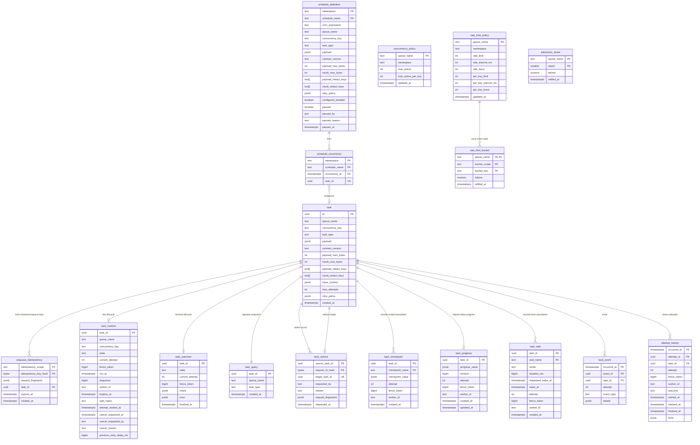

# Workhorse architecture: data model

This page is part of the [Workhorse architecture reference](../architecture.md). It owns every
table, its columns, constraints, and indexes, and declarative schedules.

## Data model



For every accepted task, exactly one of `task_runtime` and `task_outcome` must exist after a
committed transition. SQL functions preserve this lifecycle exclusivity atomically. A task on a
fast-tier queue uses `fast_task_runtime` and `fast_task_outcome` in their place, as
[Fast tier](fast-tier.md#fast-tier) describes.

### `task`

Stable identity and the current accepted definition. `id` and `created_at` do not change.

#### Definition replacement under debounce

An ordinary enqueue inserts the row once. Keyed debounce is the exception. While it owns a
`scheduled` or `ready` runtime inside its replacement window, `enqueue_debounce_v1` may update these
fields on the same identity:

- `queue_name`, `task_type`, `concurrency_key`, and `payload`
- contract version and limits
- redaction keys
- trace context
- tags
- priority
- attempt budget
- retry policy
- deadline and execution timeout

It updates matching routing and runtime fields in the same transaction. Dispatch, terminal state,
or an elapsed replacement window makes the accepted definition non-replaceable.

#### Priority, payload reads, and retry policy

- `priority` is an integer from 0 through 100 and defaults to 0. Higher values dispatch first.
- Dispatch reads the raw payload only after a runtime row has been claimed.
- The retry policy takes one of three shapes:
  - fixed: `{delayMs}`
  - exponential: `{initialDelayMs,multiplier,maxDelayMs}`
  - decorrelated jitter: `{baseDelayMs,maxDelayMs}`

#### Value size limits

`contract_version` is null for an uncontracted task. Otherwise it contains the
`TaskTypeContracts.currentVersion` selected at acceptance.

`payload_max_bytes` and `result_max_bytes` default to 1,048,576 and accept configured values
through 16,777,216.

PostgreSQL measures `octet_length(value::text)` after JSONB canonicalization. That text puts a space
after each `:` and `,`. It writes every number without an exponent. It is therefore never shorter
than compact JSON.

The SDKs measure the same text:

| SDK        | Measurement                                                                                                                                                                                                                                             | Shortcut that skips the exact measure                            | Oversized result                                                                                                                                                                                                       |
| ---------- | ------------------------------------------------------------------------------------------------------------------------------------------------------------------------------------------------------------------------------------------------------- | ---------------------------------------------------------------- | ---------------------------------------------------------------------------------------------------------------------------------------------------------------------------------------------------------------------- |
| TypeScript | `Queue` and worker use `jsonbTextBytes` in `typescript/core/src/queue/enqueue-contracts.ts`                                                                                                                                                             | Twice the compact UTF-8 length fits and the JSON has no exponent | —                                                                                                                                                                                                                      |
| Go         | `jsonbTextBytes` in `go/value_size.go`, for a handler result                                                                                                                                                                                            | Same way as TypeScript                                           | Fails the attempt with `TaskValueSizeLimitError` before any completion statement. The retry policy applies and `Worker.Run` keeps running.                                                                             |
| Python     | `jsonb_text_bytes` in `python/src/workhorse/_contracts.py`, for handler results                                                                                                                                                                         | Twice the compact ASCII length fits and the JSON has no exponent | `_encode_result` in `python/src/workhorse/worker.py` raises `TaskValueSizeLimitError`. It raises `ValueError` for a `NaN` or infinite number. Both fail the attempt through `fail_v1` before any completion statement. |
| Ruby       | Encodes the result once and passes the text to `Worker#check_result_size` in `ruby/lib/stablemates/workhorse/worker.rb` before any completion statement; otherwise measures with `Values.jsonb_text_bytes` in `ruby/lib/stablemates/workhorse/types.rb` | Twice the compact UTF-8 length fits and the JSON has no exponent | Raises `ValueSizeLimitError` with `task_type`, `part` set to `"result"`, `actual_bytes`, and `max_bytes`. The worker settles it through the ordinary fenced failure and retry path and keeps running.                  |
| Rust       | `jsonb_text_bytes` in `rust/src/worker/value_size.rs`, for every handler result                                                                                                                                                                         | None                                                             | `Worker` fails the attempt with `TaskValueSizeLimitError` through `fail_with_state` before any completion statement. The retry policy and `retry_delay` apply, on both tiers.                                          |

The Ruby behavior holds on both tiers and for each member of a completion batch.

PostgreSQL enforces the limits itself:

- `enqueue_batch_v1` rejects an oversized payload before inserting `task`, `task_runtime`, history,
  idempotency, or notification effects.
- `complete_v1` checks the persisted result limit before deleting active runtime.

#### Results jsonb cannot store

A handler result must also be a value jsonb can represent. `complete_v1` and
`complete_many_and_claim_v1` cast the result with `::jsonb`. jsonb refuses two escapes:

- `\u0000`, with SQLSTATE 22P05
- an unpaired UTF-16 surrogate escape, with SQLSTATE 22P02

Each worker scans the encoded result before any completion statement:

| SDK        | Full scan                                                                 | Cheap first check          | Error name      |
| ---------- | ------------------------------------------------------------------------- | -------------------------- | --------------- |
| Go         | `hasUnstorableEscape` in `go/value_size.go`                               | `mayHoldUnstorableEscape`  | `Error`         |
| Python     | `_has_unstorable_escape` in `python/src/workhorse/worker.py`              | `_UNSTORABLE_ESCAPE_START` | `ValueError`    |
| TypeScript | `hasUnstorableEscape` in `typescript/core/src/queue/enqueue-contracts.ts` | `mayHoldUnstorableEscape`  | `TypeError`     |
| Ruby       | `unstorable_escape?` in `ruby/lib/stablemates/workhorse/worker.rb`        | `UNSTORABLE_ESCAPE_START`  | `ArgumentError` |
| Rust       | `holds_nul` in `rust/src/worker/execute.rs`                               | None                       | `Error`         |

The cheap first check looks for `\u0000` or an escape that starts `\ud` or `\uD`. Only a result
holding one gets the full scan, so other escaped text costs one pass. A high surrogate escape counts
as paired only when a low surrogate escape follows immediately.

A Rust `String` cannot hold an unpaired surrogate. The Rust worker therefore checks the result
`Value` only for NUL in any string or key.

A refused result fails the attempt through `fail_v1` before any completion statement, with this
message:

| Refused result message                                                                                      |
| ----------------------------------------------------------------------------------------------------------- |
| `<task type> result contains a NUL character or an unpaired surrogate, which PostgreSQL jsonb cannot store` |

The message carries no part of the value, so `fail_v1` can store it.

- The retry policy applies.
- The worker keeps running.
- On the fast tier, the refused member never joins the completion batch.

Any other error from a completion statement still stops the Go, Python, TypeScript, and Ruby
workers.

#### Redaction keys

`payload_redact_keys` and `result_redact_keys` each contain at most 50 unique top-level object keys
of 1 through 200 characters.

When a worker claims a task, `claim_v1` returns the raw payload to its handler. A Go worker that
cannot decode a claimed payload skips the handler. It fails that attempt through the ordinary fenced
failure and retry path, so `Worker.Run` keeps running.

`workhorse.redact_top_level_keys_v1` removes persisted keys for these reads:

- `Admin.getTask`
- `Admin.listTasks`
- dead-letter listing
- dashboard task detail

Caller-supplied `TaskPayloadProjection.redactKeys` are added to the persisted payload keys. Scalar
and array values pass through, because top-level key redaction applies only to objects.

If either persisted key array is non-empty, `workhorse.redact_error_details_v1` substitutes
`RedactedTaskError` and a fixed message. It does so before `fail_v1` writes runtime, outcome,
attempt, or event errors. `Worker` applies the same rule before recording a handler exception in
OpenTelemetry.

#### Contract definitions and policy

`QueueOptions.contracts` maps a task type to `currentVersion` and a `versions` record of
`TaskContractVersion`. Each version contains optional `payloadSchema` and `resultSchema` JSON Schema
Draft 2020-12 documents.

- `sync_contract_definitions_v1(p_definitions jsonb)` inserts immutable `(task_type, version)` rows
  into `contract_definition`. Different schema, limit, or redaction values for an existing key
  raise `contract documents are immutable; publish a new version`.
- `contract_policy` stores `current_version`, `application_current_version`, and `operator_override`
  separately.
- Application sync updates `application_current_version`. It changes `current_version` only when
  `operator_override` is false.
- The internal `override_contract_version_v1` selects an inserted version and sets the override for
  policy tests.
- `get_contract_definition_v1(task_type, version)` returns the named version. When `version` is
  null, it resolves the policy version.

#### Contract schema profile

`protocol/v1/manifest.json` and `protocol/v1/contracts.json` pin the executable profile. It accepts
Draft 2020-12 core, applicator, validation, and metadata keywords. `format` produces annotations and
never rejects an instance.

References and definitions follow a restricted grammar:

- `$ref` must be `#`, which names the root schema, or `#/$defs/<name>`, where `<name>` is an own key
  of the root `$defs`.
- Any other reference is rejected with `<path>.$ref must point at a subschema of the contract`, for
  example `$.properties.a.$ref`. That includes a JSON pointer into `properties` or `items`, into a
  definition, or into `default` or `examples`. It also includes a percent-encoded or `~1`-escaped
  name, an anchor fragment, and a reference that does not resolve.
- `$defs` may appear only on the root schema. Elsewhere it is rejected with
  `<path>.$defs must appear only on the root schema`, for example `$.items.$defs`.
- Each `$defs` key must match `^[A-Za-z_][-A-Za-z0-9._]*$`. Otherwise the schema is rejected with
  `<path>.<name> must be a definition name matching ^[A-Za-z_][-A-Za-z0-9._]*$`, for example
  `$.$defs.a b`.
- `$anchor` is rejected at any depth with `<path> is outside the Workhorse contract profile`, for
  example `$.items.$anchor`. A property named `$anchor` stays valid.

Because the grammar excludes `/`, `~` and `%`, no SDK decodes a reference before resolving it
(ADR 0039).

Other keywords are rejected before compilation:

- Remote references, custom keywords and vocabularies, `$dynamicRef`, `$dynamicAnchor`,
  `unevaluatedProperties`, and `unevaluatedItems`.
- `pattern` and `patternProperties`, at any depth, with
  `<path> is outside the Workhorse contract profile`. Here `<path>` ends at the keyword, for example
  `$.items.patternProperties`. A property named `pattern` inside `properties` or `required` stays
  valid.

The SDKs' regular expression engines differ in syntax and matching. String-shape checks therefore
belong in handler code (ADR 0039).

TypeScript compiles with Ajv, Python with `Draft202012Validator`, and Go with
`santhosh-tekuri/jsonschema`. `compileContractSchema` constructs Ajv with two options:

- `strict: false` means Ajv-only lint rules such as `strictTypes`, `strictTuples`, and
  `strictRequired` cannot reject a profile schema. Ajv still validates each schema against the
  Draft 2020-12 meta-schema.
- `strictNumbers: true` is an instance rule. It rejects NaN and the infinities, which JSON would
  store as `null`.

Every language runs the same fixture table.

#### Contract validation at enqueue and completion

Enqueue validates with the policy's current version after explicit contract sync.
`EnqueueContractsModule` caches each current definition by `task_type`. `taskAcceptance` reads that
cache instead of calling `get_contract_definition_v1` per request.

A stale cache is handled in two ways:

1. If a cached `contractVersion` differs from `contract_policy.current_version`, `enqueue_many_v1`
   returns one internal row. The row has ordinal `0`, null `task_id`, outcome `contract_mismatch`,
   and a reason object containing the affected `taskTypes`. TypeScript reloads those definitions
   through the caller's `Queryable`, revalidates the batch, and retries once.
2. A cached definition can also reject a payload that the current selection accepts. Then
   `enqueue_many_v1` never sees the request. When a cached definition raises
   `TaskContractValidationError` or `TaskValueSizeLimitError`, `serializedTaskAcceptance` reloads
   that task type's definition once through the same `Queryable` and validates again. The second
   result stands. A payload the current version also rejects still raises, after one extra
   `get_contract_definition_v1` read.

Child-task creation and `syncSchedules` share that path through `taskAcceptance`, which reads
through the queue's database.

At completion:

- `claim_v1` returns the persisted `contractVersion`, `resultMaxBytes`, and `redactErrorDetails`.
- Completion caches the immutable document by `(task_type, contract_version)` instead of consulting
  `current_version`.
- A validation mismatch becomes `TaskContractValidationError` without retaining the value or library
  diagnostic.
- A missing retained version becomes `TaskContractUnavailableError`.
- `Worker` handles either error through the ordinary fenced failure and retry path.

Reads never invoke schemas, so historical payloads remain inspectable after application validation
changes.

### `enqueue_idempotency`

PostgreSQL-owned scoped enqueue ownership, separate from stable task identity and dispatch.

#### Key and limits

The primary key `(idempotency_scope, idempotency_key_hash)` serializes competing callers through one
scoped unique owner. The hash is the full SHA-256 of the scope/key ownership input. Raw keys are
never persisted.

| Setting | Default                  | Range                                               |
| ------- | ------------------------ | --------------------------------------------------- |
| Scope   | `default`                | 1 through 256 UTF-8 bytes                           |
| Key     | None                     | 1 through 512 UTF-8 bytes                           |
| TTL     | 86,400,000 ms (24 hours) | Integer from 1 through 31,536,000,000 ms (365 days) |

#### Indexes

- `enqueue_idempotency_expiry_idx` orders expired-key pruning.
- `enqueue_idempotency_task_idx` lets terminal pruning reject identities with retained enqueue
  ownership without scanning unrelated keys.

#### Fingerprint and replay

The stored canonical fingerprint covers:

- queue, concurrency key, priority, type, and payload
- contract version and both size limits
- both redaction-key sets
- sorted tags
- `maxAttempts` and normalized `retryPolicy`
- `prerequisiteTaskId` and normalized `dependencies`
- TTL
- explicitly supplied `runAt`
- `deadline` and `executionTimeoutMs`
- `budget`, only when the request names one

An omitted `runAt` stays omitted for keyed immediate ingress instead of capturing the classification
timestamp.

- Exact replay returns the bound task ID before task, dependency, event, runtime, FIFO-sequence, or
  notification side effects.
- A mismatch raises a structured conflict and aborts the whole statement or caller transaction.
  The conflict raises SQLSTATE `P1001`. Its details carry `scope`, `keyPreview`, the 12-hex
  `keyDigest`, `keyLength`, `existingTaskId`, the request's 1-based batch `ordinal`, the sorted
  `conflictingFields`, and both request digests.
- Requests without `options.idempotency` bypass this relation and retain the prior always-create
  behavior.

#### Key exposure and expiry

The ownership relation stores scope and full key hash, never the raw key.

- The initial `enqueued` event, UI projections, and errors expose only a bounded key preview plus
  12-hex key digest.
- The preview of a key of 1 to 4 characters is one `•` per character. A key of 5 to 8 characters
  shows its first 2 characters, `…`, and its last 2. A key of 9 or more shows its first 8, `…`, and
  its last 4.
- Exact replay appends no event.
- Structured conflicts additionally carry full SHA-256 stored and rejected request digests.

Expired ownership can be replaced by a new request. Housekeeping prunes expired bindings before
terminal task identity. `purge_queue_internal_v1` deletes the bindings of the `blocked`, `ready`,
and `scheduled` tasks it purges, and of purged ready fast-tier tasks.

### `task_dependency`

#### Columns and bounds

- The primary key is `(dependent_task_id, prerequisite_task_id)`.
- `dependent_task_id` cascades when that task identity is removed.
- `prerequisite_task_id` restricts deletion, so retention cannot strand blocked work.
- `on_success`, `on_failure`, and `on_cancellation` each contain `release`, `cancel`, or `fail`.
- `created_at` records acceptance.
- Nullable `released_at` records when the edge stopped controlling dispatch.
- `resolution` records the selected action.

Edge bounds:

- At most 100 prerequisite edges may enter one dependent task.
- At most 100 dependent edges may leave one prerequisite task.
- Each prerequisite may reach at most 100 distinct dependents through unresolved edges. The bound
  includes direct and transitive descendants. PostgreSQL checks every affected ancestor while the
  touched-component advisory locks keep the pending graph stable.

#### Pruning released edges

`workhorse.prune_released_dependencies_v1(p_limit integer)` deletes at most 100,000 released edges
whose dependent has a terminal outcome. It orders candidates by `released_at`, `dependent_task_id`,
and `prerequisite_task_id`. It then locks them with `FOR UPDATE SKIP LOCKED`.
`task_dependency_released_retention_idx` supports that bounded selection.

Removing the edge lets the prerequisite and dependent follow their own identity windows. Retained
dependency lineage is not a separate retention category.

#### Declaring dependencies at enqueue

`EnqueueOptions.dependencies` accepts 1 through 100 unique stable identities plus success, failure,
and cancellation policies. `EnqueueOptions.prerequisiteTaskId` remains a deprecated success-oriented
shorthand. The TypeScript union rejects both fields on one request. `enqueue_batch_v1` keeps runtime
validation for direct SQL and untyped JavaScript callers.

#### Prerequisite locking at enqueue

`enqueue_batch_v1` locks every prerequisite inside the caller's transaction with `FOR KEY SHARE`:

1. One statement per table locks the prerequisites of every request in the batch before the first
   request runs. It locks the `task_runtime` rows in identity order first, then the `task` rows.
   The collection skips a value that does not match the UUID pattern. That request's validation
   then raises its usual error.
2. Each request locks its own prerequisites again. That waits for nothing and counts the rows that
   exist.

Why this ordering is safe:

- Every terminal transition deletes the runtime row before it inserts the outcome whose trigger
  resolves dependents. The runtime lock therefore makes a concurrent completion, failure, or
  cancellation wait until the enqueue commits, so its resolver sees the new edge.
- A transition that committed first has already deleted the row. The enqueue's outcome reads then
  see its outcome.
- Key-share locks do not conflict with the non-key updates that claims and heartbeats make. An open
  dependent enqueue therefore does not delay dispatch of its prerequisite.
- The runtime-then-task order matches `complete_v1` and `purge_queue_internal_v1`. Neither side
  holds one row while it waits for the other.

A request which declares no prerequisite runs none of that. `enqueue_batch_v1` guards these steps on
a prerequisite count above zero:

- the prerequisite lock
- both outcome scans
- the `task_dependency` insert
- dependent resolution

No statement then reaches `task_dependency`, and its statement trigger never fires.

A live prerequisite creates a `blocked` runtime plus `dependency_blocked`. Each terminal
prerequisite resolves its edge according to policy. After every edge resolves, `fail` precedes
`cancel`, which precedes `release`.

#### Outcome trigger

`task_outcome_resolve_dependencies_insert` is an `AFTER INSERT ... FOR EACH STATEMENT` trigger with
the transition table `new_outcomes`. Its function, `resolve_task_outcome_dependencies_v1`, runs once
per statement over every outcome that statement inserted.

1. It sets `released_at` and a `release` resolution on every still-pending edge that enters one of
   those terminal tasks.
2. It probes `task_dependency_dependent_pending_idx` and `task_dependency_prerequisite_pending_idx`
   for the inserted outcomes. When neither finds an edge, it returns before any write or resolver
   call (SM-948). Most outcomes have no pending edge in either direction.
3. Otherwise it passes the new terminal identities and states, in identity order, to the resolver
   below.

| Resolver                                                                                             |
| ---------------------------------------------------------------------------------------------------- |
| `workhorse.resolve_dependents_many_v1(p_prerequisite_task_ids uuid[], p_prerequisite_states text[])` |

Step 1 exists because a task settled while still blocked would otherwise leave those edges pending
forever. A pending edge is neither a prune candidate nor a removable `prerequisite_task_id`. It
therefore held its prerequisite identity against retention until the dependent identity was purged.

- Cancellation and deadline materialization are the paths that reach step 1. A dependent released
  into dispatch has no pending edge left, so the statement matches nothing on the ordinary path.
- The resolution is `release` because no prerequisite outcome selected an action. The dependent was
  already terminal, so the edge changes nothing about it.
- `workhorse.release_own_dependencies_v1(task_id)` remains as the one-task form of that statement.

Other entry points to the resolver:

- `resolve_dependents_v1(p_prerequisite_task_id, p_prerequisite_state)` keeps its signature and
  delegates to `resolve_dependents_many_v1` with one element.
- `enqueue_batch_v1` calls `resolve_dependents_many_v1` once with every terminal prerequisite of a
  batch.

#### Resolver lock order

`resolve_dependents_many_v1` works in a fixed lock order:

1. It locks the `task_runtime` row of every `blocked` dependent reached by a pending edge from the
   given prerequisites, `FOR NO KEY UPDATE` in `task_id` order.
2. Only then does it touch `task_dependency`.

A dependent's own terminal transition also holds its runtime row before its outcome trigger releases
the dependent's own edges. A resolver and that transition therefore cannot wait for each other.

The step 1 lock does not conflict with the `FOR KEY SHARE` lock an enqueue takes on a prerequisite's
runtime row. Only the `DELETE` of a dependent that fails or is canceled waits for such an enqueue.

Before that `DELETE`, the resolver locks the runtime rows of every rejected dependent `FOR UPDATE`
in `task_id` order. An enqueue batch locks its prerequisites in the same order, so neither holds a
row the other waits for. The `DELETE` plan alone could lock the rows in any order.

Before schema version 33, a batch locked request by request. One request could then hold a row the
resolver was about to delete while the next request waited on a row the resolver already held.

#### Resolver counters

1. One `UPDATE` records `released_at` plus `resolution` on every locked dependent's pending edges
   from the given prerequisites.
2. A second statement subtracts each dependent's resolved edges from
   `task_runtime.pending_prerequisites`. It records any `fail` or `cancel` resolution in
   `dependency_rejected`.

A dependent's next step depends on its counter:

| Counter and rejection   | Resolver action                                                                                                                                        |
| ----------------------- | ------------------------------------------------------------------------------------------------------------------------------------------------------ |
| Above zero              | Stays blocked. Costs one runtime update and no edge scan.                                                                                              |
| Zero, no rejection      | Releases after one probe of `task_dependency_dependent_pending_idx` confirms that no edge is still pending. The counter write joins the release write. |
| Zero, after a rejection | Reads only its `fail` and `cancel` edges. Chooses `fail` before `cancel`, then the lowest prerequisite identity.                                       |

#### Counter repair

The resolver recounts a dependent's pending and rejecting edges instead of subtracting in two cases:

- its counter is smaller than the number of edges the call resolved
- its counter equals that number while the probe finds a pending edge

It stores the recounted values and appends one `dependency_counter_repaired` event. Its `details`
carry:

- `source` `resolver`
- the prerequisite
- the recorded counter
- the resolved edges
- the pending edges
- the recounted flag

Before schema version 38, such a counter violated `task_runtime_pending_prerequisites_check` and
rolled back the prerequisite's completion.

A counter that is too low by exactly the edges still pending therefore holds the dependent instead
of releasing it early. The probe runs only for a dependent about to settle.

`pnpm benchmark:dependency-release-guard` measured the probe against a copy of the resolver without
it, on PostgreSQL 18 and 15
([analysis](../benchmarks/2026-09-27-dependency-release-guard-analysis.md)):

| Call                     | Added cost  |
| ------------------------ | ----------- |
| Releasing one dependent  | 8 to 11 µs  |
| Releasing 100 dependents | 60 to 75 µs |
| The last edge of 100     | about 57 µs |

`settle_dependents_v1` locks each rejected dependent and checks that it has a `fail` or `cancel`
edge. A rejected dependent with none gets its pending edges recounted and its flag cleared. It
appends one `dependency_counter_repaired` event whose `details` carry `source` `settlement`, the
pending edges, and the cleared flag.

- When edges remain, it stays blocked.
- Otherwise it releases with `dependency_released.details.reason` `dependency_counter_repaired`.

Before this recount, such a dependent raised an exception and rolled back the transition that
resolved its edge.

#### Settlement

The resolver hands the rejected and released dependents to `settle_dependents_v1`. That function
performs the settlement below and returns the number of dependents that left `blocked`.

1. One statement handles every dependent that fails or is canceled. It deletes their runtime rows
   and appends their `dependency_failed` or `dependency_canceled` events. It inserts their synthetic
   terminal outcomes in identity order with `DependencyFailed` or `DependencyCanceled`.
2. A second statement moves every released dependent to ready or scheduled. It allocates ready
   sequences in identity order and appends one `dependency_released` each. The released event names
   the smallest prerequisite in the call that resolved one of the dependent's edges.
3. The resolver materializes an already-passed deadline for each released task.
4. It sends one `NOTIFY workhorse_tasks` per queue that gained ready work.

`dependency_released.details.reason` takes these values:

| Reason                           | When                                                                                |
| -------------------------------- | ----------------------------------------------------------------------------------- |
| `prerequisite_succeeded`         | After success                                                                       |
| `prerequisite_failed_policy`     | `on_failure` selects `release`                                                      |
| `prerequisite_canceled_policy`   | `on_cancellation` selects `release`                                                 |
| `prerequisite_already_succeeded` | Enqueue-time terminal short circuit, after success                                  |
| `prerequisite_terminal_policy`   | Enqueue-time terminal short circuit, after a failure or cancellation policy release |
| `dependency_counter_repaired`    | `settle_dependents_v1` recount, as above                                            |

#### Generic plans

`resolve_dependents_many_v1` is declared with `SET plan_cache_mode = force_generic_plan`.

Its lock, edge-release, counter, and release statements take the prerequisite and dependent arrays.
A custom plan sees a one-element array and costs less than the generic plan, which assumes a default
array size. Under the default mode, PL/pgSQL therefore planned all four statements again on every
call.

In the SM-950 profile, planning took about 1.2 ms per singly released task against about 0.3 ms of
execution. Fan-in siblings waited on the dependent's row lock for that time.

Every generic plan reaches `task_runtime` through `task_runtime_pkey`. It reaches `task_dependency`
through `task_dependency_prerequisite_pending_idx` or `task_dependency_dependent_pending_idx`,
driven by the arrays. It therefore stays a key probe at any table size.

`settle_dependents_v1` runs the release and rejection statements for the resolver and carries the
same setting.

#### Propagation and cascades

Propagation advances one dependency level per statement. The synthetic outcomes of one level are
the last write of their statement. The statement trigger therefore fires for them after that level's
events exist, and resolves the next level as one set.

- Every event of a level has an `occurred_at` no later than any event of the level below it.
- Within a level, the resolver writes the events in dependent identity order. No column records
  that order. `occurred_at` can repeat within a level. Before PostgreSQL 18, `event_id` is random
  below the millisecond, so it does not break those ties in write order.
- One outcome transaction can recurse through at most 100 unresolved descendants. A cascade is
  therefore at most 100 levels deep and invokes at most 101 resolver calls.
- Runtime locks serialize concurrent prerequisite outcomes at the one state transition. Evidence,
  FIFO allocation, and notification therefore happen once.

The resolver locks a level only when it reaches it, so no single order covers a whole cascade. Two
cascades that reach overlapping dependents at different levels can therefore lock them in different
orders. PostgreSQL then aborts one statement with SQLSTATE `40P01`. The integration test
`deadlocks two fenced failures whose cascades meet at different levels` in
`typescript/core/test/integration-dependencies.test.ts` reproduces that cycle.

#### Deadlock retry for fenced writes

Every SDK sends a fenced write again when PostgreSQL rolls it back with `40P01`, up to 3
attempts in total. A fenced write is a statement that names a task, its worker, and its fence token.
Nothing in the rolled-back statement committed, and the fence decides again whether the resend may
still act.

The retried statements are:

- `complete_v1`, `fail_v1`, `release_owned_v1`, `acknowledge_cancel_v1`
- `expire_owned_v1`, `expire_owned_telemetry_v1`
- `heartbeat_v1`, `heartbeat_many_v1`
- `complete_many_and_claim_v1`, `record_batch_dispatch_v1`, `record_batch_failure_v1`
- `create_child_v2`, `create_children_v1`
- `save_checkpoint_v1`, `update_progress_v1`
- `schedule_wait_v1`, `wait_for_signal_v1`, `wait_for_human_v1`

| SDK        | Helper                                                                            | Attempt constant                 |
| ---------- | --------------------------------------------------------------------------------- | -------------------------------- |
| TypeScript | `queryFencedWrite`                                                                | `FENCED_WRITE_DEADLOCK_ATTEMPTS` |
| Go         | `queryFencedWrite`                                                                | `fencedWriteDeadlockAttempts`    |
| Python     | `fenced_write_rows` and `async_fenced_write_rows` in `workhorse/_fenced_write.py` | `FENCED_WRITE_DEADLOCK_ATTEMPTS` |
| Rust       | `fenced_rows`                                                                     | `FENCED_WRITE_DEADLOCK_ATTEMPTS` |

- A deadlock aborts a caller-owned transaction, so a resend inside one fails with SQLSTATE `25P02`.
  The helper then raises the original `40P01` instead.
- Any other error is raised after one send.

Statements without a fence are sent once. `enqueue_batch_v1`, `cancel_v1`, `send_signal_v1`,
`complete_human_wait_v1`, `claim_many_v1`, `recover_expired_v1`, and every administrative statement
raise `40P01` to their caller.

The one administrative exception is `sync_concurrency_policies_v1`. Every SDK sends it through the
same helper, so it also gets up to 3 attempts, and only `40P01` repeats it. A resend writes the same
complete desired set, so a repeated sync is safe.

#### Edge validation

`reject_self_task_dependency_v1` rejects a direct self-edge before the table check and returns
SQLSTATE `P1003`.

After each insert statement, `validate_task_dependencies_v1` uses the statement transition table to
validate all inserted edges together:

1. It locks the `task` row of both endpoints of every inserted edge `FOR NO KEY UPDATE` in identity
   order. That lock does not conflict with the `FOR KEY SHARE` locks that enqueue and foreign key
   checks take.
2. It checks whether any inserted dependent is already a prerequisite. When one is, validation takes
   the full path. When every inserted dependent is a sink, validation takes the fast path.

##### Full path

Validation finds every pre-existing weakly connected component touched by either endpoint. It locks
each task identity in those components in UUID order with a transaction advisory lock.

- Inserts into disconnected components do not share a lock.
- Inserts which join or mutate the same component serialize before validation.
- Per-task component locks remain stable when a concurrent transaction merges two components.

The recursive cycle check starts from the inserted prerequisite identities and follows the primary
key's `dependent_task_id` prefix. It does not seed from the whole graph. It rejects transitive
cycles with SQLSTATE `P1003`. The JSON detail contains:

- `dependentTaskId`
- `prerequisiteTaskId`
- at most 101 `cycleTaskIds`
- `truncated`

`Queue` maps that detail to `DependencyCycleError`.

##### Fast path

`enqueue_batch_v1` always takes the fast path, because every dependent it inserts is new. A cycle
through a new edge needs an existing edge that names the new dependent as a prerequisite. The fast
path therefore skips the component locks and the cycle check.

A new sink changes only the transitive counts of its prerequisites' unresolved upstream cone.

1. Validation locks that cone with the same per-task advisory keys, in UUID order.
2. It walks the cone again and locks any member a concurrent writer added, until a walk finds no new
   member.
3. Every task's transitive dependents are a subset of those of some cone source, so it checks only
   the sources. One walk counts the union of the sources' unresolved dependents and stops after 101.
4. Only a union above 100 counts each source separately.
5. Only a source above 100 runs the exact check, which names the offending ancestor.

##### Bound enforcement

The same statement trigger enforces both direct edge bounds and the bound of 100 unresolved
descendants in a cascade. It raises SQLSTATE `P1005` with `taskId`, `limit`, and `max`. `Queue`
maps that to `DependencyLimitExceededError`.

The cascade check walks backward from inserted unresolved edges to affected ancestors. It then walks
forward through their unresolved descendants. `task_dependency_prerequisite_idx`,
`task_dependency_prerequisite_pending_idx`, and `task_dependency_dependent_pending_idx` keep both
traversals scoped to touched components.

`enqueue_batch_v1` inserts the prerequisite edges of every accepted task in a batch with one
statement. The trigger therefore validates the batch's fan-in and fan-out once.

#### Admin reads

`Admin.getTask` and `Admin.listTasks` expose:

- sorted `prerequisiteTaskIds`
- `dependencyPolicy`
- the compatible singular `prerequisiteTaskId` when exactly one edge exists
- `blockedReason`

`Admin.getDependencyLineage(taskId, limit)` returns at most 1,000 edges where the identity is either
the prerequisite or dependent. `limit` defaults to `MAX_TASK_QUERY_PAGE_SIZE`, 1,000. `truncated` is
true when more edges exist. A task gains prerequisite edges only from its own enqueue request, at
most 100, and from its children. One task creates at most one child through `create_child_v2`,
or one non-empty set of at most 100 children through `create_children_v1`. An empty set records
nothing. Once a task has a child or a non-empty set, a request for another child or another set
creates no task. A prerequisite retains at most 100 dependent edges. One identity therefore holds at most 300 edges, and the default read returns its complete
one-hop lineage without a continuation cursor. A caller-selected lower limit can still set
`truncated`.

Each `DependencyLineageRecord` contains both identities, all three terminal policies, `createdAt`,
nullable `releasedAt`, and nullable `resolution`.

`dashboard_task_dependency_v1` exposes the same retained edge evidence to the bounded dashboard
task-detail read.

#### Dashboard task list

`DashboardTaskFilter` contains `all`, `blocked`, `waiting`, `scheduled`, `retried`, `queued`,
`running`, `completed`, `discarded`, and `canceled`.

The internal `readDashboardTasks` in `typescript/dashboard-server/src/server/read-model.ts`, which
the `tasks` procedure calls, maps two filters specially:

- `blocked` maps to runtime state `blocked`.
- `waiting` maps to tasks present in `dashboard_signal_wait_v1` or `dashboard_human_wait_v1`.

Each `DashboardTaskRow` exposes `blockedReason` as `prerequisite_pending` for a blocked state. Its
`prerequisiteTaskIds` contains the sorted unresolved prerequisite identities.

Counts:

- `readDashboardTaskCounts` reports both live populations exactly below its planner threshold.
  Above that threshold, it reads their exact counts from the live runtime and external-wait
  projections.
- `readDashboardTasks` returns filtered page totals. It does not call `readDashboardTaskCounts` or
  embed `DashboardTaskCounts`.
- The SPA reads those navigation counts through the separate `taskCounts` procedure.

Payload and worker columns:

- `DashboardTaskRow` omits `payload`. `readDashboardTaskDetail` is the only task procedure that
  returns it.
- The task page adds the latest-attempt lateral join only when the internal
  `DashboardTasksQuery.worker` is non-null. Without that filter, a terminal row reports a null
  `lastWorkerId`.

Durability projection:

- If the host configures `DashboardDurabilityProjector`, the TypeScript backend reads payload and
  checkpoint names only for that server-side projection. It still omits payload from
  `DashboardTaskRow`.
- Without a projector, task-page durability is null and those columns are absent from the database
  result. Task detail still projects the complete durability plan.
- A projector that declares `payloadKeys` receives only those top-level payload keys instead of the
  whole redacted payload. The demo's `durableDemoPlanForTask` declares `scenario` and `failureMode`.

Priority filter and sort:

- The dashboard `tasksInput.priority` filter is a nullable integer from 0 through 100.
- Its `sort` is `updated` or `priority` and defaults to `updated`.
- `readDashboardTasks` accepts these fields through `DashboardTasksQuery`. It applies the priority
  filter before counting and pagination.
- `readDashboardTasks` also accepts `count`, which the `events` procedure accepts with the same
  meaning.
- The `priority` sort orders by priority descending, then `updated_at` descending, then task
  identity descending.
- `DashboardTasksPage` returns the effective `priority` and `sort`.
- `parseTaskLocation` reads them from the task URL. `taskLocationHref` writes them as `priority` and
  `sort` parameters.

#### Dashboard test enqueue

`enqueueTestInput.priority` is an integer from 0 through 100 and defaults to 0. The router passes it
to `DashboardOperator.enqueueTest`, and the demo operator supplies it to `Queue.enqueue`. The
`redrive` test action ignores this input because `redrive_v1` copies the source priority.

`DashboardEnqueueTestResult.outcome` is an optional `accepted` or `replayed`. The demo operator
fills it from `Queue.enqueueWithResult`. The dashboard can then say when a retained key returned an
existing task instead of a new one.

#### Dependency health

`Queue.health().dependencies` reports:

- blocked tasks
- pending edges
- retained `DependencyFailed` outcomes
- `retentionPruneStarved`

`retentionPruneStarved` records that the latest terminal prune deleted no identities while its
bounded candidate window contained a prerequisite protected by a dependency edge. A later successful
prune or a zero-deletion pass without dependency pins clears it.

The three counts scan at most 10,001 matching rows and return at most 10,000. They set `capped` when
any value is a lower bound.

Diagnostic indexes keep the health query from scanning unrelated runtime or history rows:

| Index                                   | Supports                              |
| --------------------------------------- | ------------------------------------- |
| `task_runtime_blocked_queue_idx`        | Global and per-queue blocked counts   |
| `task_dependency_dependent_pending_idx` | Pending-edge joins from live runtimes |
| `task_outcome_dependency_failed_idx`    | Failure counts                        |

The partial indexes exclude ready, scheduled, and active rows from their predicates, so claim does
not use them.

`Queue.queueMetricSnapshot()` splits the dispatch-pressure facts by queue and exposes
`dependencyCountsCapped`. `registerQueueMetrics()` exports them as:

- `workhorse.queue.dependencies.blocked`
- `workhorse.queue.dependencies.pending_edges`
- `workhorse.queue.dependencies.failed_resolutions`
- `workhorse.queue.dependencies.capped`

The only attribute is `workhorse.queue.name`.

### `task_child`

One immutable row links a parent identity to each named child.

#### Columns and constraints

- The primary key is `(parent_task_id, child_name)`, and `child_task_id` is unique.
- One parent may own at most 100 children.
- Names contain 1 through 200 characters.
- `request_fingerprint` stores the complete normalized child request for replay comparison.
- `created_as_set` distinguishes `runChildren` edges from the compatible single-child contract.
- `created_at` records creation.
- Nullable `joined_at` records the first accepted result read.
- `last_seen_fence_token` records the parent fence that created or successfully joined an
  individual child.

#### Renamed replay of a single child

`create_child_v2` and `create_single_child_v2` return `stored_child_name` alongside their status.
When the requested name differs from the stored one:

- The functions return `conflict`, unless `task_child.last_seen_fence_token` equals the active
  parent's fence.
- When the fences match, the handler already used its individual child in this run. Another name
  then returns `limit_exceeded`.

A resumed handler receives a new fence even when suspension preserves its logical attempt. A null
marker on an older edge makes its first renamed replay a conflict. Each SDK's conflict message
includes the stored and requested names.

The retained `create_child_v1` and `create_single_child_v1` functions keep their original limit
diagnosis for older clients.

#### Creating one child

`create_child_v2(parent_task_id, worker_id, fence_token, child_name, request)` runs these steps:

1. It locks and validates the exact active, unexpired parent generation.
2. It calls `enqueue_many_v1` and inserts `task_child`.
3. It adds a `task_dependency` edge from parent to child with success `release`, failure `fail`, and
   cancellation `cancel`.
4. It moves the parent from active to blocked, sets its `pending_prerequisites` to its pending
   edges, and clears ownership in the same transaction.

A rollback removes the child, lineage, dependency, events, and suspension.

A child whose `deadline` has already passed reaches its `task_outcome` inside `enqueue_many_v1`,
before its edge exists. After the `parent_linked` event, the function therefore passes that outcome
to `resolve_dependents_many_v1`. That call settles the blocked parent in the same transaction.

Coalescing and additional dependency options are rejected for child requests.

`create_single_child_v2` retains that implementation. The public `create_child_v2` wrapper rejects
any `created_as_set` edge before it delegates. That keeps the single-child replay contract
compatible without letting it consume a child-set replay.

#### `runChild` lifecycle

`HandlerContext.runChild(name, type, payload, options)` calls the fenced transition. It suspends the
handler without consuming its logical attempt. `create_child_v2` rejects a child name outside 1 to
200 characters, and `task_child.child_name` enforces the same bound.

1. Child success releases the parent through the dependency resolver.
2. The next claim has a new fence and restarts the handler from entry.
3. `runChild` replays and returns the retained result.

`child_created`, `parent_linked`, and the first `child_joined` record the lifecycle. A later parent
retry reads the same result without creating another child or appending another join event. A
handler that creates no child completes through the ordinary completion path.

#### Contract versions on replay

TypeScript `runChild`, `runChildren`, and `runChildrenAll` validate and stamp each child's current
contract through `EnqueueContractsModule.taskAcceptance`.

On `conflict`, `ChildTasksModule` reads each existing child's `contract_version` through
`task_child` and `get_task`. It rebuilds the request under those versions and retries once if the
rebuilt request differs.

- A stored null version keeps the child uncontracted.
- The rebuild restores both size limits and both sensitive-key lists without changing the
  current-contract cache.
- If the current contract rejects the replayed payload's schema or size, the module rebuilds under
  the stored versions before writing.
- If that rebuild also rejects the payload, the original validation error remains.

PostgreSQL still compares the complete request. A changed payload, type, option, set membership, or
join mode therefore remains a `ChildConflictError`.

#### Creating a child set

`create_children_v1(parent_task_id, worker_id, fence_token, children, mode)` accepts 0 through 100
unique named requests and mode `settled` or `all_success`.

1. A non-empty first call creates every child and dependency edge.
2. It then moves the parent to blocked and sets its `pending_prerequisites` to its pending edges.
3. After the `children_created` event, it passes every child that already holds a `task_outcome` to
   `resolve_dependents_many_v1` in one call. One example is a child created past its deadline.

Replay requires the exact names, normalized requests, and mode. It returns only after every child
reaches a terminal state.

- The joined object may not exceed the parent task's `result_max_bytes`, which defaults to
  1,048,576 bytes. An oversized join returns
  `result_too_large` without copying the object to the client.
- `children_created` and `children_joined` each append once per set.

#### Join modes

| Mode          | Edge policies (success, failure, cancellation) | Result                                       |
| ------------- | ---------------------------------------------- | -------------------------------------------- |
| `settled`     | `release`, `release`, `release`                | Keyed by child name; one outcome per child   |
| `all_success` | `release`, `fail`, `cancel`                    | Raw successful results under the child names |

In mode `settled`, each value is exactly one of:

- `{ status: "succeeded", result }`
- `{ status: "failed", error }`
- `{ status: "canceled", error }`

The ordered `children` array uses the same value under `outcome`. TypeScript and Python rebuild
insertion-ordered maps, and Go returns `[]ChildResult` in request order. The error value is the
bounded terminal evidence from `task_outcome.error`.

In mode `all_success`, failure takes precedence over cancellation if more than one rejected outcome
exists. Prerequisite identity then breaks ties. Terminal evidence names the prerequisite whose
resolution selected the parent outcome, regardless of settlement order.

#### Handler API for child sets

- `HandlerContext.runChildren(children)` uses `settled` and returns `ChildOutcomes<TResult>`.
- `HandlerContext.runChildrenAll(children)` uses `all_success` and returns `TResult`.
- Zero children return `{}` without suspension in either mode.
- Retry and duplicate dependency wakeups reuse the same edges and results without appending another
  join event.
- `ChildResultLimitExceededError` reports the measured and configured aggregate result sizes.

#### Cancellation and errors

Canceling a blocked parent does not cancel the child. A later child outcome cannot resurrect that
terminal parent.

| Error                     | Meaning                |
| ------------------------- | ---------------------- |
| `ChildLeaseLostError`     | Stale ownership        |
| `ChildConflictError`      | A changed replay       |
| `ChildLimitExceededError` | An oversized child set |

The single-child function returns `limit_exceeded` when any set-created edge exists. Callers
therefore cannot mix the two replay contracts.

#### Lineage reads

- `Admin.getTask` and `Admin.listTasks` expose `parentTaskId` and sorted `childTaskIds`.
- `Admin.getChildLineage(taskId, limit)` returns at most 1,000 edges in either direction and
  reports truncation. Each record includes the child's terminal state and bounded error when
  available.
- `readDashboardTaskDetail` reads at most 102 child rows and returns at most 101. A task can own 100
  children and be one parent's child, so that response contains its complete direct child lineage.
- `dashboard_task_child_v1` gives the dashboard the same lineage.

#### Retention

The parent owns edge lifetime. `prune_terminal_tasks_v1` refuses to prune it while any linked child
is live or has not crossed the identity, outcome, and history cutoffs. Parent deletion then removes
dependency and child edges atomically. The next pass can then reclaim children without a foreign-key
cycle.

#### Child health

`Queue.health().children` reports:

- waiting parents
- live children
- unjoined successful results
- retained parents that child policy failed or canceled

Each count scans at most 10,001 matching rows and returns at most 10,000. It sets `capped` when any
value is a lower bound.

### `task_runtime`

The only mutable lifecycle relation.

#### State-specific fields

Its check constraint makes state-specific fields mutually exclusive:

- `scheduled`
  - `run_at` is populated.
  - Ready and ownership fields are null.
  - `wait_name` and `attempt_started_at` are either both null for enqueue/retry delay or both
    populated for a durable timer.
- `blocked`
  - `run_at` preserves the requested dispatch time.
  - Ready, ownership, wait, and attempt-start fields are null.
  - No dispatch partial index contains the row.
- `ready`
  - `ready_at` and FIFO `sequence` are populated.
  - Ownership fields and `wait_name` are null.
  - A resumed timer may preserve `attempt_started_at`.
- `active`
  - Worker, acquisition, heartbeat, expiry, positive fence, and logical `attempt_started_at` are
    populated.
  - Ready placement and `wait_name` are null.
  - The optional cancellation-request timestamp carries optional attribution and reason. Each may
    stay null, and neither may appear without the timestamp.

#### Dependency counter and flag

`task_runtime.pending_prerequisites` and `task_runtime.dependency_rejected` summarize a blocked
row's dependency edges.

- The counter equals the number of its edges whose `released_at` is null.
- The flag is true when a resolved edge chose `fail` or `cancel`.
- Every other state holds `0` and `false`, which `task_runtime_dependency_counter_check` enforces.
- `task_runtime_pending_prerequisites_check` keeps the counter non-negative.

Writers of the counter:

- `enqueue_batch_v1` sets the counter when it blocks a dependent.
- `create_single_child_v1` and `create_children_v1` set it from the parent's pending edges when they
  block the parent.
- `resolve_dependents_many_v1` decrements it and releases or terminates the row at zero.

Schema history:

- Schema version 30 added both columns and backfilled them for blocked rows from their edges.
- Schema version 32 resolved every unreleased parent-to-child edge whose child already held an
  outcome. That releases or settles parents that an earlier version left blocked on a child created
  past its deadline.

#### Drift functions (schema version 38)

Schema version 38 added `dependency_counter_drift_v1(p_limit)` and
`repair_dependency_counters_v1(p_limit)`. `p_limit` defaults to 1,000 and must be from 1 through
100,000.

The drift function reads blocked rows in `task_id` order without locking them. It returns two kinds
of row:

- a row whose counter or flag disagrees with its edges, marked by its `counter_drifted` column
- a row with no pending edge, marked by its `edges_resolved` column

The repair function takes the same candidates. It locks them `FOR NO KEY UPDATE` in `task_id` order
and recounts their edges under the lock.

| Row after recount                    | Repair                                                                           |
| ------------------------------------ | -------------------------------------------------------------------------------- |
| Has pending edges                    | Gets the recounted counter and flag                                              |
| No pending edge and a rejecting edge | Fails or is canceled                                                             |
| Any other row with no pending edge   | Releases with `dependency_released.details.reason` `dependency_counter_repaired` |

- Each repaired row appends one `dependency_counter_repaired` event with `source` `repair`.
- Both settlements go through `settle_dependents_v1`.
- The repair returns `(task_id, recorded_pending_prerequisites,
pending_edges, action)` with `action` `recounted`, `released`, or `rejected`.
- No maintenance pass calls either function.

#### Governed drift repair (schema version 40)

Schema version 40 put the drift check and repair behind a governed operator surface. The operator
contract is not the two raw functions. It is:

- `Admin.listDependencyDrift(limit)`
- `Admin.repairDependencyDrift(audit, limit)`
- `workhorse admin repair-dependencies`

`limit` defaults to 1,000 and must be an integer from 1 through `MAX_DEPENDENCY_DRIFT_LIMIT`
(100,000). The client rejects any other value before it queries.

`listDependencyDrift` calls `list_dependency_drift_v1(p_limit)`. It returns each drifted row's
`task_id`, `queue_name`, `pending_prerequisites`, `pending_edges`, `dependency_rejected`,
`rejected_edges`, and planned `action`. The plan is:

- `recounted` while a pending edge remains
- `rejected` after a rejecting resolution
- `released` otherwise

The read writes nothing, and the repair recounts under lock. The repair's action can therefore
differ from the plan.

`repairDependencyDrift` calls `repair_dependency_drift_v1(p_limit, p_requested_by, p_reason,
p_request_id)`. It rejects a `requested_by` outside 1 through 200 characters, a `reason` outside 1
through 2,000 characters, and a `request_id` outside 1 through 512 UTF-8 bytes.

Each `dependency_counter_repaired` event it appends adds these to the version 38 details:
`requested_by`, `request_reason`, `request_id_preview`, `request_id_digest`, and
`request_id_length`. The digest is the first 12 hexadecimal characters of the SHA-256 of the request
id. The raw id is not stored.

The request id correlates the repair and is not an idempotency key. A rerun finds only rows that
drifted again.

- `repair_dependency_counters_internal_v1(p_limit, p_audit)` holds the repair body.
- `repair_dependency_counters_v1` keeps its version 38 signature and result and records no audit.

- `workhorse admin repair-dependencies --dry-run` calls the read and needs neither a reason nor
  confirmation.
- Without `--dry-run`, the command requires `--reason`, `--env`, and confirmation of the target
  `dependencies`. It generates a request id unless `--request-id` supplies one.

`queue_health_v1` does not report drift.

#### Priority and attempts

`task_runtime.priority` duplicates the accepted `task.priority` so claim can remain on the ready
index. Pending debounce replaces both values in one transaction. Retry, recovery, durable waits, and
promotion preserve the value while moving the same row between live states.

- `max_attempts` is an integer from 1 through 100. `enqueue_batch_v1` defaults it to 25.
- A failure or recovery retries only while the failed attempt number is below `max_attempts`.
  Otherwise the task fails.
- Retry and recovery increment `current_attempt` while moving the same row back to ready or
  scheduled.
- Named durable timer suspension preserves `current_attempt`, because waiting is successful control
  flow rather than failure. Promotion and the next claim continue the same logical attempt with a
  new fence.
- `previous_retry_delay_ms` stores only the previous decorrelated-jitter selection needed for the
  next deterministic step. It is cleared for other policy types.

#### Retry delay selection

PostgreSQL validates policy shape and numeric bounds, selects the delay, performs the state
transition, and writes provenance. Explicit persisted policies apply consistently to handler failure
and expired-lease recovery.

`retry_delay_v1` selects the delay in this order:

1. An override, including 0: a numeric `Queue.fail` delay, a numeric or callback-derived
   `WorkerOptions.retryDelayMs`, or an explicit `Queue.recoverExpired` delay.
2. The persisted retry policy.
3. Without a policy, compatibility remains path-specific:
   - Handler failure uses the legacy Sidekiq-inspired random delay
     `(count ** 4) + 15 + floor(random() * 10) * (count + 1)` seconds.
   - Lease recovery and execution timeout use a delay of 0.

A worker callback may return `undefined` to omit the override, so step 2 or 3 applies. Retry-budget
enforcement remains in SQL regardless of delay source.

Policy bounds:

- All delay fields are integers from 0 through 31,536,000,000 milliseconds (365 days).
- Exponential `multiplier` is an integer from 1 through 100.
- `maxDelayMs` must be at least `initialDelayMs` or `baseDelayMs`.

Decorrelated jitter hashes stable task identity, current attempt, and persisted previous delay.
Replay and `Queue` recreation therefore select the same value.

#### Dispatch indexes

Selective indexes keep unrelated states out of each access path:

| Index                             | Predicate             | Purpose                                                                         |
| --------------------------------- | --------------------- | ------------------------------------------------------------------------------- |
| `task_runtime_ready_idx`          | `state = 'ready'`     | Strict-priority claims by `(queue_name, priority DESC, sequence, task_id)`      |
| `task_runtime_scheduled_idx`      | `state = 'scheduled'` | Bounded due promotion by `(run_at, task_id)`                                    |
| `task_runtime_expired_active_idx` | `state = 'active'`    | Active recovery candidates by `task_id`; expiry stays heap-only for HOT updates |

The table uses fillfactor 70 because heartbeat and lifecycle updates are intentional churn. State
changes can still require index maintenance when rows enter or leave a partial index.

#### Ready index growth

Both `state = 'ready'` indexes are keyed by a value that only increases:

- `sequence` for `task_runtime_ready_idx`
- `ready_at` for `task_runtime_ready_age_idx`

Every insertion lands at the right edge, while the pages a completion emptied are refilled slowly.
The two indexes therefore grow well past what their live rows need and then settle.

Measured on PostgreSQL 18 with a backlog held at 2,000 tasks, 200,000 claims produced this growth:

| Index                        | Start    | Steady size |
| ---------------------------- | -------- | ----------- |
| `task_runtime_ready_idx`     | 17 pages | 559 pages   |
| `task_runtime_ready_age_idx` | —        | 385 pages   |

Both were flat for the last 120,000 claims. A full manual `VACUUM` afterwards returned no pages.
Vacuum returns index space for reuse and never to the operating system.

A paired run at the same churn lowered `autovacuum_vacuum_scale_factor` to 0.01 and
`autovacuum_vacuum_cost_delay` to 0 on the table. That did not change the outcome. At that rate both
arms crossed their trigger within seconds, and `autovacuum_naptime` set the pace instead. So
`task_runtime` carries only `fillfactor`.

`REINDEX CONCURRENTLY` is what reclaims that space. It returns the index to 17 pages while claims
continue:

```sql
REINDEX INDEX CONCURRENTLY workhorse.task_runtime_ready_idx;
```

Workhorse schedules no reindex. The measured growth is a bounded plateau rather than a leak, so an
installation needs none by default.

The open question is whether the plateau scales with the backlog. `pnpm soak:observe` records these
in each observation:

- every `task_runtime` index size
- the heap size
- the autovacuum counters
- the table's storage parameters

`pnpm soak:report` derives the per-index growth across the series. An operator who sees that series
climb rather than settle has the statement above as the lever.

#### Concurrency key

`concurrency_key` is null or a UTF-8 string of 1 through 256 bytes. `task` retains the accepted
value. `task_runtime` duplicates it for admission without joining lifetime identity. The key is
queue-scoped. Keyless tasks consume only queue capacity.

`task_runtime_active_queue_key_expiry_idx` contains only active rows. It orders them by queue,
concurrency key, and task identity. `claim_v1` reads heap-only `expires_at` while counting admission
pressure. The concurrency policy bounds those candidates. Neither active partial index stores
`expires_at`, so an accepted heartbeat can use a HOT update.

#### Budget name

`budget_name` is null or a non-empty UTF-8 string through 256 bytes, mirrored from `task` the same
way. Three partial indexes cover only rows that name a budget:

| Index                                   | Key                         | Rows   |
| --------------------------------------- | --------------------------- | ------ |
| `task_runtime_active_budget_expiry_idx` | `(budget_name, task_id)`    | Active |
| `task_runtime_ready_budget_queue_idx`   | `(queue_name, budget_name)` | Ready  |
| `task_runtime_ready_budget_idx`         | `(budget_name, queue_name)` | Ready  |

Rows without a budget never enter them.

### `task_outcome`

Semantically immutable terminal state. Completion, terminal failure, or cancellation deletes runtime
and inserts the outcome in one transaction.

#### Columns

| Outcome   | Semantic column                   |
| --------- | --------------------------------- |
| Succeeded | `result`                          |
| Failed    | `error`                           |
| Canceled  | The bounded cancellation envelope |

- Those semantic columns never change.
- Each terminal function sets the retention-only `history_through_at` watermark when it inserts the
  outcome.
- Never-started cancellation uses fence zero and has no attempt row. Started cancellation retains
  ownership provenance.

#### Dispatch and retention

Terminal tasks no longer occupy dispatch indexes. Automated retention never deletes an outcome
alone. It removes the stable terminal task only after every retention boundary has elapsed and no
history rows remain.

#### Dead-letter index

Failed outcomes additionally have one cold partial index ordered by immutable completion time and
identity. `list_dead_letters_v1` uses it for bounded cursor pages. A page holds 1 through 1,000
rows (`MAX_REDRIVE_BATCH_SIZE`) and defaults to 100. It joins the frozen accepted `task` definition
only after selecting terminal candidates. This index is not a dispatch path, and
claim never reads it.

### `task_query`

A bounded operator routing projection created with each task.

#### Columns and maintenance

- It stores `task_id`, `queue_name`, `task_type`, and immutable `created_at`.
- A pending debounce replacement can update the two routing fields.
- Claims, retries, promotion, cancellation, completion, and heartbeats never write this table.

`project_task_query_v1` maintains the projection through `task_query_projection_insert` and
`task_query_projection_update`. The triggers run after `task` insert or a routing-field update.

#### Listing

`list_tasks_v1` runs these steps:

1. It scans the dedicated global, queue, or type creation-time indexes.
2. It joins each candidate to its authoritative `task_runtime` or `task_outcome` row before applying
   a state filter.
3. It joins `task` for priority and optional payload projection.

No broad query index is added to `task_runtime`. Pages use immutable `(created_at, task_id)` keys
and a filter/projection-bound signature. Cross-page state membership is weakly consistent until
snapshot pagination is implemented.

#### Payload projection

Payload is omitted by default. When requested, PostgreSQL applies bounded top-level redaction before
checking the response byte ceiling. It returns explicit omission status. These controls bound
disclosure and returned size for selected rows. They do not bound accepted payload size or requested
detoasting work.

### `task_redrive`

Insert-only source-to-target lineage and operator audit.

#### Keys and columns

- The source/request hash primary key serializes exact replay.
- Unique target identity gives every new execution one parent.
- Raw request IDs are never stored.
- The row retains safe request preview/digest/length, actor, reason, canonical request fingerprint,
  source and initial target states, and request time.

| Input                    | Range                      |
| ------------------------ | -------------------------- |
| Actor (`p_requested_by`) | 1 through 200 characters   |
| Reason                   | 1 through 2,000 characters |
| Request ID               | 1 through 512 UTF-8 bytes  |

`redrive_v1` and `redrive_many_v1` both enforce these ranges.

#### `redrive_v1`

`redrive_v1` accepts only a retained failed source. It creates a fresh ready task with `run_at`
now and `current_attempt` 1.

- It copies queue, type, priority, payload, accepted contract version, size limits, redaction keys,
  tags, attempt budget, retry policy, and execution timeout.
- It clears the old absolute deadline.
- It never copies dependency edges, child lineage, checkpoints, waits, signal deliveries, attempts,
  results, or cancellation state.

Source and target events plus the lineage row commit atomically. The original outcome's semantic
terminal columns are never updated. Its retention watermark follows the normal history-attribution
rule.

- Exact replay returns the existing target.
- A changed actor or reason under the same source/request identity conflicts.

`redrive_many_v1` applies the same transition to an oldest-first bounded candidate page. It accepts
a keyset cursor for deterministic backlog progression. It performs no writes in dry-run mode.

#### Lineage retention

The source foreign key protects lineage. Terminal identity pruning skips any source with a retained
descendant edge. It skips the source before it bounds the candidate window. Retained sources
therefore never keep a pass from reaching younger eligible tasks.

Target deletion cascades its inbound edge. Ancestors can then become eligible later under the normal
retention windows.

`Admin.getRedriveLineage` traverses the retained connected graph with an explicit bound and
truncation flag. The bound is 1 through 1,000 records and defaults to 1,000.

### `task_checkpoint`

Insert-only named JSON results at explicit handler restart boundaries.

#### Key and write rules

- The primary key `(task_id, checkpoint_name)` makes each name immutable for the stable task
  identity, so retries can reuse completed steps.
- `checkpoint_name` holds 1 to 200 characters.
- `save_checkpoint_v1` locks and verifies the exact active, unexpired worker/fence generation before
  inserting. That serializes the write against completion, failure, and lease recovery.
- Attempt, fence, worker, and creation time preserve ownership provenance.
- Equal repeated saves return the existing row. A different value conflicts.

#### Handler behavior

`HandlerContext.checkpoint(name, operation)` reads an existing value before running user code. It
coalesces overlapping calls for the same name inside one handler. A duplicate call receives the
first call's result or error.

In Go:

- A panic in the operation reaches each duplicate as a `checkpoint <name> operation panicked` error.
  It saves nothing and continues to the worker as the task failure.
- A duplicate also returns the handler context's cause once that context ends, because the operation
  may ignore cancellation.

A checkpoint does not make external effects exactly once. A process can disappear after an external
system commits but before the checkpoint transaction commits.

#### Size and lifetime

Values are limited to 1 MiB (1,048,576 bytes) of PostgreSQL's canonical JSONB text representation.
That gives every language client one authoritative definition.

The TypeScript and Rust clients reject a value that holds `NaN` or an infinity at any depth before
they write. TypeScript throws a `TypeError`, and Rust returns a `HandlerError`. `JSON.stringify` and
`serde_json` would store such a number as `null`.

Checkpoints intentionally have no independent retirement path. Deleting a completed name while
retaining a retryable task could repeat that step. They cascade only when the stable parent task
identity is deleted, so future task-retention policy must account for checkpoint storage.

### `task_progress`

One latest-value mutable projection for operational progress. It is kept separate from immutable
payload, checkpoint, and outcome fields.

#### Writes

- `update_progress_v1` serializes on the active runtime row. It accepts only the exact unexpired
  worker/fence generation.
- Accepted changes increment a monotonic revision and replace attempt, fence, worker, and
  update-time provenance.
- Identical values are no-ops.
- The TypeScript and Rust clients reject a value that holds `NaN` or an infinity at any depth before
  they write, as they do for checkpoints. TypeScript throws a `TypeError`, and Rust returns
  `Error::InvalidArgument`.

#### Handler API

| SDK        | Read           | Write          |
| ---------- | -------------- | -------------- |
| TypeScript | `getProgress`  | `setProgress`  |
| Python     | `get_progress` | `set_progress` |
| Go         | `GetProgress`  | `SetProgress`  |

- Stale writes raise each SDK's `ProgressLeaseLostError`.
- Changed writes inside the cadence limit raise `ProgressRateLimitError` with the remaining delay.

#### Limits and lifetime

- Values are limited to 64 KiB of canonical JSONB text.
- One fence may commit a changed value at most every 100 milliseconds. A new ownership generation
  may report immediately.
- Each accepted change emits a bounded `progress_updated` event with revision and byte size but not
  the value.
- The latest projection survives retry and terminal materialization. It cascades only with the
  stable parent identity.

### `task_wait`

Insert-once named timer boundaries for a stable task identity.

#### Replay rules

- Relative sleeps store the first PostgreSQL-computed wake timestamp and are first-write-wins by
  name.
- Absolute waits conflict if replay supplies a different target or changes mode.

`schedule_wait_v1` locks and revalidates the active generation. It then either returns an elapsed
row or atomically moves runtime to scheduled without consuming an attempt. Rows retain attempt,
fence, worker, and creation provenance. They leave dispatch eligibility in `task_runtime`.

Code after a wait resumes by replaying the handler from its entry point. Work before the wait must
itself be idempotent or checkpointed.

#### Limits

- Names are limited to 200 characters.
- Durations are limited to 365 days.
- One task may hold at most 1,000 timer names.
- Waits cascade only with the stable parent task identity.

### `task_signal_wait`

One named external-delivery boundary per stable task identity.

#### Declaring a signal wait

`wait_for_signal_v1` accepts the exact active task, worker, and fence generation. A first
declaration retains its attempt, fence, worker, and claim time. It then moves runtime to a
non-runnable scheduled row without closing the logical attempt.

- `MAX_EXTERNAL_WAITS_PER_TASK` is 1,000.
- `MAX_EXTERNAL_WAIT_NAME_CHARACTERS` is 200.
- Names cannot have leading or trailing whitespace.

Declaration errors:

- If the same pending boundary is declared concurrently, PostgreSQL returns `already_waiting`. The
  client raises `SignalWaitConflictError`.
- `SignalWaitLeaseLostError` is reserved for a stale or expired ownership generation.
- Both errors expose the boundary through `waitName`.

#### Delivering a signal

`send_signal_v1` accepts the task identity, signal name, JSON payload, idempotency key, and trusted
actor.

| Bound                                     | Limit                                          |
| ----------------------------------------- | ---------------------------------------------- |
| `MAX_EXTERNAL_WAIT_VALUE_BYTES`           | Payloads: 65,536 bytes of canonical JSONB text |
| `MAX_EXTERNAL_WAIT_IDEMPOTENCY_KEY_BYTES` | Keys: 1 through 512 UTF-8 bytes                |
| `MAX_EXTERNAL_WAIT_ACTOR_CHARACTERS`      | Actors: 1 through 200 characters               |

The TypeScript client counts name and actor characters in Unicode code points, as PostgreSQL
`char_length` does.

The function serializes delivery with declaration. It stores only a SHA-256 key hash and request
fingerprint. `signal_received` and `signal_rejected` events record the first 12 hexadecimal
characters of that hash as `idempotency_key_digest`. The same transaction makes the waiting runtime
ready. The first accepted payload is retained.

| Request                        | Result                                   |
| ------------------------------ | ---------------------------------------- |
| Equal same-key retry           | Returns `duplicate`                      |
| Changed same-key request       | Raises `SignalIdempotencyConflictError`  |
| Another key                    | Returns `already_delivered`              |
| Early, stale, or late delivery | Bounded status; dispatch state unchanged |

#### TypeScript handler and delivery surfaces

`HandlerContext.waitForSignal(name, { timeoutMs })` suspends. After handler replay, it returns the
retained payload.

`Queue.sendSignal` is the application-owned delivery surface. The dashboard procedure
`dashboard.signalTask` derives `requestedBy` from its authenticated server principal before it calls
the same queue operation.

`signal_waiting`, `signal_received`, `signal_replayed`, and `signal_rejected` events retain bounded
lifecycle evidence. Events include the actor and a short key digest, but never the raw key or
payload.

#### Timeout and deadline

`MAX_EXTERNAL_WAIT_TIMEOUT_MS` is 604,800,000 (7 days). `timeoutMs` accepts an integer from 1
through that bound.

- A declaration which omits `timeoutMs` uses that same bound as its default. PostgreSQL then gives
  the undelivered signal a seven-day `timeout_at`, so an unanswered boundary closes 604,800,000
  milliseconds after its declaration.
- The stored `task_signal_wait.timeout_at` is the earlier of that instant and the accepted task
  deadline. A shorter caller timeout or earlier `task.deadline_at` wins.
- `wait_for_signal_v1` writes that effective bound to `task_runtime.deadline_at`, where the waiting
  runtime temporarily stores it.
- Accepted delivery restores the accepted task deadline before making the runtime ready.

Expiry is therefore the deadline path. It terminally fails the task with `DeadlineExceeded` and
starts no further attempt. It never resumes handler code without a payload.

`terminalize_deadline_v1` materializes `DeadlineExceeded` and retains the original attempt
attribution. Every later delivery then returns `stale`.

#### Go API

Go `HandlerContext.WaitForSignal(name, options ...ExternalWaitOptions)` uses the same transition.
`ExternalWaitOptions.Timeout` accepts zero or a whole-millisecond duration through seven days.

| Status            | Go result                                                                               |
| ----------------- | --------------------------------------------------------------------------------------- |
| `waiting`         | Records the worker suspension and cancels the handler context with the private sentinel |
| `delivered`       | Decodes and returns the retained JSON payload                                           |
| `stale`           | `SignalWaitLeaseLostError`                                                              |
| `already_waiting` | `SignalWaitConflictError`                                                               |
| `limit_exceeded`  | `SignalWaitLimitExceededError`                                                          |

Concurrent calls with one name share one result.

`Queue.SendSignal` accepts an `ExternalWaitDelivery`. It returns `SignalDeliveryResult` with the
bounded status, retained payload, delivery time, and actor. A changed retained key returns
`SignalIdempotencyConflictError`.

#### Listing signal waits

`Admin.listSignalWaits({ limit, cursor })` returns a `SignalWaitPage` in ascending `createdAt`,
`taskId`, and `name` order.

- `limit` is an integer from 1 through `MAX_EXTERNAL_WAIT_LIST_SIZE`, 1,000. The default is 100.
- Each `SignalWait` contains `taskId`, `queue`, `taskType`, `name`, `attempt`, `createdAt`, and
  `deadlineAt`.
- `nextCursor` contains the exact PostgreSQL `created_at` text, task identity, and name when another
  page exists.

`dashboard_signal_wait_v1` owns the matching SQL projection. It excludes delivered or stale rows.

#### Dashboard waits

`dashboard.humanWaits` reads the first default page from both `Admin.listSignalWaits()` and
`Admin.listHumanWaits()`. Its `DashboardHumanWaitPage` returns `signalWaits`, `waits`, `canSignal`,
`canComplete`, and the bounded `QueueHealth.externalWaits` diagnostics.

Dashboard task rows join the current runtime name to `dashboard_signal_wait_v1` and
`dashboard_human_wait_v1`. They expose:

- `signalWait` as `{ name, deadlineAt }`
- `humanWait` as `{ name, context, deadlineAt }`

`DashboardTasksPage.canCompleteHumanWait` reports the server-owned operator capability. Task detail
also returns `canSignal`.

The React application marks both wait kinds in `/tasks?filter=waiting`. It calls
`dashboard.signalTask` from the task drawer. It offers an application-defined human quick action in
each task-row menu.

#### Retention

Signal rows have no independent retention window. They cascade only when terminal identity pruning
can safely remove the parent `task`, after its outcome and required history are also eligible.

### `task_human_wait`

One named human decision per stable task identity.

#### Declaring a human wait

`wait_for_human_v1` accepts the exact active task, worker, fence generation, name, and operator
context. The shared bounds are `MAX_EXTERNAL_WAIT_NAME_CHARACTERS`, `MAX_EXTERNAL_WAIT_VALUE_BYTES`,
and `MAX_EXTERNAL_WAITS_PER_TASK`:

- Names are limited to 200 characters.
- Context and completion results are each limited to 65,536 bytes of canonical JSONB text.
- One task retains at most 1,000 human decisions.
- Names cannot have leading or trailing whitespace.

Declaration errors expose the name as `waitName`:

- A same-context concurrent declaration raises `HumanWaitAlreadyWaitingError`.
- A changed context raises `HumanWaitConflictError`.

#### Completing a human wait

`complete_human_wait_v1` accepts the task identity, token name, result, idempotency key, and trusted
actor. Results are limited to 65,536 bytes of canonical JSONB text
(`MAX_EXTERNAL_WAIT_VALUE_BYTES`). Keys hold 1 through 512 UTF-8 bytes, and actors hold 1 through
200 characters. The function retains only the SHA-256 key hash, request fingerprint, first result,
actor, and completion time.

| Request                  | Result                                     |
| ------------------------ | ------------------------------------------ |
| Equal retry              | Returns `duplicate`                        |
| Changed same-key request | Raises `HumanWaitIdempotencyConflictError` |
| Another key              | Returns `already_completed`                |
| Early or stale request   | Bounded status; dispatch state unchanged   |

#### TypeScript API

`HandlerContext.waitForHuman(name, context, { timeoutMs })` suspends and returns the retained result
after replay. `timeoutMs` has the same behavior as a signal wait:

- the same optional range
- the 604,800,000-millisecond default
- the same task deadline interaction
- the same terminal failure outcome

`Queue.completeHumanWait` is the application completion surface.

- `CompleteHumanWaitRequest` uses `requestedBy` for caller attribution.
- `HumanWaitCompletionResult.payload` contains the accepted decision, matching signal delivery
  vocabulary.
- Its `completedBy` reports the actor whose completion PostgreSQL retained.

#### Go API

Go `HandlerContext.WaitForHuman(name, context, options ...ExternalWaitOptions)` uses the same
timeout and suspension path. It JSON-encodes the context before the call. Concurrent calls with one
name share a result only when their encoded contexts match.

| Status            | Go result                      |
| ----------------- | ------------------------------ |
| `completed`       | Returns the retained result    |
| `stale`           | `HumanWaitLeaseLostError`      |
| `already_waiting` | `HumanWaitAlreadyWaitingError` |
| `limit_exceeded`  | `HumanWaitLimitExceededError`  |
| `conflict`        | `HumanWaitConflictError`       |

`Queue.CompleteHumanWait` accepts `ExternalWaitDelivery`. It returns the retained result, completion
time, and actor in `HumanWaitCompletionResult`. A changed retained key returns
`HumanWaitIdempotencyConflictError`.

#### Listing and events

`Admin.listHumanWaits<TContext>({ limit, cursor })` returns a `HumanWaitPage<TContext>` with the
same page bounds, cursor fields, and order as signal waits. Each `HumanWait<TContext>` adds the
stored `context` to the signal-wait projection. Custom operator tools can use this method.

The dashboard task query reads the matching `dashboard_human_wait_v1` row. It derives `requestedBy`
from the authenticated principal when it completes a decision.

`human_wait_created`, `human_wait_completed`, `human_wait_replayed`, and `human_wait_rejected`
retain value-free lifecycle evidence.

#### Dashboard quick action

The dashboard recognizes an optional `context.dashboard.quickAction` object with `label` and
`result` fields. It renders `label` in the task-row menu. It submits the stored JSON `result` only
after confirmation.

A missing or malformed object leaves the menu action disabled. The dashboard does not invent a
result for a generic decision.

#### Timeout, cancellation, and retention

Human decisions use the same default PostgreSQL timeout and parent-identity retention contract as
signal waits.

Immediate cancellation and deadline terminalization read `task_human_wait` before deleting
`task_runtime`. They preserve the original attempt, fence, worker, and claim time.

A completion after either transition returns `stale` and appends `human_wait_rejected`. It cannot
overwrite the retained decision row or terminal outcome.

`dashboard_human_wait_v1.deadline_at` exposes the effective PostgreSQL timeout. That includes an
earlier accepted task deadline when one exists.

### `retention_policy`

One singleton row is the target database's authoritative retention policy.

#### Columns

Its effective typed columns contain explicit nullable minimum windows for these categories:

- task identity
- terminal outcome
- task events
- attempt history
- schedule occurrences
- statistics

Each window is null or an integer from 1 through 36,500 days.

The row also holds five bounded work limits:

| Column                            | Accepted values     | Clean install |
| --------------------------------- | ------------------- | ------------- |
| `terminal_task_prune_limit`       | 1 through 100,000   | 1,000         |
| `history_partitions_per_pass`     | 1 through 52        | 4             |
| `default_partition_rows_per_pass` | 1 through 1,000,000 | 10,000        |
| `occurrence_rows_per_pass`        | 1 through 1,000,000 | 10,000        |
| `statistics_rows_per_pass`        | 1 through 1,000,000 | 10,000        |

- Matching `application_*` columns retain the latest deployment defaults.
- `operator_overrides` contains only the names whose effective values an operator owns.
- Every category defaults to 14 days. Null disables automatic deletion for that category.

#### Updating the policy

| Function                       | Queue method                    | Effect                                                                                |
| ------------------------------ | ------------------------------- | ------------------------------------------------------------------------------------- |
| `sync_retention_policy_v1`     | `Queue.syncRetentionPolicy`     | Updates application columns and copies them into effective columns not operator-owned |
| `override_retention_policy_v1` | `Queue.overrideRetentionPolicy` | Atomically updates selected effective values and adds their names                     |
| `revert_retention_policy_v1`   | `Queue.revertRetentionPolicy`   | Copies selected application values back and removes their names                       |

Passing `{ force: true }` to synchronization copies every supplied value and clears all overrides.

`Queue.previewRetentionPolicy` performs no writes. It counts at most 10,001 eligible rows per
category and reports 10,000 plus a capped flag. Its terminal-task count includes
`fast_task_outcome` rows alongside `task_outcome` rows.

#### Validity rules

Identity is the attribution anchor. Finite terminal-task retention requires:

- both identity and outcome windows
- finite event, attempt, and occurrence windows
- an identity minimum at least as long as every dependent minimum

PostgreSQL rejects configurations that could remove an identity before its retained provenance.

Windows are minimums rather than deletion deadlines. Bounded cleanup or retained dependent rows can
safely extend actual retention.

### `concurrency_policy`

One row per queue stores a deployment-owned dispatch budget.

#### Columns

| Column               | Meaning and bounds                                                     |
| -------------------- | ---------------------------------------------------------------------- |
| `queue_name`         | Primary key; 1 through 256 UTF-8 bytes                                 |
| `namespace`          | Owns the row; same bounds                                              |
| `max_active`         | Limits all active tasks in the queue; integer from 1 through 1,000,000 |
| `max_active_per_key` | Nullable queue-scoped key limit; integer from 1 through `max_active`   |
| `updated_at`         | Changes only when either effective limit changes                       |

A null key limit disables keyed admission while preserving the queue limit.

#### Synchronization

`sync_concurrency_policies_v1(namespace, definitions, prune)` reconciles one namespace atomically.
The SDK surfaces are:

- TypeScript `Queue.syncConcurrencyPolicies(namespace, definitions, { prune })`
- Python `Queue.sync_concurrency_policies(namespace, definitions, prune=True)` and
  `AsyncQueue.sync_concurrency_policies(namespace, definitions, prune=True)`, through caller-owned
  Psycopg or asyncpg connections
- Go `Queue.SyncConcurrencyPolicies(ctx, namespace, definitions, options...)`, through a
  caller-owned `Executor`

One call accepts at most 10,000 unique queue definitions. Each definition permits only `queue`,
`maxActive`, and optional `maxActivePerKey`.

Locking:

- The function takes an exclusive global transaction advisory lock to serialize reconcilers.
- It takes an exclusive queue advisory lock before changing each row.
- `claim_v1` takes the matching shared queue lock before reading policy. First creation and pruning
  therefore cannot race an ungoverned claim.

The reconciler rejects queues owned by another namespace. It upserts desired rows and prunes omitted
rows by default.

- TypeScript `{ prune: false }`, Python `prune=False`, and Go `SyncPolicyOptions{Prune: false}`
  retain omitted rows.
- When pruning is enabled, an empty desired set removes every policy owned by that namespace.

#### Listing

These reads return persisted rows ordered by `queue_name`:

- TypeScript `Queue.listConcurrencyPolicies(queueNames)`
- Python `Queue.list_concurrency_policies(queue_names)` and
  `AsyncQueue.list_concurrency_policies(queue_names)`
- Go `Queue.ListConcurrencyPolicies(ctx, queueNames)`

An omitted, nil, or empty array returns every policy. A non-empty array filters by exact queue name.
This read has no implicit result cap.

`Queue.concurrencyPolicies(queueNames)` remains as a deprecated TypeScript alias for the rest of the
`0.x` line. It is removed in `1.0.0`.

#### Capacity semantics

Policy capacity counts only active rows whose lease has not expired. The policy is therefore a
dispatch budget, not mutual exclusion.

A handler can still overlap a replacement after its stale lease expires. Fence validation prevents
the stale generation from committing a lifecycle result.

### `rate_limit_policy` and `rate_limit_bucket`

One `rate_limit_policy` row per queue defines a PostgreSQL-owned token bucket. Each rate column
accepts bounded positive integers.

#### Policy columns

| Column                                                  | Bounds                                      |
| ------------------------------------------------------- | ------------------------------------------- |
| `rate_limit`, `rate_burst`                              | Required; 1 through 1,000,000               |
| `rate_interval_ms`                                      | Required; 1 through 86,400,000 milliseconds |
| `queue_name`, `namespace`                               | 1 through 256 UTF-8 bytes each              |
| `per_key_limit`, `per_key_interval_ms`, `per_key_burst` | Nullable; appear together or remain null    |

A keyed policy gives every non-null `task.concurrency_key` an independent bucket within its queue.
Keyless tasks consume only the queue bucket.

#### Synchronization

`sync_rate_limit_policies_v1(namespace, definitions, prune)` reconciles deployment-owned desired
state. The SDK surfaces are:

- TypeScript `Queue.syncRateLimitPolicies(namespace, definitions, { prune })`
- Python `Queue.sync_rate_limit_policies(namespace, definitions, prune=True)` and
  `AsyncQueue.sync_rate_limit_policies(namespace, definitions, prune=True)`
- Go `Queue.SyncRateLimitPolicies(ctx, namespace, definitions, options...)`

Each definition contains only `queue`, `rate`, and optional `perKey`. Each bucket contains `limit`,
`intervalMs`, and `burst`.

Synchronization accepts at most 10,000 unique queues. It rejects cross-namespace ownership and
prunes omitted rows by default.

#### Listing

These reads return persisted definitions without an implicit result cap:

- TypeScript `Queue.listRateLimitPolicies(queueNames)`
- Python `Queue.list_rate_limit_policies(queue_names)` and
  `AsyncQueue.list_rate_limit_policies(queue_names)`
- Go `Queue.ListRateLimitPolicies(ctx, queueNames)`

An omitted or empty Python sequence and a nil or empty Go slice read every policy.

`Queue.rateLimitPolicies(queueNames)` remains as a deprecated TypeScript alias for the rest of the
`0.x` line. It is removed in `1.0.0`.

#### Bucket state

`rate_limit_bucket` stores mutable key token balances separately from policy provenance.

Since schema version 43, the queue bucket lives on the queue's [admission shards](#admission_shard).
A `bucket_scope` `queue` row written earlier is inert. Each shard refills with the same arithmetic
at its share of the rate.

`rate_limit_bucket_v1` refills a bucket:

1. It computes elapsed time from `clock_timestamp()`.
2. It clamps negative elapsed time to zero.
3. It adds `elapsed_ms * limit / interval_ms`.
4. It caps the result at `burst`.

Process clock skew cannot create capacity, because application time never enters refill arithmetic.

#### Consumption and cleanup

- One admitted start consumes one token in the claim transaction.
- Completion, failure, cancellation, durable suspension, and lease expiry never refund a token.
- Admission probes do not create rows for keys that never start. The function inserts bucket state
  only when it consumes a token.
- Each claim inspects the oldest 100 key buckets for its queue. It removes those whose tokens have
  fully refilled. That bounds cleanup work while keeping inactive high-cardinality keys from
  accumulating forever.
- Deleting a policy cascades its remaining bucket state. Recreating the policy therefore begins with
  a full burst.

#### Status and telemetry

`Queue.rateLimitStatuses(queueNames)` observes at most 100 policies and the oldest 100 ready rows
per policy. It reads a 101st sentinel to set `policySetCapped` or `sampleCapped`, but never returns
that sentinel.

Each returned row reports:

- refilled queue tokens
- throttled-ready depth
- distinct sampled keys waiting for tokens
- the earliest sampled `nextEligibleAt`

An omitted or empty `queueNames` array observes every policy, subject to the cap. A non-empty array
filters exact queue names before the cap.

`QueueHealth.rateLimitPolicies` includes the same observations. It sets `capped` when either limit
applies.

OpenTelemetry exports configured starts per second, available queue tokens, throttled ready depth,
and next-eligibility delay. Queue name is the only policy dimension. Since schema version 43, the
available queue tokens are the refilled tokens of the queue's admission shards, summed.

### `admission_shard`

Admission shards let claims of one governed queue admit concurrently.

A queue's `max_active` and its rate bucket are each one number that every claim must respect. When
every claim locked that number, claims of one governed queue ran one at a time (SM-932). Schema
version 43 splits both numbers into shares, one per admission shard. Claims that hold different
shards then admit at the same time. [ADR 0082](../decisions/0082-shard-the-admission-counters.md)
records the decision.

#### Columns

`admission_shard` has one row per queue and shard, with primary key `(queue_name, shard)`:

- `queue_name`
- `shard`, a non-negative `smallint`
- `tokens`, null when the queue has no rate policy, and never negative
- `refilled_at`

It has no foreign key, so a queue with only a concurrency policy still has rows.

`task_runtime.admission_shard` records the shard an active lease counts against. A lease written
before version 43 has a null shard and counts against shard 0.

A shard's active count is the queue's unexpired active leases whose
`COALESCE(admission_shard, 0) % shards` equals the shard.

#### Shard count

`admission_shard_count_v1(max_active, max_active_per_key, rate_burst, per_key_limit)` gives a
queue's shard count:

- 0 when the queue has neither `max_active` nor a rate policy;
- 1 when the queue has `max_active_per_key` or `per_key_limit`, because keyed admission must see
  the whole queue;
- otherwise `LEAST(8, max_active, rate_burst)`, ignoring whichever is null, so every share is at
  least 1.

#### Shares

`admission_share_v1(total, shards, shard)` returns `total / shards`, plus 1 for each shard below
`total % shards`. The shares of shards 0 through `shards - 1` sum to the total.

- The concurrency share of a shard is its share of `max_active`.
- Its rate share is its share of `rate_burst`.
- A shard refills at `rate_limit * share / (rate_interval_ms * rate_burst)` tokens per millisecond
  and holds at most its share.

#### Rebalancing

`rebalance_admission_shards_v1(queue, now)` rebuilds a queue's rows:

1. Takes the exclusive advisory lock `workhorse:admission-shards:<queue>`, then each shard lock
   `workhorse:admission-shard:<queue>:<n>` for `n` from 0 through 7, in order, waiting for each.
2. Reads both policies and computes the new shard count.
3. Computes the total tokens. With no rate policy the total is null. With no stored row, or with a
   stored null `tokens`, the total is `rate_burst`. Otherwise it refills each stored row to `now` at
   its old share and caps the sum at `rate_burst`, so a rebalance never creates tokens.
4. Deletes the stored rows and inserts one row per new shard, with `total * share / rate_burst`
   tokens and the later of `now` and the latest stored `refilled_at`.

Callers:

- `sync_concurrency_policies_v1` and `sync_rate_limit_policies_v1` rebalance every queue they upsert
  or prune, after their row changes.
- A claim rebalances a queue whose stored rows do not match its policies. That happens only after a
  policy row changed outside synchronization.

Deleting a policy row directly leaves its shard rows in place. They are inert while the queue has no
queue-wide rule, and the next rebalance replaces them.

#### Lock order

A claim holds its shard locks until it commits. A claim that holds a shard waits for no other shard,
so claims cannot deadlock on shards. The one exception holds every shard: a claim that rebalances
took them in order.

### `budget` and `budget_bucket`

One `budget` row per name defines a deployment-owned limit that tasks in any queue can name
([ADR 0067](../decisions/0067-add-named-budgets-that-span-queues.md)).

#### Columns

| Column                                         | Meaning and bounds                                                                                           |
| ---------------------------------------------- | ------------------------------------------------------------------------------------------------------------ |
| `budget_name`                                  | Primary key; 1 through 256 UTF-8 bytes                                                                       |
| `namespace`                                    | Owns the row; same bounds                                                                                    |
| `max_active`                                   | Nullable; integer from 1 through 1,000,000; caps unexpired active tasks naming the budget across every queue |
| `rate_limit`, `rate_interval_ms`, `rate_burst` | Nullable; appear together or remain null; same bounds as `rate_limit_policy`                                 |
| `updated_at`                                   | Changes only when a limit changes                                                                            |

`budget_limit_check` requires at least one limit. A budget has no per-key sub-limit; keys stay
queue-scoped.

#### Synchronization

`sync_budgets_v1(namespace, definitions, prune)` reconciles deployment-owned desired state. The SDK
surfaces are:

- TypeScript `Queue.syncBudgets(namespace, definitions, { prune })`
- Python `Queue.sync_budgets(namespace, definitions, prune=True)` and
  `AsyncQueue.sync_budgets(namespace, definitions, prune=True)`
- Go `Queue.SyncBudgets(ctx, namespace, definitions, options...)`

Each definition contains only `name`, optional `maxActive`, and optional `rate`, and at least one
limit. Synchronization accepts at most 10,000 unique names. It runs these steps:

1. It takes the exclusive `workhorse:budgets` transaction advisory lock.
2. Since migration 0050, it then takes `workhorse:budget:<budget_name>` for every name it defines or
   can prune, in name order, before it reads a definition.
3. It rejects cross-namespace ownership and prunes omitted rows by default.
4. It sends a `workhorse_tasks` wake hint to at most 100 queues holding ready work that names an
   affected budget.

A claim holds the per-budget lock from admission to the bucket charge, so a definition cannot change
between the two. The shared name order keeps a sync and a claim from deadlocking.

#### Listing

These reads return persisted rows ordered by `budget_name` without an implicit result cap:

- TypeScript `Queue.listBudgets(budgetNames)` and `Admin.listBudgets(budgetNames)`
- Python `Queue.list_budgets(budget_names)` and `AsyncQueue.list_budgets(budget_names)`
- Go `Queue.ListBudgets(ctx, budgetNames)`

#### Naming a budget on a task

`task.budget_name` and `task_runtime.budget_name` are null or 1 through 256 UTF-8 bytes.

- `enqueue_batch_v1` reads the `budget` request key and validates it. It adds the key to the
  idempotency fingerprint only when present, so a request accepted before schema version 3 keeps its
  digest.
- `enqueue_debounce_v1` updates it on replacement, and `redrive_v1` copies it.
- A task whose budget has no row admits freely, the way a queue with no policy row has no limit.

#### Claim admission

`claim_v1` is `claim_many_v1` with a limit of 1. `claim_many_v1` admits every full-tier batch in
rounds ([Claim](lifecycle.md#claim)).

`claim_one_v1(queue, worker, lease_ms, wait_for_budgets)` applies the same budget rules to one
claim. No claim path calls it since schema version 41. Its steps are:

1. Before it reads the clock, the claim samples the first 100 ready rows of its queue in priority
   order.
2. It takes the exclusive transaction advisory lock `workhorse:budget:<budget_name>` for each
   distinct budget name in that sample, in name order. Two claims that share budgets therefore
   cannot deadlock.
3. It inspects the 100-row priority window. It calls `budget_admission_v1(budget_name, now)` only
   for a candidate whose budget lock it holds.

A candidate whose budget first appears after the sample is not admitted by that claim.

`budget_admission_v1` takes the same per-budget lock itself whenever the budget row exists. The
count it reads therefore includes every start another claim committed before the lock was granted.

`claim_many_v1` lets only its first round wait for a budget lock.

- Each later round uses `pg_try_advisory_xact_lock` and skips any budget it cannot lock at once. The
  batch already holds budget locks, and waiting on another could deadlock against a batch that holds
  them in a different order.
- `claim_many_v1` computes each locked budget's room from the same count and bucket instead of
  calling `budget_admission_v1`.

#### Counting and charging

- Admission counts active rows through `task_runtime_active_budget_expiry_idx` whose `expires_at` is
  later than now.
- It probes `budget_bucket_v1(budget_name, now, false)` without consuming.
- After the runtime update selects a candidate, `budget_bucket_v1(budget_name, now, true)` consumes
  one token.

`budget_bucket` holds one row per budget with the refill arithmetic of `rate_limit_bucket_v1`.
Deleting a budget cascades its bucket.

#### Capacity notification

`notify_budget_capacity_v1` fires when an active row naming a budget leaves the active state.

- The `WHEN` clauses of `task_runtime_budget_capacity_update` and
  `task_runtime_budget_capacity_delete` repeat that test, so a row without a budget queues no
  trigger event.
- The function notifies `workhorse_tasks` for each distinct waiting queue found through
  `task_runtime_ready_budget_idx`, at most 100 per release.

#### Status and telemetry

`budget_status_v1(budget_names)` reports at most 100 budgets and samples at most 101 ready rows per
budget. Each row reports:

- `active`
- `available_tokens`, null without a rate
- `saturated`
- `blocked_ready`, zero unless saturated
- `next_eligible_at`
- `sample_capped`
- `budget_set_capped`

Consumers:

- `Queue.budgetStatuses(budgetNames)` returns those rows.
- `queue_health_v1` carries them as `budget_policies`. `QueueHealth.budgetPolicies` sets `capped`
  when either limit applies.
- `evaluate_queue_health_v1` emits `budget-blocked` with `budgetName` when `blocked_ready` is
  positive.
- The dashboard `queues` and `system` procedures carry `budgets` and `budgetsCapped` through
  `dashboard_budgets_v1(health)`.

OpenTelemetry exports these metrics, with `workhorse.budget.name` as the only dimension:

- `workhorse.budget.concurrency.limit`
- `workhorse.budget.concurrency.active`
- `workhorse.budget.rate_limit.configured`
- `workhorse.budget.rate_limit.available_tokens`
- `workhorse.budget.blocked_ready`
- `workhorse.budget.next_eligible_delay`

### History

Two history relations retain lifecycle evidence: `task_event` and `attempt_history`.

#### Relations

`task_event` is the append-only lifecycle audit.

`attempt_history` contains one immutable row for every closed logical attempt. That includes retry,
lease expiry, success, terminal failure, and cancellation after an attempt actually started.

- Its `started_at` preserves the logical attempt start across timer suspensions.
- Its `claimed_at` identifies the final activation that closed it.
- Timer suspension itself emits events but does not close attempt history.

A fast-tier task writes to either relation only when its queue opts in
([Fast tier](fast-tier.md#fast-tier)).

#### Daily partitions

Both history relations use UTC-daily range partitions with default fallbacks.

`history_partition_horizon_days_v1(interval_ms)` returns how many days beyond the current day must
exist. The sum has three terms:

- 3 for the days the health snapshot demands
- `ceil(interval_ms / 86,400,000)` for the days the UTC date can advance before the next preparation
  pass
- 1 for a pass that starts late

At the default six-hour cadence that is 5, so preparation maintains six days. Clean installation
creates that horizon. `prepare_history_partitions_v1` continuously replenishes and repairs it.

The horizon must stay wider than the four days `missing-history-partitions` checks. Otherwise every
UTC midnight leaves the furthest checked day absent until the next pass.

Default partitions preserve insert availability when partition maintenance is late. Health reports
exact counts through 10,000 rows and explicit capped lower bounds beyond that. Fallback spill
therefore cannot remain invisible or make health unbounded.

#### Record identity

`task_event.event_id` and `attempt_history.attempt_id` are UUIDv7 values generated by
`uuid_v7_v1()`. PostgreSQL 15 through 18 does not need an extension.

1. The function starts with the core `gen_random_uuid()` value.
2. It writes the low 48 bits of Unix epoch milliseconds into bytes 0 through 5.
3. It sets version 7 in byte 6 and the RFC 9562 variant in byte 8.

The bits below the millisecond stay random, so two values from one millisecond sort in random
order. On PostgreSQL 18, installation replaces the body with the native `uuidv7()`. Its values
increase monotonically within a session.

Each partitioned relation has a composite primary key over its partition key and record identity:
`(occurred_at, event_id)` or `(occurred_at, attempt_id)`. The UUID remains the portable identity in
an archive. The composite key satisfies PostgreSQL's partitioned uniqueness rule.

`task_event_identity_idx` and `attempt_history_identity_idx` support direct dashboard and archive
lookups by UUID when the caller does not know the history day.

#### Timeline reads

`list_task_timeline_v1` merges retained rows from both history relations into one latest-first
cursor stream. The stream is ordered by event/attempt time, kind rank, and immutable UUID record
identity. Its cursor accepts the UUID as `p_cursor_record_id`.

- Every entry exposes the task's accepted priority, which is frozen before any attempt begins.
- Event details and attempt errors are operator evidence rather than task payload. Payload
  redaction does not change them.
- Retention is independent, so an existing identity can legitimately return partial or empty
  history.

#### Retention

Event and attempt retention are independent phases inside `retain_history_v1`. Each phase:

- drops only fully expired completed daily partitions
- retires at most the configured number per pass
- skips busy day locks
- caps DDL lock waits at 250 ms
- bounded-deletes expired rows from its own default partition

Explicit day creation and paired retirement functions remain available for controlled operator work.

#### Partition DDL lock order

`create_history_day_v1` and `retire_history_day_v1` acquire `ACCESS EXCLUSIVE` on the
`attempt_history` parent before the `task_event` parent. Lifecycle transitions insert attempt
history before task events. This shared parent-lock order therefore prevents paired partition DDL
from deadlocking a transition between its two history inserts.

Creation then runs these steps:

1. It locks `attempt_history_default` before `task_event_default`.
2. It stages matching fallback rows.
3. It attaches each missing partition.
4. It restores the staged rows.

Every reference to a staging table names `pg_temp`. A caller whose `search_path` searches a writable
schema first therefore cannot substitute a table of its own for the staged rows.

#### Attribution and identity deletion

`task_event.task_id` and `attempt_history.task_id` reference `task.id` with `ON DELETE CASCADE`.
PostgreSQL validates history attribution, so history inserts need no row trigger.

- `prune_terminal_tasks_v1` excludes identities with retained history.
- Direct identity deletion cascades history.
- Dropping a history partition removes its rows independently.

A global retained-through watermark advances only after both history categories are completely
cleared before their cutoffs. `prune_terminal_storage_v1` may delete a terminal identity only behind
that watermark.

#### Queue purge

The internal `purge_queue_internal_v1` explicitly deletes associated history before deleting queued
identities. The public four-argument `purge_queue_v1` adds the `Admin` contract.

`queue_purge_request` stores:

- the request hash
- a safe preview
- a 12-character digest
- the character length
- actor, reason, and fingerprint
- the original deleted count
- request time

An exact replay returns that count without deleting newer tasks. A material replay raises SQLSTATE
`P1006`, which `Admin` maps to `PurgeIdempotencyConflictError`.

Direct application SQL that deletes package-owned `task` rows is unsupported, because it can bypass
these guards.

### `task_stat_bucket`, `task_stat_bucket_hour`, `task_stat_bucket_day`, and `task_stat_state`

Rolling statistics serve operator reads expressed as time windows without scanning every retained
event and attempt. Their stored tiers bound dashboard query cost as retained history grows.

#### Tiers and measures

| Table                   | Grain                                                   |
| ----------------------- | ------------------------------------------------------- |
| `task_stat_bucket`      | One row per closed minute per `(queue_name, task_type)` |
| `task_stat_bucket_hour` | Complete hours derived from minute rows                 |
| `task_stat_bucket_day`  | Complete days derived from hour rows                    |

Measures are split by grain:

- `enqueued` and the `task_*` columns count tasks.
- The `attempt_*` columns count closed attempts.
- Each row carries the latest attempt error and a `wait_sketch` for first-claim queue latency.

#### Wait sketch

`wait_sketch` is a JSON object from logarithmic bin index to count.

| Function                               | Behavior                                                |
| -------------------------------------- | ------------------------------------------------------- |
| `stat_sketch_index_v1(value_ms)`       | `floor(ln(1 + value_ms) / ln(1.02))`                    |
| `stat_sketch_merge_v1(sketches)`       | Adds matching counts                                    |
| `stat_sketch_percentile_v1(sketch, q)` | Returns `1.02^(bin + 0.5) - 1` for the nearest-rank bin |

The midpoint estimate has roughly one percent relative error. It keeps zero and sub-millisecond
waits representable and merges without retaining samples.

#### Aggregation and rollup

`aggregate_stats_v1(from, to)` is the single definition of a minute bucket. For full-tier tasks, it
attributes a first-attempt wait to the first `claimed` event's minute. It joins that event to the
task's `enqueued` event.

`rollup_stats_v1` runs these steps:

1. It materializes complete minutes.
2. It derives complete hours, then complete days.
3. It advances `rolled_up_through`, `hourly_rolled_up_through`, and `daily_rolled_up_through` in
   `task_stat_state`.

#### Fast-tier inputs

The aggregation includes both queue tiers. Fast-tier inputs come from `fast_task_runtime` and
`fast_task_outcome`, including `enqueued_at`, retained `errors`, and the final attempt.

- When `record_attempts` is enabled, recorded `attempt_history` rows replace compact error entries.
  The final attempt is not counted twice.
- First-claim waits use the fast row's `claimed_at`, a retained first-attempt error entry, or a
  recorded first attempt.
- If the compact error list overflows, older unrecorded attempts and first claims can be absent from
  raw recomputation.

#### UTC bin origin

Every bin anchors on `timestamp '2000-01-01' AT TIME ZONE 'UTC'`, a fixed instant. Bucket boundaries
are therefore UTC boundaries on every database, whatever its `TimeZone`.

`date_bin` takes an origin, and a bare `timestamptz '2000-01-01'` literal is not a fixed instant.
PostgreSQL resolves it in the session's `TimeZone`, at the offset in force on 2000-01-01 rather than
today. That would make boundaries follow the database's timezone and shift by an hour across a
daylight-saving transition.

The day tier therefore agrees with the history day partitions. Those pin UTC through
`date_trunc('day', clock_timestamp() AT TIME ZONE 'UTC') AT TIME ZONE 'UTC'`.

Minute bins are unaffected by any timezone in any case. Every offset PostgreSQL resolves for
2000-01-01 is a whole number of minutes.

#### Window reads

`stat_window_tier_v1(from, to)` requires a lower bound aligned to the tier:

- a minute-aligned lower bound for a window under 2 days
- an hour-aligned lower bound for a window of at least 2 days
- a day-aligned lower bound for a window of at least 90 days

`stat_buckets_v1(from, to)` selects that tier for complete periods. It then uses finer rows and
`aggregate_stats_v1` for the recent right edge. Every boundary bins on a fixed UTC origin and steps
fixed hours, so the session `TimeZone` cannot move it.

A window is correct immediately. A lagging rollup costs a longer raw tail rather than missing data.

#### Rewrites and cardinality

Each pass rewrites the last few closed minutes. A bucket is a pure function of the raw history in
its minute.

- A transaction that commits its history row after its own minute closed is absorbed by the rewrite
  instead of being lost.
- Running the pass twice converges rather than double counting.

Cardinality is bounded per bucket. Pairs beyond the group limit are folded into the `__other__` task
type within their own queue. Generated task types therefore cannot make statistics grow without
limit.

#### Retention interlock

The watermark is a retention interlock. Raw history is the only input a bucket can be rebuilt from,
so `retain_history_v1` clamps its event and attempt cutoffs to `rolled_up_through`.

A stalled rollup holds history. It surfaces as growing retention lag and a rising
`QueueHealth.statistics.lagMs`. It never silently deletes the input to a window nobody has computed
yet.

While cold export is enabled, `retain_history_v1` applies a second clamp per dataset to
`cold_export_dataset.exported_through`. That clamp is described under
[`cold_export_policy`](#cold_export_policy-cold_export_dataset-and-cold_export_segment).

#### Bucket retention

Buckets are a sixth retained category with a retention ladder:

| Tier   | Retention                           |
| ------ | ----------------------------------- |
| Minute | At most two days                    |
| Hour   | At most ninety days                 |
| Day    | Follows `statistics_retention_days` |

- A shorter configured window shortens every tier.
- Each table deletes at most `statistics_rows_per_pass` rows per pass.
- Statistics stay outside the `task_identity >= dependents` constraint, because a bucket summarizes
  tasks rather than attributing one.

#### Excluded dimensions

Worker and tag dimensions remain live-query dimensions. Worker identifiers and tag arrays have
data-controlled cardinality. Adding either to the rollup would remove the row bound that queue and
task type provide.

The tier benchmark uses sixty-four workers and three tags per task. It measures the decision without
multiplying aggregate rows.

#### Rollup cadence

Workers offer to run `run_maintenance_v1(p_now)` on their slow maintenance cadence. It calls
`rollup_stats_v1` before retention, so the same pass can reclaim the history it just summarized.

The real rollup cadence is `maintenance_policy.statistics_rollup_interval_ms`. It is one minute by
default, matching the bucket width.

- `rollup_stats_v1` reads it, along with `statistics_group_limit` and
  `statistics_recompute_buckets`. It returns without work until the interval elapses.
- Passes serialize on a transaction-scoped advisory lock, so every worker may run it.
- Setting the interval to 0 opts the whole fleet out. Windows stay fully derived, and history
  retention holds at the current watermark.
- `Queue.rollupStatistics({ force: true })` bypasses the cadence gate for an explicit operator pass,
  including while opted out.

Full reference in [`rolling-statistics.md`](../rolling-statistics.md). The design tradeoffs are
recorded in [ADR 0019](../decisions/0019-derived-rolling-statistics.md).

### `cold_export_policy`, `cold_export_dataset`, and `cold_export_segment`

Cold export copies finalized history days out of PostgreSQL into an operator-owned store. It records
each copy so retention can wait for it
([ADR 0068](../decisions/0068-export-cold-history-behind-the-rollup-watermark.md)).

#### Tables

`cold_export_policy` is a singleton with one `enabled` flag, false on a clean install.

`cold_export_dataset` holds one row per exported dataset: `task_event`, `attempt_history`, or
`fast_task_outcome`. Each row has an exclusive UTC-day-aligned `exported_through` watermark.

`cold_export_segment` is the ledger, with one row per `(dataset, segment_start)`:

| Column                       | Meaning                                |
| ---------------------------- | -------------------------------------- |
| `segment_end`                | Exactly 86,400 seconds after the start |
| `status`                     | `exporting` or `complete`              |
| `attempts`                   | Attempt fence                          |
| `exporter_id`                | 1 through 256 bytes                    |
| `lease_expires_at`           | Lease expiry                           |
| `object_key`, `manifest_key` | At most 1,024 bytes each               |
| `checksum_sha256`            | 64 hex characters                      |
| `byte_length`, `row_count`   | Object size and rows                   |
| `last_error`                 | Latest failure                         |
| `started_at`, `completed_at` | Segment timing                         |

- A complete row always carries `row_count`, `byte_length`, and `completed_at`.
- A row with rows always carries an object key and checksum.

#### UTC alignment constraints (migration 0052)

Since migration 0052, two constraints hold alignment:

- `cold_export_dataset_utc_midnight_check` holds `exported_through` at a UTC midnight.
- `cold_export_segment_utc_day_check` holds `segment_start` at a UTC midnight and a segment to
  exactly 86,400 seconds.

#### Migration 0052 locking

Migration 0052 takes its locks in this order:

1. It takes the `workhorse:maintenance:history-retention` and
   `workhorse:maintenance:terminal-storage` advisory transaction locks. `retain_history_v1` and
   `prune_terminal_storage_v1` try those locks and skip while they are held. They therefore cannot
   delete history on the old watermark while the migration repairs the ledger.
2. It locks the `cold_export_policy` row `FOR UPDATE`, as `set_cold_export_policy_v1` does first.
3. It takes `ACCESS EXCLUSIVE` on `cold_export_dataset` and `cold_export_segment` before it reads
   either.

No exporter can complete a damaged segment or claim the next one between the damage search and the
repair. An exporter waiting on a dataset row cannot deadlock with the later `ALTER TABLE`.

The repair fences the ledger only. It cannot cancel an object or manifest upload already in flight,
which would write the corrected day's key with the old range. Every exporter must therefore be
stopped and its uploads drained before the upgrade. Leave `enabled` true so retention keeps waiting
for the export.

#### Migration 0052 repair

A dataset is damaged when it has a `complete` row off a UTC midnight or not 86,400 seconds long. For
each damaged dataset, the migration runs these steps:

1. It rewinds `exported_through` to the UTC midnight of the earliest such `segment_start`. A later
   misaligned segment could share that UTC date and its object key. The rewind never goes below
   `cold_export_oldest_history_day_internal_v1` for the dataset, nor above the watermark's own UTC
   midnight.
2. It moves the rewind past every `complete` row that starts at or after the earliest damaged day
   and whose `row_count` exceeds the rows its range now holds in the source relation. Retention
   removed part of that day, and exporting it again would overwrite a complete object with fewer
   rows. The target becomes the UTC midnight after the latest such `segment_end`, capped at the UTC
   midnight at or after the old watermark.
3. It warns, naming the days it cannot re-export, in any of these cases:
   - the oldest retained day is later than the earliest damaged day
   - the target moved past an under-count row
   - nothing is retained
4. A damaged `complete` row at a UTC midnight on or after the rewound watermark returns to
   `exporting`. It gets `segment_end` 86,400 seconds later and `attempts` incremented. Its exporter,
   lease, keys, checksum, counts, error and `completed_at` are cleared. A completion fenced by the
   old `attempts` therefore fails. A warning reports these per dataset.
5. Every other row off a UTC midnight, or `complete` and not 86,400 seconds long, is deleted. A
   warning per dataset gives the counts and the range. No claim recreates a deleted day below the
   rewound watermark.
6. The rewound watermark then steps over any `complete` row at it, as completion would.
7. Finally, an `exporting` row at a UTC midnight is extended to 86,400 seconds with `attempts`
   incremented and its lease cleared.

History retention reads `exported_through`, so it holds the rewound days until the export copies
them again.

The migration rounds any other watermark down to its UTC midnight.

#### Policy functions

`set_cold_export_policy_v1(p_enabled, p_from)` turns export on or off and returns the status rows.

Enabling seeds each dataset without a watermark at one of these days:

- `cold_export_oldest_history_day_internal_v1`, the UTC day of the oldest retained partition lower
  bound or default-partition row
- the UTC day of `p_from`, when given
- the current UTC day, when the dataset is empty

Errors and re-enabling:

- A `p_from` that differs from an existing watermark raises `already started`.
- `p_from` with `p_enabled = false` raises.
- Re-enabling advances a watermark that fell below the oldest retained day. Retention deleted those
  days while export was off.

`get_cold_export_status_v1()` returns one row per dataset:

- `enabled`, `dataset`, `exported_through`, and `exportable_through`
- `complete_segments`
- the `exporting_segment_start` and `exporting_attempts` of a held or abandoned segment
- the newest `last_error`
- `updated_at`

#### Export gate

`cold_export_exportable_through_internal_v1(p_now)` is the gate. A day exports only after it closed
and the minute rollup passed it:

| Gate expression                                                                         |
| --------------------------------------------------------------------------------------- |
| `LEAST(date_bin('1 day', task_stat_state.rolled_up_through), date_trunc('day', p_now))` |

#### Segment functions

`claim_cold_export_segment_v1(p_dataset, p_exporter_id, p_lease_ms, p_now)` returns nothing in these
cases:

- export is off
- another exporter holds an unexpired lease
- the next day ends after the gate

Otherwise it first re-leases an `exporting` row whose lease lapsed, incrementing `attempts`. Failing
that, it opens the day at `exported_through`. The day ends a fixed `interval '24 hours'` later, so a
session `TimeZone` with daylight saving cannot make a segment 23 or 25 hours long. The lease is
1,000 through 86,400,000 ms.

The read function returns `(occurred_at, row_id, record)` pages:

| Read function signature                                                                       |
| --------------------------------------------------------------------------------------------- |
| `read_cold_export_rows_v1(p_dataset, p_from, p_to, p_after_occurred_at, p_after_id, p_limit)` |

- Pages hold 1 through 100,000 rows in `(occurred_at, id)` order.
- `record` is the `to_jsonb` of the row.
- For `fast_task_outcome`, the pair is `(finished_at, task_id)`. The oldest retained day is the UTC
  day of `min(finished_at)`.

The completion function marks a segment complete:

| Completion function signature                                                                                                                          |
| ------------------------------------------------------------------------------------------------------------------------------------------------------ |
| `complete_cold_export_segment_v1(p_dataset, p_segment_start, p_attempts, p_object_key, p_manifest_key, p_checksum_sha256, p_byte_length, p_row_count)` |

- It raises `not held by attempt` unless the row is `exporting` at exactly `p_attempts`.
- It marks the row complete and advances `exported_through` across every contiguous complete day.
- It returns the new watermark.

`fail_cold_export_segment_v1(p_dataset, p_segment_start, p_attempts, p_error)` clears the lease and
stores the error under the same fence.

#### Retention clamp

While `cold_export_policy.enabled` is true, `retain_history_v1` clamps `v_event_before` and
`v_attempt_before` to the matching `exported_through` after the rollup clamp.
`prune_terminal_tasks_v1` clamps its fast-tier cutoff to the `fast_task_outcome` watermark the same
way ([Fast retention and cold export](fast-tier.md#fast-retention-and-cold-export)).

- A dataset row that is unexpectedly missing clamps to the statistics epoch, `2000-01-01 UTC`, so
  nothing is deleted.
- With export off, the clamp is skipped entirely and every other retention rule is unchanged.

#### Exporter contract

No exporter ships in this release. The four segment functions are the contract any exporter follows
([ADR 0068](../decisions/0068-export-cold-history-behind-the-rollup-watermark.md)). An exporter runs
these steps:

1. It claims one day of one dataset.
2. It reads the day in `read_cold_export_rows_v1` pages of 1 through 100,000 rows.
3. It writes one JSON-lines object per day, named as shown below.
4. It writes a `.manifest.json` beside the object. The manifest carries the row count, byte length,
   and hex SHA-256 of the object as stored.
5. It completes the segment with those values.

| Object key pattern                                                         |
| -------------------------------------------------------------------------- |
| `<prefix>/<dataset>/<YYYY>/<MM>/<DD>/<dataset>-<YYYY>-<MM>-<DD>.ndjson.gz` |

An empty day completes with a null object key and a manifest only.

`Queue.setColdExportPolicy()` and `Queue.getColdExportStatus()` wrap the two policy functions. They
emit the `workhorse.cold_export_policy.synchronized` log event.

Enabling export with no exporter running holds event and attempt retention at the seeded watermark
indefinitely.

### `queue_control` and `queue_purge_request`

#### `queue_control`

`queue_control` stores one row per managed queue.

The audited `set_queue_paused_v1` writes `paused`, `updated_by`, `reason`, `request_id_preview`,
`request_id_digest`, `request_id_length`, and `updated_at`.

| Field      | Accepted range             |
| ---------- | -------------------------- |
| Actor      | 1 through 200 characters   |
| Reason     | 1 through 2,000 characters |
| Request ID | 1 through 512 UTF-8 bytes  |

The request ID is never stored raw. PostgreSQL stores a safe preview, the first 12 hexadecimal hash
characters, and the character length.

`set_queue_tier_v1` and `set_queue_history_v1` write the `tier`, `record_attempts`, and
`record_claims` columns described in [Fast tier](fast-tier.md#fast-tier).

#### `queue_purge_request`

`queue_purge_request` is the idempotency and audit record for the four-argument `purge_queue_v1`.

- One request hash owns one queue, actor, and reason fingerprint.
- An exact replay returns `deleted_count` from the first execution.
- Actor, reason, and request ID use the same limits as queue pause.
- A material replay raises `P1006` before it deletes anything.

### `worker_registry`

One row per live worker process, keyed by the durable `worker_id` used for leases and attempt
history.

#### Purpose

Process-local memory cannot answer "which workers exist" once workers are deployed independently of
the web tier. The relation lets an operator surface report and control a fleet it does not host.

The claim path never reads it, and it holds one row per worker. It therefore cannot affect dispatch
cost. Producers never register, so it is worker evidence and not a process inventory.

#### Columns

- `queue_names` stores the ordered, non-empty set of queues the worker claims.
- `queue_name` mirrors the first member for readers that show one queue.
- `schedule_namespaces` stores the ordered set that the worker offers to `fire_due_schedules_v2`.

#### Registration

`register_worker_v1` is a single round trip. It publishes these values, then returns the
PostgreSQL-owned `paused` flag:

- `queue_names`, `schedule_namespaces`, `concurrency`, and `lease_ms`
- `heartbeat_ms`, `poll_ms`, `maintenance_interval_ms`, and `maintenance_routine_poll_ms`
- `registry_interval_ms`, `active_slots`, and `draining`
- `client_protocol_version`, `sdk_language`, and `sdk_version`

| SDK        | Refresh interval option            | Opt-out                           |
| ---------- | ---------------------------------- | --------------------------------- |
| TypeScript | `WorkerOptions.registryIntervalMs` | `0`                               |
| Python     | `registry_interval_ms`             | `0`                               |
| Go         | `WorkerOptions.RegistryInterval`   | `WorkerOptions.DisableRegistry`   |
| Rust       | `WorkerOptions::registry_interval` | `WorkerOptions::disable_registry` |
| Ruby       | `registry_interval:`               | `disable_registry: true`          |

Each interval defaults to 5 seconds. The dashboard shows the reported process values read-only,
because changing them requires a deployment.

#### Client identity

`client_protocol_version`, `sdk_language`, and `sdk_version` record what the registering process is.

- All three are nullable. The SQL protocol is callable directly, and a client that reports nothing
  is a fact to record rather than a caller to reject.
- Each SDK stamps its own values, and no caller supplies them. TypeScript reports `typescript`,
  Python reports `python`, Go reports `go`, Rust reports `rust`, and Ruby reports `ruby`, each with
  its published package version.
- `sdk_language` holds 1 through 40 characters, and `sdk_version` holds 1 through 64.
- `client_protocol_version` is 1 or greater.
- A refresh overwrites all three rather than merging. A downgraded worker therefore stops claiming a
  build it no longer runs.

`worker_client_protocols_v1()` returns one row per distinct `client_protocol_version`, with the NULL
group last. It counts only workers whose `last_heartbeat_at` falls within their own `lease_ms`.
`workhorse schema status --json` reports it as `fleet`.

`workhorse schema contract` names the workers themselves through the `live_workers_on_protocols`
catalogue statement ([ADR
0057](../decisions/0057-retain-superseded-functions-and-contract-on-the-operators-schedule.md)).
That statement selects registry rows that meet both conditions:

- `client_protocol_version` is null or falls in the step's retiring set
- `last_heartbeat_at` is inside `lease_ms`

#### Pause ownership

Ownership is deliberately split. A worker may not write `paused`, and an operator may not write the
runtime columns.

The five-argument `set_worker_paused_v1` validates its audit fields:

| Field           | Accepted range             |
| --------------- | -------------------------- |
| `paused_by`     | 1 through 200 characters   |
| `paused_reason` | 1 through 2,000 characters |
| Request ID      | 1 through 512 UTF-8 bytes  |

It delegates the registry update to `set_worker_paused_internal_v1`. It then stores
`paused_request_id_preview`, `paused_request_id_digest`, and `paused_request_id_length`. It returns
no rows for an unregistered worker.

#### Pause scope

The flag is scoped to a process incarnation. Each worker lifecycle start announces a fresh
`instance_id`. `register_worker_v1` keeps the pause and request evidence only while that instance
keeps refreshing. A new instance of the same worker id clears them.

Without that column, PostgreSQL could not tell a routine heartbeat from a restart. The flag would
then be either indefinitely sticky or cleared by the worker's own next heartbeat. Durable "stop this
work" belongs to queue pause.

#### Pause behavior

Pause is cooperative in exactly the sense cancellation is. The worker stops claiming at its next
refresh, and a handler already executing runs to completion.

- TypeScript and Python keep local pause separate. A local `Worker.resume()` therefore cannot clear
  a still-effective operator pause.
- Attribution is not authorization. Callers enforce their own permission checks.
- Registration failures are non-fatal. Each worker keeps its last remote-pause value until another
  refresh succeeds.

#### Deregistration and pruning

- Graceful shutdown calls `deregister_worker_v1`.
- A killed worker simply stops refreshing. It is reported offline once its registration goes stale.
- `run_maintenance_v1` calls the bounded `prune_worker_registry_v1` with a one-minute maximum age.
- `Queue.pruneWorkerRegistry` accepts an explicit window for operator calls.

Reported slot use is therefore eventually consistent with the worker's real event loop. Read it as
an operational indicator rather than a synchronous cross-process read.

### `maintenance_policy` and `maintenance_state`

#### Policy columns

The singleton maintenance policy stores these values:

| Column                              | Accepted values                | Clean install          |
| ----------------------------------- | ------------------------------ | ---------------------- |
| `timezone`                          | One validated IANA time zone   | UTC                    |
| `partition_preparation_interval_ms` | 60,000 through 604,800,000     | six hours              |
| `terminal_cleanup_interval_ms`      | 1,000 through 86,400,000       | five minutes           |
| `history_retention_local_time`      | Second precision               | 03:00                  |
| `statistics_rollup_interval_ms`     | 0, or 1,000 through 86,400,000 | 60,000 ms (one minute) |
| `statistics_group_limit`            | 1 through 10,000               | 200 groups             |
| `statistics_recompute_buckets`      | 0 through 1,440                | 2 recompute buckets    |

Matching `application_*` columns and `operator_overrides` use the same ownership model as retention
policy.

#### Updating the policy

- `sync_maintenance_policy_v1` seeds unoverridden effective values. It accepts `p_force` to clear
  all overrides.
- `override_maintenance_policy_v1` changes selected effective values.
- `revert_maintenance_policy_v1` restores selected application defaults.

A timezone or local-time change clears `maintenance_state.last_completed_local_date`. The new
boundary may therefore run on the current local date.

#### State

Maintenance state stores `last_started_at` and `last_completed_at` for `tick`, `history_partitions`,
`history_retention`, and `terminal_storage`. It also stores the history-retention watermark.

`maintenance_state.terminal_prune_dependency_starved` records whether the last
`prune_terminal_tasks_v1` call deleted nothing from its exact locked candidate window while that
window contained a prerequisite protected by a dependency edge.

Workers poll all four database-scheduled routines — the statistics rollup included — on their SDK's
maintenance interval. PostgreSQL performs the global due check and advisory-lock coordination.

#### Run history

`maintenance_run` retains the newest 50 recorded executions for each of those four routines. Each
row stores:

- its UUIDv7 `run_id`
- start and completion instants
- a `succeeded`, `failed`, or `incomplete` outcome
- total affected rows
- the ordered JSON phase results

The `record_maintenance_run_internal_v1` insert prunes older rows for the same routine in the
caller's transaction.

- Slow routines record every eligible execution.
- `tick_v1` records only executions that return a phase error or affect at least one task. It
  records errors immediately. It samples successful task-changing executions at most once per
  minute.

Neither an idle nor a continuously busy one-second cadence therefore creates unbounded write churn.

### Declarative schedules

Scheduling metadata and occurrence evaluation live in the target database.

#### `schedule_definition`

`schedule_definition` is the target database's desired-state record for one deployment namespace.
It stores validated cron text, a typed Workhorse task definition, and a monotonically increasing
revision, never arbitrary SQL.

- `configured_enabled` stores deployment intent.
- `paused`, `paused_by`, `paused_reason`, and `paused_at` store the durable operator override and
  attribution.
- Synchronization updates `configured_enabled` without changing those pause columns.
- Removed definitions set `configured_enabled = false` rather than deleting the row. Occurrence
  history and a pause then remain attributable when a deployment later re-adds the definition.

#### Catch-up position

`catchup_policy` is `skip`, `latest`, or `all` and defaults to `skip`.

`last_evaluated_at` is the durable schedule position. It remains independent of occurrence
retention. It advances without a revision change during evaluation.

`set_schedule_paused_v1` moves that position to the resume time for `skip`. `latest` and `all`
retain their prior position.

#### Synchronization

`sync_schedule_definitions_v2` delegates definition reconciliation to the internal helper
`sync_schedule_definitions_internal_v1`.

- It validates and stores `catchup_policy`.
- It validates each task definition: `priority` is an integer from 0 through 100 and defaults to 0,
  `maxAttempts` is 1 through 100 and defaults to 25, and `concurrencyKey` is 1 through 256 UTF-8
  bytes.
- It updates `last_evaluated_at` when an evaluation boundary changes.
- Any definition change increments the schedule revision once.

`fire_schedule_v1` copies task metadata into the occurrence task. A later deployment therefore
cannot reinterpret an already-synchronized definition with a different current contract.

#### `schedule_occurrence`

`schedule_occurrence` provides one durable key per `(namespace, schedule_name, occurrence_at)`
second. `fire_schedule_v1` inserts that key and enqueues through `enqueue_v1` in one transaction.

A repeated fire for the same second returns null. Only the call that creates the task reports a
fire.

#### Cron evaluation

`cron_occurrences_v1(expression, last_occurrence_at, now, limit, timezone)` is `IMMUTABLE` and
`PARALLEL SAFE`. It implements the five- or six-field dialect in `protocol/v1/cron.md`, including:

- lists, ranges, steps, and names
- `?`, `L`, `<DOW>L`, and `<DOW>#<ordinal>`
- the fixed macro set
- `H` expansion

Time behavior and bounds:

- It advances a nonexistent wall time across a daylight-saving gap.
- It selects the first instant in a fold.
- If several wall-clock fields normalize to one instant, it returns that instant once.
- It searches at most 128 years and accepts limits from 1 through 10,000.

`protocol/v1/cron-occurrences.json` fixes the inputs and expected UTC instants.

#### Firing due schedules

`fire_due_schedules_v2(namespaces, now, catchup_limit, evaluation_window_ms)` runs in one database
round trip:

1. It lists definitions whose `configured_enabled` is true and `paused` is false.
2. It loads their last durable occurrence.
3. It calls `cron_occurrences_v1`.
4. It delegates selected results to revision-fenced `fire_schedule_v1`.

| Policy   | Selected occurrences                                                                                  |
| -------- | ----------------------------------------------------------------------------------------------------- |
| `skip`   | Only occurrences newer than both the durable position and `now - evaluation_window_ms`                |
| `latest` | The newest occurrence after the durable position                                                      |
| `all`    | Ordered occurrences after the durable position; advances only through the bounded result at the limit |

The worker supplies its `maintenanceIntervalMs`, `maintenance_interval_ms`, or
`MaintenanceInterval` as the evaluation window.

A null `now` means `clock_timestamp()`, and every SDK passes null. Schedule evaluation therefore
reads the same clock budgets and rate limits read.

`fire_schedule_v1` repeats both state checks under the definition row lock.

#### Busy occurrences

`fire_schedule_v1` answers a null task id for an occurrence another transaction holds and for one
already fired. `fire_due_schedules_v2` therefore takes that occurrence's advisory lock itself before
it fires.

A busy lock ends the pass for that definition:

- The function reports no row for the occurrence.
- It evaluates nothing after it.
- It leaves `last_evaluated_at` at the last occurrence it did evaluate.

A pass that defers before its first occurrence writes no row at all. It therefore never waits on the
definition row lock the holding transaction owns. The holder either commits the occurrence or rolls
back and leaves it for the next pass.

#### SDK options

| SDK        | Catch-up policy                     | Catch-up limit                       |
| ---------- | ----------------------------------- | ------------------------------------ |
| TypeScript | `ScheduleDefinition.catchupPolicy`  | `scheduleCatchupLimit`               |
| Python     | `ScheduleDefinition.catchup_policy` | `schedule_catchup_limit`             |
| Go         | `ScheduleDefinition.CatchupPolicy`  | `WorkerOptions.ScheduleCatchupLimit` |

The policy defaults to `skip`. The limit accepts 1 through 10,000 and defaults to 100.

#### Namespace locking

Every runtime calls `fire_due_schedules_v2` on the maintenance cadence, independently of the
`tick_v1` lock. The function takes one transaction advisory lock per namespace.

- Concurrent callers for one namespace return without evaluation.
- Workers offering different namespaces can progress in parallel.
- Persisted occurrence keys remain the final duplicate barrier.

`sync_schedule_definitions_v2` takes the same namespace lock,
`workhorse:schedule-namespace:<namespace>`. It uses the blocking `pg_advisory_xact_lock` before it
reads or writes any definition row.

- A tick only tries that lock. It skips a namespace whose synchronization is open and never waits on
  one.
- A synchronization waits for a running tick to commit.
- Two synchronizations of one namespace therefore also run one after the other, whatever order their
  definitions are listed in.

Before schema version 52, the synchronization wrote rows in its argument order without that lock. A
tick that had moved one row's evaluation position could then wait on a second row the
synchronization held. PostgreSQL then aborted one of them with `40P01`.

A caller that locks definition rows in its own transaction before it synchronizes can still deadlock
with a tick.

#### Running a task now

The four-argument `run_task_now_v1(task_id, requested_by, reason, request_id)` releases an ordinary
future-scheduled task. It does not change its recurring definition or bypass a durable wait.

| Field      | Accepted range             |
| ---------- | -------------------------- |
| Actor      | 1 through 200 characters   |
| Reason     | 1 through 2,000 characters |
| Request ID | 1 through 512 UTF-8 bytes  |

A successful release has two effects:

- It deletes the task's `enqueue_idempotency` row when its `coalescing_mode` is `debounce`, which
  ends the debounce window.
- It appends one `promoted` event. Its details contain `reason = 'manual'`, `requested_by`,
  `request_reason`, `request_id_preview`, the 12-character `request_id_digest`, and
  `request_id_length`.

Calls that do not change the task append no event.

Every dashboard backend calls this function directly. It supplies the audit arguments from its
authenticated actor and the request's audit envelope.
