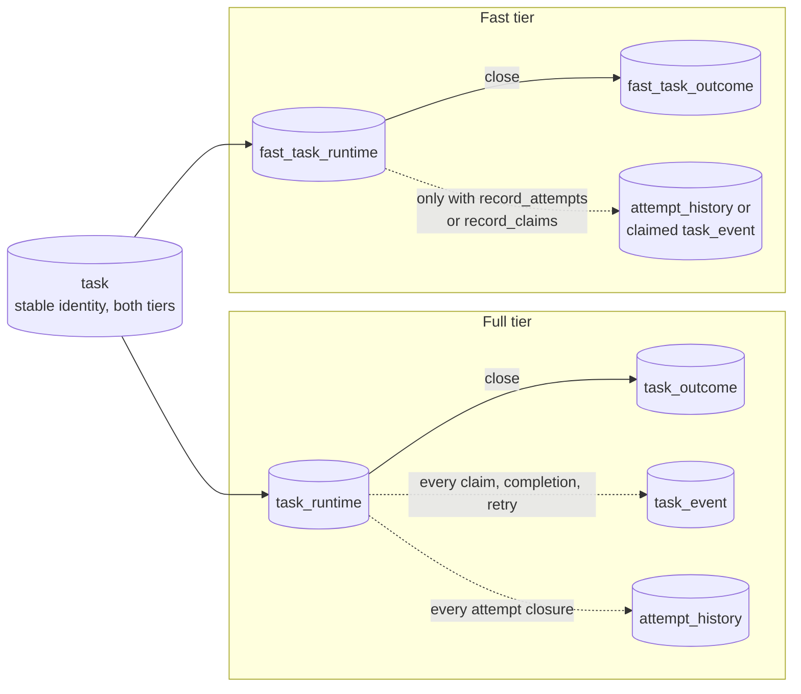

# Workhorse architecture: fast tier

This page is part of the [Workhorse architecture reference](../architecture.md). It owns the fast
task tier: its tables, functions, rejected features, and workers.

## Fast tier

A full-tier task pays for durable execution on every transition:

- Its claim, completion, and retry each write a `task_runtime` change and a `task_event` row.
- Completion and retry also close the attempt into an `attempt_history` row.

A queue whose handlers never use durable execution pays that cost for nothing. The fast tier
removes it. A fast-tier task lives in one `fast_task_runtime` row and closes into one
`fast_task_outcome` row. It writes history only when the queue opts in ([ADR
0077](../decisions/0077-add-a-fast-task-tier-that-records-one-outcome-row-per-task.md)).

The tier belongs to the queue, never to a task or a worker. PostgreSQL routes every transition by
the queue's current tier, so a client calls the same public functions for both tiers.

For every accepted fast-tier task, exactly one of `fast_task_runtime` and `fast_task_outcome` exists
after a committed transition, and neither `task_runtime` nor `task_outcome` exists. The stable
`task` identity row is shared by both tiers.

### Tier and history settings

`queue_control` carries the tier and the opt-in history switches:

| Column            | Definition                                                       |
| ----------------- | ---------------------------------------------------------------- |
| `tier`            | `tier text NOT NULL DEFAULT 'full'`, checked to `fast` or `full` |
| `record_attempts` | `record_attempts boolean NOT NULL DEFAULT false`                 |
| `record_claims`   | `record_claims boolean NOT NULL DEFAULT false`                   |

A queue without a `queue_control` row is full-tier. Every existing queue therefore stays full-tier
after migration 0025. `dashboard_queue_control_v1` exposes `tier`, `record_attempts`, and
`record_claims` beside `paused`.

#### Changing the tier

`set_queue_tier_v1(p_queue_name, p_tier, p_requested_by, p_reason)` changes the tier and returns
the tier now in force. `p_requested_by` contains 1 through 200 characters and `p_reason` 1 through
2,000. The function takes the queue's exclusive tier lock, then:

- returns at once when the tier is unchanged;
- raises `P1007` with feature `tier change` when the queue holds any live task in either runtime
  table, with the message `queue <name> has live tasks, so its tier cannot change`;
- raises `P1007` with feature `concurrency policies` or `rate-limit policies` when moving to `fast`
  while a `concurrency_policy` or `rate_limit_policy` row names the queue;
- otherwise upserts `queue_control.tier`, `updated_by`, `reason`, and `updated_at`.

A queue must therefore be empty to switch tier. Terminal outcomes stay in the table they closed
into, so a switched queue's old tasks stay readable. `set_queue_tier_v1` does not change `paused`
or the history switches.

#### Changing the history switches

`set_queue_history_v1(p_queue_name, p_record_attempts, p_record_claims)` sets the history switches
and returns both. A null argument keeps the current value. The function does not check the tier,
so a full-tier queue may hold settings that take effect once it moves to fast. A change applies to
claims and completions that start after it commits.

- With `record_attempts`, each closed fast-tier attempt writes one `attempt_history` row instead of
  an entry in the row's `errors` list. `started_at` equals `claimed_at`, because a fast-tier attempt
  never suspends.
- With `record_claims`, each fast claim writes one `claimed` `task_event` carrying `worker_id`,
  `fence_token` as text, and `expires_at`.

#### SDK methods

TypeScript exposes `Admin.setQueueTier(queueName, tier, { actor, reason, requestId })` and
`Admin.setQueueHistory(queueName, settings)`. The other SDKs expose the same pair: Python
`Admin.set_queue_tier` and `set_queue_history(queue_name, *, record_attempts=None,
record_claims=None)` returning `QueueHistory`, Go `Admin.SetQueueTier` and `SetQueueHistory` with
`*bool` switches, and Rust `set_queue_tier` and `set_queue_history`.

`Admin.setQueueTier` validates the whole `AdminAudit` and wraps `set_queue_tier_v1`:

- It passes only `actor` and `reason`, so the tier change records no request ID.
- It returns the `QueueTier`.
- It emits the `workhorse.queue.tier_set` log event with `workhorse.queue.tier`.

Every `Admin` method counts `AdminAudit` actor and reason characters in Unicode code points, as
PostgreSQL `char_length` does.

`Admin.setQueueHistory` takes a partial `QueueHistorySettings` (`recordAttempts`, `recordClaims`)
and returns the full settings.

### Tier locking

Tier locks keep a tier change from interleaving with a write that read the old tier.

`lock_queue_tiers_v1(p_queue_names text[])` takes a shared transaction advisory lock on
`'workhorse:queue-tier:' || name` for each distinct queue, in `"C"` collation order. It returns the
names that are fast-tier.

- Enqueue, redrive, child creation, and policy synchronization take these shared locks before they
  read the tier.
- `set_queue_tier_v1` takes the exclusive form of the same lock.

A tier change and an enqueue into that queue therefore serialize, and a tier change never observes a
half-written batch.

### `fast_task_runtime`

One row per live fast-tier task. It copies every field a claim returns, so a claim reads and writes
this table alone. A retry returns the row to `ready`; any close deletes it.

| Column                                                        | Constraint                                                 |
| ------------------------------------------------------------- | ---------------------------------------------------------- |
| `task_id uuid`                                                | Primary key; references `task.id` `ON DELETE CASCADE`      |
| `queue_name`, `task_type`                                     | Non-empty text                                             |
| `state`                                                       | `ready` or `active`                                        |
| `priority integer`                                            | 0 through 100, default 0                                   |
| `run_at timestamptz`, `sequence bigint`                       | Dispatch order; `run_at` is the release time or retry time |
| `payload`, `contract_version`, `redact`, `trace_context`      | Copied from the accepted definition                        |
| `result_max_bytes integer`                                    | 1 through 16,777,216                                       |
| `retry_policy jsonb`, `max_attempts`, `attempt`               | Attempts 1 through 100; `attempt` defaults to 1            |
| `fence_token bigint`                                          | Non-negative, default 0                                    |
| `worker_id`, `claimed_at`, `expires_at`, `attempt_timeout_at` | Set only while active                                      |
| `deadline_at`                                                 | Finite when set                                            |
| `execution_timeout_ms bigint`                                 | 1 through 31,536,000,000                                   |
| `previous_retry_delay_ms bigint`                              | 0 through 31,536,000,000                                   |
| `cancel_requested_at`, `cancel_requested_by`, `cancel_reason` | Actor 1 through 200 characters; reason 1 through 2,000     |
| `errors jsonb`, `errors_dropped integer`                      | JSON array, default `[]`; non-negative count               |
| `enqueued_at timestamptz`                                     | Acceptance time                                            |

#### Row shapes

`fast_task_runtime_state_shape_check` enforces two shapes:

- A `ready` row has null `worker_id`, `claimed_at`, `expires_at`, `attempt_timeout_at`, and
  cancellation fields.
- An `active` row has `worker_id`, `claimed_at`, and `expires_at` set and `fence_token` above 0. Its
  cancellation actor and reason require `cancel_requested_at`.

A ready row with a future `run_at` plays the role of a full-tier `scheduled` row. The tier has no
separate scheduled state and no promotion pass.

#### Indexes

Three partial indexes serve the three scans:

| Index                                  | Key                                                  | Predicate                                       | Serves                                                 |
| -------------------------------------- | ---------------------------------------------------- | ----------------------------------------------- | ------------------------------------------------------ |
| `fast_task_runtime_ready_idx`          | `(queue_name, priority DESC, run_at, sequence)`      | `state = 'ready'`                               | The claim                                              |
| `fast_task_runtime_active_due_idx`     | `least(expires_at, attempt_timeout_at, deadline_at)` | `state = 'active'`                              | Recovery of every overdue active row in one range scan |
| `fast_task_runtime_ready_deadline_idx` | `(deadline_at)`                                      | `state = 'ready'` and `deadline_at IS NOT NULL` | Ready-row deadline recovery                            |

#### What the tier does not keep

The fast tier keeps no heartbeat time, no execution budget across releases, no wait name, and no
scheduled state.

#### The `errors` list

A task's attempt history lives in `errors` unless the queue records attempts. `fast_retry_v1`
appends one entry per closed attempt with these fields:

- `attempt`
- `fence_token` as text
- `worker_id`
- `claimed_at`
- `finished_at`
- `outcome`: `retry`, `timeout`, or `lease_expired`
- `error`

The list holds at most 10 entries. At the cap, `fast_retry_v1` drops the oldest entry and
increments `errors_dropped`, so a reader can tell the list is incomplete.

### `fast_task_outcome`

One row per closed fast-tier task.

| Column                                   | Constraint                                                           |
| ---------------------------------------- | -------------------------------------------------------------------- |
| `task_id uuid`                           | Primary key; references `task.id` `ON DELETE CASCADE`                |
| `queue_name`, `task_type`                | Copied from the runtime row                                          |
| `state`                                  | `succeeded`, `failed`, or `canceled`                                 |
| `attempt integer`                        | At least 1; the final attempt                                        |
| `result jsonb`, `error jsonb`            | Final result or final error                                          |
| `fence_token`, `worker_id`, `claimed_at` | The final claim; `fence_token` above 0 when set                      |
| `enqueued_at`, `finished_at`             | `finished_at` defaults to `clock_timestamp()`                        |
| `errors jsonb`, `errors_dropped`         | Carried over from the runtime row                                    |
| `closed_as text`                         | Null, `canceled`, `deadline_exceeded`, `timeout`, or `lease_expired` |

#### Outcome checks

`fast_task_outcome_claim_check` requires `fence_token`, `worker_id`, and `claimed_at` to be all null
or all set. They are null when the task closed while ready. Examples are a ready cancellation and an
expired deadline before any claim.

`fast_task_outcome_state_shape_check` requires:

- `succeeded`: null `error`, a claim, and null `closed_as`;
- `failed`: a non-null `error`;
- `canceled`: a non-null `error` and `closed_as = 'canceled'`.

`closed_as` names the boundary that closed a task when the handler did not. A handler's own
terminal failure leaves it null.

#### Outcome indexes

- `fast_task_outcome_finished_brin_idx` is a BRIN index on `finished_at` for time-range reads.
- `fast_task_outcome_retention_idx` on `(finished_at, task_id)` serves retention and cold export.

Migration 0025 runs `ANALYZE` on both new tables, so the planner has statistics for them before the
first dashboard read.

### Rejected features and `P1007`

A fast-tier queue supports these features:

- priority, delayed runs, and idempotency keys;
- retry policies, deadlines, and execution timeouts;
- heartbeats and cancellation;
- redrive, pause, purge, and run-now.

It rejects every feature that needs durable execution or per-task coordination state. PostgreSQL
raises the rejection through
`reject_fast_feature_v1(p_queue_name, p_feature, p_ordinal DEFAULT NULL)`:

- SQLSTATE `P1007`;
- message `fast-tier queue <name> does not support <feature>`;
- `DETAIL` JSON `{ queue, feature, ordinal? }`, where `ordinal` names the offending request's
  position in a batch.

| Feature text                                  | Raised by                                                       |
| --------------------------------------------- | --------------------------------------------------------------- |
| `concurrency keys`, `budgets`                 | `enqueue_batch_v1`, and `redrive_v1` into a fast queue          |
| `dependencies`, `prerequisite tasks`          | `enqueue_batch_v1`                                              |
| `debounce`, `throttle`                        | `enqueue_debounce_v1`, `enqueue_throttle_v1`, `enqueue_many_v1` |
| `child tasks`                                 | `create_single_child_v1` and `create_children_v1`               |
| `concurrency policies`, `rate-limit policies` | Policy synchronization and `set_queue_tier_v1`                  |
| `tier change`                                 | `set_queue_tier_v1` while live tasks exist                      |
| `batched completion`                          | `complete_many_and_claim_v1` on a full-tier queue               |

Two rejections differ from that shape:

- A full-tier task that names a fast-tier task as a prerequisite is also rejected. That rejection
  carries `{ feature: "dependencies", taskId, ordinal }` and no `queue` key, because the offending
  queue is the prerequisite's.
- The `batched completion` message is `queue <name> is not a fast-tier queue`.

The full tier has no fused completion call.
[ADR 0077](../decisions/0077-add-a-fast-task-tier-that-records-one-outcome-row-per-task.md#5-the-research-builds-implicit-path-is-not-ported)
measured fused completion only on the fast tier.

#### SDK errors

Every SDK maps `P1007` to one error:

| SDK        | Error                                                         |
| ---------- | ------------------------------------------------------------- |
| TypeScript | `FastTierUnsupportedError(queue, feature, ordinal?)`          |
| Python     | `FastTierUnsupportedError`                                    |
| Go         | `*FastTierUnsupportedError` matching `ErrFastTierUnsupported` |
| Rust       | `Error::FastTierUnsupported { queue, feature, ordinal }`      |

TypeScript raises `FastTierUnsupportedError(queue, feature, ordinal?)
` with the message `Fast-tier queue <queue> does not support <feature>`; `fastTierRejection`
decodes `DETAIL` and falls back to `unknown` for a missing field.

### Fast enqueue

`enqueue_batch_v1` handles fast-tier requests in these steps:

1. It calls `lock_queue_tiers_v1` for the batch's queues.
2. It applies the rejections above.
3. It inserts fast-tier requests set-based: one `INSERT` into `task` and one into
   `fast_task_runtime` for all of them.

It writes no `task_runtime` row and no `enqueued` event. Idempotency keys work as on the full tier.

A request whose deadline has already passed closes at once through `fast_terminalize_deadline_v1`.
The batch notifies `workhorse_tasks` once per ready queue, as a full-tier batch does.

### Fast claim

`claim_one_v1` and `claim_many_v1` branch to `fast_claim_v1(p_queue_name, p_worker_id, p_limit,
p_lease_ms, p_record_claims)` when the queue is fast-tier. A paused queue claims nothing.

The claim selects ready rows whose `run_at` has arrived and whose deadline has not passed,
in `priority DESC,
run_at, sequence` order with `FOR UPDATE SKIP LOCKED`. It takes each fence from `fence_token_seq`.
It sets `expires_at` from the lease and `attempt_timeout_at` from `execution_timeout_ms`.

The timeout restarts on every claim, because the tier keeps no execution budget.

`fast_claim_v1` picks one of two statements, so a queue that does not record claims pays for no
`task_event` write.

#### Lock waits and deadlock avoidance

`FOR UPDATE SKIP LOCKED` skips a row that another transaction holds, but it can still wait. The
deadlock arises in these steps:

1. The claim locks a candidate whose ready version another worker has just leased and committed.
2. PostgreSQL follows the update chain and waits there without a wait policy.
3. The recheck of `state = 'ready'` then rejects the row, but the claim keeps its lock on it until
   the transaction ends.
4. The owning worker's `fast_complete_many_v1` pre-lock or its `fast_heartbeat_many_v1` round can
   wait on that lock while the claim waits on the owner.

In that cycle, PostgreSQL rolled one statement back with SQLSTATE `40P01` (SM-934).

`fast_claim_v1` therefore guards its claim:

- It runs with `SET lock_timeout = '50ms'`.
- It runs its claim inside a PL/pgSQL `BEGIN ... EXCEPTION WHEN lock_not_available` block.
- A lock wait that reaches 50 ms raises SQLSTATE `55P03`. That rolls the block's subtransaction
  back, releases every row lock the claim took, and returns no rows.
- The function-level `SET` restores the caller's `lock_timeout` on exit, so the timeout covers only
  the claim.
- The claim collects its rows into an array before it returns any, because a set-returning function
  cannot withdraw a row it has returned.

In `complete_many_and_claim_v1` the completion is outside that block and still commits.

The timeout is far below PostgreSQL's default `deadlock_timeout` of 1 s, so the claim leaves the
cycle before the deadlock detector runs. A server whose `deadlock_timeout` is below 50 ms can still
detect the cycle first.

Migration `0040-release-a-fused-claim-lock-before-it-can-deadlock.sql` (schema 39) replaced
`fast_claim_v1` in place. A claim that returns fewer rows than its limit stays within its contract.
[ADR 0081](../decisions/0081-release-a-fused-claim-lock-before-it-can-deadlock.md) records the
choice and its measurement.

#### Delayed rows in the ready index

A delayed row stays in `fast_task_runtime_ready_idx`, and `run_at <= now` is an index condition, not
a bound on the scan. The claim therefore reads past every delayed row whose priority is above the
highest due row. When nothing is due, it reads past the whole queue's backlog.

- On PostgreSQL 18 a btree skip scan makes one index descent per such priority, so the read is
  bounded by the 101 priorities.
- PostgreSQL 15 through 17 have no skip scan and read every such entry.

`pnpm benchmark:fast-claim-backlog` measured a million delayed rows above the due work
([analysis](../benchmarks/2026-09-27-fast-claim-backlog-analysis.md)):

| PostgreSQL | Claim cost                                  |
| ---------- | ------------------------------------------- |
| 18         | 0.07 ms added                               |
| 17         | 30 ms, against about 0.4 ms for its control |
| 15         | 43 ms, against about 0.4 ms for its control |

[ADR 0080](../decisions/0080-keep-delayed-fast-tier-tasks-in-the-ready-index.md) keeps delayed
rows in the ready index.

### Completion and fused completion

`complete_v1` branches to `fast_complete_v1`, which calls `fast_complete_many_v1(p_worker_id,
p_task_ids, p_fence_tokens, p_results)` with one task.

#### Batch completion

`fast_complete_many_v1` completes a batch in one statement:

- a fenced `DELETE` from `fast_task_runtime`;
- one `fast_task_outcome` insert;
- one `attempt_history` insert per task when the queue records attempts.

It returns the accepted task IDs. It leaves an attempt alone, and out of the result, when the
attempt's fence, worker, lease, deadline, or attempt timeout no longer matches. It does the same
when the attempt carries a pending cancellation.

Implementation details:

- The `DELETE` finds each row by primary key and has no `state` predicate, because
  `fast_task_runtime_state_shape_check` gives a ready row a null `worker_id`.
- The function runs with `plan_cache_mode = force_generic_plan`, so PL/pgSQL does not build a
  custom plan for the statement on every call.
- The history insert joins `queue_control` on `record_attempts` instead of calling
  `fast_records_attempts_v1` per completed row.

#### Oversized results

An oversized result fails only its own attempt. After taking its locks, `fast_complete_many_v1`
handles oversized results in these steps:

1. It selects each input whose `octet_length(COALESCE(result, 'null')::text)` exceeds the row's
   `result_max_bytes`.
2. It passes each one, in task ID order, to `fast_fail_v1` with a null retry delay and the error
   `{"name": "TaskValueSizeLimitError", "message": "<task_type> result exceeds its configured size
limit", "stack": null}`.
3. The task's retry policy then schedules another attempt or finishes it as failed.
4. The function leaves those tasks out of the returned IDs.
5. Since migration 0060 (schema version 59), it then reads the clock again
   ([Clock sample after the lock](#clock-sample-after-the-lock)). It completes each other member
   whose lease, deadline, and attempt timeout are still live at that reading.

`complete_many_and_claim_v1` still runs its claim.

The blast radius therefore differs by tier:

- On the full tier, `complete_v1` raises for an oversized result, and the caller's statement or
  transaction rolls back.
- On the fast tier, a batch of completions and its fused claim survive one oversized row.
- `fast_complete_v1` keeps the full tier's behavior: it raises for one oversized result before it
  calls `fast_complete_many_v1`.

The TypeScript, Go, Python, Ruby, and Rust workers measure results before they call, so they reach
this path only through a bug.

#### Lock order

Completion and heartbeat lock rows in one shared order:

- Before the `DELETE`, `fast_complete_many_v1` locks the caller's rows with `SELECT ... ORDER BY
task_id FOR UPDATE`, filtered on `task_id = ANY (p_task_ids)` and `worker_id = p_worker_id`.
- `fast_heartbeat_many_v1` takes `FOR NO KEY UPDATE` locks in the same order before its `UPDATE`.
- The full-tier `heartbeat_many_v1` branch takes the same ordered `FOR NO KEY UPDATE` lock on
  `task_runtime` before its `UPDATE`.

The `DELETE` plan locks rows in input order. The heartbeat plan can lock them in
`fast_task_runtime_active_due_idx` order. Without the shared order, a worker's completion and its
own heartbeat round could each hold a row the other waits for. PostgreSQL rolled one back with
SQLSTATE `40P01`. The fused claim held the completion's locks longer and made that more likely.

A caller may therefore name its tasks and leases in any order.

#### Clock sample after the lock

Since migration 0051 (schema version 50), a completion or heartbeat that waited for a row lock
checks expiry against a clock sample taken after that lock.

- A lease that expired during the wait is rejected rather than accepted or renewed.
- An accepted completion records the post-lock time as `finished_at`.
- A renewal counts from the post-lock time.

Recovery and reclaim skip locked rows and change the fence, so the earlier pre-lock time could not
duplicate or lose a task.

`fast_complete_many_v1`, `fast_heartbeat_many_v1`, and the single-tier paths of
`heartbeat_many_v1` sample `clock_timestamp()` after every row lock of the call is held, not before
the first. In such a batch, a lease that was live when its own row was locked is still rejected if it
expired while the call waited for a later row. A mixed-tier `heartbeat_many_v1` batch validates each
lease separately, as the next section describes.

Since migration 0060 (schema version 59), `fast_complete_many_v1` samples the clock a second time.
That sample follows the oversized failures and precedes the completion `DELETE`.
Failing one writes an outcome row, and that write can wait, for example behind partition
maintenance. The `DELETE` and `finished_at` use the later sample, so a member whose lease expired
during that wait is rejected.

Since the same migration, `fast_acknowledge_cancel_v1` checks the lease after its row lock, as
`acknowledge_cancel_v1` does on the full tier. It used to filter on `expires_at` in the locking
`SELECT`. Another transaction can hold the row lock without changing the row. PostgreSQL then
does not evaluate that filter again after the wait. A lease that expired during the wait was
therefore still accepted.

#### Heartbeat batch routing

`heartbeat_many_v1` routes a batch by the tiers it names:

| Batch names                                                    | Path                                                                         |
| -------------------------------------------------------------- | ---------------------------------------------------------------------------- |
| At least one `fast_task_runtime` row and no `task_runtime` row | `fast_heartbeat_many_v1`                                                     |
| No fast-tier task                                              | The full-tier `UPDATE ... FROM`, unchanged                                   |
| Both tiers                                                     | `heartbeat_v1` once per lease in `task_id` order; rows return in input order |

A named task in neither table counts as neither. A heartbeat round that races its worker's own
completion therefore keeps the ordered path and reports that task `stale`.

In a mixed batch, each `heartbeat_v1` call samples the clock after its own row lock. The sample of
one lease follows only the locks of the leases before it. An earlier lease can therefore
be accepted before the call waits for a later lease's lock.

#### `complete_many_and_claim_v1`

`complete_many_and_claim_v1(p_worker_id, p_task_ids, p_fence_tokens, p_results, p_queue_name,
p_limit, p_lease_ms)` completes up to 100 tasks and claims up to `p_limit` more from one fast-tier
queue in one round trip.

| Parameter    | Range                                  |
| ------------ | -------------------------------------- |
| `p_limit`    | 0 through 100                          |
| `p_lease_ms` | 100 through 86,400,000, default 30,000 |

- The first row carries `accepted uuid[]`; claimed tasks follow in claim order.
- A call that claims nothing returns one row with null claim columns.
- A paused queue completes but claims nothing.
- For a full-tier queue, the function raises `P1007` with feature `batched completion`.

#### TypeScript `Queue` methods

`Queue.completeAndClaim(task, workerId, result, { queue, limit, leaseMs? })` returns
`CompletionClaimResult { accepted, claimed }`. Concurrent calls from one worker for one queue and
lease fuse into one statement at `setImmediate`. The fused statement is chunked at 100 completions
and a total claim limit of 100.

`Queue.claimFast(workerId, limit, { queue?, leaseMs? })` claims through the same function with
empty arrays. It rejects with `FastTierUnsupportedError` for a full-tier queue.

When PostgreSQL rolls the statement back with SQLSTATE `40P01`, `completeManyAndClaim` sends it
again through `queryFencedWrite`. It tries up to `FENCED_WRITE_DEADLOCK_ATTEMPTS` (3) times in
total, because nothing in it committed.

Since schema 39 the fused claim leaves a lock wait before it can deadlock
([Fast claim](#fast-claim)). The Go, Python, Rust, and TypeScript workers therefore keep this resend
only as a safety net. It still covers:

- a server whose `deadlock_timeout` is below the claim's `lock_timeout`;
- a cycle through the completion half of the statement;
- the settlement cascades that every fenced write shares
  ([`task_dependency`](data-model.md#task_dependency)).

### Retry, timeout, heartbeat, and release

`fail_v1`, `timeout_owned_v1`, `expire_owned_v1`, `heartbeat_v1`, `heartbeat_many_v1`,
`release_owned_v1`, and `acknowledge_cancel_v1` branch to their fast-tier helpers:

- `fast_fail_v1(task, worker, fence, error, retry_delay_ms)` redacts the error and either retries
  through the PostgreSQL delay selector and `fast_retry_v1`, or closes the task `failed` with null
  `closed_as`. It returns the next state.
- `fast_timeout_owned_v1` retries with outcome `timeout`, or closes `failed` with
  `closed_as = 'timeout'`.
- `fast_expire_owned_v1` returns `stale`, `cancel_requested`, `deadline_exceeded`,
  `timeout_exceeded`, or `not_due`.
- `fast_heartbeat_many_v1(worker, ids, fences, lease_ms)` returns `(ordinal, task_id, status)` and
  moves only `expires_at`.
- `fast_release_owned_v1` returns the row to `ready` without consuming the attempt, notifies
  `workhorse_tasks`, and writes no `released` event.
- `fast_acknowledge_cancel_v1` closes the task `canceled`.

`fast_retry_v1` changes the runtime row:

- It resets the claim columns and increments `attempt`.
- It stores the next jitter state.
- It sets `run_at` to the end of the retry delay and takes a new `sequence`.
- It notifies `workhorse_tasks` only when the delay is zero.

### Fast cancellation

`cancel_v1` branches to `fast_cancel_v1(task, requested_by, reason)`, which returns `(status, state,
current_attempt, requested_at, requested_by, reason, finished_at)`.

- A ready row closes at once as `canceled`.
- An active row records the request once and stays with its worker. The worker acknowledges it, or
  recovery closes it when the lease lapses.

### Fast recovery

`recover_expired_v1` calls `fast_recover_expired_v1(limit, retry_delay_ms, now)` with its remaining
budget. It returns `recovered`, `expired_leases`, `retried`, `retry_dimensions`, and `queues`, which
`recover_expired_v1` adds to its full-tier counts.

`fast_recover_expired_v1` reads ready rows past their deadline through
`fast_task_runtime_ready_deadline_idx`, and active rows past `least(expires_at, attempt_timeout_at,
deadline_at)` through one range scan of `fast_task_runtime_active_due_idx`, both with `SKIP LOCKED`.

| Cause                                    | Result                                                                                               |
| ---------------------------------------- | ---------------------------------------------------------------------------------------------------- |
| Deadline                                 | Closes `failed` with `closed_as = 'deadline_exceeded'`, or `canceled` when a cancellation is pending |
| Attempt timeout                          | Retries with outcome `timeout`, or closes with `closed_as = 'timeout'`                               |
| Lapsed lease with a pending cancellation | Closes `canceled`                                                                                    |
| Any other lapsed lease                   | Retries with outcome `lease_expired`, or closes `failed` with `closed_as = 'lease_expired'`          |

A lapsed lease's error is `{ name: "LeaseExpired", message: "worker lease
expired" }`.

### Operator operations

- `run_task_now_v1` moves a delayed fast-tier row's `run_at` to now.
- `purge_queue_internal_v1` deletes ready fast-tier rows by deleting their `task` identities, which
  cascades.
- `list_dead_letters_v1` lists failed rows from `fast_task_outcome`.
- `redrive_v1` and `redrive_many_v1` accept those rows as sources. A redrive copies the task into
  its queue's current tier, not the tier it closed in.
- `Admin.getTask`, `list_tasks_v1`, and `list_task_timeline_v1` include both fast tables.

### Fast retention and cold export

#### Retention

`prune_terminal_tasks_v1(p_identity_before, p_outcome_before, p_history_before, p_limit)` splits
`p_limit` between the full and fast tiers. The tier that goes first gets half of it, rounded up, and
alternates on every call. A share that one tier cannot use goes to the other tier, so neither tier's
backlog starves the other. A fast outcome is deletable when:

- `finished_at` is earlier than `p_outcome_before`;
- `finished_at` is earlier than the fast history cutoff, which is `p_history_before`, clamped to
  the `fast_task_outcome` dataset's `exported_through` while cold export is enabled, or to
  `2000-01-01 UTC` when that dataset row is missing;
- the `task` identity's `created_at` is earlier than `p_identity_before`;
- no `task_event`, `attempt_history`, `schedule_occurrence`, `enqueue_idempotency`, or
  `task_redrive` row references the task.

The pass reads in `(finished_at, task_id)` order with `FOR UPDATE OF task SKIP LOCKED`. It deletes
the `task` identity, which cascades to the outcome.

#### Cold export

Cold export has a third dataset, `fast_task_outcome`, admitted by the `cold_export_dataset` and
`cold_export_segment` checks.

- Its oldest day is the UTC day of `min(finished_at)`.
- `read_cold_export_rows_v1` returns `(finished_at, task_id, to_jsonb(outcome))` for it, keyed on
  `(finished_at, task_id)`.
- `ColdExportDataset` is `"task_event" | "attempt_history" | "fast_task_outcome"`.

### Fast read models

The dashboard views union both tiers, so a fast-tier task appears with the same columns as a
full-tier one.

- `dashboard_task_runtime_v1` shows a ready row with a future `run_at` as `scheduled`. It reports
  null `heartbeat_at` and the last `errors` entry as `error`.
- `dashboard_task_outcome_v1` reports `run_at` as `COALESCE(claimed_at, enqueued_at)`.
- `dashboard_attempt_history_v1` derives one row per `errors` entry and one for the final attempt,
  with `attempt_id` `md5(task_id || ':' || attempt || ':attempt')`. It skips an attempt that already
  has a recorded `attempt_history` row.
- `dashboard_task_event_v1` derives an `enqueued` event with details `{ tier: "fast" }`, a `claimed`
  event unless a recorded one exists, and a terminal event named `COALESCE(closed_as, state)`.
- `dashboard_task_result_v1` reads the result from either outcome table.

`queue_health_v1` includes fast-tier rows:

- It counts live fast-tier rows in its state counts and its deadline and timeout pressure.
- It reports a delayed ready row as `scheduled`.
- It unions fast outcomes into its terminal counts under the same scan cap.
- A fast outcome's `history_through_at` is its `finished_at`.

`aggregate_stats_v1` derives the enqueue, attempt, and terminal counts of fast-tier tasks from the
two fast tables, because they write no events.

### Workers on a fast-tier queue

#### Tier probe

A worker does not configure the tier. Each SDK worker probes a queue with a fast claim through
`complete_many_and_claim_v1`. A `P1007` answer marks the queue full-tier for 30 seconds. The worker
then claims through `claim_many_v1` until the next probe.

| SDK        | Probe interval constant        |
| ---------- | ------------------------------ |
| TypeScript | `TIER_PROBE_INTERVAL_MS`       |
| Python     | `_TIER_PROBE_INTERVAL_SECONDS` |
| Go         | `fastTierProbeInterval`        |
| Rust, Ruby | `TIER_PROBE_INTERVAL`          |

A stale belief is safe, because PostgreSQL routes each claim by the current tier.

#### Fused completion

A fast-tier completion uses the fused statement. A `batched completion` rejection means the queue
left the fast tier, so the worker falls back to `complete_v1`.

Every SDK worker fuses a completion with a refill claim, for `freeSlots() + 1` tasks under the
refill-batch rule, and hands the slot over directly.

#### Dispatch cohorts

Every SDK worker splits its slots into cohorts so that fused completions do not run in lockstep
([ADR 0076](../decisions/0076-keep-overlapping-batched-claims-in-flight-to-fill-worker-slots.md#cohorts-for-batched-completions)).

The default cohort count comes from `defaultDispatchCohorts(concurrency, spareConnections)`:

- 1 below concurrency 8;
- otherwise `ceil(concurrency / 8)` clamped to 2 through 8;
- then capped at the spare connections, and never below 1.

Cohort `i` owns `floor(concurrency / cohorts)` slots, plus one when `i < concurrency % cohorts`.

Each SDK computes its spare connections from its own pool settings.

#### TypeScript worker

`WorkerOptions.cohorts` is a safe integer from 1 through `concurrency`. Without it,
`defaultDispatchCohorts` applies the default above.

The cap applies only when the queue's database is itself a pool with a positive `options.max`:

- `Queue[workerStatementPoolCapacity]()` reports that size.
- `spareConnections` is `max` minus 1 for the listener when `supportsTaskNotifications()` holds,
  minus 1 for the heartbeat connection unless `sharedHeartbeats` is true.
- Pools of 3, 4, 6 and 10 connections give a concurrency-64 worker 1, 2, 4 and 8 cohorts.

A database with an attached pool, such as a Prisma or Kysely adapter, runs statements outside that
pool, so its default is not capped. An explicit `cohorts` is never capped.

`ClaimLeaseFenceModule` batches concurrent completions by worker, queue, lease, and
`CompletionClaim.cohort`, so a batch never spans cohorts.

- A fused claim asks for at most its cohort's free slots, and the tasks it leases join that cohort.
- While no claim is in flight, a plain claim fills the cohort with the most free slots.
- The first claim asks for one cohort's share.
- While any configured queue answers full-tier, the worker ignores cohorts and dispatches as one
  group.

#### Python worker

`Worker(cohorts=...)` takes an integer from 1 through `concurrency`.
`_dispatch_cohorts(concurrency, spare_connections)` applies the same default.

`spare_connections` is the pool's `max_size`, or its `get_max_size()`, minus 1 for the listener,
minus 1 for the heartbeat connection unless `shared_heartbeats` is true. A pool whose size is
unknown leaves the default uncapped.

Fused completion works in these steps:

1. `Worker._reserve_completion_claim` reserves the refill slots.
2. `Worker._send_batched_completion` sends one statement per queue and cohort at a time.
3. Completions that arrive while it is in flight share the next statement. It is split into chunks
   of at most 100 tasks and 100 claimed slots.
4. `Worker._send_completion_chunk` names each chunk's tasks in task ID order.

When PostgreSQL rolls the chunk back with SQLSTATE `40P01`, `fenced_write_rows` sends the chunk
again. It tries up to `FENCED_WRITE_DEADLOCK_ATTEMPTS` (3) times in total, because nothing in it
committed.

#### Go worker

The Go worker splits its slots the same way.

- `WorkerOptions.Cohorts` is an integer from 1 through `Concurrency`.
- `NewWorker` rejects any other explicit value with `worker cohorts must be between
1 and the concurrency`. Zero selects `defaultDispatchCohorts(concurrency, spareConnections)`,
  which uses the TypeScript rule.
- `spareConnections` is the pool's `MaxConns`, minus 1 for the listener unless `PollingOnly` is
  set, minus 1 for the heartbeat connection unless `SharedHeartbeats` is set.
- An explicit `Cohorts` is never capped.

The worker's `completionBatcher` groups concurrent fast-tier completions by queue and cohort. It
keeps one `complete_many_and_claim_v1` call in flight per group.

- A call carries at most `completionBatchLimit` (100) completions, and its claim limits sum to at
  most 100.
- The fused claim limit is the free slots plus one, capped by the free slots of the completing
  task's cohort plus one.
- The call names its tasks in task ID order, and `heartbeat_many_v1` names its leases in the same
  order.

The fused claim releases a lock it would otherwise keep on a candidate another worker leased first
([Fast claim](#fast-claim)). When PostgreSQL still rolls a statement back with SQLSTATE `40P01`,
`queryFencedWrite` sends it again, up to `fencedWriteDeadlockAttempts` (3) times in total.

#### Rust worker

The Rust worker follows the same rules.

- `WorkerOptions::cohorts` is an `Option<usize>`.
- A value outside 1 through `concurrency` fails with
  `worker cohorts must be between 1 and concurrency`.
- An explicit value is never capped.
- Its `default_cohorts` caps the default at the pool's `max_size`, minus 1 for the heartbeat
  connection unless `shared_heartbeats` is true. Its listener opens a connection outside the pool.
- The fused claim limit follows the Go rule.

`Inner::complete_batched` sends the completions of one queue and cohort that finish in the same
scheduler turn as one `complete_many_and_claim_v1` statement of at most 100 completions.

- When that statement raises `FastTierUnsupported`, each completion falls back to `complete_v1`.
- The worker sorts each statement's task ids.
- When PostgreSQL still rolls a statement back with SQLSTATE `40P01`, `fenced_rows` sends it again,
  up to `FENCED_WRITE_DEADLOCK_ATTEMPTS` (3) times in total, because nothing in it committed.

#### Ruby worker

The Ruby worker follows the Python rules.

- `Worker.new(cohorts:)` takes an Integer from 1 through `concurrency` and raises `ArgumentError`
  otherwise. An explicit value is never capped.
- Without it, `dispatch_cohorts` applies the TypeScript default. It caps the default at the pool's
  Integer `size`, minus 1 for the listener, minus 1 for the heartbeat connection unless
  `shared_heartbeats` is true, and never below 1.
- A pool without an Integer `size` leaves the default uncapped.
- `DispatchSlots` splits the slots as TypeScript does.

Claims and fused completion work as follows:

- `reserve_claim` plans a plain claim and reserves its slots under one `@state_lock` hold, so a
  fused claim cannot reserve the same slots in between.
- `reserve_completion_claim` asks for the free slots of the completing task's cohort plus one.
- `send_batched_completion` keeps one `complete_many_and_claim_v1` statement in flight per queue and
  cohort.
- Completions that arrive meanwhile share the next statement. It is split into chunks of at most
  `COMPLETION_BATCH_LIMIT` (100) tasks and 100 claimed slots.
- `send_completion_chunk` names each chunk's tasks in task ID order.
- When PostgreSQL rolls a chunk back with SQLSTATE `40P01`, `fenced_rows` sends it again, up to
  `FENCED_WRITE_DEADLOCK_ATTEMPTS` (3) times in total.
- A chunk that raises `FastTierUnsupportedError` completes each task through `complete_v1`.

#### Handler context rejections

A fast-tier handler context rejects durable execution locally with `FastTierUnsupportedError` for
the task's queue:

| Call                                        | Feature text    |
| ------------------------------------------- | --------------- |
| `setProgress`                               | `progress`      |
| `checkpoint`                                | `checkpoints`   |
| `sleep`, `sleepUntil`                       | `durable waits` |
| `waitForSignal`                             | `signal waits`  |
| `waitForHuman`                              | `human waits`   |
| `runChild`, `runChildren`, `runChildrenAll` | `child tasks`   |

The rejection is a handler failure, so the attempt follows the task's retry policy.

#### Ruby argument validation order

The Ruby `HandlerContext` rejects its snake_case counterparts with the same feature text, before any
durable write.

Only step names, and a child set's type, size, and name uniqueness, are validated first:

- An invalid checkpoint, wait, signal, human wait, or child name raises `ArgumentError` before a
  block runs or any statement reaches PostgreSQL, including the deferred tier read.
- `run_children` and `run_children_all` check the set before its names.
- A set that is not an Array of `ChildTaskRequest` raises `ArgumentError`.
- A set of more than 100 children raises `LimitExceededError`.
- Repeated child names raise `ArgumentError`, also before the tier check.

Every other argument is validated after the tier check. That includes a checkpoint's block, a
sleep's duration or time, a wait's timeout, and a human wait's context.

`get_checkpoint` and `get_progress` stay reads and still answer. A Ruby batch member's
`BatchHandlerContext` delegates to its `HandlerContext`, so its `checkpoint` and `set_progress`
raise the same error before any durable write.

#### Deferred tier read after a full-tier claim

A queue can move to the fast tier while the Ruby or TypeScript worker still claims it through
`claim_many_v1`. That statement then returns fast-tier tasks with no tier marker. The deferred tier
read lets the handler context reject durable calls for those tasks.

In Ruby, `Worker#track_full_tier_claim` gives the tasks of a non-empty `claim_many_v1` result one
shared, deferred tier read.

- The first durable call of any of those handlers runs it through the internal `queue_control`
  statement.
- Both the claim and the `HandlerContext` cache the answer.
- On `tier = 'fast'` the call raises `FastTierUnsupportedError` and the worker ends the probe
  interval.

`set_queue_tier_v1` refuses a queue with live tasks, so one read holds for every task of the claim.

The TypeScript worker does the same:

- `Worker.trackFullTierClaim` gives the tasks of a non-empty `claim_many_v1` result one shared tier
  read, which caches only an answer.
- `createHandlerContext` awaits that read at the start of each call in the table, before any read,
  write, or callback.
- The read reaches `QueueAdministration.queueTier` through the internal `workerQueueTierRead`
  capability.
- A batch member's context comes from the same `createHandlerContext`, so its `checkpoint` and
  `setProgress` reject the same way.

The read runs inside the handler, where the heartbeat already renews the lease.

- A slow read therefore cannot expire a lease that `claim_many_v1` committed.
- A failed read is not cached. It raises from the durable call before any durable write, and the
  next durable call retries it.
- A handler that makes no durable call never reads the tier, and its task completes through
  `complete_v1` or `fail_v1`.
