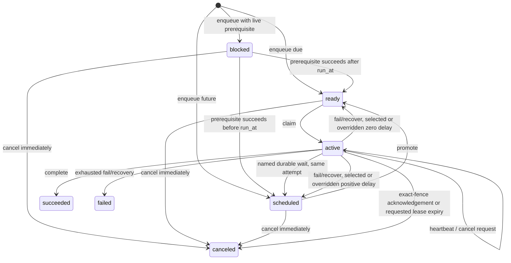
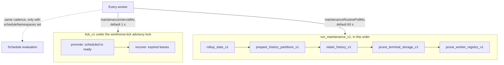
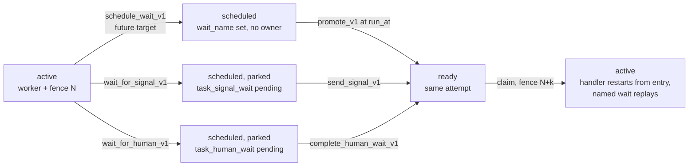
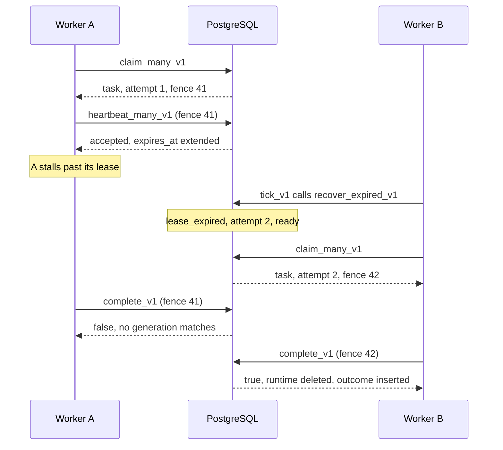

# Workhorse architecture: task lifecycle

This page is part of the [Workhorse architecture reference](../architecture.md). It owns the atomic
lifecycle transitions from enqueue to terminal outcome, delivery semantics, and the read models and
health snapshot.

## Atomic lifecycle

### Enqueue

#### Batch validation

- A batch holds at most 1,000 requests.
- `enqueue_batch_v1` parses and validates every request against one timestamp.
- A request may carry an optional priority, persisted retry policies, and up to 100 dependency
  identities.
- Priority defaults to 0 and must be an integer from 0 through 100.
- Any invalid member rolls back the entire batch.

`enqueue_batch_v1` returns `(ordinal, task_id, accepted)` for each input. `accepted` is true only
when the statement created the durable task. Input ordinality controls returned IDs and ready
sequence allocation.

When a batch has more than one invalid member, these rules pick the reported one:

- The request loop reports the first member it rejects in input order.
- The loop runs before the edge insert, so a loop rejection wins over a dependency bound.
- Each bound check names the lowest task identity that exceeds it, whatever the input order.

#### Batch write order

One `enqueue_batch_v1` call writes `task`, optional `task_dependency` edges, `task_runtime` or a
policy-selected terminal outcome, and acceptance events in the caller's transaction.

The loop over requests writes no full-tier task row. For each new full-tier request it:

1. Validates the request.
2. Locks and reads its prerequisites.
3. Settles its idempotency key.
4. Buffers its `task` row, `task_runtime` row, `task_dependency` edges, and `enqueued` event
   details.

After the last request, `enqueue_batch_v1`:

1. Writes `task`, then `task_runtime`, then all edges together with their `dependency_blocked` or
   `dependency_released` events. Each write is one statement in input order.
2. Passes every distinct terminal prerequisite to one `resolve_dependents_many_v1` call in identity
   order.
3. Inserts the `enqueued` events in input order.
4. Calls `terminalize_deadline_v1` for each task whose deadline has already passed.

Each blocked runtime stores in `pending_prerequisites` the number of edges `enqueue_batch_v1`
inserts pending. That is every prerequisite without an outcome plus every terminal prerequisite
whose policy rejects. The key-share locks it holds on the prerequisites keep that count exact
against a concurrent terminal transition.

Each task therefore keeps the event order that one-row writes produced; only the interleaving
between tasks changes. The buffer never hides a prerequisite. The batch generates every new task
identity, and a caller can name only a task that existed before the batch.

Commit-delivered `NOTIFY workhorse_tasks` is coalesced to one notification per distinct queue that
gained ready work.

#### Enqueue results

`enqueue_many_v1` preserves the `enqueue_batch_v1` contract and returns
`(ordinal, task_id, outcome, reason)`. Ordinary requests map `accepted` to `accepted` or `replayed`
and return a null `reason`.

A batch containing `debounce` or `throttle` requests locks every scoped idempotency, debounce, or
throttle key in bytewise order. It does so before processing requests in caller order. This keeps
mixed batches atomic and prevents overlapping batches from reversing key-lock order.

`Queue.enqueueWithResult` and `Queue.enqueueManyWithResults` expose the discriminated
`EnqueueResult` union:

- Its `outcome` is `accepted`, `replayed`, `replaced`, `non_replaceable`, or `coalesced`.
- Only `non_replaceable` carries `reason`.
- That `EnqueueNonReplaceableReason` is `incompatible_key_mode`, `not_pending`, or
  `window_elapsed_pending`.

`Queue.enqueue` and `Queue.enqueueMany` preserve their string-ID return values by projecting the
same structured results.

#### Keyed ingress modes

Each keyed mode has one contract:

- Idempotency replays one materially equivalent request and rejects a conflicting reuse.
- Debounce replaces one pending definition while arrivals continue.
- Throttle reuses one accepted identity without changing it.

These contracts serialize acceptance in PostgreSQL, but they do not make handler effects exactly
once. A handler can repeat after a lost lease or process failure. External effects therefore still
require their own idempotency boundary.

ADR 0031 keeps these keyed ingress modes mutually exclusive. The `EnqueueOptions` union rejects
invalid combinations during TypeScript compilation. PostgreSQL rejects malformed direct requests.
Their shared ownership table, hash, and lock ordering do not collapse `replayed`, `replaced`,
`non_replaceable`, and `coalesced` into one outcome.

#### Keyed debounce

`EnqueueOptions.debounce` contains these fields:

| Field      | Constraint                                                      |
| ---------- | --------------------------------------------------------------- |
| `key`      | At most 512 UTF-8 bytes, the idempotency key limit.             |
| `scope`    | Optional. At most 256 UTF-8 bytes, the idempotency scope limit. |
| `windowMs` | An integer from 1 through 31,536,000,000 (365 days).            |
| `schedule` | `reset` or `preserve`.                                          |

A request with `debounce` cannot also supply `idempotency`, `runAt`, `prerequisiteTaskId`, or
`dependencies`. `Queue.enqueueManyWithResults` rejects these combinations before querying
PostgreSQL. `enqueue_debounce_v1` rejects them for direct SQL callers. PostgreSQL derives the
initial run time from `clock_timestamp() + windowMs`.

`enqueue_debounce_v1` hashes the scoped key and takes the same transaction advisory lock as enqueue
idempotency. It stores `coalescing_mode = 'debounce'` on `enqueue_idempotency` and never persists
the raw key. A new key creates one scheduled task through `enqueue_batch_v1` and returns `accepted`.

##### Replacement

PostgreSQL replaces a pending definition only when the retained runtime meets all of these:

- It is `scheduled` or `ready`.
- It has a null `attempt_started_at` and `wait_name`.
- It is on `current_attempt = 1`.
- The key window is still active.

PostgreSQL validates the replacement through `enqueue_batch_v1`. It then updates the accepted task
definition and runtime atomically. The stable task ID and current attempt remain unchanged.

- `reset` derives a new run time and key expiry from the statement clock.
- `preserve` retains both.

A `debounced` event records the safe key preview, the first 12 hexadecimal key-digest characters,
the schedule policy, window, expiry, prior request digest, and replacement request digest.

##### Rejection

These retained states return `non_replaceable` with the retained task ID:

- an active runtime;
- a started or waiting runtime;
- a terminal outcome;
- an incompatible idempotency key;
- an elapsed-but-still-pending runtime.

A `scheduled` or `ready` runtime counts as started in either case below. Its reason is
`not_pending`.

- `attempt_started_at` or `wait_name` is set.
- `current_attempt` exceeds 1 after a retry.

`enqueue_many_v1` also returns `not_pending`, `incompatible_key_mode`, or `window_elapsed_pending`
as its reason. PostgreSQL discards the new request's payload and leaves the accepted definition
unchanged. It appends `debounce_rejected` with the same bounded reason.

##### Fresh acceptance

- If the key window elapsed after the old task became active or terminal, a new pending identity can
  be accepted.
- Queue purge removes the key before the task identity, so a purged key can also accept fresh work.
- `run_task_now_v1` deletes a released task's debounce identity, so the next same-key request is
  `accepted` as a new task.

These rules preserve one runtime or outcome for every accepted identity. They also prevent promotion
lag from creating two pending tasks for one elapsed key.

#### Keyed throttle

`EnqueueOptions.throttle` contains these fields:

| Field      | Constraint                                                      |
| ---------- | --------------------------------------------------------------- |
| `key`      | At most 512 UTF-8 bytes, the idempotency key limit.             |
| `scope`    | Optional. At most 256 UTF-8 bytes, the idempotency scope limit. |
| `windowMs` | An integer from 1 through 31,536,000,000 (365 days).            |

A request cannot combine `throttle` with `idempotency`, `debounce`, `prerequisiteTaskId`, or
`dependencies`. `Queue.enqueueManyWithResults` and `enqueue_throttle_v1` enforce the dependency
exclusions. A throttled request may supply `runAt`; explicit scheduling remains material to request
equivalence.

`enqueue_throttle_v1` hashes the scoped key and takes the shared transaction advisory lock. It
converts the throttle window into the `enqueue_batch_v1` idempotency retention contract. PostgreSQL
stores `coalescing_mode = 'throttle'` and derives expiry from `clock_timestamp() + windowMs`.

##### First request

The first request returns `accepted`. Its `enqueued` event adds `details.throttle`, which contains:

- `scope`;
- the first 12 hexadecimal key-digest characters;
- `key_length`;
- `window_ms`;
- `expires_at`.

##### Repeat before expiry

An equivalent request before expiry returns the retained task ID with `coalesced`.

- It creates no task, runtime, ready sequence, or notification effect.
- PostgreSQL appends one `throttled` event with the same safe key evidence. The event never stores
  the raw key.
- The caller emits a `workhorse.task.throttled` debug log and increments
  `workhorse.tasks.enqueue.outcomes`.

Payload, queue, type, priority, scheduling, retry, contract, tag, deadline, timeout, or window
changes before expiry raise `EnqueueIdempotencyConflictError`.

Coalescing remains valid while the retained task is ready, scheduled, active, or terminal. Throttle
controls acceptance rather than execution. A retained key cannot change among idempotency, debounce,
and throttle modes before expiry.

##### Fresh acceptance after expiry

- After expiry, a new request accepts a new stable identity even if the prior identity remains
  retained.
- Queue purge removes the binding of a `blocked`, `ready`, or `scheduled` task and also permits a
  new acceptance.

### Promotion

`promote_v1` moves due runtime rows from scheduled to ready. It:

1. Reads `clock_timestamp()` once into `v_now`.
2. Locks a bounded due set with `FOR UPDATE SKIP LOCKED`, selecting rows with `run_at <= v_now`. The
   scan therefore seeks `task_runtime_scheduled_idx` to the current time instead of filtering every
   delayed row.
3. Updates those runtime rows from scheduled to ready, preserving priority and assigning new FIFO
   sequences.
4. Appends events and emits a wake hint.

Every promoted row emits `promoted`. Its locked `due` CTE also carries any durable `wait_name`
through the update. Timer-backed rows therefore append `wait_elapsed` before the marker is cleared.

#### Maintenance cadence

Production maintenance is worker-owned and split by cadence and failure domain.

Each worker calls `tick_v1` at most once per configured `maintenanceIntervalMs` (default
1,000 ms). The same cadence drives in-process schedule evaluation. Under the transaction-scoped
`workhorse:tick` advisory lock, `tick_v1`:

1. Records `maintenance_state.last_started_at`.
2. Performs bounded promotion.
3. Performs bounded expired-lease recovery.
4. Records `last_completed_at` if both phases avoid an error.

Concurrent callers return immediately with `skipped_lock = true` and do not change the state.

A skipped tick still spends the caller's interval. The TypeScript and Python workers stamp their
last tick time whether or not a phase skipped. The Go and Rust maintenance loops wait for their next
ticker fire.

This is intended. The lock holder is promoting and recovering at that moment, so a skip hands the
work to it rather than dropping it. A retry may come due after the holder's promote statement
starts. It waits for the next tick from any worker, which is at most one interval away, the same
bound as an uncontended fleet.

#### First maintenance pass

A long-running worker registers before its first claim, but it does not wait for its first
maintenance pass. These entry points start that pass beside dispatch:

- the TypeScript `Worker.run()`;
- the Python `Worker.run()` and `AsyncWorker.run()`;
- the Go `Worker.Run`;
- the Rust `Worker::run`.

A fresh worker's first claim therefore skips one `tick_v1`, schedule evaluation, and
`run_maintenance_v1` round. [ADR 0078
](../decisions/0078-start-a-long-running-workers-first-claim-beside-its-startup-maintenance-pass.md)
records this order.

A single pass (TypeScript `runOnce()`, Go `RunOnce`, Rust `run_once`) runs maintenance before it
claims. The Python `run_once()` does so whenever its maintenance interval has elapsed.

The Python worker runs the first pass, and every later one, on a dedicated maintenance thread:

- The thread offers `tick_v1` and schedule evaluation on `maintenance_interval_ms`.
- It offers `run_maintenance_v1` on `maintenance_routine_poll_ms`, each on its own cadence.
- Full slots, a local or remote pause, and the empty-claim wait never delay a pass.
- It is the only caller during `run`, so passes never overlap.
- A failure in any pass stops the run, and `run` reports its error after the claimed tasks drain.

#### Background routines

Every TypeScript, Python, Go, and Rust worker calls `run_maintenance_v1(p_now)` from its slow
maintenance cycle. The function calls, in order:

1. `rollup_stats_v1`
2. `prepare_history_partitions_v1`
3. `retain_history_v1`
4. `prune_terminal_storage_v1`
5. `prune_worker_registry_v1`

| SDK        | Offer interval option                         | Default    |
| ---------- | --------------------------------------------- | ---------- |
| TypeScript | `maintenanceRoutinePollMs`                    | 60 seconds |
| Python     | `maintenance_routine_poll_ms`                 | 60 seconds |
| Go         | `WorkerOptions.MaintenanceRoutineInterval`    | 60 seconds |
| Rust       | `WorkerOptions::maintenance_routine_interval` | 60 seconds |

[ADR 0011](../decisions/0011-daily-retention-and-split-maintenance.md) decided that default, and
[ADR 0072](../decisions/0072-converge-the-worker-runtime-defaults.md) holds the SDKs to it.

PostgreSQL checks persisted due state under each routine's advisory lock, so extra offers remain
no-ops. None shares the promotion advisory lock. Each routine has its own default cadence:

| Routine                  | Default cadence                                                                                                     |
| ------------------------ | ------------------------------------------------------------------------------------------------------------------- |
| Statistics rollup        | Every minute.                                                                                                       |
| Partition preparation    | Every six hours.                                                                                                    |
| Terminal storage cleanup | Every five minutes. Five seconds after a pass that ended with a full batch.                                         |
| History retention        | Once per local date at or after `maintenance_policy.history_retention_local_time` in `maintenance_policy.timezone`. |

Partition retirement abandons a DDL lock attempt after 250 ms rather than waiting indefinitely
behind dispatch.

Failure handling:

- Each maintenance function keeps its existing phase exception subtransactions. A reported phase
  error therefore does not roll back successful sibling phases.
- An unexpected top-level failure from the first four functions still rejects the pass.
- The orchestrator catches registry pruning alone and reports it as `worker_registry` after the
  other phases.

Terminal storage reports `enqueue_idempotency`, `released_dependencies`, then `terminal_tasks`.
Released-edge compaction runs first so the same pass can prune a newly unpinned prerequisite.

Each phase deletes at most `retention_policy.terminal_task_prune_limit` rows per batch. The
`terminal_tasks` phase repeats `prune_terminal_tasks_v1` while each batch fills, until the phase has
run for one second. Its `rows_affected` sums every batch. A phase error rolls back all of its batches.

A pass ends with a backlog when any phase reached the limit in its last batch. The pass then sets
`maintenance_state.terminal_cleanup_backlog_since`, or keeps its earlier value. While that column is
set, the next pass is due five seconds after the last completion, or after
`terminal_cleanup_interval_ms` when that is shorter. A successful pass without a backlog clears the
column and restores the configured interval. A failed pass clears nothing.

With the default limit of 1,000 and one worker offering the routine every 60 seconds, a backlog
therefore loses at least 1,000 tasks a minute. A pass usually deletes more, because its batches
repeat for up to one second.

#### Terminal-task pruning

Terminal-task pruning selects a bounded candidate window of identities that meet all of these:

- they have outcomes;
- both minimum windows have elapsed;
- they have no live runtime;
- they have no retained schedule occurrence;
- their history boundaries are behind the global retained-through watermark.

`prune_terminal_tasks_v1` then:

1. Locks at most `LEAST(p_limit * 4, 100000)` such identities, oldest `finished_at` first, with
   `SKIP LOCKED`.
2. Drops candidates that a retained enqueue key, a dependency edge, or an unprunable child pins.
3. Deletes at most `p_limit`. The bounded delete cascades outcome, checkpoints, and waits.

The full and fast tiers share `p_limit`. The tier that goes first gets half of it, rounded up. The
other tier gets the rest of `p_limit`. When the first tier used its whole share and the batch still
has room, the first tier runs again for the remainder. A share that one tier cannot use therefore
goes to the other tier. `maintenance_state.terminal_prune_fast_first` alternates the first tier on
every call, so at a limit of 1 the tiers take turns. A backlog in either tier cannot starve the
other. `prune_full_terminal_tasks_internal_v1` and `prune_fast_terminal_tasks_internal_v1` run one
tier's share each.

Since migration 0049 the window itself excludes a redrive source, through
`task_redrive_source_time_idx`. A source waits for its younger target. A window of sources would
otherwise hide the targets that release them, and every pass would delete nothing.

History insert triggers serialize with parent deletion and move the watermark backward for late old
history. Queue purge explicitly removes history before identity.

#### Maintenance telemetry

All maintenance functions return one row per phase,
`(phase, rows_affected, duration_ms, skipped_lock, error)`.

- The four dashboard routines persist the same phase measurements in `maintenance_run`.
- History retention uses `incomplete` when bounded work remains without a phase error.
- `WorkerMaintenanceLoop` is the shared `tick | statistics_rollup | background_routines` taxonomy
  for phase telemetry and drift metrics.
- The worker exposes the latest phase rows through `worker.maintenanceTelemetry()` and forwards each
  row to the optional `onMaintenance` callback.

Between passes a worker issues only the claim query.

### Durable timer suspension

ADR 0030 reserves **timer wait** for the immutable `task_wait` record. Signal boundaries, human
decisions, child joins, and dependency gates keep separate meanings despite shared storage.

The three suspensions below share one shape. Each clears ownership without closing the logical
attempt. Each wake path makes the same attempt claimable under a new fence.

#### Scheduling a timer wait

`schedule_wait_v1` accepts either a relative bigint duration or an absolute timestamp. It locks the
exact active worker/fence generation and rechecks lease expiry after acquiring the runtime lock.

- The wait name holds 1 to 200 characters.
- A relative duration is 1 through 31,536,000,000 ms (365 days), `MAX_WAIT_DURATION_MS`.
- An absolute target must be finite. The TypeScript and Python SDKs also reject a first target more
  than `MAX_WAIT_DURATION_MS` ahead.

| Case                           | Behavior                                                                                                           |
| ------------------------------ | ------------------------------------------------------------------------------------------------------------------ |
| First future target            | Inserts `task_wait`, changes runtime to wait-marked scheduled state, clears ownership, and emits `wait_scheduled`. |
| First past-due target          | Still recorded, but leaves runtime active and returns elapsed.                                                     |
| Relative replay                | Returns the first stored target even if later configuration supplies another duration.                             |
| Absolute target or mode change | Conflicts.                                                                                                         |
| Reaching an elapsed name       | Emits `wait_replayed`.                                                                                             |

#### Worker suspension

Suspension aborts the handler's cooperative signal and exits through private worker control flow.
The heartbeat stops and the worker slot is free for another claim.

If the handler catches that signal and returns, the worker reasserts the recorded suspension. It
also emits `workhorse.handler.signal_swallowed` at warning severity with
`workhorse.handler.outcome = suspended`.

Suspension does not call failure or completion and does not increment attempts. Normal promotion
later makes the same logical attempt claimable with a new fence. Maintenance cadence and worker
availability bound wake latency; there is no exact wall-clock guarantee. Queue health reports the
number of sleeping and overdue waits plus the next durable wake target.

### Durable signal suspension

`wait_for_signal_v1` takes an advisory lock scoped to task identity and signal name. It then locks
and revalidates the active runtime generation.

Its nullable `p_timeout_ms` selects a shorter boundary than the default or accepted task deadline.
Omitting it defaults to `MAX_EXTERNAL_WAIT_TIMEOUT_MS`, so the effective boundary is
`LEAST(deadline_at, declaration + COALESCE(p_timeout_ms, 604800000)
milliseconds)`. It inserts `task_signal_wait`, clears ownership, and parks runtime outside the
ready and active indexes.

The worker uses the same private suspension control path as a timer wait, so no failure, completion,
or attempt-history row is written.

#### Signal delivery

`send_signal_v1` takes the same advisory lock. If a pending row still owns the waiting boundary, it
retains the request. It then changes runtime to ready with a fresh FIFO sequence before notifying
workers.

- Competing deliveries serialize at this transition.
- Cancellation, deadline materialization, or another lifecycle transition makes an undelivered row
  stale.
- A delivered row remains replayable through later handler retries and follows parent-task
  retention.

#### External wait health

`QueueHealth.externalWaits` reports `pendingSignals`, `pendingHumanDecisions`, `overdue`,
`oldestPendingAgeMs`, `rejectedDeliveries`, and `capped`. `rejectedDeliveries` counts rejection
events since `p_rejected_since`. The SDKs pass `EXTERNAL_WAIT_REJECTION_WINDOW_MS` (86,400,000 ms,
24 hours) before now. The SQL default is also one day.

Separate scans inspect at most 10,001 rows each of:

- pending signals;
- pending human decisions;
- overdue signals;
- overdue human decisions;
- recent rejection events.

Counts cap at 10,000. `task_event_rejected_delivery_idx` restricts rejection scans by event type and
time, so health and metrics never scan unrelated retained events.

An overdue row adds the critical `overdue-external-waits` reason until the deadline reaper
materializes it. `WorkhorseMetricsObserver` exports `workhorse.wait.pending`,
`workhorse.wait.overdue`, and `workhorse.wait.delivery.rejected` by queue and the bounded `signal`
or `human` kind only.

### Human decision suspension

`wait_for_human_v1`:

1. Serializes on the stable task and token name.
2. Validates the active fence.
3. Stores bounded decision context and the effective optional `p_timeout_ms`.
4. Parks the runtime without closing the logical attempt.

It computes that boundary exactly as `wait_for_signal_v1` does, including the
`MAX_EXTERNAL_WAIT_TIMEOUT_MS` default when the caller omits `p_timeout_ms`. A replay must provide
equal JSON context.

`complete_human_wait_v1` serializes competing operator results and retains the first accepted
completion. In the same transaction it moves the runtime to ready and notifies workers. The handler
restarts from entry and receives that retained result at the named wait.

### Claim

A claim moves admissible ready work to active under a new fence.

#### Entry points and limits

- `Queue.claim` uses `claim_v1`, which is `claim_many_v1` with a limit of 1.
- `claim_many_v1(queue, worker, limit, lease_ms)` accepts a limit from 1 through 100 and a lease
  from 100 through 86,400,000 ms.
- `claim_many_v1` raises before any lock when either is NULL or outside its range, on either tier.
  Since migration 0047, every function that bounds a required limit or lease rejects NULL the same
  way.
- On a fast-tier queue `claim_many_v1` branches to `fast_claim_v1` instead ([Fast
  claim](fast-tier.md#fast-claim)).

One runtime update changes the selected row to active. It installs worker, global fence,
acquisition, heartbeat, and expiry data. The same transaction appends the claim event before
returning:

- identity;
- payload;
- normalized `retryPolicy`;
- contract version;
- result limit;
- error-redaction flag.

No transaction remains open while user code runs.

#### Isolation requirement

Every claim entry point, `claim_v1`, `claim_many_v1`, and `complete_many_and_claim_v1`, requires
read committed isolation.

Admission counts active leases after it takes its locks. Only a statement snapshot taken after those
locks sees a concurrent claim's committed lease. Under repeatable read or serializable, the
transaction snapshot can predate the lock wait. Two claims could then both admit past a shared
budget's `maxActive`.

Since migration 0048, each entry point raises SQLSTATE `0A000` before any lock unless
`transaction_isolation` is `read committed` or `read uncommitted`. PostgreSQL runs
`read uncommitted` as read committed.

#### Admission policies

`claim_v1` takes shared advisory locks for concurrency and rate-policy deployment. It then reads the
matching policy rows without locking them. On a governed queue it then holds at least one [admission
shard](data-model.md#admission_shard). It computes acquisition and lease timestamps after those
potentially blocking locks.

| Policy                | Selection                                                                                                                     |
| --------------------- | ----------------------------------------------------------------------------------------------------------------------------- |
| No concurrency policy | Selects the strict-priority head through `task_runtime_ready_idx`.                                                            |
| Concurrency policy    | Counts only unexpired active rows through `task_runtime_active_queue_key_expiry_idx` and stops when its held shards are full. |
| Rate policy           | Refills the held shards from PostgreSQL time and returns null when they hold no whole token.                                  |

Priority dispatch has no aging or fair-share control. A sustained stream of higher-priority ready
work can starve lower-priority rows in the same queue.

#### Budgets

When the queue's first 100 ready rows name budgets, `claim_policy_batch_v1` also takes one exclusive
advisory lock per budget name. It takes them in name order, before reading the clock. See
[`budget`](data-model.md#budget-and-budget_bucket).

- It checks each candidate with `budget_admission_v1`, so a saturated budget is passed over inside
  the same 100-row window.
- It reads budget room together with shard room.
- Claims of unrelated budgets do not serialize.
- A queue with no budget-named ready work takes no budget lock.
- A claim that passes over a saturated budget locks no ready row.

#### Key limits and the policy window

If concurrency-key or rate-key limits apply, `claim_policy_batch_v1` inspects at most the first 100
ready rows. It orders them by priority descending, FIFO sequence, and task identity. It selects the
earliest candidate whose queue-scoped key has concurrency capacity and a rate token.

- Saturated or throttled candidates remain ready, so later admissible work can proceed without an
  unbounded prefix scan.
- The transaction consumes queue and key tokens only after its runtime update selects a candidate.
- Competing worker processes serialize on each shard lock, so one durable token admits one start
  even when claims overlap.
- Returning null after exhausting the window enters the Worker's normal bounded empty-claim wait
  instead of a claim loop.

That window reads without locking. `claim_policy_batch_v1` takes a row lock, with
`FOR NO KEY UPDATE SKIP LOCKED`, only on the candidates it admits. A claim that admits nothing
therefore leaves every row it read lockable by another claim.

The admission decision cannot go stale between the read and the lock. Every rule that passes over a
row holds a lock until the claim transaction ends:

- `max_active_per_key` and a per-key rate cap give the queue one admission shard, whose lock the
  claim holds.
- A budget holds `workhorse:budget:<budget_name>`.

`pnpm benchmark:saturated-claim` measures a claim on a queue whose keys are all saturated. It writes
no row lock and one WAL record, where the window lock wrote 100 row locks and 101 WAL records.

#### Batched admission rounds

On every full-tier queue, `claim_many_v1` admits the batch as a set through `claim_policy_batch_v1`.
Before schema version 41, a queue with no concurrency or rate-limit policy row called `claim_one_v1`
once per task. That repeated the policy locks, the budget sample, and the key-bucket prune for every
start (SM-948).

The batch takes the same shared advisory locks once and reads both policies. On a governed queue it
then computes the shard count and a home shard, `pg_backend_pid() % shards`. When the stored
`admission_shard` rows do not match that count, it calls `rebalance_admission_shards_v1` and holds
every shard. The batch then runs rounds. Each round:

1. Locks the budgets named by the first 100 ready rows, in name order. Only a first round that did
   not rebalance waits for each lock. Any other round uses `pg_try_advisory_xact_lock` and skips a
   budget it cannot lock. A queue with no ready row that names a budget skips this sample.
2. In the first round, takes the first shard lock it can get at once, starting at home. When every
   shard is held, it waits for the home shard. A batch that may not wait for locks instead returns
   nothing and publishes the queue on `workhorse_tasks`.
3. Reads the clock once. The first round also prunes up to 100 fully refilled key buckets, as
   `claim_one_v1` does.
4. Reads every shard's room and refilled tokens:
   - A shard's room is its concurrency share minus its unexpired active leases.
   - A shard's tokens are its refilled balance, capped at its rate share.
   - The held room is the room of the held shards, reduced by any shard the batch does not hold that
     is over its share. That overdraft comes from leases counted on a shard before a rebalance.
   - The held tokens are the whole tokens of the held shards.
   - The queue's room is the smaller of the two, and of the remaining limit.
5. When that room is below what the whole queue could start, borrows other shards. Starting at home,
   it tries the lock of each shard it does not hold that has room and tokens, without waiting. It
   stops once it holds enough. Home is included, because the first round may have passed over it. It
   then reads the shards again. A shard another claim holds is never counted, so the batch never
   spends room another claim may be spending. A round with no room ends the batch.
6. Reads the first 100 admissible ready rows without locking, in priority, sequence, and
   task-identity order. It computes each key's room from `max_active_per_key` and the key bucket. It
   computes each locked budget's room from `budget.max_active` and `budget_bucket`. A budget the
   claim never locked has no room. A row fits when its rank within its key and its rank within its
   budget are both within that room. A round with no `max_active_per_key`, no `per_key_limit`, and
   no locked budget skips the window instead. Such a direct round locks the first ready rows up to
   the queue's room with `FOR NO KEY UPDATE SKIP LOCKED`. It keeps them up to the first row that
   names a budget, because reading past a budget the claim never locked has no bound. It ends the
   batch after step 8.
7. Locks up to the queue's room of fitting rows with `FOR NO KEY UPDATE SKIP LOCKED`, as
   `claim_one_v1` does, so a dependent enqueue's key-share lock hides no ready row. It allocates
   their fences from `fence_token_seq` in ascending order, activates them in one update, and appends
   one claim event per row. The update sets `admission_shard` for each row, filling the held shards'
   room in held order. Without a concurrency policy every row takes the first held shard.
8. Charges the held shards, in held order, each key bucket, and each budget bucket once for the
   starts it admitted. A shard gives at most the tokens it holds. A missing bucket starts full, and
   refill never runs from a clock ahead of the claim.

A round returns its rows in fence order. The batch stops in these cases:

- It fills the limit or the queue's own room.
- The window held every ready row and the round activated every fitting row. The exception is a row
  with both a limited key and a limited budget. Only that mix can leave a greedy admission
  unrealized within one round, so the batch runs another round then.

The batch reads the policy rows only after it holds the shared deployment locks. A policy
synchronized before the batch starts therefore applies to it. A queue with no policy row, no per-key
rule, and no locked budget runs one direct round.

A batch can stop at a full held room while a shard it could not lock had room. The batch then
publishes the queue on `workhorse_tasks` before it returns. Another worker claims that room once the
shard's holder commits. A queue therefore never waits with room for longer than one claim round.

#### Plan caching

`claim_many_v1` and `claim_policy_batch_v1` are declared with
`SET plan_cache_mode = force_generic_plan`. Their statements over the batch arrays have a
pessimistic generic row estimate. Under the default mode PL/pgSQL therefore replanned them on every
call. That replanning doubled the latency of a limit-1 policy claim, and every such claim holds a
shard lock.

### Worker concurrency and lifecycle

#### Worker options

`WorkerOptions.concurrency` accepts an integer from 1 through 100 and defaults to 1. The configured
value is exposed as readonly `worker.concurrency`. `worker.runtimeState()` returns the process-local
snapshot `{ concurrency, activeSlots, paused, draining }`. It is an operational view of this object,
not durable liveness or membership state.

The constructor requires a safe integer for every timing and limit option, so `NaN`, the infinities,
and fractions throw before any queue operation.

| Option                     | Accepted range                                                   |
| -------------------------- | ---------------------------------------------------------------- |
| `leaseMs`                  | At least 1.                                                      |
| `heartbeatMs`              | 1 through 2,147,483,647, and less than `leaseMs`.                |
| `pollMs`                   | 0 through 2,147,483,647.                                         |
| fixed `retryDelayMs`       | At least 0.                                                      |
| `maintenanceIntervalMs`    | 100 through 2,147,483,647.                                       |
| `maintenanceRoutinePollMs` | 100 through 2,147,483,647.                                       |
| `registryIntervalMs`       | 0, which opts out of registration, or 100 through 2,147,483,647. |
| `scheduleCatchupLimit`     | 1 through 10,000.                                                |

`leaseMs` defaults to 30,000 ms, and `heartbeatMs` to `max(100, floor(leaseMs / 3))` ms.
`maintenanceIntervalMs` defaults to 1,000 ms.

#### Queue set

- `WorkerOptions.queues` accepts one or more non-empty queue names. Duplicate names collapse to one
  entry while preserving first occurrence order.
- `WorkerOptions.queue` remains the single-queue compatibility option.
- Supplying both options throws.
- Omitting both uses `WorkerQueueApi.defaultQueue`.

One worker identity, pause state, and `concurrency` budget cover the complete configured queue set.

#### Dispatch loop

Each claim requests a number of slots through `claim_many_v1`. Every member passes ordering, policy,
rate-token, and fence checks inside that call, and the batch admits its members in rounds
([Claim](#claim)). The worker advances the queue cursor after every batched queue attempt. Each
claimed task starts one independent per-task handler task. On a queue whose tier probe answers fast,
the worker claims and completes through `complete_many_and_claim_v1` instead ([Workers on a
fast-tier queue](fast-tier.md#workers-on-a-fast-tier-queue)).

`dispatchLoop` in `typescript/core/src/worker.ts` keeps more than one claim in flight, as [ADR
0076](../decisions/0076-keep-overlapping-batched-claims-in-flight-to-fill-worker-slots.md) decides
for every SDK. A claim in flight reserves its limit. The free slots are `concurrency` minus the
running handlers minus the reserved slots.

- With no claim in flight, any free slot starts a claim for all free slots.
- With a claim in flight, another starts only when the free slots reach
  `dispatchRefillBatch(concurrency)`, which is `ceil(concurrency / 4)`. At most four claims are
  therefore in flight.
- The loop waits for the first finished handler, returned claim, or wake, and never awaits a claim
  inline.

A claim counts as empty when it returns no row, or only rows of unhandled types that it releases
through `release_owned_v1`. After an empty claim the loop starts no claim until the poll deadline or
a dispatch wake newer than that claim.

The notification claim delay of `NOTIFICATION_CLAIM_DELAY_MS` applies only while
`consecutiveEmptyClaims` is above zero. It spreads idle workers without slowing a busy one. A
dependency release notifies on every completion, and a busy worker that paid the delay on each claim
spent most of a chain or fan-in run asleep. The delay runs inside the claim, and a claim whose
worker paused or stopped during the delay is never sent.

Tasks that a claim returns after `stop`, `pause`, a handler failure, or a claim error still run,
because each holds a lease. On stop the loop drains every claim in flight, runs the tasks they
return, and then awaits every handler.

The runtime fixture `busy-worker-refills-slots-with-overlapping-batched-claims` pins, in every SDK:

- the claim limits 8, 1, and 2 at concurrency 8;
- two claims in flight;
- at most 0.75 claims per task.

This bounds claim and connection pressure without serializing user handlers. A handler slot remains
active through completion, retry/failure handling, or durable-wait suspension. Every active task
owns its own worker heartbeat registration, abort controller, fence checks, and final transition.

#### Batch handlers

`Worker.handleBatch(type, { maxSize, lingerMs }, handler)` registers one `BatchHandler` for a task
type.

- `maxSize` is a safe integer from 1 through 100 and cannot exceed `WorkerOptions.concurrency`.
- `lingerMs` is a safe integer from 0 through 60,000.

Tasks in ordinary active slots rendezvous in the type's process-local coordinator. A full group
dispatches immediately. A partial group dispatches after its first member has waited `lingerMs`;
this timer does not depend on `LISTEN` notifications.

Every `BatchHandlerItem` retains its payload and a `BatchHandlerContext`. This context omits
`sleep`, `sleepUntil`, `waitForSignal`, `waitForHuman`, `runChild`, and `runChildren`. One member
cannot suspend while the shared callback owes an outcome for every member. The context retains the
task, abort signal, checkpoint reads and writes, wait reads, and progress reads and writes.

The coordinator sorts members by priority descending and coordinator arrival order. One invocation
contains only the same configured queue and registered task type.

The handler returns one `BatchHandlerOutcome` per member in the same order:

- `{ status: "succeeded", result }` submits that member's result.
- `{ status: "failed", error }` submits that member's failure through its persisted retry policy and
  remaining attempt budget.
- A thrown error, non-array return, wrong outcome count, or invalid outcome rejects every member.
  Each per-task execution path still submits that failure under its own fence.

##### Batch admission

PostgreSQL admits each member inside `claim_many_v1` before the process-local rendezvous. The batch
is not an atomic admission unit. Every admitted member consumes:

- one worker slot;
- one queue or keyed active count;
- one queue rate token and one keyed rate token, when the matching policy applies.

A policy can therefore produce a partial batch. Linger time continues to consume each admitted
member's lease and policy capacity. Priority controls PostgreSQL admission first; the coordinator's
sort only orders members that were already admitted.

The fenced SQL transitions release each member's policy capacity after completion, failure,
cancellation, expiry, or recovery. A stale fence rejects only its member. `Worker.stop()` drains
admitted members and their heartbeats but prevents another claim pass.

##### Batch evidence

At dispatch, the coordinator generates one UUID. It calls
`record_batch_dispatch_v1(batch_id, task_ids, attempts, fence_tokens, worker_id)` before invoking
the callback.

- The function accepts 1 through 100 unique task IDs with equal-length attempt and fence arrays.
- PostgreSQL verifies every member against its immutable `claimed` event. Cancellation or lease loss
  during the linger therefore does not erase an actual dispatch.
- The wrapper delegates to `record_batch_event_v1`, which validates all members before it writes any
  event.
- The helper locks the batch ID while it writes, so a retry returns the original member count
  without appending duplicate evidence.
- The `task_event_batch_id_idx` partial expression index bounds the lookup to matching batch
  evidence.
- Dispatch and failure evidence must name identical members. If the same batch ID already names
  different evidence, PostgreSQL rejects the write.

PostgreSQL then appends one `batch_dispatched` `task_event` per member. Each event records
`batch_id`, ordered `members` containing `task_id` and `attempt`, `size`, `worker_id`, and that
member's `fence_token`.

`Worker` serializes these announcements, but callbacks execute with its ordinary concurrency. If
PostgreSQL rejects the evidence write, `Worker` logs the failure and still invokes the callback. An
observability failure therefore does not become a task failure.

If the callback throws or returns an invalid outcome list, `Worker` calls `record_batch_failure_v1`
before it rejects the members. PostgreSQL appends one `batch_failed` event per claimed member with
the same batch fields. A failure to append this evidence does not replace the callback error or
prevent per-task settlement.

`DashboardTaskDetail.batchExecutions` projects every retained `batch_dispatched` event for the
selected task. Each execution includes the batch ID, selected attempt, dispatch time, and ordered
member identities. If a member's matching attempt has closed, the execution also includes its
outcome and error. The task drawer links the other member identities. It labels a batch-wide failure
only when the selected task has a retained `batch_failed` event for that batch ID.

Two logs cover batches, without payloads or task IDs:

- `workhorse.handler.batch_dispatched` logs the bounded size, measured linger, full/partial flag,
  queue, type, and worker identity.
- `workhorse.handler.batch_evidence_failed` warns when PostgreSQL cannot record either the dispatch
  or its shared callback failure.

#### Pause, resume, and stop

- `pause()` prevents later claims while maintenance and active tasks continue.
- `resume()` clears the pause and makes claims immediately eligible.
- `stop()` enters draining state and prevents later claims. It allows every already active handler
  and its final fenced transition to finish before `run()` resolves.

These process-local controls do not impose queue weights. `concurrency_policy` enforces a durable
active-work budget across worker processes. `rate_limit_policy` enforces a durable start-rate budget
across worker processes.

#### Capacity release notifications

An update that moves a governed runtime away from active, or deletes it, runs
`notify_concurrency_capacity_v1` before the row changes. Completion, failure, retry release,
cancellation, durable wait, and recovery can therefore wake a worker in another process without
waiting for its fallback poll. A worker that takes a notification while idle delays its next claim.

The trigger publishes the queue on `workhorse_tasks` when any of these holds:

- the row's [admission shard](data-model.md#admission_shard) has its share of active rows;
- the queue's active rows, counted up to `max_active`, reach `max_active`;
- the row's `concurrency_key` has `max_active_per_key` active rows.

Only such a release can unblock a claim. A full shard counts even when the queue has room, because a
claim that has not committed may have filled the other shards. A release below every cap publishes
nothing, unless an open claim holds its shard or a sync changed the shard count, as described below.

The count includes the row being released and every concurrent release that has not committed. The
first release from a full queue therefore always publishes, even when one statement releases several
rows.

The `WHEN` clauses of `task_runtime_concurrency_capacity_update` and
`task_runtime_concurrency_capacity_delete` repeat the function's first test. A claim, a promotion,
or the delete of a row that was never active therefore calls no function. Every release of an active
row still calls it, even on a queue with no policy row. A policy synchronized while a lease is held
must see that lease end, and the wait described next orders the release after any open claim.

##### Shard lock check

Before it counts, the trigger tries `pg_try_advisory_xact_lock_shared` on the lock of the row's
shard, `COALESCE(admission_shard, 0) % shards`. A claim holds that lock until it commits, and it may
have filled the shard with leases the count cannot see.

- When the trigger cannot take the lock at once, it publishes the queue without counting. It never
  waits, so a release never blocks behind an open claim, and releases still run in parallel.
- A claim that wants the shard after the trigger holds it waits for the release to commit and then
  counts it.
- With the lock held, the trigger reads both policies again. It publishes the queue when the policy
  is gone or the shard count changed. The shard it computed may no longer be the one a claim counts
  the row in.

The count includes active rows whose lease has expired, although claim admission excludes them. A
lease that expires after a claim finds a shard full therefore cannot hide the cap from a later
release.

##### Lease expiry

An expiring lease changes no row, so neither `notify_concurrency_capacity_v1` nor
`notify_budget_capacity_v1` runs when a lease expires. Claim admission sees the returned capacity at
once, but a worker whose claim found the queue full keeps sleeping. It finds the capacity at its
next fallback poll or when `recover_expired_v1` releases the expired row, whichever comes first.

That release still counts the expired row toward `max_active`, so it publishes the queue. The budget
trigger wakes every queue waiting on the budget. Every worker offers `tick_v1` once per maintenance
interval, one second by default, and each tick recovers a bounded batch of expired rows. The wake
therefore follows expiry by about one maintenance interval, unless more expired leases are waiting
than one tick recovers. PostgreSQL has no event that fires at a stored timestamp, so Workhorse
leaves this wake to recovery instead of adding one.

##### Releases inside a caller's transaction

The shared shard lock lasts until the releasing transaction commits, not until the trigger returns.
A claim that wants that shard waits for the release, and other claims take a free shard. Workhorse's
own releases are single statements that commit at once.

A TypeScript `Queue` bound to a caller's transaction through `forTransaction` can call `complete`,
`fail`, `releaseOwned`, `scheduleWait`, or `recoverExpired` there. Claims that want the released
rows' shards then wait until the caller commits.

A synchronization rebalances each affected queue and waits for every shard lock, but a release never
waits for a shard lock. Before schema version 43 the release waited on the policy row. A pruning
sync could then deadlock with one transaction that released tasks from several capped queues.

A sync can still meet `40P01` from a caller's transaction that claims from several queues:

- The concurrency sync is safe to repeat, because it writes the complete desired set. Every SDK
  therefore sends an aborted `sync_concurrency_policies_v1` again, up to 3 attempts in total.
- `sync_rate_limit_policies_v1` is sent once, and its caller receives the `40P01`.
- Inside a caller's transaction, the deadlock has already aborted that transaction. The SDK raises
  the original `40P01` and the caller repeats the transaction.

### Heartbeat

#### Single renewal

`heartbeat_v1` locks the exact active `task_id`, `worker_id`, and `fence_token` row with
`FOR NO KEY UPDATE`, then performs one `UPDATE` against it. It takes no advisory or
concurrency-policy row lock because renewal does not change admission counts.

Since migration 0051 (schema version 50) it samples `clock_timestamp()` after the row lock, as
`update_progress_v1` does. A lease that expired while the call waited for the lock is therefore not
renewed. A renewed lease counts from the post-lock time.

The function returns `accepted`, `cancel_requested`, `deadline_exceeded`, `timeout_exceeded`, or
`stale`. It changes heartbeat, expiry, and `updated_at` only for `accepted`.

#### Batched renewal

`heartbeat_many_v1(p_worker_id, p_leases jsonb)` accepts 1 through 100
`{ taskId, fenceToken, leaseMs }` entries.

1. On the full tier it locks the worker's named rows in `task_id` order.
2. It samples `clock_timestamp()` after those locks.
3. One `UPDATE ... FROM` then renews every matching generation.

The function returns `(ordinal, task_id, status)` in input order. It reports a missing or mismatched
generation as `stale`.

TypeScript, Python, Go, and Rust workers keep one non-overlapping heartbeat round per worker and
send every active lease through this function. Per-task deadline timers and abort signals remain
independent.

#### Lease watchdog

In every SDK, a heartbeat round that throws leaves every task running, and the next round retries.
The round's result says nothing about ownership, so the worker never aborts or fails a task for it.

Each attempt instead keeps a local lease watchdog:

| SDK        | Watchdog                                                                                                       |
| ---------- | -------------------------------------------------------------------------------------------------------------- |
| TypeScript | `TaskAttempt`                                                                                                  |
| Python     | the per-attempt expiration thread                                                                              |
| Go         | the attempt's watchdog timer                                                                                   |
| Rust       | the `watchdog` timer in `Inner::execute`, which cancels the `CancellationToken` with `CancelReason::LeaseLost` |

The watchdog measures from the moment the claim request left. Every `accepted` heartbeat moves it to
the moment that round's request left. Both moments precede the database's renewal, so the local
window never outlasts the stored `expires_at`.

Once one lease passes without a newer accepted renewal, the watchdog:

1. Submits `lease_expired`.
2. Stops the heartbeat.
3. Aborts the handler's signal, token, or context.

Settlement then records `lease_lost` without calling `fail_v1`.

A heartbeat call that never settles blocks later rounds, because rounds do not overlap. The watchdog
is therefore what bounds how long a handler outlives its lease.

#### After the handler returns

A Rust task leaves the heartbeat round when its handler returns. A TypeScript, Python, or Go task
stays in the heartbeat round, and keeps its watchdog, until its final transition is written. Result
validation and the fenced write can therefore wait on the pool past a lease without handing a
finished task to recovery. Every accepted renewal still extends the lease.

The SDKs differ in what a refusal does once the handler has returned.

- TypeScript `TaskAttempt` has no handler-returned state. A `stale` renewal or a lapsed watchdog
  submits `lease_expired`. A due deadline or attempt timeout calls `expire_owned_v1` in the
  background.
- Go `superviseOwnership` and Python `_run_supervised_attempt` mark when the handler returned. After
  that, a refused renewal, a lapsed watchdog, or a due expiration only stops renewing. The fenced
  completion or failure then meets the same verdict in PostgreSQL:
  - `fail_v1` settles a due deadline or attempt timeout itself.
  - `complete_v1` and `fast_complete_many_v1` refuse it, along with a requested cancellation,
    without writing.
  - Python `_reconcile_rejected_completion` then calls `expire_owned_v1` under the attempt's fence.
    It writes `deadline_exceeded` or `timeout_exceeded`, or acknowledges a `cancel_requested` answer
    with `acknowledge_cancel_v1`. Go `reconcileRejectedSettlement` does the same.
  - A `stale` or `not_due` answer leaves the task to recovery, and Python raises `StaleLeaseError`.

Python ends supervision in one outer `finally` in `_execute_claimed_task_within_span`, on every
path, including a `BaseException` from the handler.

#### Heartbeat connection

TypeScript workers send heartbeat rounds on one reserved pooled connection. Handlers that hold every
other connection therefore cannot starve lease renewal.

Reservation requirements:

- The pool is the queryable's attached pool, else the queryable itself when it has `connect()`, as a
  node-postgres `Pool` does.
- The reservation needs a known capacity (`options.max`) of at least 3. That leaves room for the
  notification listener and one claim.
- When a `Queue` cannot lend it, the `Worker` constructor throws. The message names the reason (no
  pool, unknown size, or the size found) and the opt-out.
- `WorkerOptions.sharedHeartbeats` skips the reservation and sends rounds through the queue's
  queryable.
- A custom `WorkerQueueApi` that is not a `Queue` is not checked, because it chooses its own
  transport.

Every worker on one pool shares the reservation, keyed like the listener by the pool object. The
last holder to close it returns the client to the pool. Closing does not wait for a connect still
pending behind an exhausted pool; a client that arrives later is released.

- `Worker.run()` takes a hold before its first maintenance pass and keeps it until the run ends.
- `runOnce()` takes one when the first attempt registers its lease, before the handler starts, and
  closes it with the last lease.

Each round on the reservation is bounded by `heartbeatMs`. A round that exceeds the bound, or whose
statement fails, releases the client with an error. node-postgres then destroys the connection
rather than pooling it, which is the client-side cancel. The next round connects a new one.

The reservation listens for the client's `error` event while it holds the client. An error between
rounds, as when PostgreSQL terminates the backend of an idle worker, destroys the client the same
way and changes no lease. A checked-out node-postgres client has no listener of its own, so without
this one the error would end the process.

No session `SET` is involved, so the reservation is safe under transaction pooling.

The Go, Python, and Rust drivers report a lost connection only on the next statement, which fails
that round and discards the connection. Their heartbeat connections work as follows:

- Go workers use the pool's dedicated heartbeat connection unless `WorkerOptions.SharedHeartbeats`
  opts out. A Go worker's invocations share one hold. `Worker.Run` and `Worker.RunOnce` take it
  after they acquire the execution permit and release it before they return the permit. A `RunOnce`
  that waits for the permit therefore cannot release the hold of the invocation it waits behind.
- A Python worker takes its dedicated heartbeat connection from the supplied pool.
- A Rust worker reserves one pooled heartbeat connection unless `WorkerOptions::shared_heartbeats`
  is set. It bounds a round on that connection by one heartbeat interval and discards the connection
  when the round fails. A round under `shared_heartbeats` borrows like any other statement and is
  not bounded.

### Cancellation

`cancel_v1` locks the sole runtime row. This serializes cancellation with completion, failure,
checkpoint, wait, heartbeat, and recovery.

`cancel_v1` raises before the lock when a supplied `p_requested_by` falls outside 1 to 200
characters, or a supplied `p_reason` outside 1 to 2,000 characters. Both are optional.

#### Inactive work

Ready, future-scheduled, and durable-wait continuations delete runtime and insert one immutable
`canceled` outcome immediately.

- Never-started work emits no attempt history.
- A durable wait whose logical attempt already started closes exactly one canceled attempt using
  retained provenance.
- A task returned through `release_owned_v1` with no retained provenance for its current attempt
  closes like never-started work, as [Owned release](#owned-release) describes.

#### Active work

1. The first request stores its timestamp, optional `requestedBy`, and optional reason, then appends
   one `cancel_requested` event. Repeats retain the first committed metadata.
2. Heartbeat status aborts the handler's `AbortSignal` with `CancellationRequestedError`.
3. `acknowledge_cancel_v1` accepts only the exact unexpired worker/fence. It creates one canceled
   outcome, attempt row, and terminal event.

If the handler ignores the signal until expiry, bounded recovery materializes cancellation instead
of retrying.

Cancellation is cooperative, not an out-of-band lease revocation. JavaScript cannot be forcibly
interrupted and external effects remain at least once. Handlers should observe `AbortSignal`, stop
beginning new effects, and use provider idempotency, outbox/inbox, or compensation. `requestedBy` is
audit attribution only; authorization belongs to the calling application or operator layer.

#### Races with terminal transitions

Cancellation versus completion or failure is first-committer-wins. All terminal paths own the same
runtime lock and exclusivity invariant.

- After cancellation commits, stale completion, failure, checkpoint, wait, heartbeat, and
  acknowledgement calls cannot recreate runtime or overwrite outcome.
- After success or failure commits, cancellation reports that existing terminal state.
- Repeated terminal requests do not duplicate events, outcomes, or attempt history.

A recurring schedule owns definitions and occurrence deduplication, not the lifecycle of every fired
task. Canceling one occurrence does not disable the definition or change its revision. It does not
prevent the next occurrence from enqueueing independently.

### Deadlines and execution timeouts

| Boundary          | Scope                                                                                                                                        | Behavior when reached                                                                                                                                                                               |
| ----------------- | -------------------------------------------------------------------------------------------------------------------------------------------- | --------------------------------------------------------------------------------------------------------------------------------------------------------------------------------------------------- |
| Enqueue deadline  | The stable task identity. An absolute wall-clock boundary that keeps advancing while work is ready, scheduled, waiting, retrying, or active. | PostgreSQL prevents the expired task from entering a new claim and materializes one immutable failed outcome with deadline-specific evidence. A deadline never creates another attempt.             |
| Execution timeout | One logical attempt. Active execution consumes the budget; a named durable wait releases the lease and pauses that accounting.               | PostgreSQL closes the attempt with timeout-specific history. It schedules the next attempt through the persisted retry policy, or materializes terminal failure when the retry budget is exhausted. |

Both boundaries are optional. `execution_timeout_ms` is an integer from 1 through 31,536,000,000.

`terminalize_deadline_v1` closes an expired task in one of three ways:

- An active row closes the current attempt with the owning worker and fence.
- An inactive row whose current attempt retains a wait, signal, or human-wait row closes that attempt
  with the latest retained attribution.
- Any other inactive row, including a task returned through `release_owned_v1`, closes with fence 0
  and no `attempt_history` row.

A pending cancellation request takes precedence over all three and closes the task `canceled`.

Ordinary handlers should complete within 110 seconds so rolling deployments retain practical drain
headroom. Longer operations should use durable execution boundaries: idempotent stages, named
checkpoints, and lease-releasing waits. The recommendation is not a hard database limit because
deployment grace periods vary. Applications should still set execution timeouts deliberately rather
than relying on an unbounded handler.

#### Local timers

The worker mirrors authoritative timestamps with local timers for prompt cooperative delivery. At
the earlier of `deadline_at` and `attempt_timeout_at`, the local timer aborts the handler signal and
calls `expire_owned_v1` with the current worker and fence. PostgreSQL then closes the timed-out
attempt and schedules its retry or terminal failure without waiting for lease expiry.

JavaScript and external effects are not forcibly preempted. The completed timeout transition still
fences every late completion, failure, heartbeat, checkpoint, or wait write. Heartbeat and bounded
maintenance remain fallbacks for process loss and races. Cancellation, completion, deadline,
timeout, and lease-expiry races remain row-lock ordered and first-committer-wins.

### Retry and recovery

#### Failure

`fail_v1` locks the matching unexpired active generation.

- If budget remains, it calls the PostgreSQL delay selector and compare-and-set increments the
  attempt. It persists any next jitter state and places the row in ready or scheduled state.
- Otherwise it deletes runtime and inserts a failed outcome.

In both cases it closes attempt history and appends an event atomically. `retry_scheduled` details
include `retry_policy`, `retry_delay_ms`, and `retry_delay_source`.

#### Expired-lease recovery

`recover_expired_v1` cooperatively locks expired active rows in bounded batches.

- A row carrying a cancellation request becomes canceled and does not retry.
- Other rows perform policy selection and an increment-and-requeue or delete-and-outcome transition.
  The observed fence and expiry serve as CAS guards.

`Queue.recoverExpired(limit)` passes an omitted delay as SQL `NULL`, allowing persisted policy
selection; an explicit number remains an override. `lease_expired` details include the policy,
selected delay, and source. Old workers cannot later complete because their active generation no
longer exists.

The deadline, timeout, and lease scans compare against one `v_now` read at entry:

- The deadline and timeout scans seek `task_runtime_deadline_idx` and `task_runtime_timeout_idx` to
  the current time.
- The lease scan reads every active row through `task_runtime_expired_active_idx`, which has no
  `expires_at` key.
- The writes and their per-row compare-and-set guards still read `clock_timestamp()`.

The sequence below shows why a resumed worker cannot overwrite newer work. Recovery replaces the
generation the old worker held, so its late write matches no row. A worker's lease watchdog normally
abandons the attempt before that write. If the watchdog does not, Workhorse still rejects the stale
write. The example retries without delay; a delayed retry waits for promotion first.

#### Recovery telemetry

`recover_expired_v1` also sets transaction-local counts for expired leases and tasks returned to
live work. `recover_expired_telemetry_v1` returns those counts with total affected rows. `tick_v1`
carries them on its `recover` phase. The production worker path and direct `Queue.recoverExpired`
calls therefore emit the same recovery span and counters.

`expire_owned_telemetry_v1` wraps prompt timeout settlement by a live worker. It returns the exact
next state, so `Queue.expireOwned` emits a retry span and increments the retry counter only when
PostgreSQL starts another attempt.

#### Owned release

`release_owned_v1(task, worker, fence)` returns an owned task to its queue without consuming
`current_attempt`. A claim carries no task-type filter, so a worker can hold a task whose type it
has no handler for. The attempt belongs to the worker that reaches the handler.

`release_owned_v1` locks the matching unexpired active generation, then:

- answers `cancel_requested` when one is pending;
- delegates to `expire_owned_v1` when `deadline_at` or `attempt_timeout_at` has already passed, so a
  release never hides a boundary the database was about to record;
- answers `stale` to a worker whose fence PostgreSQL no longer recognizes.

Otherwise it:

1. Sets the row to `ready` with a new `sequence`.
2. Clears `worker_id`, `fence_token`, `acquired_at`, `heartbeat_at`, `expires_at`, `wait_name`,
   `attempt_timeout_at`, and `error`.
3. Adds the elapsed lease to `execution_used_ms` the way `schedule_wait_v1` does.
4. Notifies `workhorse_tasks`.
5. Appends a `released` event carrying `worker_id` and `fence_token`.

It writes no `attempt_history` row, because the attempt is not closed.

The released row keeps `attempt_started_at` and the accumulated `execution_used_ms`, but no wait,
signal, or human-wait row records it. No worker reached the handler, so the release leaves no
attribution for the attempt. Until a later claim reaches a handler, cancellation and deadline
recovery close the task like never-started work:

- The outcome carries fence 0.
- No `attempt_history` row is written.
- The terminal event carries no attempt, and a `deadline_exceeded` event reports `started` as false.

A task that suspended earlier in the same logical attempt keeps the attribution its suspension
retained, so a later release does not erase it. Before schema version 56, `cancel_v1` raised for a
released task and `terminalize_deadline_v1` rolled back the whole recovery pass that reached one.

Each SDK releases a task of an unregistered type through it and records the `released` handler
outcome. A pass whose claims were all unrunnable counts as empty for the poll backoff. A task no
deployed worker handles is therefore re-claimed on the poll cadence rather than in a loop.

- `Worker.RunOnce`, Python `run_once()`, and Rust `Worker::run_once` report such a pass as
  unprocessed.
- `runOnce()` waits the poll interval on the pass that follows one.

The shared `missing-handler` runtime fixture asserts in every SDK that the pass after a
released-only pass makes no progress.

### Terminal transitions

`complete_v1`, exhausted failure, and cancellation consume the matching runtime row. Runtime
deletion, outcome insertion, any truthful attempt closure, and event append commit or roll back
together. Completion and failure reject a runtime that already carries a cancellation request.

### Enqueue and replay

`enqueue_batch_v1` first validates and canonicalizes every request against one classification
timestamp.

1. Keyed requests acquire deterministic sorted scoped-ownership locks before ordinal processing,
   preventing overlapping batches from deadlocking.
2. Exact equivalents return the retained task ID and skip all acceptance side effects. A mismatch
   aborts the whole batch.
3. New keyed and unkeyed requests then insert, in caller order, identity, runtime, one `enqueued`
   event, and FIFO placement when ready. At most one commit-delivered notification is sent per ready
   queue.

This preserves same-batch duplicates, caller transaction rollback, and ordinary unkeyed behavior.

## Delivery semantics

Workhorse provides durable at-least-once execution. Enqueue idempotency can make repeated acceptance
attempts converge on one durable task identity. It does not make handler execution or external
effects exactly once.

A process can die at either of these points:

- after an external effect but before completion commits;
- after completion commits but before observing the response.

Applications must use provider idempotency keys or transactional outbox/inbox patterns for
non-idempotent effects.

Schedule occurrence deduplication prevents duplicate enqueue for one occurrence second. PostgreSQL's
evaluator supplies the planned occurrence slot as the key. A per-occurrence advisory lock plus the
durable key make concurrent workers racing the same fire converge on one task. This does not change
handler delivery semantics: a scheduled task can still execute more than once after a worker crash.

## Read models and health

`Admin.getTask(id)` joins the stable `task` identity and accepted definition to both lifecycle
relations and coalesces the one that exists. It preserves `retryPolicy` plus cancellation-request
metadata for active work.

### Health snapshot

`queue_health_v1(p_rejected_since timestamptz)` returns the queue health snapshot. These SDK methods
call it:

- TypeScript `Queue.health()`;
- Go `Queue.Health()`;
- Python `Queue.health()` and `AsyncQueue.health()`.

The function reads every correctness-sensitive value in one statement. One MVCC snapshot covers the
verified schema version, state counts, and dispatch depths. It also covers dependency, child,
deadline, timeout, promotion, concurrency, rate-limit, rollup, and retention pressure.

- `historyPartitionDays` reports whether each required daily history partition exists.
- `capturedAt` is PostgreSQL's transaction timestamp for the statement.
- `terminal_cleanup_backlog_since` copies `maintenance_state.terminal_cleanup_backlog_since`. It is
  the start of the pass that first ended with a full batch, and null while terminal cleanup keeps
  pace. Go, Python, Rust, and Ruby return the document as a map, so the key reaches callers.
  TypeScript `Queue.health()` maps named fields and does not carry it yet.

#### Snapshot cost

Snapshot cost tracks live work, not lifetime history.

- Live-state counts and depths come from `task_runtime` and are exact.
- Terminal state counts stop scanning `task_outcome` at `HEALTH_HISTORY_SCAN_LIMIT` (100,000) rows.
- The `task_stat_bucket` count stops at the same cap.
- `terminalCountsCapped` and `statistics.bucketsCapped` mark capped values as lower bounds that are
  exact until the cap.

The rate-limit block reuses the identical SQL as `Queue.rateLimitStatuses()`, so the two surfaces
cannot disagree about throttle semantics.

#### JIT

Singleton CTEs carry `LIMIT 1` planner hints. Without them, PostgreSQL's row estimates trigger JIT
compilation and add roughly one second to each snapshot.

The hints alone do not hold JIT off as the queue grows. One statement covering every
correctness-sensitive value gives the plan hundreds of expressions. Past a few thousand ready rows
the estimated cost crosses PostgreSQL's inlining and optimization thresholds. LLVM then spends
seconds compiling a statement that executes in tens of milliseconds.

`queue_health_v1` therefore disables JIT for itself. So do the four dashboard reads that embed the
snapshot:

- `dashboard_human_waits_v1`
- `dashboard_queues_v1`
- `dashboard_settings_v1`
- `dashboard_system_v1`

#### Observations

PostgreSQL planner and collector readings are observations rather than transactional facts. They are
returned under `QueueHealth.observations`:

- per-relation size and tuple statistics from `pg_stat_user_tables`, summed across
  `pg_partition_tree`;
- `oldestTransactionAgeMs` and `lockWaitCount` from `pg_stat_activity`;
- `pg_notification_queue_usage()`.

`queue_health_v1` reads them after the correctness snapshot in the same function call. They may lag
until the statistics collector flushes.

### Health verdict

`evaluate_queue_health_v1(snapshot, policy)` produces `status.level` (`healthy`, `degraded`,
`critical`) and `status.reasons`. Each reason is `{ code, severity, observed, budget }`, plus:

- `queue` on queue admission codes;
- `budgetName` on `budget-blocked`;
- `category` on retention lag.

Critical codes mean work is stopping or being lost:

- `expired-leases`
- `overdue-deadlines`
- `overdue-execution-timeouts`
- `overdue-external-waits`
- `stalled-promotion`, when the oldest due scheduled runtime exceeds `promotionLagMs`
- `missing-history-partitions`, counting each absent partition side across the current day and the
  three days after it

Degraded codes cost storage or throughput: `rollup-stalled`, `retention-lag`,
`eligible-history-partitions`, `default-history-rows`, `concurrency-blocked`,
`rate-limit-throttled`, and `budget-blocked`.

#### Health policy

`queue_health_policy` uses `singleton` as its primary key. It owns these thresholds:

| Column                        | Default                       | Application default column                |
| ----------------------------- | ----------------------------- | ----------------------------------------- |
| `promotion_lag_ms`            | 10,000 milliseconds           | `application_promotion_lag_ms`            |
| `rollup_stalled_lag_ms`       | 1,800,000 milliseconds        | `application_rollup_stalled_lag_ms`       |
| `row_retention_lag_ms`        | 21,600,000 milliseconds (6 h) | `application_row_retention_lag_ms`        |
| `partition_retention_lag_ms`  | 172,800,000 milliseconds      | `application_partition_retention_lag_ms`  |
| `eligible_history_partitions` | 2 partitions                  | `application_eligible_history_partitions` |

`operator_overrides` records provenance, and `updated_at` records the last policy change.

| Function                          | Behavior                                                                       |
| --------------------------------- | ------------------------------------------------------------------------------ |
| `sync_queue_health_policy_v1`     | Seeds application values without replacing overrides unless `p_force` is true. |
| `override_queue_health_policy_v1` | Accepts named non-negative integer values.                                     |
| `revert_queue_health_policy_v1`   | Restores named application defaults.                                           |
| `get_queue_health_policy_v1`      | Returns the policy row.                                                        |

`QueueHealth.budgets` reports the values used for the returned verdict; callers cannot supply
per-call thresholds.

### Health consumers

`workhorse health --json` writes the same `QueueHealth` object and exits 2 when the level is not
`healthy`.

#### Dashboard health cache

`createDashboardQueueHealthReader` reads the raw `queue_health_v1()` document with one SQL
statement. It once called `Admin.health()`. Its consumers now hand the document back to PostgreSQL
as procedure input, and a converted `QueueHealth` would need converting back.

- It shares an in-flight read and its document for 3,000 milliseconds.
- The readers in one host workspace's `DashboardRpcContext` use that cache.
- A failed read is never cached.
- The Go `backend.queueHealth` method and the Python `DashboardBackend._queue_health` method keep
  the same cache with the same bound.

`dashboard_system_v1` and `dashboard_settings_v1` call `queue_health_v1` inside PostgreSQL instead.

#### System page

`DashboardSystemPage.status` carries `level` and the raw reasons.

- The SPA derives human wording through `healthCheckMessages`.
- It lists all 13 reason-code checks through `systemHealthChecks`, including passing checks.
- Individual critical and degraded checks appear first with advice and documentation links.
- The SPA labels `rate-limit-throttled` as `Throttling`. It labels `concurrency-blocked` and
  `budget-blocked` as `Limiting`. These are neutral operating states, without changes to their
  protocol severity.
- It does not display `status.level` or add health thresholds.

`DashboardSystemPage.kpis` also projects `dependencies`, `children`, and `externalWaits` from the
same snapshot for current-pressure drill-downs.

`dashboard_system_v1` groups ready rows by `queue_name` and `priority`. Each
`DashboardSystemQueueRow.priorityBacklog` returns `priority`, `ready`, and `oldestReadyMs`, ordered
by priority descending. PostgreSQL orders queue rows by `queue_name`; the SPA applies display-risk
order.

### Retention health

Retention health includes:

- the persisted policy;
- oldest retained timestamps;
- per-category cleanup lag;
- counts of fully eligible event and attempt partitions;
- bounded row counts for both default partitions.

Fallback counts are exact through 10,000 rows; `defaultHistoryRowsCapped` marks 10,001 as a lower
bound.

Live tasks are excluded from terminal identity lag. Terminal identity and terminal outcome lag count
only rows that `prune_terminal_tasks_v1` could delete now. A row also waits until its
`history_through_at` is earlier than the `history_retained_before` of the `history_retention`
routine. That cutoff advances once a day, so a row held only by it is not lag. A stalled history
pass shows up as task event and attempt history lag instead.

One history pass releases a whole day of rows at once, and the bounded prune then needs several
runs to delete them. Row lag therefore counts from the later of two instants:

- the row passing its row window;
- the first scheduled pass due to release the row.

A pass at time t sets the cutoff to the start of the current UTC day, minus the longer of
`task_event_retention_days` and `attempt_history_retention_days`. History through h is therefore
releasable from the start of the UTC day after h plus that window. The due pass is the first
`history_retention_local_time` in `maintenance_policy.timezone` at or after that instant. The
instant is fixed for each row, so a prune that stops still shows growing lag. A pass that runs late
makes its rows count as late too. Health measures the oldest eligible row only:
`eligible_task_identity_at` for identity lag and `eligible_terminal_outcome_at` for outcome lag.
`queue_health_v1` removes those rows' `history_through_at` values from the public document.

History lag is based only on fully droppable partitions or expired default rows. It excludes the
intentionally retained partial boundary day.

Row lag grows only once the oldest eligible row has waited longer than its budget.
`terminal_cleanup_backlog_since` shows a terminal cleanup backlog earlier. A value that stays set
across several passes means completions outrun cleanup. Each recorded `terminal_storage` run in
`maintenance_run` gives the rows that pass deleted, so successive runs give the deletion rate.

#### Schedule run retention lag

Schedule runs are deleted only by the daily `history_retention` routine, so the oldest run ages by
up to a day between passes. Their `retention-lag` reason therefore follows that routine rather than
`schedule_occurrence_lag_ms`. That value stays the raw time past the occurrence window and remains
the reason's `observed` value.

`queue_health_v1` computes two internal lags and removes both from the public document:

- `schedule_occurrence_pass_lag_ms` measures the oldest row with `fired_at` at or before
  `maintenance_state.last_started_at`, as of that start, against
  `schedule_occurrence_retention_days`.
  - A failing or incomplete pass still records its start, so rows it left behind stay visible.
  - It is 0 when `last_completed_local_date` is NULL and the pass started before
    `retention_policy.updated_at`. A retention-policy change resets completion, and that pass used
    the earlier window.
  - A maintenance-policy change also resets completion but keeps the window, so it does not trigger
    this guard.
- `schedule_occurrence_due_lag_ms` is the time since the first scheduled pass after the latest start
  fell due.
  - A start at or after `history_retention_local_time` in `maintenance_policy.timezone` counts as
    that local day's pass. The next pass then falls due at that time on the following day.
  - A `last_completed_local_date` covers its whole local day, which accounts for a forced pass
    before the scheduled time.
  - Without a recorded start or completed date, the due pass is the first scheduled time at or after
    the oldest run passed its window. That pass was the first that could delete the run, and its
    time stays fixed until a pass starts.
  - The lag keeps growing while no pass starts, and incomplete event or attempt retention does not
    affect it.

`evaluate_queue_health_v1` reports schedule runs in either case:

- the pass lag exceeds `row_retention_lag_ms`;
- the due lag exceeds it while `schedule_occurrence_lag_ms` is above 0.

Between on-time passes, expired runs alone do not degrade health. Every other row category keeps the
direct `row_retention_lag_ms` comparison.
