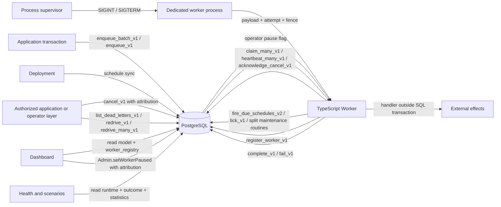

# Workhorse architecture: overview

This page is part of the [Workhorse architecture reference](../architecture.md). It owns the design
objective, the system context and adapter contract, errors, and tenancy.

## Design objective

Dispatch cost should scale with live work, not lifetime completed work. Schema version 1 stores:

- stable identity and the current accepted definition in `task`; pending keyed debounce may replace
  the definition before dispatch
- exactly one mutable `task_runtime` row only while a task is scheduled, blocked, ready, or active
- exactly one immutable `task_outcome` row after success or terminal failure
- at most one bounded mutable `task_progress` projection, separate from payload and outcome
- immutable audited `task_redrive` edges between failed sources and fresh target identities
- append-only, time-partitioned `task_event` and `attempt_history`

## System context

PostgreSQL is the durable authority. A worker owns a task only while the active `task_runtime` row
matches its worker ID and fence token and has not expired.

### Connections and clients

`@stablemates/workhorse` exports node-postgres `Pool` as its default connection implementation.

- `Queue`, `Admin`, and schema operations accept that pool or another `Queryable` supplied by an
  adapter.
- `Worker` accepts a `Queue` or another `WorkerQueueApi`.

### Worker processes

Workers run in dedicated processes. Each process owns:

- its adapter
- its Workers
- an optional probe-only listener
- termination signals
- bounded drain
- final resource close

Web frameworks do not participate in worker lifecycle. See
[`worker-processes.md`](../worker-processes.md) and
[ADR 0012](../decisions/0012-dedicated-worker-processes.md).

### ORM adapters

`@stablemates/workhorse-drizzle`, `@stablemates/workhorse-prisma`, `@stablemates/workhorse-typeorm`,
`@stablemates/workhorse-kysely`, and `@stablemates/workhorse-knex` convert provider database and transaction objects into
`Queryable`.

Each adapter finds the node-postgres pool differently:

| Factory                | How it finds the pool                                                                                                                                         |
| ---------------------- | ------------------------------------------------------------------------------------------------------------------------------------------------------------- |
| `createDrizzleAdapter` | Discovers the retained node-postgres pool through `$client`.                                                                                                  |
| `createTypeOrmAdapter` | Discovers it as `dataSource.driver.master`, which TypeORM's `PostgresDriver` creates on `initialize()`. The adapter looks it up when a worker is constructed. |
| `createPrismaAdapter`  | Accepts the option `pool`.                                                                                                                                    |
| `createKyselyAdapter`  | Accepts the option `pool`. Kysely callers can pass the pool used by `PostgresDialect`.                                                                        |

Each adapter exposes `queue` and `admin`. `forTransaction` and `adminForTransaction` bind the
corresponding client to a caller-owned transaction. Neither method commits, rolls back,
disconnects, or destroys that transaction.

Each adapter closes resources only through its configured `close` callback.
`WorkhorseAdapter.close()` invokes that callback once.

#### Prisma and TypeORM queryables

`prismaQueryable` sends the statement and positional values through `$queryRawUnsafe`.
`typeOrmQueryable` sends them through `query`.

Both require a row array. Both synthesize the `QueryResult` metadata that core does not inspect:

- an empty `command`
- the row-array length as `rowCount`
- zero as `oid`
- an empty `fields` array

`PrismaQueryError` and `TypeOrmQueryError` retain the statement and original `cause`. Neither copies
parameter values into the message. Their error-code searches process at most 16 queued entries.
They accept only five-character uppercase alphanumeric codes.

- `PrismaQueryError` prefers `meta.code` over Prisma's outer raw-query code.
- `TypeOrmQueryError` follows `driverError` and `cause`.

Each adapter copies the discovered code to its wrapper's `code` property. Core uses it to preserve
typed SQL conflicts.

#### Drizzle queryable

`drizzleQueryable` rebuilds the statement as a Drizzle `SQL` value. Each positional `$N` becomes
`sql.param`, and the text between parameters becomes `sql.raw`.

The scan follows PostgreSQL's lexer. A `$N` stays text inside any of these:

- a string literal
- an `E''` escape string
- a quoted identifier
- a line comment
- a nested block comment
- a dollar-quoted body
- an identifier

Comment and continuation rules:

- A line comment ends at a line feed or a carriage return.
- Literals separated by whitespace that contains a newline form one constant. The continuation
  keeps the first segment's escape rules.
- A line comment counts as that whitespace, so a quote inside it never starts a continuation.
- A block comment between two literals keeps them separate.

A schema script's plpgsql bodies therefore reach PostgreSQL unchanged. A genuine `$N` with no
matching value raises `RangeError`.

For a parameter-free script with several statements, node-postgres returns one result per
statement. `executeDrizzle` returns the rows of the last one.

#### Kysely queryable

`kyselyQueryable` builds a `CompiledQuery.raw` from the statement and positional values. It then
calls `executeQuery` on either a `Kysely` database or `Transaction`. It maps `QueryResult.rows` into
the same synthetic node-postgres metadata as the Prisma and TypeORM queryables.

`KyselyQueryError`:

- retains the statement and original `cause`
- follows at most 16 nested causes
- accepts only five-character uppercase alphanumeric codes
- copies the discovered code to its wrapper

#### Knex queryable and Objection recipe

`knexQueryable` in `@stablemates/workhorse-knex` accepts a Knex database or transaction with `client: "pg"`.
It sends each statement through `raw(statement).options({ text: statement, values: [...values] })`.
The released fixture pins Knex 3.3.0, pg 8.23.0, and Objection 3.1.5; other versions are not certified.
The native `text` option restores SQL after Knex rewrites question marks, including those in literals, comments, dollar quotes, and JSON operators.
Repeated and out-of-order `$N` parameters retain native PostgreSQL semantics.
`postProcessResponse` is rejected at adaptation and before every execution. Only one native result with object `rows` is accepted.
Multi-statement result arrays and transformed rows fail. Custom clients and query-mutating listeners are outside the verified boundary.
Rows retain pg's native values and order; the shared provider synthesizes the same metadata described above.
`KnexQueryError` preserves `statement`, original `cause`, and SQLSTATE `code` through the shared `QueryError` implementation.
The adapter neither extracts connections nor bypasses Knex's completed-transaction guard.
Callers own transactions, savepoints, and Knex destruction. The adapter does not validate a transaction's database against its base executor.
Objection's `Model.query(transaction)` uses that same Knex transaction; it needs no additional package.
Workers use separately configured compatible pg pools. A Knex adapter accepts an explicit `pool` for dedicated heartbeat and listener sessions.
It never extracts Knex's internal pool. Without `pool`, a worker requires the explicit `sharedHeartbeats` opt-out.

### What an adapter must guarantee

`typescript/core/src/adapter.ts` owns the shared implementation of every guarantee below. It is
exported from `@stablemates/workhorse` as `QueryError`, `rowsToQueryResult`,
`attachConnectionPool`, `createProviderQueryable`, `createProviderAdapter`, and
`createWorkhorseAdapter`. An adapter that uses them supplies only how its ORM runs a statement. An
adapter that does not use them still owes the same guarantees.

1. **Statement execution.**
   - `query(text, values)` sends `text` unmodified with `values` as positional parameters.
   - It returns a `QueryResult` whose `rows` preserve result order.
   - `rowsToQueryResult` sets `rowCount` to the row-array length, `command` to the empty string,
     `oid` to zero, and `fields` to an empty array. Core reads only `rows` and `rowCount`.
   - A provider that answers with anything other than a row array is a failed query, not an empty
     result.
2. **Transaction adaptation.**
   - `forTransaction(transaction)` returns a `Queue` bound to the caller's transaction.
   - `adminForTransaction(transaction)` returns the matching `Admin`.
   - Neither client commits, rolls back, disconnects, or destroys the transaction.
   - A claim through either client requires that transaction to run at read committed; see
     [Claim](lifecycle.md#claim).
3. **Error translation.**
   - A failed statement throws an error extending `QueryError`. The error retains `statement` and
     the original `cause`, and copies the SQLSTATE to `code`.
   - The code comes from `databaseErrorCode` in `typescript/core/src/errors.ts`. It searches
     breadth-first over `cause`, `driverError`, and `meta`, at most 16 objects, and is cycle-safe.
   - It accepts only five-character uppercase alphanumeric codes. It prefers a nested SQLSTATE over
     a Prisma `P\d{4}` code that carries `meta`.
   - Core depends on this through any ORM wrapper to raise these errors:
     - `EnqueueIdempotencyConflictError` for SQLSTATE `P1001`
     - `RedriveIdempotencyConflictError` for `P1002`
     - `DependencyCycleError` for `P1003`
     - `DependencyLimitExceededError` for `P1005`
   - Messages never copy parameter values.
4. **Failures that pass through untranslated.**
   - A `QueryError` is already translated. It is rethrown as-is rather than nested again.
   - A `RangeError` states that the statement itself was malformed: a placeholder with no
     matching value. That is the caller's error rather than the database's.
5. **Connection pool.**
   - An adapter lends workers a node-postgres pool through `attachConnectionPool`. It stores the
     pool, or a function that finds it, on the queryable under an internal symbol.
   - A value counts as a pool only if it has `connect()`. `options.max` gives its capacity.
   - The pool object is the sharing identity. Queryables built from one pool share one listener and
     one heartbeat connection.
   - Transaction queryables never carry a pool, because that session ends.
   - Without a pool, a worker refuses to start unless `sharedHeartbeats` is set. With it set, the
     worker dispatches by bounded polling.
   - `connectionPoolOf(database)` resolves that pool for any caller. It is exported from
     `@stablemates/workhorse` with its `ConnectionPool` type. It checks in this order:
     1. an attached pool, calling the function when the adapter attached one
     2. the queryable itself, when it has `connect()`
     3. otherwise `undefined`
   - The function form lets TypeORM attach its driver's pool before the data source connects. A
     caller therefore resolves the pool at use, not once.
6. **Resource ownership.**
   - An adapter closes nothing it did not create.
   - `WorkhorseAdapter.close()` invokes the configured `close` callback at most once, however many
     times it is called.

### Connection poolers

Every production statement is self-contained. No code path issues `SET`, holds a cursor, or takes a
session-level advisory lock, so `pool_mode = transaction` serves every queue operation.

Two kinds of session state are the exceptions. `integration-pooling.test.ts` runs each pooler and
pool mode as a separate lane to prove the boundary.

#### `LISTEN` notifications

`LISTEN workhorse_tasks` is session state. Behavior by pooler:

| Pooler and mode               | Behavior                                                                                                                                                                                                                                          |
| ----------------------------- | ------------------------------------------------------------------------------------------------------------------------------------------------------------------------------------------------------------------------------------------------- |
| PgBouncer session mode        | Delivers `NOTIFY` normally.                                                                                                                                                                                                                       |
| PgBouncer in transaction mode | Accepts `LISTEN`, returns success, then releases the server connection. No notification is ever delivered and no error reaches `onNotificationError`. The subscription reports listening while the `Worker.run()` fallback poll carries dispatch. |
| PgCat, either pool mode       | Relays a buffered notification only with the client's next query result, so an idle `LISTEN`ing worker hears nothing.                                                                                                                             |

Restoring wake hints takes a worker pool that reaches PostgreSQL without those poolers, such as the
Prisma or Kysely adapter's `pool`. The alternative is a `Queue` whose queryable has no `connect()`.
It stays polling-only, and its workers need `sharedHeartbeats`.

#### Advisory locks

Session advisory locks (`pg_advisory_lock`, `pg_advisory_unlock`, `pg_try_advisory_lock`) pin to
whichever server session ran them. They outlive the client checkout. Under transaction pooling, a
second client can acquire a held key, and grants leak onto pooled backends.

Every Workhorse advisory lock is transaction-scoped (`pg_advisory_xact_lock`,
`pg_try_advisory_xact_lock`, `pg_advisory_xact_lock_shared`), including the schema-migration lock.
No production path is affected. The session forms exist only in test harnesses.

#### Heartbeat connection

The TypeScript worker's reserved heartbeat connection holds no session state. It runs only
`heartbeat_many_v1`, bounds each round on the client, and never issues `SET`. It works in every
pool mode.

#### Connection budgets per language

Each language holds these connections before handlers and cohorts take anything:

| Language   | Listener connection                                                                                                                                | Heartbeat connection                                                                  |
| ---------- | -------------------------------------------------------------------------------------------------------------------------------------------------- | ------------------------------------------------------------------------------------- |
| TypeScript | One `TaskNotificationHub` per pool in `notifications.ts`, holding one pooled connection. `listeningPool` skips it when `options.max` is 1 or less. | One shared heartbeat connection per pool in `heartbeat-connection.ts`.                |
| Go         | One `taskNotificationHub` per `*pgxpool.Pool`. `subscribeToTaskNotifications` polls instead when `MaxConns` is below 2.                            | `holdHeartbeatConnection` holds the shared heartbeat connection.                      |
| Ruby       | One `Worker::Listener.shared(pool)` per pool object, holding one pool connection.                                                                  | One `Worker::Heartbeat.dedicated(pool)` per pool object, holding one pool connection. |
| Python     | One per `Worker` or `AsyncWorker`, from the supplied Psycopg or asyncpg pool.                                                                      | One per `Worker` or `AsyncWorker`, from the same pool.                                |
| Rust       | Opened per worker by `notifications::listen` from `WorkerOptions::listen_config`, outside the pool.                                                | One per worker, from the pool.                                                        |

TypeScript keys both its listener and its heartbeat connection by the pool object. Go follows the
same pattern.

A dedicated heartbeat connection needs a pool of at least 3 connections in every language, unless
the opt-out is set:

- `sharedHeartbeats` in TypeScript
- `SharedHeartbeats` in Go
- `shared_heartbeats` in Python, Rust, and Ruby

#### Schema operations

Schema operations run under transaction pooling.

- `installSchema` sends `schema.sql` as one multi-statement simple query.
- Each migration step is one `BEGIN`…`COMMIT` script. It takes its transaction-scoped lock behind
  `SET LOCAL lock_timeout`.

### Queue module seams

`Queue` is the application and worker facade. `Admin` is the operator facade. Both constructors
call `createQueueModuleContext` and `createQueueModules`. Neither factory is exported from
`typescript/core/src/index.ts`, so both clients share modules without exposing the module graph.

`createQueueModuleContext` returns an immutable `QueueModuleContext`. The context contains the
`Queryable`, default queue name, and validated `QueueOptions`. Every internal module extends
`QueueModule`, which retains that context for relocated behavior.

`createQueueModules` constructs nine receivers:

- `EnqueueContractsModule`
- `ClaimLeaseFenceModule`
- `CheckpointsProgressWaitsModule`
- `QueueAdministrationModule`
- `WorkerRegistryModule`
- `RetentionMaintenanceModule`
- `CronSchedulesModule`
- `OperatorReadsModule`
- `ChildTasksModule`, for fenced child creation and joining

#### `EnqueueContractsModule`

- `EnqueueContractsModule.enqueue` and `enqueueMany` own enqueue serialization, tracing,
  telemetry, and `P1001` conflict translation.
- `taskAcceptance` selects and validates the current payload contract for direct enqueue and
  schedule synchronization.
- `validateResult` validates completion against the contract version accepted by the claimed task.
- `validateQueueOptions` checks contract configuration before `Queue` creates the immutable module
  context.

`Queue.enqueue`, `enqueueMany`, `syncSchedules`, and `complete` delegate these operations without
changing their public signatures. `typescript/core/src/queue.ts` continues to re-export the four
public error classes.

#### `ClaimLeaseFenceModule`

`ClaimLeaseFenceModule` owns `cancel`, `claim`, `heartbeat`, `heartbeatStatus`, `expireOwned`,
`acknowledgeCancel`, `complete`, `fail`, and `recoverExpired`. `Queue` delegates without changing
its public signatures.

- `FencedLease` converts a `ClaimedTask` and worker ID into the exact task ID, worker ID, and
  decimal fence token tuple. Every owned SQL transition in that module uses that tuple.
- `complete` invokes the enqueue module's result-contract validation before the fenced transition.
- `recordRecoveryTelemetry` remains shared with `Queue.tick`. `Queue.tick` reports the same
  recovery counters from the combined maintenance function.
- `rowTimestamp` and `nullableRowTimestamp` own PostgreSQL timestamp mapping for this module and
  for the row mappers that remain in `Queue`.

#### `Admin` and operator reads

`Admin` delegates these operations to those modules:

- task lookup, listing, and timelines
- dead letters, redrive, and lineage
- checkpoint and wait reads
- worker inspection
- queue controls

`Queue` does not expose those operator methods.

`OperatorReadsModule.validateTaskListQuery` and `validateTaskTimelineQuery` use
`validateTaskListQuery`, `validateTaskTimelineCursor`, and `validatePageLimit` from
`typescript/core/src/queue/filter-cursor.ts`. The validators enforce the limits exported as
`MAX_TASK_QUERY_PAGE_SIZE`, `MAX_TASK_QUERY_PAYLOAD_BYTES`, and `MAX_TASK_QUERY_REDACT_KEYS`.

### Python and Go admin clients

The Python package exports `Admin` over a caller-owned Psycopg connection. It exports `AsyncAdmin`
through `from_psycopg` or `from_asyncpg`. Both clients expose these methods:

- tasks: `list_tasks`, `get_task`, `get_task_timeline`
- dead letters: `list_dead_letters`, `redrive`, `redrive_many`
- checkpoints and progress: `get_checkpoint`, `list_checkpoints`, `get_progress`
- waits: `get_wait`, `list_waits`, `list_signal_waits`, `list_human_waits`
- workers: `list_workers`, `set_worker_paused`
- queues: `pause_queue`, `resume_queue`, `purge_queue`

`AdminAudit` carries `actor`, `reason`, and `request_id`. Every method uses the same versioned SQL
and row mappers for Psycopg and asyncpg. Neither client commits, rolls back, or closes the caller's
connection.

The Python dashboard backend creates `Admin` from its existing `SyncExecutor`. Shared wait reads and
audited queue or worker controls therefore use the public client rather than a dashboard-only SQL
path.

The Go module exports `NewAdmin(Executor)` beside `NewQueue`. `Admin` uses the caller-owned pgx or
`database/sql` executor and checks schema compatibility for every operation. It maps the same
versioned protocols:

- task, timeline, and dead-letter reads
- checkpoint, wait, and worker reads
- redrive
- queue pause, queue resume, and queue purge

`AdminAudit` carries `Actor`, `Reason`, and `RequestID` for every mutation. `go/dashboard`
constructs one `Admin` and routes queue and worker controls through it.

### Operator dashboard

The operator dashboard is a separate boundary from the worker fleet. It is a framework-neutral
request host. It reads everything it shows from PostgreSQL, including worker identity, runtime
state, and policy provenance. It can therefore be mounted in a process that runs no workers at all.

- Mounting requires only a database connection.
- Policy mutation additionally requires `operator.mode
=== "writable"` and a `DashboardSettingsController`.
- Every policy mutation call carries actor, reason, request ID, and server-assigned occurrence
  time.

#### Workspaces

`createDashboardHost` accepts exactly one of `database` and `workspaces`.

`workspaces` maps a name to `DashboardWorkspaceOptions`. Each entry carries its own `Queryable`
plus optional overrides for:

- `environment`
- `configuredWorkers`
- `maintenanceLoops`
- `operator`
- the five controllers
- `projectDurability`

An omitted override falls back to the host-level option.

`DashboardWorkspaceOptions.databaseHost` and `DashboardWorkspaceOptions.databaseName` are optional
display-only labels of the backing database's host and name. The host never derives them from the
connection, because a `Queryable` carries no address.

The demo derives its labels from `DATABASE_URL_PRIMARY` and `DATABASE_URL_SECONDARY`:

- `demoDatabaseHostLabel` gives `hostname[:port]`, or the `host` query parameter when the URL names
  no network host.
- `demoDatabaseNameLabel` gives the URL path without its leading slash.

#### Workspace routing

Each workspace gets its own `Admin`, `Queue`, schema-compatibility probe, and RPC context.

- A workspace mounts at `{path}/{name}`, with its endpoint at `{path}/{name}/rpc`.
- The mount path answers a 302 redirect to `{path}/{defaultWorkspace}/tasks`. `defaultWorkspace`
  defaults to the first configured workspace.
- A first segment naming no workspace answers 404.
- A workspace name matches `/^[a-z0-9](?:[a-z0-9_-]{0,62}[a-z0-9])?$/i`. It is never `rpc`,
  `assets`, `login`, or `logout`.
- `authorize(request, workspace)` receives the resolved workspace name. It receives null in
  single-workspace mode and outside every workspace.
- Single-admin authentication stays host-wide at `{path}/login` and `{path}/logout`.

#### Workspace switcher

`DashboardRuntimeConfig` carries two fields so the browser renders its switcher:

- `workspaces`: every `{ name, url, databaseHost?, databaseName? }`. The database labels appear
  only when configured.
- `workspace`: the rendered one.

Both are `[]` and `null` in single-workspace mode. The switcher menu shows `databaseHost` and
`databaseName` joined by `·` as a dimmed line under the workspace name.

#### Standalone entry point

The standalone entry point accepts `DashboardStandaloneTarget<Database>`. That is either a bare
database or `{ workspaces, defaultWorkspace }`.

`workhorse dashboard` builds one from two sources:

- repeatable `--workspace <name=url>` flags
- a `--config` JSON file whose entries state `url` or `urlEnv`

## Errors

### Error hierarchy

Every error Workhorse raises deliberately extends `WorkhorseError`
(`typescript/core/src/errors.ts`). `WorkhorseError` extends `Error`, and each subclass sets `name`.

`instanceof WorkhorseError` therefore means "Workhorse rejected this call", not "this call failed".
These propagate unchanged and do not carry the base:

- a PostgreSQL error
- a handler's own throw
- a driver connection failure

The exported subclasses include:

- `DependencyCycleError` and `DependencyLimitExceededError`, for dependency graph rejection
- `SchemaCompatibilityError`, for a startup refusal. Its `code` is a `SchemaCompatibilityCode`. Its
  `installedVersion` and `expectedVersion` name the two versions that disagree.

`typescript/core/src/index.ts` is the complete export inventory.

### Reading database error codes

Recognizing a PostgreSQL failure means reading through whatever an ORM wrapped it in.

- `databaseErrorCode(error)` returns the SQLSTATE.
- `databaseErrorDetails(error)` returns every `DETAIL` string along the chain.

Both walk breadth-first over `cause`, `driverError`, and `meta`. Both visit at most 16 objects.
Both track visited objects, so a cyclic `cause` terminates.

A candidate SQLSTATE must match `/^[0-9A-Z]{5}$/`. A Prisma code matching `/^P\d{4}$/` on an object
that also carries `meta` is held back. It is returned only when nothing nested supplies a real
SQLSTATE. Prisma reports `P2010` on the same field and retains the true SQLSTATE under `meta`.

### SQLSTATE registry

Workhorse owns the following SQLSTATE registry. `schema-sqlstates.test.ts` scans every declaration
and fails if a code gains an unregistered meaning.

| SQLSTATE | Meaning                              | TypeScript result                                       |
| -------- | ------------------------------------ | ------------------------------------------------------- |
| `P1001`  | Enqueue idempotency conflict         | `EnqueueIdempotencyConflictError`                       |
| `P1002`  | Redrive idempotency conflict         | `RedriveIdempotencyConflictError`                       |
| `P1003`  | Dependency cycle                     | `DependencyCycleError`                                  |
| `P1004`  | Child creation lost the parent lease | SQL converts it to the child operation's `stale` status |
| `P1005`  | Dependency graph bound exceeded      | `DependencyLimitExceededError`                          |
| `P1006`  | Purge idempotency conflict           | `PurgeIdempotencyConflictError`                         |
| `P1007`  | Fast-tier queue rejects a feature    | `FastTierUnsupportedError`                              |

`Queue` decodes each exposed error's diagnostics from `DETAIL`.
[Rejected features and `P1007`](fast-tier.md#rejected-features-and-p1007) lists every feature text
and the matching Python, Go, and Rust errors.

A payload failing shape validation is discarded in favor of sanitized placeholder details rather
than propagated. `DETAIL` is diagnostic text that an operator or an ORM can also write.

### Missing rows

`expectOneRow(result, source)` takes the single row a statement is defined to return. When the
result is empty, it throws `MissingRowError` naming `source`.

An empty result from a set-returning function that declares one row means the installed schema and
this client disagree.

## Tenancy

Workhorse has no tenant object and documents two tiers. The decision is recorded in [ADR
0069](../decisions/0069-isolate-tenants-by-database-and-carry-tenant-identity-as-task-metadata.md).

### Isolated tenancy

_Isolated tenancy_ installs the schema into one database per tenant. PostgreSQL enforces the
boundary.

- Every table, policy, budget, schedule, retention window, and dashboard session is separate,
  because the databases are.
- Each database runs `workhorse schema migrate` independently.
- Each `Worker` binds to one database.

### Shared tenancy

_Shared tenancy_ carries the tenant on three task fields that already exist:

| Field                                    | Bounds                                                           | Role                                                                                                                                                                                                                                                                   |
| ---------------------------------------- | ---------------------------------------------------------------- | ---------------------------------------------------------------------------------------------------------------------------------------------------------------------------------------------------------------------------------------------------------------------- |
| `task.concurrency_key`                   | 1 through 256 UTF-8 bytes, queue-scoped                          | `concurrency_policy.max_active_per_key` and the `rate_limit_policy` per-key bucket give the tenant fair share inside one queue.                                                                                                                                        |
| `task.budget_name`                       | 1 through 256 UTF-8 bytes                                        | One `budget` row per tenant caps that tenant's active tasks or start rate across every queue. `sync_budgets_v1` accepts at most 10,000 definitions per call, so one budget per tenant is a deployment cost of about 130 microseconds per tenant on the benchmark host. |
| One `tenant:<id>` element of `task.tags` | `task.tags` holds at most 20 tags of at most 100 characters each | `task_tags_gin_idx` serves the `&&` and `@>` filters in `list_dead_letters_v1`, `redrive_many_v1`, `dashboard_tasks_v1`, `dashboard_tasks_cursor_v1`, and `dashboard_activity_v1`. The dashboard wire validator accepts at most 20 selected tags.                      |

What shared tenancy does not scope:

- `schedule_definition` retains `concurrency_key` and carries neither tags nor a budget.
- `namespace` on schedules, policies, and budgets identifies the owning deployment, not a tenant.
- `retention_policy` is a singleton, so retention windows are per installation.
- Metric attributes never include a key or tag.
- Spans carry `workhorse.task.id` and `workhorse.task.type` rather than the key or tags.
- No function scopes a read or an operator action to a tenant. Tag filters narrow a result without
  enforcing a boundary.

### Admission cost

Admission cost is independent of tenant count. `claim_v1` counts one key through
`task_runtime_active_queue_key_expiry_idx` and one budget through
`task_runtime_active_budget_expiry_idx`. When a per-key limit or budget can pass over saturated
work, it inspects at most 100 ready rows.

`pnpm benchmark:tenant-cardinality` loads one queue with 100 through 100,000 tenants. Each tenant
has a key, a tag, and optionally its own budget. The queue has 80 saturated rows at the head of the
window.

Results across the whole ladder:

- Median claim latency measured 2.2 through 3.5 ms without budgets.
- Median claim latency measured 3.7 through 4.4 ms with budgets.
- Each admission count took three buffer hits.
- The dashboard task list filtered by tag grew from 1 ms to 94 ms. It materializes the whole task
  projection before filtering.
- `queue_health_v1` reached 2.7 s at 200,000 ready rows.

Both of the last two track total rows, not tenants
([analysis](../benchmarks/2026-09-16-tenant-cardinality-analysis.md)).
